# Gallery: the chakravala figures in Lean

Every figure of the Julia ecosystem that the Lean port can compute today, rendered with [LeanPlot](https://github.com/alok/LeanPlot) (left) next to the Julia/CairoMakie original (right, same data, same figure size). Regenerate with

```
julia --startup-file=no --project=oracle oracle/gallery/run_all.jl   # Julia renders and data dumps
cd gallery && lake exe gallery --docs   # Lean renders (gallery/out/*.png, *.svg), data checks, this page
cd gallery && lake test                 # the data checks alone
```

`gallery/` is a Lake package of its own (it requires the root package and LeanPlot `f141f59`); both sides render at one pixel per unit of the same figure size.

The Cartan figures are drawn with `GrassmannPlot` (`gallery/GrassmannPlot/`), the port of Cartan's Makie extension (`ext/MakieExt.jl`): `lines(t)`, `streamplot(t)`, `mesh(M, f)`, `scaledarrows(M, t)`, … dispatch on the field's base and fiber types as in Julia. The Julia originals are drawn by Cartan's own methods; where CairoMakie needs an `Axis3` for comparable framing (Julia's automatic `LScene`), the scripts pass it.

The data column compares the numbers behind each plot with the Julia dump (`oracle/gallery/data/<name>.json`): iteration counts of the fractals, curve samples, streamlines, graph edges and error curves. Images are compared by eye (DESIGN.md §0: plot data numerically, images visually).

## Fatou

| figure | Lean (LeanPlot) | Julia (CairoMakie) | data agreement |
|---|---|---|---|
| **fatou-orbit** ([original](https://raw.githubusercontent.com/chakravala/Fatou.jl/master/img/orbit.png))<br>Cobweb orbit of x ↦ x² − 0.67<br><sub>`juliafill(:(z^2-0.67),∂=[-1.25,1.5],x0=1.25,orbit=17,depth=3,n=147) \|> orbit` (Fatou.jl `README.md:58-64`)</sub><br><sub>PyPlot's colour cycle and LaTeX title/legend become Makie's palette and plain text, on both sides.</sub> |  | 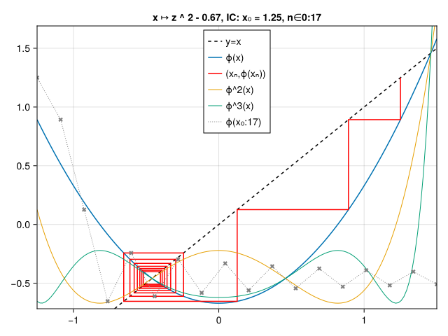 | <details><summary>✅ 8/8 checks</summary>orbit x₀…x₁₇ (N2): max rel \|Δ\| = 0 over 18 values (tol 0)<br>cobweb x: max rel \|Δ\| = 0 over 51 values (tol 0)<br>cobweb y: max rel \|Δ\| = 0 over 51 values (tol 0)<br>ylim: max rel \|Δ\| = 0 over 2 values (tol 0)<br>ϕ^0(x) samples: max rel \|Δ\| = 0 over 147 values (tol 0)<br>ϕ^1(x) samples: max rel \|Δ\| = 0 over 147 values (tol 0)<br>ϕ^2(x) samples: max rel \|Δ\| = 0 over 147 values (tol 0)<br>ϕ^3(x) samples: max rel \|Δ\| = 0 over 147 values (tol 0)</details><br><sub>pixels: mean \|ΔRGB\| 0.5/255, 0.1% of pixels > 64/255</sub> |
| **fatou-filled-julia** ([original](https://raw.githubusercontent.com/chakravala/Fatou.jl/master/img/filled-julia.png))<br>Filled Julia set of z² − 0.06 + 0.67i (iteration counts, gnuplot)<br><sub>`plot(fatou(juliafill(:(z^2+$c),∂=[-1.5,1.5,-1,1],N=80,n=1501,cmap="gnuplot",iter=true)), bare=true)` (`README.md:66-74`)</sub><br><sub>The README image is PyPlot `imshow(extent = bounds)` with a LaTeX title; here both sides draw the raster with cell edges at the bounds, the plain-text `String(K)` title, and the Makie colormap of the same name (Lean: `Fatou.Raster.toRGBA8` through a 256-entry table sampled from it). `bare=true`: no title, no colorbar.</sub> | 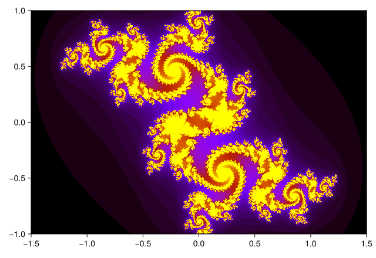 | 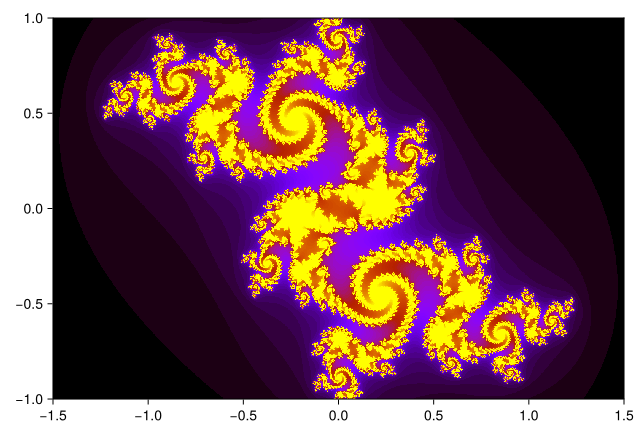 | <details><summary>✅ 5/5 checks</summary>raster size (rows × cols): equal (1001×1501)<br>iteration histogram: equal (81 bins, 1502501 pixels)<br>FNV-1a of the iteration counts: equal (0xd7605d2089529229)<br>mix NaN count: equal (0)<br>Σ mix: \|Δ\| / Σ\|mix\| = 1.49e-14</details><br><sub>pixels: mean \|ΔRGB\| 0.6/255, 0.0% of pixels > 64/255</sub> |
| **fatou-mandelbrot** ([original](https://raw.githubusercontent.com/chakravala/Fatou.jl/master/img/mandelbrot.png))<br>Mandelbrot set, limit colouring exp(−\|z₂₀\|) (gist_earth)<br><sub>`mandelbrot(:(z^2+c),n=800,N=20,∂=[-1.91,0.51,-1.21,1.21],cmap="gist_earth") \|> fatou \|> plot` (`README.md:76-82`)</sub><br><sub>The README image is PyPlot `imshow(extent = bounds)` with a LaTeX title; here both sides draw the raster with cell edges at the bounds, the plain-text `String(K)` title, and the Makie colormap of the same name (Lean: `Fatou.Raster.toRGBA8` through a 256-entry table sampled from it).</sub> | 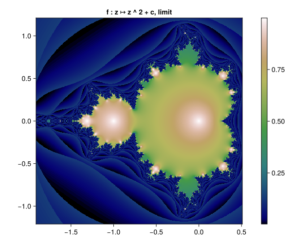 |  | <details><summary>✅ 5/5 checks</summary>raster size (rows × cols): equal (800×800)<br>iteration histogram: equal (21 bins, 640000 pixels)<br>FNV-1a of the iteration counts: equal (0x403251fa209bfc85)<br>mix NaN count: equal (0)<br>Σ mix: \|Δ\| / Σ\|mix\| = 8.29e-15</details><br><sub>pixels: mean \|ΔRGB\| 0.7/255, 0.1% of pixels > 64/255</sub> |
| **fatou-newton** ([original](https://raw.githubusercontent.com/chakravala/Fatou.jl/master/img/newton.png))<br>Newton fractal of z³ − 1 (iteration counts, jet)<br><sub>`newton(:(z^3-1),n=800,ϵ=0.1,N=25,iter=true,cmap="jet") \|> fatou \|> plot` (`README.md:96-104`)</sub><br><sub>The README image is PyPlot `imshow(extent = bounds)` with a LaTeX title; here both sides draw the raster with cell edges at the bounds, the plain-text `String(K)` title, and the Makie colormap of the same name (Lean: `Fatou.Raster.toRGBA8` through a 256-entry table sampled from it). The Newton map is REDUCE's factored form `(2z³+1)/(3z²)`, as Julia iterates it.</sub> |  | 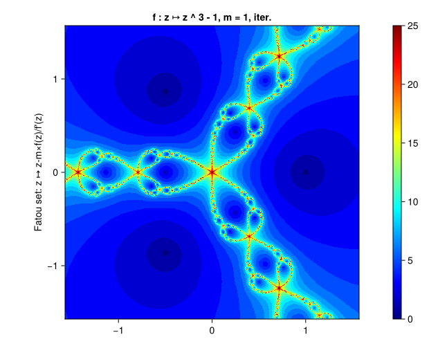 | <details><summary>✅ 5/5 checks</summary>raster size (rows × cols): equal (800×800)<br>iteration histogram: equal (26 bins, 640000 pixels)<br>FNV-1a of the iteration counts: equal (0x8610e251146353c5)<br>mix NaN count: equal (0)<br>Σ mix: \|Δ\| / Σ\|mix\| = 7.70e-16</details><br><sub>pixels: mean \|ΔRGB\| 0.6/255, 0.0% of pixels > 64/255</sub> |
| **fatou-generalized-newton** ([original](https://raw.githubusercontent.com/chakravala/Fatou.jl/master/img/generalized-newton.png))<br>Generalized Newton fractal of sin z − 1, m = 1 − i (cubehelix)<br><sub>`newton(:(sin(z)-1),m=1-1im,∂=[-2π/3,-π/3,-π/6,π/6],n=500,N=33,iter=true,ϵ=0.05,cmap="cubehelix") \|> fatou \|> plot` (`README.md:106-116`)</sub><br><sub>The README image is PyPlot `imshow(extent = bounds)` with a LaTeX title; here both sides draw the raster with cell edges at the bounds, the plain-text `String(K)` title, and the Makie colormap of the same name (Lean: `Fatou.Raster.toRGBA8` through a 256-entry table sampled from it). `sin`/`cos` come from libm in Lean and from Julia's own kernels, yet the histogram is identical.</sub> | 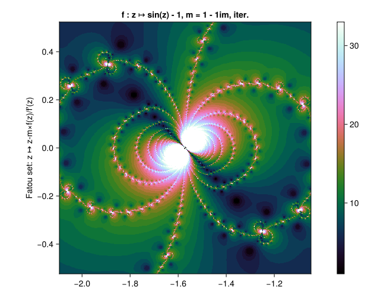 |  | <details><summary>✅ 4/4 checks</summary>raster size (rows × cols): equal (500×500)<br>iteration histogram (libm tier): total variation 0 of 500000 (tol 0.1%)<br>mix NaN count: equal (6)<br>Σ mix: \|Δ\| / Σ\|mix\| = 2.23e-14</details><br><sub>pixels: mean \|ΔRGB\| 0.4/255, 0.0% of pixels > 64/255</sub> |

## Fatou wiki

| figure | Lean (LeanPlot) | Julia (CairoMakie) | data agreement |
|---|---|---|---|
| **fatou-wiki-newton-roots** ([original](https://raw.githubusercontent.com/wiki/chakravala/Fatou.jl/img/nf1-roots.png))<br>Newton basins of z³ − 1 by the root reached (brg)<br><sub>`newton(:(z^3-1),ϵ=0.001,n=800,cmap="brg") \|> fatou \|> plot` (wiki example (1))</sub><br><sub>The wiki image is PyPlot `imshow` with a LaTeX title; both sides here draw a heatmap over the bounds with the plain-text `String(K)` title and the Makie colormap of the same name. The iterated map is REDUCE's `(2z³+1)/(3z²)`.</sub> | 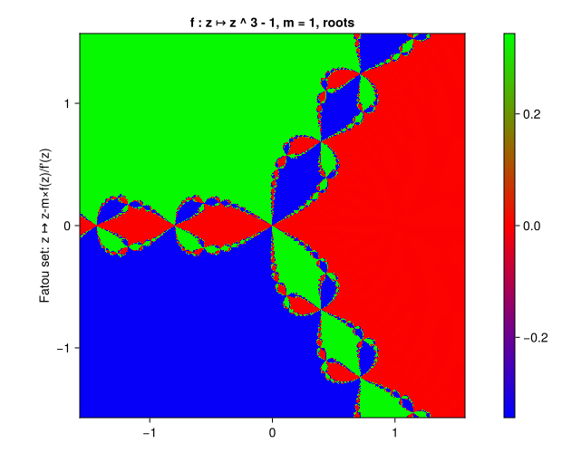 |  | <details><summary>✅ 5/5 checks</summary>raster size (rows × cols): equal (800×800)<br>iteration histogram: equal (36 bins, 640000 pixels)<br>FNV-1a of the iteration counts: equal (0x584cce7926b80185)<br>mix NaN count: equal (0)<br>Σ mix: \|Δ\| / Σ\|mix\| = 8.84e-16</details><br><sub>pixels: mean \|ΔRGB\| 0.7/255, 0.0% of pixels > 64/255</sub> |
| **fatou-wiki-newton-snowflake** ([original](https://raw.githubusercontent.com/wiki/chakravala/Fatou.jl/img/nf2-iter.png))<br>Newton fractal of z³ − 1 with multiplicity m = 2 (ocean)<br><sub>`newton(:(z^3-1),m=2,n=800,N=37,ϵ=0.27,iter=true,cmap="ocean") \|> fatou \|> plot` (wiki example (2))</sub><br><sub>The wiki image is PyPlot `imshow` with a LaTeX title; both sides here draw a heatmap over the bounds with the plain-text `String(K)` title and the Makie colormap of the same name. The iterated map is REDUCE's `(z³+2)/(3z²)` for m = 2.</sub> | 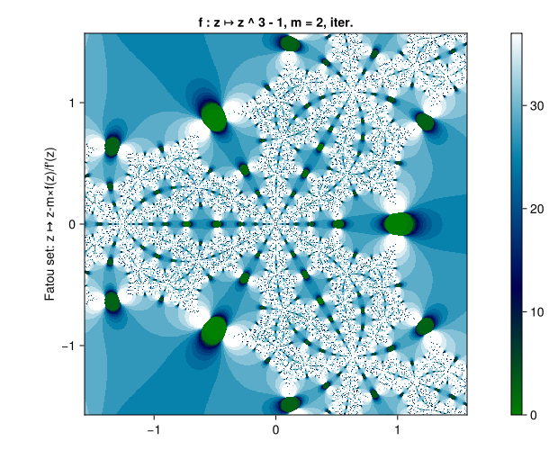 | 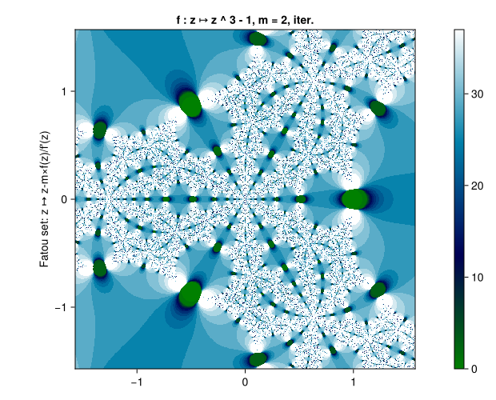 | <details><summary>✅ 5/5 checks</summary>raster size (rows × cols): equal (800×800)<br>iteration histogram: equal (38 bins, 640000 pixels)<br>FNV-1a of the iteration counts: equal (0x24cd9d4441364675)<br>mix NaN count: equal (0)<br>Σ mix: \|Δ\| / Σ\|mix\| = 1.28e-15</details><br><sub>pixels: mean \|ΔRGB\| 0.4/255, 0.0% of pixels > 64/255</sub> |
| **fatou-wiki-newton-hsv** ([original](https://raw.githubusercontent.com/wiki/chakravala/Fatou.jl/img/nf3-limit.png))<br>Generalized Newton fractal of z³ − 1 with m = −0.5, limit angle (hsv)<br><sub>`newton(:(z^3-1),m=-0.5,n=800,N=10,cmap="hsv") \|> fatou \|> plot` (wiki example (3))</sub><br><sub>The wiki image is PyPlot `imshow` with a LaTeX title; both sides here draw a heatmap over the bounds with the plain-text `String(K)` title and the Makie colormap of the same name. The iterated map is REDUCE's `(7z³-1)/(6z²)` for m = -0.5.</sub> |  | 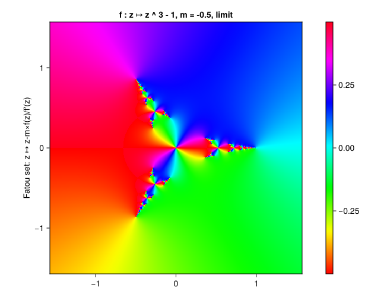 | <details><summary>✅ 5/5 checks</summary>raster size (rows × cols): equal (800×800)<br>iteration histogram: equal (11 bins, 640000 pixels)<br>FNV-1a of the iteration counts: equal (0x3b435f8f60cdb9e5)<br>mix NaN count: equal (0)<br>Σ mix: \|Δ\| / Σ\|mix\| = 1.01e-15</details><br><sub>pixels: mean \|ΔRGB\| 0.5/255, 0.0% of pixels > 64/255</sub> |
| **fatou-wiki-basilica** ([original](https://raw.githubusercontent.com/wiki/chakravala/Fatou.jl/img/o3-iter.png))<br>The basilica, filled Julia set of z² − 1 (iteration counts, default colormap)<br><sub>`juliafill(:(z^2-1),∂=[-2,2],iter=true,n=800) \|> fatou \|> plot` (wiki orbit example (3))</sub><br><sub>The wiki image is PyPlot `imshow` with a LaTeX title; both sides here draw a heatmap over the bounds with the plain-text `String(K)` title and the Makie colormap of the same name. `cmap = ""` is viridis, PyPlot's default; the wiki passes the string `"z^2-1"`, which Julia 1.x can no longer `parse`, so both sides use the expression.</sub> | 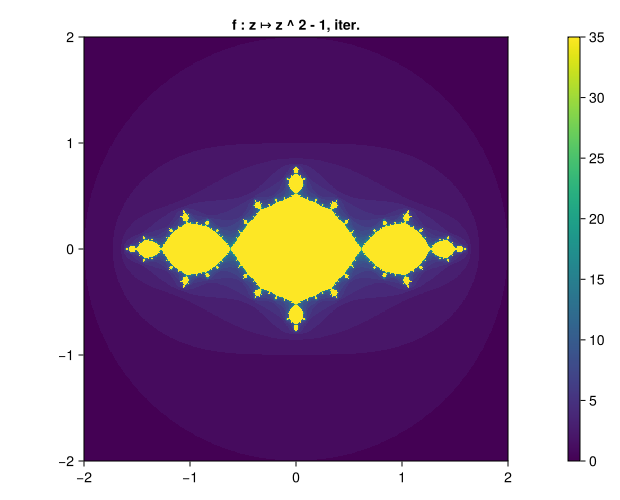 |  | <details><summary>✅ 5/5 checks</summary>raster size (rows × cols): equal (800×800)<br>iteration histogram: equal (36 bins, 640000 pixels)<br>FNV-1a of the iteration counts: equal (0x9865de526e91a9a5)<br>mix NaN count: equal (0)<br>Σ mix: \|Δ\| / Σ\|mix\| = 3.60e-17</details><br><sub>pixels: mean \|ΔRGB\| 0.3/255, 0.0% of pixels > 64/255</sub> |

## Grassmann

| figure | Lean (LeanPlot) | Julia (CairoMakie) | data agreement |
|---|---|---|---|
| **grassmann-wave** ([original](https://raw.githubusercontent.com/chakravala/Grassmann.jl/master/paper/img/wave.png))<br>Conformal versor field read in (v∞, v1, v2) (wave, the README header)<br><sub>`@basis S"∞+++"; streamplot(vectorfield(exp((π/4)*(v12+v∞3)),V(2,3,4),V(1,2,3)),-1.5..1.5,-1.5..1.5,-1.5..1.5,gridsize=(10,10))` (`README.md:63-67, 298-302`)</sub><br><sub>The README's `gridsize=(10,10)` is padded to `(10,10,10)` (Makie `to_ndim`; Makie 0.24 wants the 3-tuple). The arrowheads are Makie's `meshscatter` cones (tessellated `Cone`, size 0.2·min(widths)/min(gridsize)), built as a shaded LeanPlot mesh (LeanPlot's own 3D streamplot recipe draws flat triangles); both use `Axis3` instead of the README's `LScene`.</sub> | 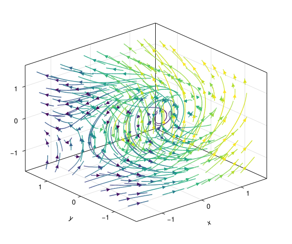 | 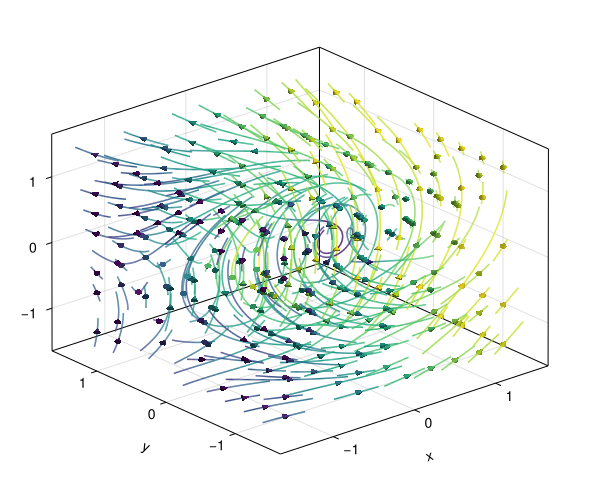 | <details><summary>✅ 6/6 checks</summary>arrows: equal (301)<br>line points: equal (25632)<br>NaN separators: equal (602)<br>all line points (Float32 hash): bit-identical (0x769d004af3e24625)<br>arrow positions: max \|Δ\| = 0<br>arrow directions: max \|Δ\| = 0</details><br><sub>pixels: mean \|ΔRGB\| 1.6/255, 0.7% of pixels > 64/255</sub> |
| **grassmann-orb** ([original](https://raw.githubusercontent.com/chakravala/Grassmann.jl/master/paper/img/orb.png))<br>Conformal versor field on the Riemann sphere (orb)<br><sub>`@basis S"∞+++"; streamplot(vectorfield(exp((π/4)*(v12+v∞3)),V(2,3,4)),-1.5..1.5,-1.5..1.5,-1.5..1.5,gridsize=(10,10))` (`README.md:298-302`)</sub><br><sub>The README's `gridsize=(10,10)` is padded to `(10,10,10)` (Makie `to_ndim`; Makie 0.24 wants the 3-tuple). The arrowheads are Makie's `meshscatter` cones (tessellated `Cone`, size 0.2·min(widths)/min(gridsize)), built as a shaded LeanPlot mesh (LeanPlot's own 3D streamplot recipe draws flat triangles); both use `Axis3` instead of the README's `LScene`.</sub> | 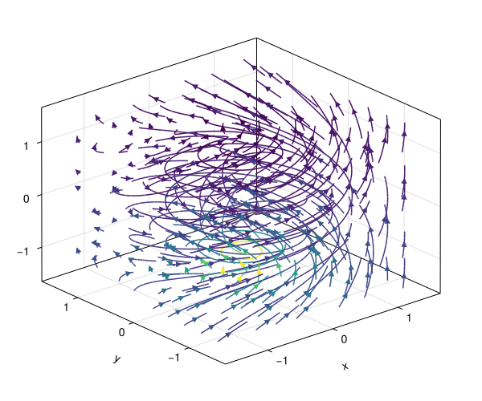 | 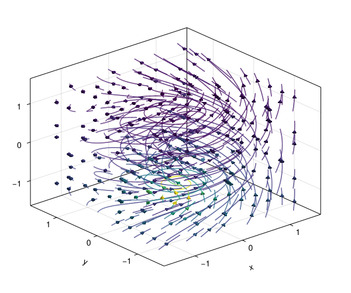 | <details><summary>✅ 6/6 checks</summary>arrows: equal (293)<br>line points: equal (24908)<br>NaN separators: equal (586)<br>all line points (Float32 hash): bit-identical (0x71866dde10fe3862)<br>arrow positions: max \|Δ\| = 0<br>arrow directions: max \|Δ\| = 0</details><br><sub>pixels: mean \|ΔRGB\| 2.4/255, 0.6% of pixels > 64/255</sub> |
| **grassmann-plane-1** ([original](https://raw.githubusercontent.com/chakravala/Grassmann.jl/master/paper/img/plane-1.png))<br>Versor field of exp(π*v12/2) on the Euclidean plane<br><sub>`basis"2"; streamplot(vectorfield(exp(π*v12/2)),-1.5..1.5,-1.5..1.5)` (Grassmann.jl `README.md:271-285`)</sub> |  |  | <details><summary>✅ 6/6 checks</summary>arrows: equal (202)<br>line points: equal (9115)<br>NaN separators: equal (404)<br>all line points (Float32 hash): bit-identical (0x075f14278e8c9b32)<br>arrow positions: max \|Δ\| = 0<br>arrow directions: max \|Δ\| = 0</details><br><sub>pixels: mean \|ΔRGB\| 0.2/255, 0.0% of pixels > 64/255</sub> |
| **grassmann-plane-2** ([original](https://raw.githubusercontent.com/chakravala/Grassmann.jl/master/paper/img/plane-2.png))<br>Versor field of exp((π/2)*v12/2) on the Euclidean plane<br><sub>`basis"2"; streamplot(vectorfield(exp((π/2)*v12/2)),-1.5..1.5,-1.5..1.5)` (Grassmann.jl `README.md:271-285`)</sub> |  | 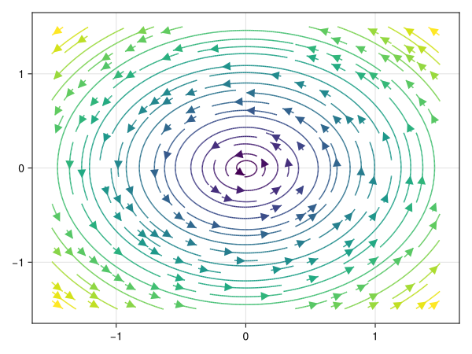 | <details><summary>✅ 6/6 checks</summary>arrows: equal (178)<br>line points: equal (8982)<br>NaN separators: equal (356)<br>all line points (Float32 hash): bit-identical (0x24ea20b08294e4bf)<br>arrow positions: max \|Δ\| = 0<br>arrow directions: max \|Δ\| = 0</details><br><sub>pixels: mean \|ΔRGB\| 0.8/255, 0.0% of pixels > 64/255</sub> |
| **grassmann-plane-3** ([original](https://raw.githubusercontent.com/chakravala/Grassmann.jl/master/paper/img/plane-3.png))<br>Versor field of exp((π/4)*v12/2) on the Euclidean plane<br><sub>`basis"2"; streamplot(vectorfield(exp((π/4)*v12/2)),-1.5..1.5,-1.5..1.5)` (Grassmann.jl `README.md:271-285`)</sub> | 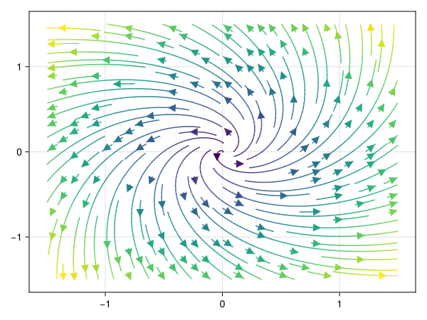 | 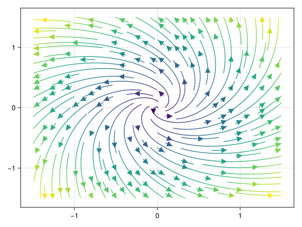 | <details><summary>✅ 6/6 checks</summary>arrows: equal (171)<br>line points: equal (8931)<br>NaN separators: equal (342)<br>all line points (Float32 hash): bit-identical (0x9bee65a3fcff096f)<br>arrow positions: max \|Δ\| = 0<br>arrow directions: max \|Δ\| = 0</details><br><sub>pixels: mean \|ΔRGB\| 0.2/255, 0.0% of pixels > 64/255</sub> |
| **grassmann-plane-4** ([original](https://raw.githubusercontent.com/chakravala/Grassmann.jl/master/paper/img/plane-4.png))<br>Versor field of v1*exp((π/4)*v12/2) on the Euclidean plane<br><sub>`basis"2"; streamplot(vectorfield(v1*exp((π/4)*v12/2)),-1.5..1.5,-1.5..1.5)` (Grassmann.jl `README.md:271-285`)</sub> | 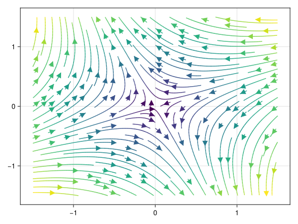 |  | <details><summary>✅ 6/6 checks</summary>arrows: equal (162)<br>line points: equal (9043)<br>NaN separators: equal (324)<br>all line points (Float32 hash): bit-identical (0x7010f4006e90c8de)<br>arrow positions: max \|Δ\| = 0<br>arrow directions: max \|Δ\| = 0</details><br><sub>pixels: mean \|ΔRGB\| 0.3/255, 0.0% of pixels > 64/255</sub> |
| **grassmann-plane-5** ([original](https://raw.githubusercontent.com/chakravala/Grassmann.jl/master/paper/img/plane-5.png))<br>Versor field of exp((π/8)*v12/2) on the hyperbolic plane<br><sub>`@basis S"+-"; streamplot(vectorfield(exp((π/8)*v12/2)),-1.5..1.5,-1.5..1.5)` (Grassmann.jl `README.md:271-285`)</sub> | 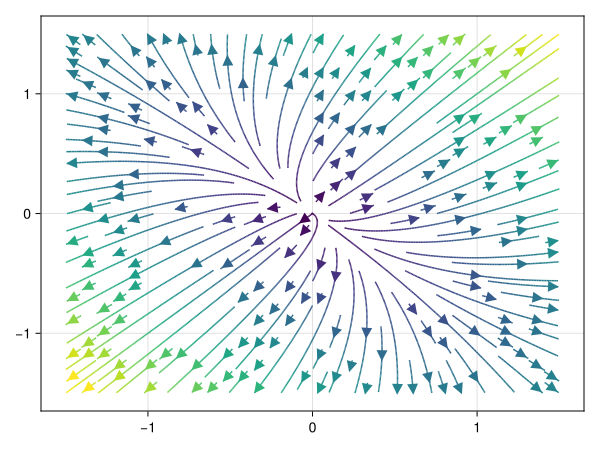 |  | <details><summary>✅ 6/6 checks</summary>arrows: equal (201)<br>line points: equal (9018)<br>NaN separators: equal (402)<br>all line points (Float32 hash): bit-identical (0xf5dc0af6d15c8d0b)<br>arrow positions: max \|Δ\| = 0<br>arrow directions: max \|Δ\| = 0</details><br><sub>pixels: mean \|ΔRGB\| 0.2/255, 0.0% of pixels > 64/255</sub> |
| **grassmann-plane-6** ([original](https://raw.githubusercontent.com/chakravala/Grassmann.jl/master/paper/img/plane-6.png))<br>Versor field of v1*exp((π/4)*v12/2) on the hyperbolic plane<br><sub>`@basis S"+-"; streamplot(vectorfield(v1*exp((π/4)*v12/2)),-1.5..1.5,-1.5..1.5)` (Grassmann.jl `README.md:271-285`)</sub> |  |  | <details><summary>✅ 6/6 checks</summary>arrows: equal (193)<br>line points: equal (9080)<br>NaN separators: equal (386)<br>all line points (Float32 hash): bit-identical (0x87c4a2104333da0b)<br>arrow positions: max \|Δ\| = 0<br>arrow directions: max \|Δ\| = 0</details><br><sub>pixels: mean \|ΔRGB\| 0.5/255, 0.0% of pixels > 64/255</sub> |
| **grassmann-torus** ([original](https://raw.githubusercontent.com/chakravala/Grassmann.jl/master/paper/img/torus.png))<br>Curve on the Riemann sphere S"∞+++" (torus)<br><sub>`@basis S"∞+++"; f(t) = (↓(exp(π*t*((3/7)*v12+v∞3))>>>↑(v1+v2+v3))); lines(V(2,3,4).(points(f)))` (`README.md:287-292`)</sub><br><sub>Julia's `lines` of 3D points opens an `LScene`; both sides use Makie's default `Axis3` (azimuth 1.275π, elevation π/8) so the frames are comparable. For t ∈ [-2π, -2π+5.6] the curve retraces itself (period 7); LeanPlot's coverage accumulation draws the doubled stretch slightly heavier than Cairo, which strokes the union of the path.</sub> | 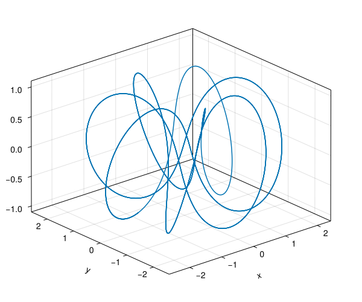 | 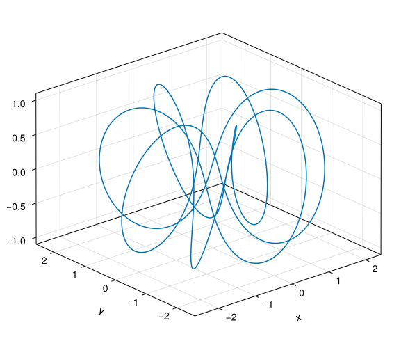 | <details><summary>✅ 5/5 checks</summary>points: equal (125664)<br>x (every 64th point): max rel \|Δ\| = 2.87e-16 over 1964 values (tol 1.00e-9)<br>y (every 64th point): max rel \|Δ\| = 2.61e-16 over 1964 values (tol 1.00e-9)<br>z (every 64th point): max rel \|Δ\| = 2.22e-16 over 1964 values (tol 1.00e-9)<br>Σx, Σy, Σz over all points: max \|Δ\| / Σ\|·\| = 7.86e-16</details><br><sub>pixels: mean \|ΔRGB\| 0.8/255, 0.8% of pixels > 64/255</sub> |
| **grassmann-helix** ([original](https://raw.githubusercontent.com/chakravala/Grassmann.jl/master/paper/img/helix.png))<br>The same curve in conformal space S"∞∅+++" (helix)<br><sub>`@basis S"∞∅+++"; f(t) = (↓(exp(π*t*((3/7)*v12+v∞3))>>>↑(v1+v2+v3))); lines(V(3,4,5).(points(f)))` (`README.md:293-296`)</sub><br><sub>Julia's `lines` of 3D points opens an `LScene`; both sides use Makie's default `Axis3` (azimuth 1.275π, elevation π/8) so the frames are comparable.</sub> |  | 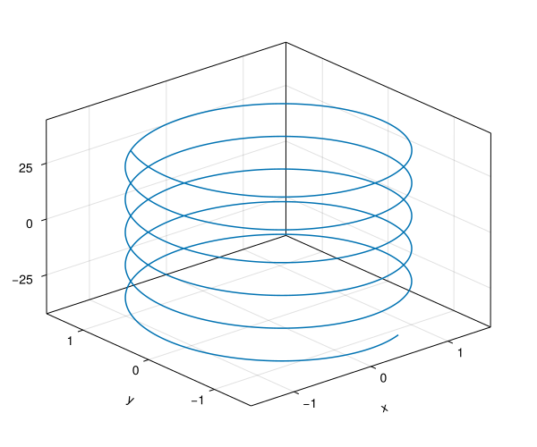 | <details><summary>✅ 5/5 checks</summary>points: equal (125664)<br>x (every 64th point): max rel \|Δ\| = 2.22e-16 over 1964 values (tol 1.00e-9)<br>y (every 64th point): max rel \|Δ\| = 2.22e-16 over 1964 values (tol 1.00e-9)<br>z (every 64th point): max rel \|Δ\| = 2.21e-16 over 1964 values (tol 1.00e-9)<br>Σx, Σy, Σz over all points: max \|Δ\| / Σ\|·\| = 3.11e-15</details><br><sub>pixels: mean \|ΔRGB\| 0.1/255, 0.0% of pixels > 64/255</sub> |
| **grassmann-orbit-2** ([original](https://raw.githubusercontent.com/chakravala/Grassmann.jl/master/paper/img/orbit-2.png))<br>Orbit of a translating conformal versor (orbit-2)<br><sub>`f(t) = ↓(exp(t*v∞*(sin(3t)*3v1+cos(2t)*7v2-sin(5t)*4v3)/2)>>>↑(v1+v2-v3)); lines(V(2,3,4).(points(f)))` (`README.md:304-310`)</sub><br><sub>Julia's `lines` of 3D points opens an `LScene`; both sides use Makie's default `Axis3` (azimuth 1.275π, elevation π/8) so the frames are comparable.</sub> | 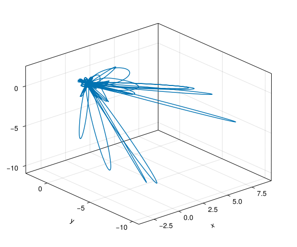 | 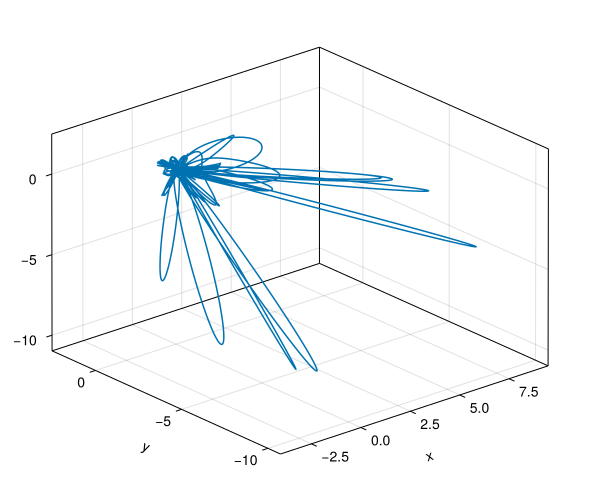 | <details><summary>✅ 5/5 checks</summary>points: equal (125664)<br>x (every 64th point): max rel \|Δ\| = 1.30e-14 over 1964 values (tol 1.00e-9)<br>y (every 64th point): max rel \|Δ\| = 9.14e-15 over 1964 values (tol 1.00e-9)<br>z (every 64th point): max rel \|Δ\| = 1.38e-14 over 1964 values (tol 1.00e-9)<br>Σx, Σy, Σz over all points: max \|Δ\| / Σ\|·\| = 8.26e-15</details><br><sub>pixels: mean \|ΔRGB\| 0.2/255, 0.1% of pixels > 64/255</sub> |
| **grassmann-orbit-4** ([original](https://raw.githubusercontent.com/chakravala/Grassmann.jl/master/paper/img/orbit-4.png))<br>Orbit of a rotating and translating conformal versor (orbit-4)<br><sub>`f(t) = ↓(exp(t*(v12+0.07v∞*(sin(3t)*3v1+cos(2t)*7v2-sin(5t)*4v3)/2))>>>↑(v1+v2-v3)); lines(V(2,3,4).(points(f)))` (`README.md:311-316`)</sub><br><sub>Julia's `lines` of 3D points opens an `LScene`; both sides use Makie's default `Axis3` (azimuth 1.275π, elevation π/8) so the frames are comparable.</sub> | 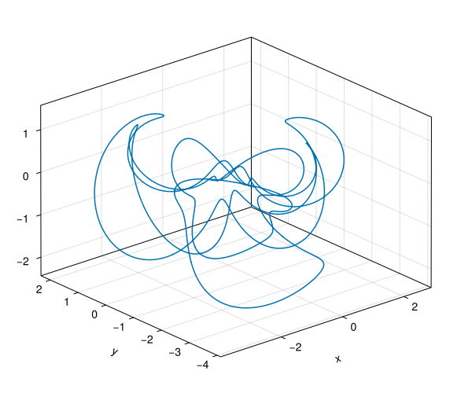 |  | <details><summary>✅ 5/5 checks</summary>points: equal (125664)<br>x (every 64th point): max rel \|Δ\| = 2.89e-14 over 1964 values (tol 1.00e-9)<br>y (every 64th point): max rel \|Δ\| = 3.24e-14 over 1964 values (tol 1.00e-9)<br>z (every 64th point): max rel \|Δ\| = 2.13e-14 over 1964 values (tol 1.00e-9)<br>Σx, Σy, Σz over all points: max \|Δ\| / Σ\|·\| = 6.82e-15</details><br><sub>pixels: mean \|ΔRGB\| 0.2/255, 0.0% of pixels > 64/255</sub> |

## Grassmann paper graphs

| figure | Lean (LeanPlot) | Julia (CairoMakie) | data agreement |
|---|---|---|---|
| **grassmann-graph-1** ([original](https://raw.githubusercontent.com/chakravala/Grassmann.jl/master/paper/img/graph-1.png))<br>Digraph of v12 + v34<br><sub>`SimpleDiGraph(v12+v34)` (Grassmann.jl `paper/paper.tex:566-586`, `ext/LightGraphsExt.jl`)</sub><br><sub>The paper figure came from `GraphPlot.gplot` via Compose (not installable, and `Grassmann.graph` was removed upstream); both sides draw GraphPlot's circular layout (vertex k at angle 2π(k-1)/n, y down) with the same data-space disks and arrowheads, from the `ext/LightGraphsExt.jl` edge rule.</sub> | 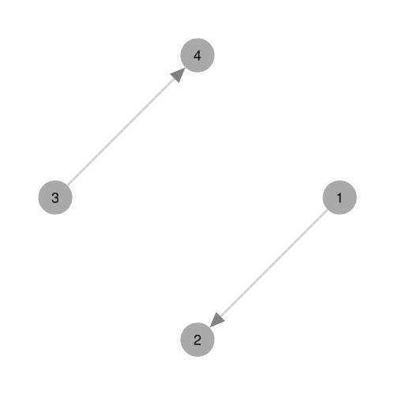 | 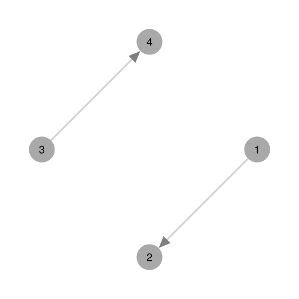 | <details><summary>✅ 2/2 checks</summary>edges (in insertion order): equal: 1→2, 3→4<br>vertices: equal (4)</details><br><sub>pixels: mean \|ΔRGB\| 0.0/255, 0.0% of pixels > 64/255</sub> |
| **grassmann-graph-2** ([original](https://raw.githubusercontent.com/chakravala/Grassmann.jl/master/paper/img/graph-2.png))<br>Digraph of v14 + v24 + v34<br><sub>`SimpleDiGraph(v14+v24+v34)` (Grassmann.jl `paper/paper.tex:566-586`)</sub><br><sub>The paper figure came from `GraphPlot.gplot` via Compose (not installable, and `Grassmann.graph` was removed upstream); both sides draw GraphPlot's circular layout (vertex k at angle 2π(k-1)/n, y down) with the same data-space disks and arrowheads, from the `ext/LightGraphsExt.jl` edge rule.</sub> | 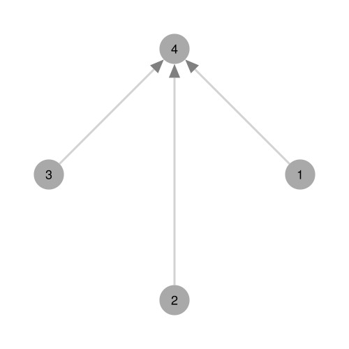 | 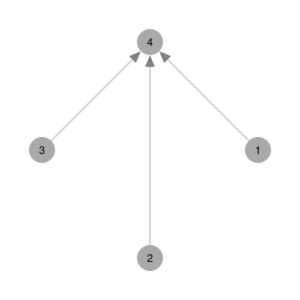 | <details><summary>✅ 2/2 checks</summary>edges (in insertion order): equal: 1→4, 2→4, 3→4<br>vertices: equal (4)</details><br><sub>pixels: mean \|ΔRGB\| 0.0/255, 0.0% of pixels > 64/255</sub> |
| **grassmann-graph-3** ([original](https://raw.githubusercontent.com/chakravala/Grassmann.jl/master/paper/img/graph-3.png))<br>Digraph of ∂(v124) + v34<br><sub>`SimpleDiGraph(∂(v124)+v34)` (Grassmann.jl `paper/paper.tex:566-586`)</sub><br><sub>The paper figure came from `GraphPlot.gplot` via Compose (not installable, and `Grassmann.graph` was removed upstream); both sides draw GraphPlot's circular layout (vertex k at angle 2π(k-1)/n, y down) with the same data-space disks and arrowheads, from the `ext/LightGraphsExt.jl` edge rule.</sub> |  | 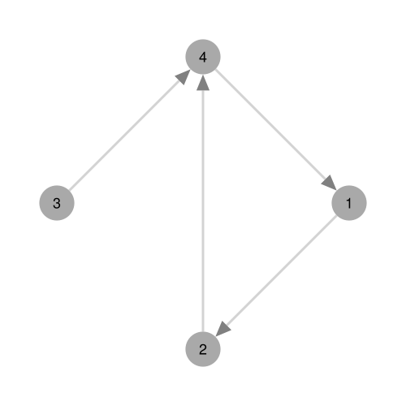 | <details><summary>✅ 2/2 checks</summary>edges (in insertion order): equal: 1→2, 4→1, 2→4, 3→4<br>vertices: equal (4)</details><br><sub>pixels: mean \|ΔRGB\| 0.0/255, 0.0% of pixels > 64/255</sub> |
| **grassmann-triangle-tetrahedron** ([original](https://raw.githubusercontent.com/chakravala/Grassmann.jl/master/paper/img/triangle-tetrahedron.png))<br>Digraph of v123 + !v123 in ℝ⁷ (triangle and tetrahedron)<br><sub>`x = Λ(ℝ^7).v123; Grassmann.graph(x+!x)` (Grassmann.jl `paper/paper.tex:320-329`, `src/Grassmann.jl:430-445`)</sub><br><sub>The paper figure came from `GraphPlot.gplot` via Compose (not installable, and `Grassmann.graph` was removed upstream); both sides draw GraphPlot's circular layout (vertex k at angle 2π(k-1)/n, y down) with the same data-space disks and arrowheads, from the `ext/LightGraphsExt.jl` edge rule. Edges between the tetrahedron's vertices run both ways (double arrows).</sub> | 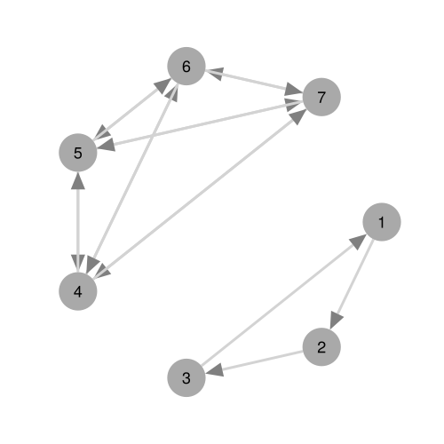 | 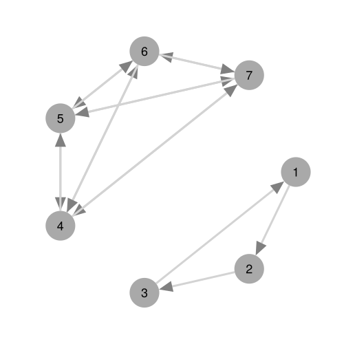 | <details><summary>✅ 2/2 checks</summary>edges (in insertion order): equal: 1→2, 3→1, 2→3, 5→4, 4→6, 6→5, 4→5, 7→4, 5→7, 6→4, 4→7, 7→6, 5→6, 7→5, 6→7<br>vertices: equal (7)</details><br><sub>pixels: mean \|ΔRGB\| 0.0/255, 0.0% of pixels > 64/255</sub> |

## Wilkinson

| figure | Lean (LeanPlot) | Julia (CairoMakie) | data agreement |
|---|---|---|---|
| **wilkinson-x-2-pow-9**<br>Error bounds of the forms of (x − 2)⁹<br><sub>`plot(PolynomialComparison(:((x - 2) ^ 9)))` (Wilkinson.jl `src/polynomial.jl:96-133`)</sub><br><sub>Wilkinson.jl does not load (PyPlot/Conda), so the Julia side runs its copied kernels (as `oracle/wilkinson/gen.jl`) and draws with CairoMakie; LaTeX labels are plain text. Upstream's positional `legend(leg)` mislabels the lines when the input form is drawn and spells "orignal"; both sides label each line directly.</sub> | 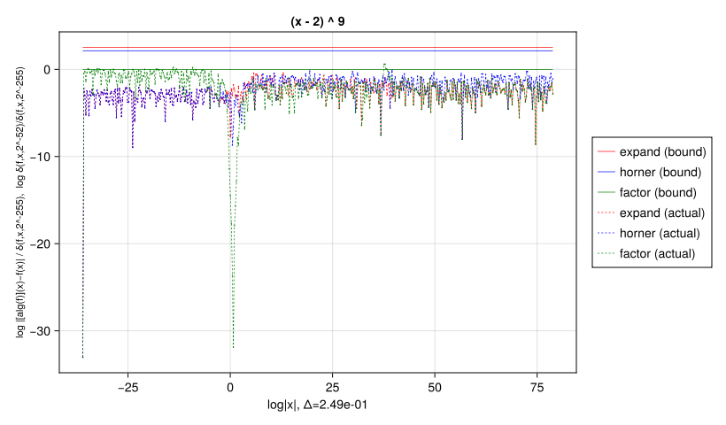 | 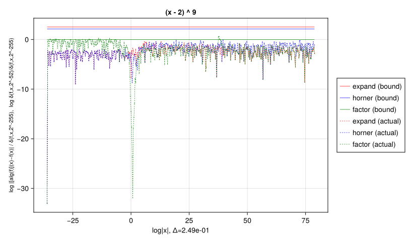 | <details><summary>✅ 5/5 checks</summary>extra (input drawn): equal (false)<br>rxtra (rounded factorization drawn): equal (false)<br>series: equal (6)<br>grid (every 10th): max rel \|Δ\| = 0 over 300 values (tol 0)<br>every series (labels, every 10th value, Σ): max rel \|Δ\| = 0 (sampled), 1.56e-15 (sums) over 6 series</details><br><sub>pixels: mean \|ΔRGB\| 0.5/255, 0.0% of pixels > 64/255</sub> |
| **wilkinson-cubic**<br>Error bounds of x³ − 6x² + 11x − 6, with REDUCE's rounded factorization<br><sub>`plot(PolynomialComparison(:(x^3 - 6x^2 + 11x - 6)))` (Wilkinson.jl `src/polynomial.jl:96-133`)</sub><br><sub>Wilkinson.jl does not load (PyPlot/Conda), so the Julia side runs its copied kernels (as `oracle/wilkinson/gen.jl`) and draws with CairoMakie; LaTeX labels are plain text. Upstream's positional `legend(leg)` mislabels the lines when the input form is drawn and spells "orignal"; both sides label each line directly.</sub> | 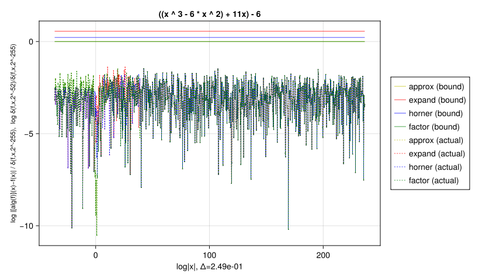 | 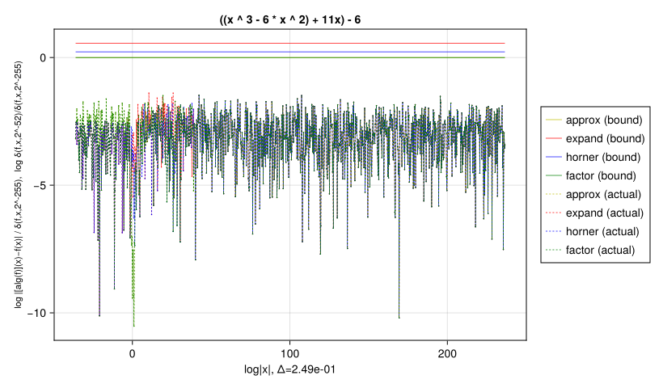 | <details><summary>✅ 5/5 checks</summary>extra (input drawn): equal (false)<br>rxtra (rounded factorization drawn): equal (true)<br>series: equal (8)<br>grid (every 10th): max rel \|Δ\| = 0 over 300 values (tol 0)<br>every series (labels, every 10th value, Σ): max rel \|Δ\| = 0 (sampled), 3.70e-15 (sums) over 8 series</details><br><sub>pixels: mean \|ΔRGB\| 1.2/255, 0.2% of pixels > 64/255</sub> |
| **wilkinson-product**<br>Error bounds of (2x − 1)(3x + 2), with the input form<br><sub>`plot(PolynomialComparison(:((2x - 1) * (3x + 2))))` (Wilkinson.jl `src/polynomial.jl:96-133`)</sub><br><sub>Wilkinson.jl does not load (PyPlot/Conda), so the Julia side runs its copied kernels (as `oracle/wilkinson/gen.jl`) and draws with CairoMakie; LaTeX labels are plain text. Upstream's positional `legend(leg)` mislabels the lines when the input form is drawn and spells "orignal"; both sides label each line directly.</sub> | 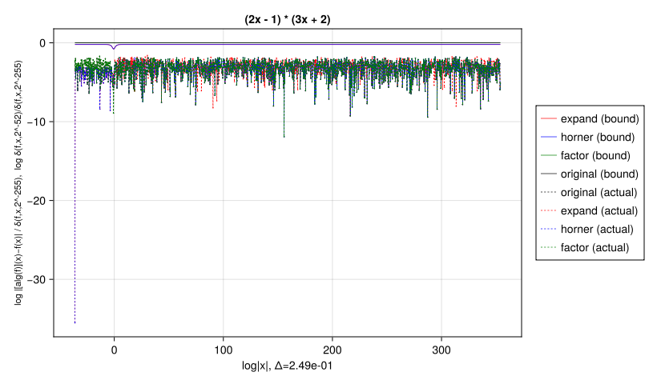 | 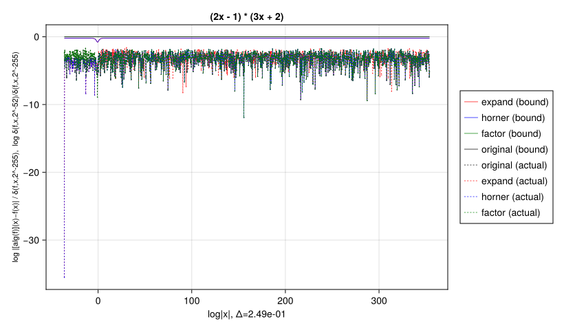 | <details><summary>✅ 5/5 checks</summary>extra (input drawn): equal (true)<br>rxtra (rounded factorization drawn): equal (false)<br>series: equal (8)<br>grid (every 10th): max rel \|Δ\| = 0 over 300 values (tol 0)<br>every series (labels, every 10th value, Σ): max rel \|Δ\| = 0 (sampled), 1.08e-14 (sums) over 8 series</details><br><sub>pixels: mean \|ΔRGB\| 0.8/255, 0.1% of pixels > 64/255</sub> |

## Cartan (fiber.md)

| figure | Lean (LeanPlot) | Julia (CairoMakie) | data agreement |
|---|---|---|---|
| **cartan-riemann-torus** ([original](https://cartan.crucialflow.com/dev/fiber))<br>Riemann-sphere curve as a TensorField, coloured by speed (torus)<br><sub>`pts = TensorField(-2*pi:0.0001:2*pi); @basis S"∞+++"; f(t) = ↓(exp(π*t*((3/7)*v12+v∞3))>>>↑(v1+v2+v3)); lines(V(2,3,4).(f.(pts)))` (`fiber.md:477-487`)</sub> | 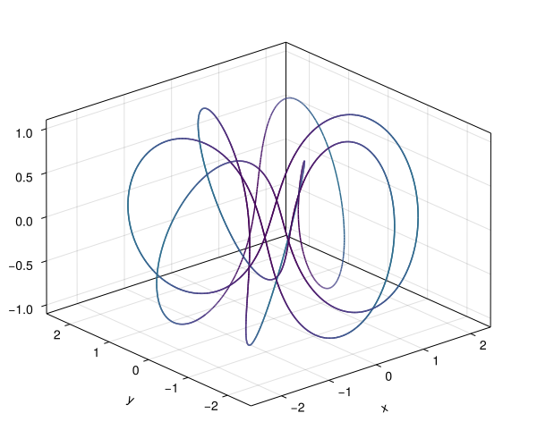 | 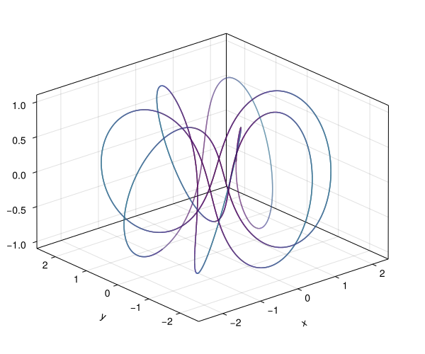 | <details><summary>✅ 12/12 checks</summary>speed: count: equal (125664)<br>speed (every 64th): max rel \|Δ\| = 5.40e-13 over 1964 values (tol 1.00e-9)<br>speed: sum over all: \|Δ\| / Σ\|·\| = 6.68e-16 (tol 1.00e-9)<br>x1: count: equal (125664)<br>x1 (every 64th): max rel \|Δ\| = 2.87e-16 over 1964 values (tol 1.00e-9)<br>x1: sum over all: \|Δ\| / Σ\|·\| = 7.86e-16 (tol 1.00e-9)<br>x2: count: equal (125664)<br>x2 (every 64th): max rel \|Δ\| = 2.61e-16 over 1964 values (tol 1.00e-9)<br>x2: sum over all: \|Δ\| / Σ\|·\| = 1.99e-16 (tol 1.00e-9)<br>x3: count: equal (125664)<br>x3 (every 64th): max rel \|Δ\| = 2.22e-16 over 1964 values (tol 1.00e-9)<br>x3: sum over all: \|Δ\| / Σ\|·\| = 1.50e-16 (tol 1.00e-9)</details><br><sub>pixels: mean \|ΔRGB\| 0.5/255, 0.1% of pixels > 64/255</sub> |
| **cartan-riemann-orbit-2** ([original](https://cartan.crucialflow.com/dev/fiber))<br>Riemann-sphere curve of a translating versor, coloured by speed<br><sub>`f(t) = ↓(exp(t*v∞*(sin(3t)*3v1+cos(2t)*7v2-sin(5t)*4v3)/2)>>>↑(v1+v2-v3)); lines(V(2,3,4).(f.(pts)))` (`fiber.md:477-487`)</sub> |  | 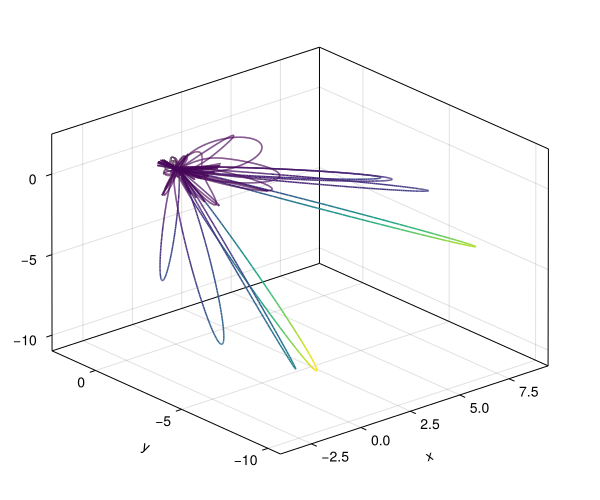 | <details><summary>✅ 12/12 checks</summary>speed: count: equal (125664)<br>speed (every 64th): max rel \|Δ\| = 1.74e-12 over 1964 values (tol 1.00e-9)<br>speed: sum over all: \|Δ\| / Σ\|·\| = 2.87e-15 (tol 1.00e-9)<br>x1: count: equal (125664)<br>x1 (every 64th): max rel \|Δ\| = 8.18e-15 over 1964 values (tol 1.00e-9)<br>x1: sum over all: \|Δ\| / Σ\|·\| = 8.42e-15 (tol 1.00e-9)<br>x2: count: equal (125664)<br>x2 (every 64th): max rel \|Δ\| = 7.09e-15 over 1964 values (tol 1.00e-9)<br>x2: sum over all: \|Δ\| / Σ\|·\| = 0 (tol 1.00e-9)<br>x3: count: equal (125664)<br>x3 (every 64th): max rel \|Δ\| = 5.02e-15 over 1964 values (tol 1.00e-9)<br>x3: sum over all: \|Δ\| / Σ\|·\| = 1.72e-15 (tol 1.00e-9)</details><br><sub>pixels: mean \|ΔRGB\| 0.4/255, 0.2% of pixels > 64/255</sub> |
| **cartan-riemann-orbit-4** ([original](https://cartan.crucialflow.com/dev/fiber))<br>Riemann-sphere curve of a rotating and translating versor, coloured by speed<br><sub>`f(t) = ↓(exp(t*(v12+0.07v∞*(sin(3t)*3v1+cos(2t)*7v2-sin(5t)*4v3)/2))>>>↑(v1+v2-v3)); lines(V(2,3,4).(f.(pts)))` (`fiber.md:477-487`)</sub> | 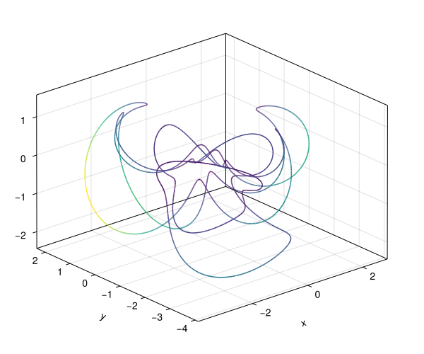 | 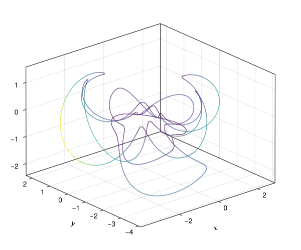 | <details><summary>✅ 12/12 checks</summary>speed: count: equal (125664)<br>speed (every 64th): max rel \|Δ\| = 1.08e-12 over 1964 values (tol 1.00e-9)<br>speed: sum over all: \|Δ\| / Σ\|·\| = 1.80e-15 (tol 1.00e-9)<br>x1: count: equal (125664)<br>x1 (every 64th): max rel \|Δ\| = 3.78e-16 over 1964 values (tol 1.00e-9)<br>x1: sum over all: \|Δ\| / Σ\|·\| = 5.73e-16 (tol 1.00e-9)<br>x2: count: equal (125664)<br>x2 (every 64th): max rel \|Δ\| = 3.50e-16 over 1964 values (tol 1.00e-9)<br>x2: sum over all: \|Δ\| / Σ\|·\| = 4.13e-15 (tol 1.00e-9)<br>x3: count: equal (125664)<br>x3 (every 64th): max rel \|Δ\| = 3.11e-16 over 1964 values (tol 1.00e-9)<br>x3: sum over all: \|Δ\| / Σ\|·\| = 6.82e-15 (tol 1.00e-9)</details><br><sub>pixels: mean \|ΔRGB\| 0.6/255, 0.2% of pixels > 64/255</sub> |
| **cartan-riemann-helix** ([original](https://cartan.crucialflow.com/dev/fiber))<br>The same curve in conformal space S"∞∅+++", coloured by speed<br><sub>`@basis S"∞∅+++"; f(t) = ↓(exp(π*t*((3/7)*v12+v∞3))>>>↑(v1+v2+v3)); lines(V(3,4,5).(vector.(f.(pts))))` (`fiber.md:488-493`)</sub> | 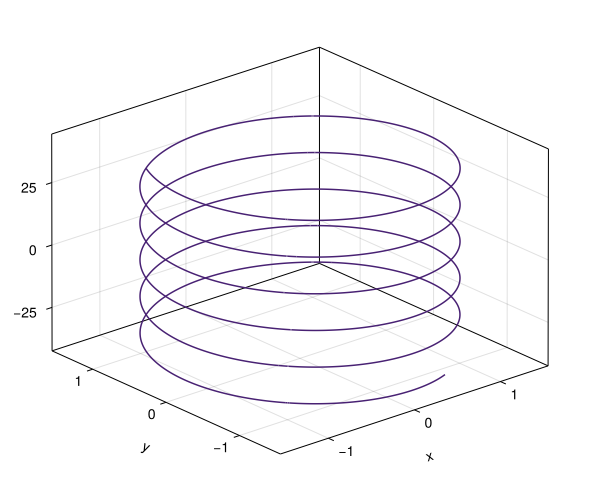 |  | <details><summary>✅ 12/12 checks</summary>speed: count: equal (125664)<br>speed (every 64th): max rel \|Δ\| = 6.24e-12 over 1964 values (tol 1.00e-9)<br>speed: sum over all: \|Δ\| / Σ\|·\| = 6.18e-15 (tol 1.00e-9)<br>x1: count: equal (125664)<br>x1 (every 64th): max rel \|Δ\| = 2.22e-16 over 1964 values (tol 1.00e-9)<br>x1: sum over all: \|Δ\| / Σ\|·\| = 1.46e-15 (tol 1.00e-9)<br>x2: count: equal (125664)<br>x2 (every 64th): max rel \|Δ\| = 2.22e-16 over 1964 values (tol 1.00e-9)<br>x2: sum over all: \|Δ\| / Σ\|·\| = 3.54e-16 (tol 1.00e-9)<br>x3: count: equal (125664)<br>x3 (every 64th): max rel \|Δ\| = 2.21e-16 over 1964 values (tol 1.00e-9)<br>x3: sum over all: \|Δ\| / Σ\|·\| = 3.11e-15 (tol 1.00e-9)</details><br><sub>pixels: mean \|ΔRGB\| 0.2/255, 0.0% of pixels > 64/255</sub> |
| **cartan-bivector-1** ([original](https://cartan.crucialflow.com/dev/fiber))<br>Streamlines of the 31×31 grid field of exp(pi*v12/2) (Euclidean plane)<br><sub>`basis"2"; vdom = TensorField(ProductSpace{V}(-1.5:0.1:1.5,-1.5:0.1:1.5)); streamplot(tensorfield(exp(pi*v12/2)).(vdom))` (`fiber.md:495-509`)</sub> |  | 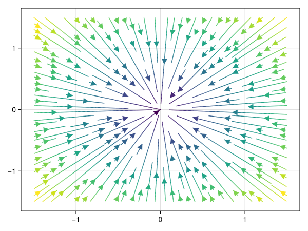 | <details><summary>✅ 6/6 checks</summary>arrows: equal (202)<br>line points: equal (9115)<br>NaN separators: equal (404)<br>all line points (Float32 hash): bit-identical (0x075f14278e8c9b32)<br>arrow positions: max \|Δ\| = 0<br>arrow directions: max \|Δ\| = 0</details><br><sub>pixels: mean \|ΔRGB\| 0.2/255, 0.0% of pixels > 64/255</sub> |
| **cartan-bivector-2** ([original](https://cartan.crucialflow.com/dev/fiber))<br>Streamlines of the 31×31 grid field of exp((pi/2)*v12/2) (Euclidean plane)<br><sub>`basis"2"; vdom = TensorField(ProductSpace{V}(-1.5:0.1:1.5,-1.5:0.1:1.5)); streamplot(tensorfield(exp((pi/2)*v12/2)).(vdom))` (`fiber.md:495-509`)</sub> | 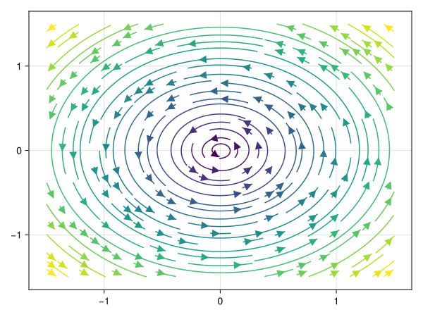 |  | <details><summary>✅ 6/6 checks</summary>arrows: equal (178)<br>line points: equal (8982)<br>NaN separators: equal (356)<br>all line points (Float32 hash): bit-identical (0x24ea20b08294e4bf)<br>arrow positions: max \|Δ\| = 0<br>arrow directions: max \|Δ\| = 0</details><br><sub>pixels: mean \|ΔRGB\| 0.8/255, 0.0% of pixels > 64/255</sub> |
| **cartan-bivector-3** ([original](https://cartan.crucialflow.com/dev/fiber))<br>Streamlines of the 31×31 grid field of exp((pi/4)*v12/2) (Euclidean plane)<br><sub>`basis"2"; vdom = TensorField(ProductSpace{V}(-1.5:0.1:1.5,-1.5:0.1:1.5)); streamplot(tensorfield(exp((pi/4)*v12/2)).(vdom))` (`fiber.md:495-509`)</sub> |  |  | <details><summary>✅ 6/6 checks</summary>arrows: equal (171)<br>line points: equal (8931)<br>NaN separators: equal (342)<br>all line points (Float32 hash): bit-identical (0x9bee65a3fcff096f)<br>arrow positions: max \|Δ\| = 0<br>arrow directions: max \|Δ\| = 0</details><br><sub>pixels: mean \|ΔRGB\| 0.2/255, 0.0% of pixels > 64/255</sub> |
| **cartan-bivector-4** ([original](https://cartan.crucialflow.com/dev/fiber))<br>Streamlines of the 31×31 grid field of v1*exp((pi/4)*v12/2) (Euclidean plane)<br><sub>`basis"2"; vdom = TensorField(ProductSpace{V}(-1.5:0.1:1.5,-1.5:0.1:1.5)); streamplot(tensorfield(v1*exp((pi/4)*v12/2)).(vdom))` (`fiber.md:495-509`)</sub> |  |  | <details><summary>✅ 6/6 checks</summary>arrows: equal (162)<br>line points: equal (9043)<br>NaN separators: equal (324)<br>all line points (Float32 hash): bit-identical (0x7010f4006e90c8de)<br>arrow positions: max \|Δ\| = 0<br>arrow directions: max \|Δ\| = 0</details><br><sub>pixels: mean \|ΔRGB\| 0.3/255, 0.0% of pixels > 64/255</sub> |
| **cartan-bivector-5** ([original](https://cartan.crucialflow.com/dev/fiber))<br>Streamlines of the 31×31 grid field of exp((pi/8)*v12/2) (Lobachevskian plane)<br><sub>`@basis S"+-"; vdom = TensorField(ProductSpace{V}(-1.5:0.1:1.5,-1.5:0.1:1.5)); streamplot(tensorfield(exp((pi/8)*v12/2)).(vdom))` (`fiber.md:495-509`)</sub> |  |  | <details><summary>✅ 6/6 checks</summary>arrows: equal (201)<br>line points: equal (9018)<br>NaN separators: equal (402)<br>all line points (Float32 hash): bit-identical (0xf5dc0af6d15c8d0b)<br>arrow positions: max \|Δ\| = 0<br>arrow directions: max \|Δ\| = 0</details><br><sub>pixels: mean \|ΔRGB\| 0.2/255, 0.0% of pixels > 64/255</sub> |
| **cartan-bivector-6** ([original](https://cartan.crucialflow.com/dev/fiber))<br>Streamlines of the 31×31 grid field of v1*exp((pi/4)*v12/2) (Lobachevskian plane)<br><sub>`@basis S"+-"; vdom = TensorField(ProductSpace{V}(-1.5:0.1:1.5,-1.5:0.1:1.5)); streamplot(tensorfield(v1*exp((pi/4)*v12/2)).(vdom))` (`fiber.md:495-509`)</sub> | 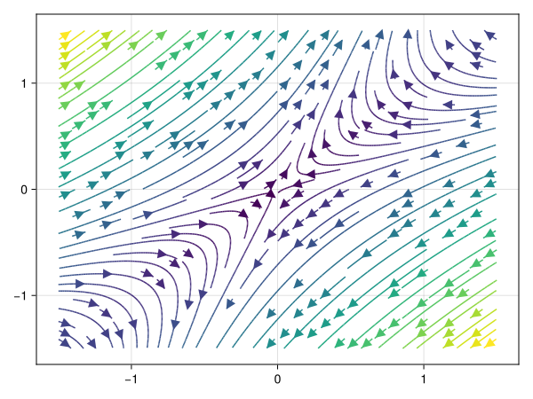 | 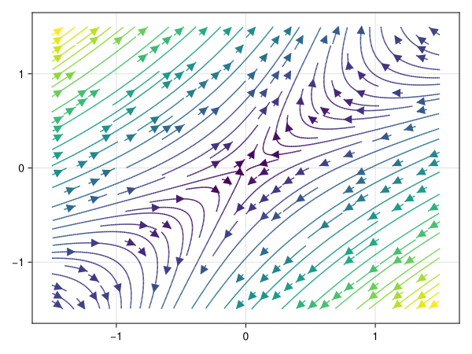 | <details><summary>✅ 6/6 checks</summary>arrows: equal (193)<br>line points: equal (9080)<br>NaN separators: equal (386)<br>all line points (Float32 hash): bit-identical (0x87c4a2104333da0b)<br>arrow positions: max \|Δ\| = 0<br>arrow directions: max \|Δ\| = 0</details><br><sub>pixels: mean \|ΔRGB\| 0.5/255, 0.0% of pixels > 64/255</sub> |
| **cartan-conformal-stream-1** ([original](https://cartan.crucialflow.com/dev/fiber))<br>Streamlines of the 31³ grid field of exp((π/4)(v12+v∞3)) on ProductSpace{V(1,2,3)}<br><sub>`@basis S"∞+++"; vdom = TensorField(ProductSpace{V(1,2,3)}(-1.5:0.1:1.5,…)); streamplot(tensorfield(exp((pi/4)*(v12+v∞3)),V(2,3,4)).(vdom),gridsize=(10,10))` (`fiber.md:511-523`)</sub> |  | 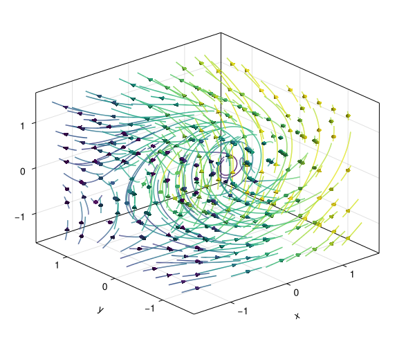 | <details><summary>✅ 6/6 checks</summary>arrows: equal (302)<br>line points: equal (25671)<br>NaN separators: equal (604)<br>all line points (Float32 hash): bit-identical (0x42e9e587de93a410)<br>arrow positions: max \|Δ\| = 0<br>arrow directions: max \|Δ\| = 0</details><br><sub>pixels: mean \|ΔRGB\| 1.6/255, 0.7% of pixels > 64/255</sub> |
| **cartan-conformal-stream-2** ([original](https://cartan.crucialflow.com/dev/fiber))<br>Streamlines of the 31³ grid field of exp((π/4)(v12+v∞3)) on ProductSpace{V(2,3,4)}<br><sub>`@basis S"∞+++"; vdom = TensorField(ProductSpace{V(2,3,4)}(-1.5:0.1:1.5,…)); streamplot(tensorfield(exp((pi/4)*(v12+v∞3)),V(2,3,4)).(vdom),gridsize=(10,10))` (`fiber.md:511-523`)</sub> | 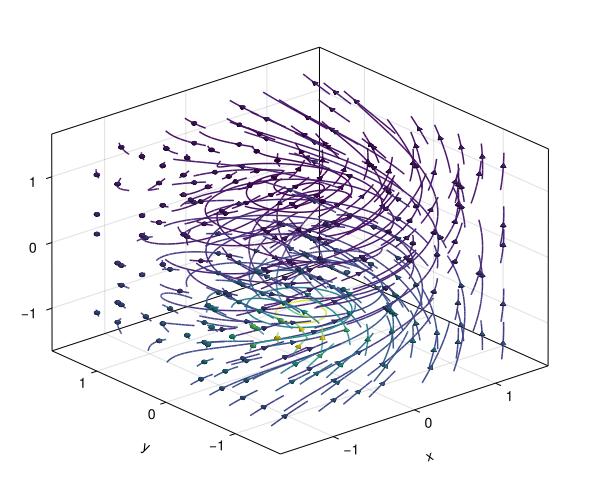 | 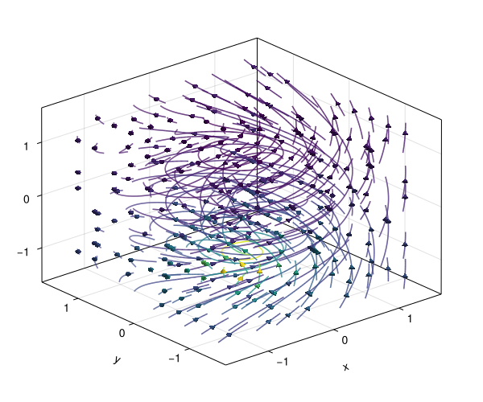 | <details><summary>✅ 6/6 checks</summary>arrows: equal (294)<br>line points: equal (24937)<br>NaN separators: equal (588)<br>all line points (Float32 hash): bit-identical (0x64dc00cae4b47c33)<br>arrow positions: max \|Δ\| = 0<br>arrow directions: max \|Δ\| = 0</details><br><sub>pixels: mean \|ΔRGB\| 2.3/255, 0.6% of pixels > 64/255</sub> |
| **cartan-circle** ([original](https://cartan.crucialflow.com/dev/fiber))<br>The unit circle as a plane curve, coloured by speed<br><sub>`t = TensorField(0:0.001:2pi); circ = Chain.(cos(t),sin(t)); lines(circ)` (`fiber.md:602-613`)</sub> | 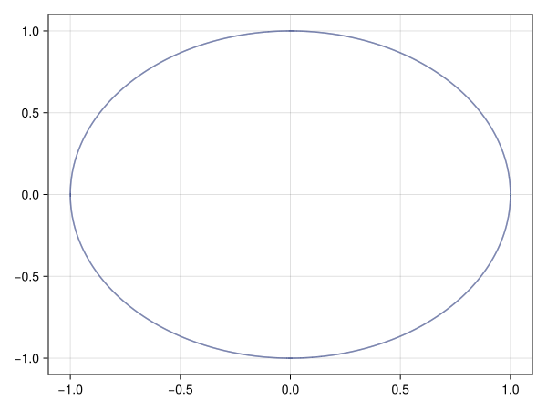 | 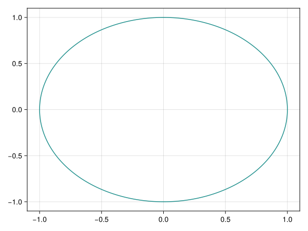 | <details><summary>✅ 9/9 checks</summary>speed: count: equal (6284)<br>speed (every 16th): max rel \|Δ\| = 0 over 393 values (tol 1.00e-9)<br>speed: sum over all: \|Δ\| / Σ\|·\| = 2.81e-14 (tol 1.00e-9)<br>x1: count: equal (6284)<br>x1 (every 16th): max rel \|Δ\| = 0 over 393 values (tol 1.00e-9)<br>x1: sum over all: \|Δ\| / Σ\|·\| = 1.36e-15 (tol 1.00e-9)<br>x2: count: equal (6284)<br>x2 (every 16th): max rel \|Δ\| = 0 over 393 values (tol 1.00e-9)<br>x2: sum over all: \|Δ\| / Σ\|·\| = 9.23e-16 (tol 1.00e-9)</details><br><sub>pixels: mean \|ΔRGB\| 0.4/255, 0.5% of pixels > 64/255</sub> |
| **cartan-sphere-wireframe** ([original](https://cartan.crucialflow.com/dev/fiber))<br>Wireframe of the sphere over SphereParameter(60,60)<br><sub>`spher(x) = Chain(cos(x[2])*sin(x[1]), sin(x[2])*sin(x[1]), cos(x[1])); wireframe(spher.(SphereParameter(60,60)))` (`fiber.md:602-613`)</sub> | 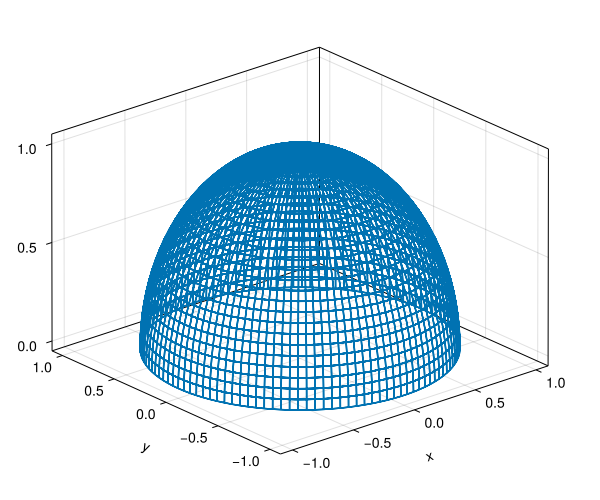 | 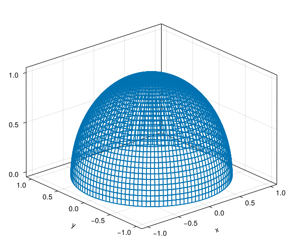 | <details><summary>✅ 10/10 checks</summary>segment points: equal (27848)<br>x1: count: equal (27848)<br>x1 (every 64th): max rel \|Δ\| = 0 over 436 values (tol 1.00e-9)<br>x1: sum over all: \|Δ\| / Σ\|·\| = 2.05e-17 (tol 1.00e-9)<br>x2: count: equal (27848)<br>x2 (every 64th): max rel \|Δ\| = 0 over 436 values (tol 1.00e-9)<br>x2: sum over all: \|Δ\| / Σ\|·\| = 2.93e-18 (tol 1.00e-9)<br>x3: count: equal (27848)<br>x3 (every 64th): max rel \|Δ\| = 0 over 436 values (tol 1.00e-9)<br>x3: sum over all: \|Δ\| / Σ\|·\| = 4.11e-16 (tol 1.00e-9)</details><br><sub>pixels: mean \|ΔRGB\| 1.2/255, 0.2% of pixels > 64/255</sub> |
| **cartan-torus-tangent-stream** ([original](https://cartan.crucialflow.com/dev/fiber))<br>Streamlines of a parameter field drawn on the torus (tangent-space streamplot)<br><sub>`tor = torus.(TorusParameter(60,60)); vf3 = f3.(TorusParameter(100,100)); streamplot(tor,vf3)` (`fiber.md:778-797`)</sub><br><sub>The streamlines are traced in parameter space and pushed through the embedding (Makie's `transform_func`); they agree bit for bit. Julia draws in the automatic `LScene` (an `Axis3` loses the transformed limits in CairoMakie), Lean in an `Axis3` with data aspect, so the camera differs. The arrowhead size uses the triangulated surface area instead of Cartan's `surfacearea` (a differential-geometry integral).</sub> | 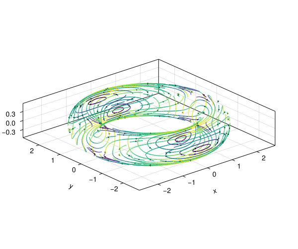 | 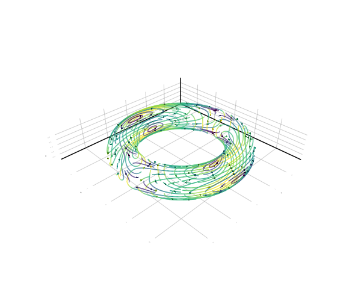 | <details><summary>✅ 6/6 checks</summary>arrows: equal (145)<br>line points: equal (18559)<br>NaN separators: equal (290)<br>all line points (Float32 hash): bit-identical (0x317c5a42c3dde416)<br>arrow positions: max \|Δ\| = 0<br>arrow directions: max \|Δ\| = 0</details><br><sub>pixels: mean \|ΔRGB\| 10.4/255, 8.6% of pixels > 64/255</sub> |
| **cartan-hopf** ([original](https://cartan.crucialflow.com/dev/fiber))<br>Hopf fibration: seven nested tori of the stereographic Hopf map<br><sub>`hs = stereohopf.(HopfParameter()); alteration!(hs,wireframe,wireframe!)` (`fiber.md:765-775`)</sub> | 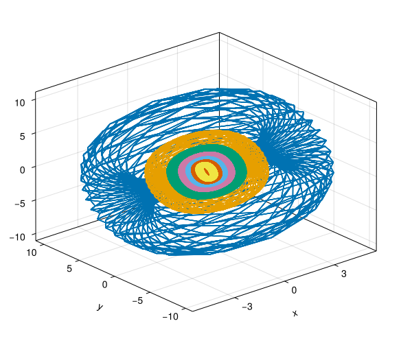 | 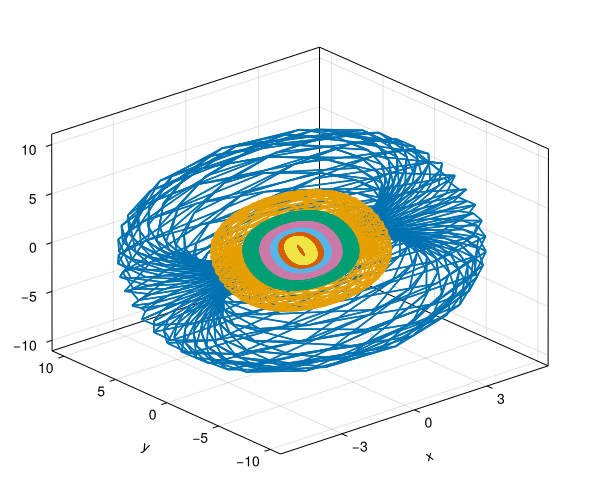 | <details><summary>✅ 11/11 checks</summary>wireframes: equal (7)<br>segment points per leaf: equal ([28320, 28320, 28320, 28320, 28320, 28320, 28320])<br>x1: count: equal (25620)<br>x1 (every 97th): max rel \|Δ\| = 0 over 265 values (tol 1.00e-9)<br>x1: sum over all: \|Δ\| / Σ\|·\| = 1.38e-16 (tol 1.00e-9)<br>x2: count: equal (25620)<br>x2 (every 97th): max rel \|Δ\| = 0 over 265 values (tol 1.00e-9)<br>x2: sum over all: \|Δ\| / Σ\|·\| = 3.81e-16 (tol 1.00e-9)<br>x3: count: equal (25620)<br>x3 (every 97th): max rel \|Δ\| = 0 over 265 values (tol 1.00e-9)<br>x3: sum over all: \|Δ\| / Σ\|·\| = 7.37e-17 (tol 1.00e-9)</details><br><sub>pixels: mean \|ΔRGB\| 1.2/255, 0.3% of pixels > 64/255</sub> |

## Cartan (plot.md)

| figure | Lean (LeanPlot) | Julia (CairoMakie) | data agreement |
|---|---|---|---|
| **cartan-plot-arrows2d** ([original](https://cartan.crucialflow.com/dev/plot))<br>arrows2d of a vector field on a black axis, coloured by strength<br><sub>`xy = TensorField(OpenParameter(xs,ys),Chain.(us,vs)); arrows2d!(xy, lengthscale = 0.2, color = strength)` (`plot.md:15-28`)</sub> | 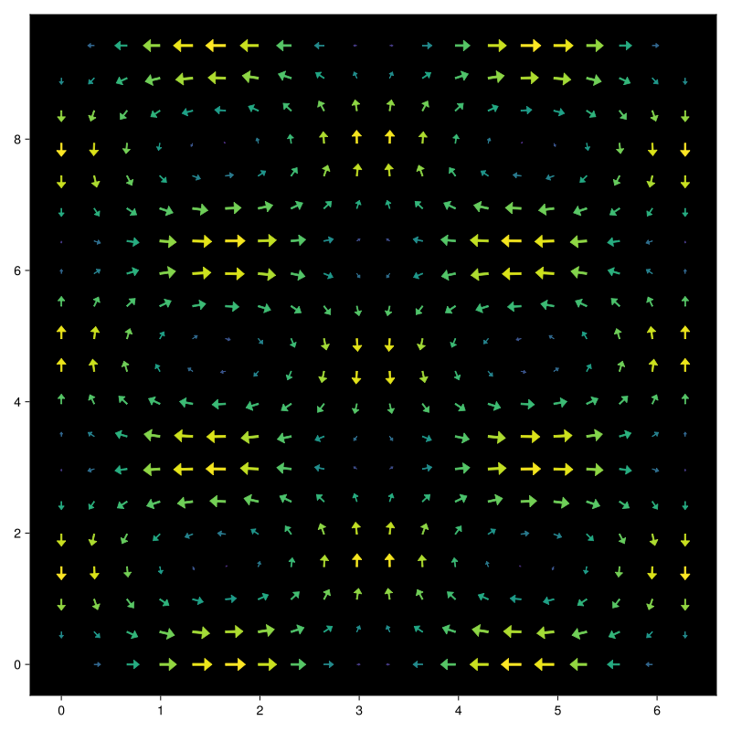 | 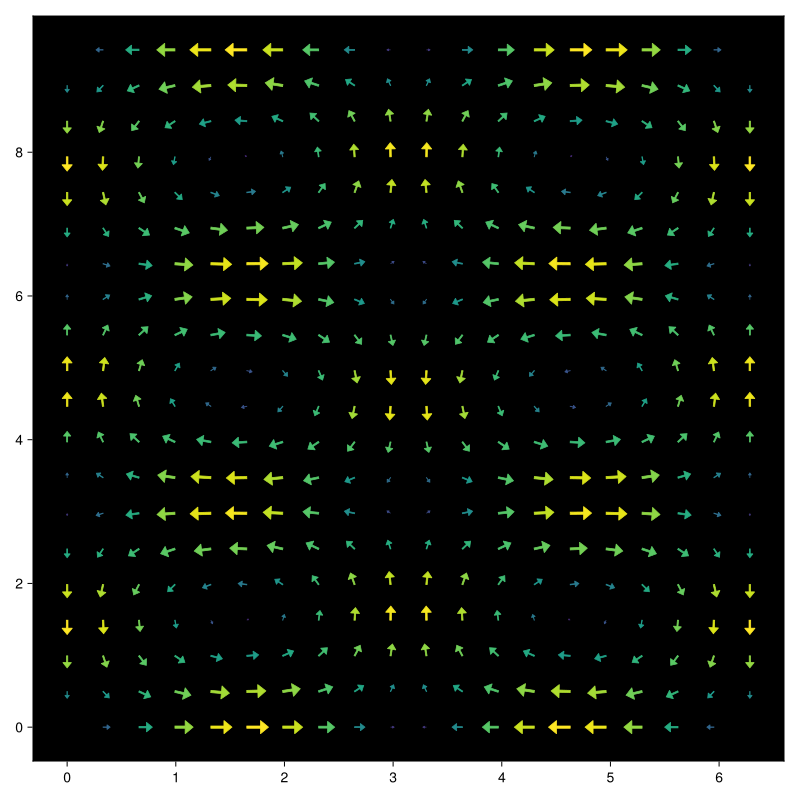 | <details><summary>✅ 18/18 checks</summary>origins: points: equal (400)<br>origins x1: count: equal (400)<br>origins x1 (every 1th): max rel \|Δ\| = 0 over 400 values (tol 1.00e-9)<br>origins x1: sum over all: \|Δ\| / Σ\|·\| = 0 (tol 1.00e-9)<br>origins x2: count: equal (400)<br>origins x2 (every 1th): max rel \|Δ\| = 0 over 400 values (tol 1.00e-9)<br>origins x2: sum over all: \|Δ\| / Σ\|·\| = 0 (tol 1.00e-9)<br>directions: points: equal (400)<br>directions x1: count: equal (400)<br>directions x1 (every 1th): max rel \|Δ\| = 0 over 400 values (tol 1.00e-9)<br>directions x1: sum over all: \|Δ\| / Σ\|·\| = 0 (tol 1.00e-9)<br>directions x2: count: equal (400)<br>directions x2 (every 1th): max rel \|Δ\| = 0 over 400 values (tol 1.00e-9)<br>directions x2: sum over all: \|Δ\| / Σ\|·\| = 0 (tol 1.00e-9)<br>colour values: count: equal (400)<br>colour values (every 1th): max rel \|Δ\| = 0 over 400 values (tol 1.00e-9)<br>colour values: sum over all: \|Δ\| / Σ\|·\| = 0 (tol 1.00e-9)<br>plot items: equal (true)</details><br><sub>pixels: mean \|ΔRGB\| 0.1/255, 0.0% of pixels > 64/255</sub> |
| **cartan-plot-arrows3d** ([original](https://cartan.crucialflow.com/dev/plot))<br>arrows3d with grey shafts and black tips<br><sub>`ps = OpenParameter(-5:2:5,-5:2:5,-5:2:5); ns = map(p -> 0.1 * Chain(p[2], p[3], p[1]), ps); arrows3d(TensorField(ps, ns), shaftcolor = :gray, tipcolor = :black, align = :center)` (`plot.md:31-38`)</sub> | 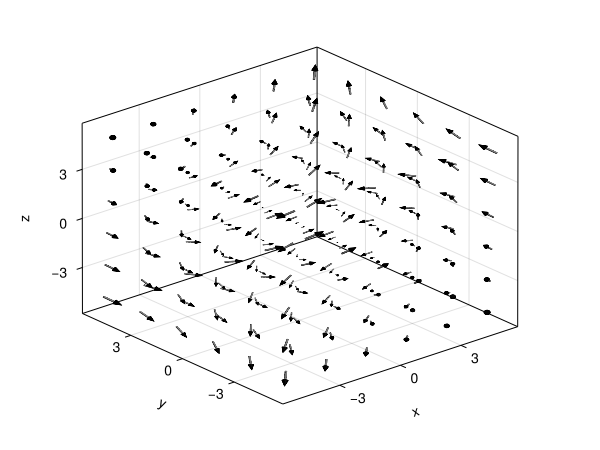 | 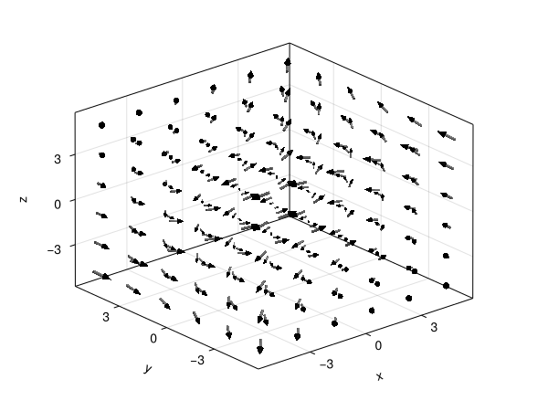 | <details><summary>✅ 21/21 checks</summary>origins: points: equal (216)<br>origins x1: count: equal (216)<br>origins x1 (every 1th): max rel \|Δ\| = 0 over 216 values (tol 1.00e-9)<br>origins x1: sum over all: \|Δ\| / Σ\|·\| = 0 (tol 1.00e-9)<br>origins x2: count: equal (216)<br>origins x2 (every 1th): max rel \|Δ\| = 0 over 216 values (tol 1.00e-9)<br>origins x2: sum over all: \|Δ\| / Σ\|·\| = 0 (tol 1.00e-9)<br>origins x3: count: equal (216)<br>origins x3 (every 1th): max rel \|Δ\| = 0 over 216 values (tol 1.00e-9)<br>origins x3: sum over all: \|Δ\| / Σ\|·\| = 0 (tol 1.00e-9)<br>directions: points: equal (216)<br>directions x1: count: equal (216)<br>directions x1 (every 1th): max rel \|Δ\| = 0 over 216 values (tol 1.00e-9)<br>directions x1: sum over all: \|Δ\| / Σ\|·\| = 0 (tol 1.00e-9)<br>directions x2: count: equal (216)<br>directions x2 (every 1th): max rel \|Δ\| = 0 over 216 values (tol 1.00e-9)<br>directions x2: sum over all: \|Δ\| / Σ\|·\| = 0 (tol 1.00e-9)<br>directions x3: count: equal (216)<br>directions x3 (every 1th): max rel \|Δ\| = 0 over 216 values (tol 1.00e-9)<br>directions x3: sum over all: \|Δ\| / Σ\|·\| = 0 (tol 1.00e-9)<br>plot items: equal (true)</details><br><sub>pixels: mean \|ΔRGB\| 3.2/255, 1.5% of pixels > 64/255</sub> |
| **cartan-plot-arrows3d-lengths** ([original](https://cartan.crucialflow.com/dev/plot))<br>arrows3d coloured by length<br><sub>`lengths = vec(norm.(ns)); arrows3d(TensorField(ps, ns), color = lengths, lengthscale = 1.5, align = :center)` (`plot.md:40-46`)</sub> | 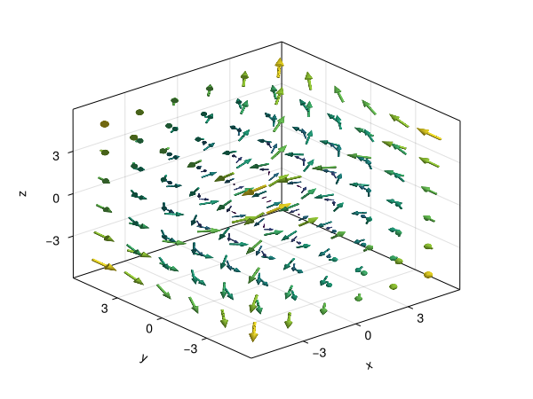 | 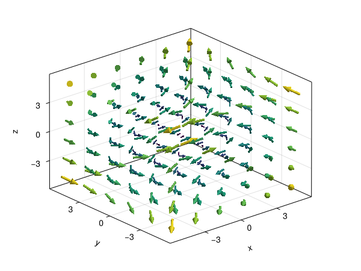 | <details><summary>✅ 24/24 checks</summary>origins: points: equal (216)<br>origins x1: count: equal (216)<br>origins x1 (every 1th): max rel \|Δ\| = 0 over 216 values (tol 1.00e-9)<br>origins x1: sum over all: \|Δ\| / Σ\|·\| = 0 (tol 1.00e-9)<br>origins x2: count: equal (216)<br>origins x2 (every 1th): max rel \|Δ\| = 0 over 216 values (tol 1.00e-9)<br>origins x2: sum over all: \|Δ\| / Σ\|·\| = 0 (tol 1.00e-9)<br>origins x3: count: equal (216)<br>origins x3 (every 1th): max rel \|Δ\| = 0 over 216 values (tol 1.00e-9)<br>origins x3: sum over all: \|Δ\| / Σ\|·\| = 0 (tol 1.00e-9)<br>directions: points: equal (216)<br>directions x1: count: equal (216)<br>directions x1 (every 1th): max rel \|Δ\| = 0 over 216 values (tol 1.00e-9)<br>directions x1: sum over all: \|Δ\| / Σ\|·\| = 0 (tol 1.00e-9)<br>directions x2: count: equal (216)<br>directions x2 (every 1th): max rel \|Δ\| = 0 over 216 values (tol 1.00e-9)<br>directions x2: sum over all: \|Δ\| / Σ\|·\| = 0 (tol 1.00e-9)<br>directions x3: count: equal (216)<br>directions x3 (every 1th): max rel \|Δ\| = 0 over 216 values (tol 1.00e-9)<br>directions x3: sum over all: \|Δ\| / Σ\|·\| = 0 (tol 1.00e-9)<br>colour values: count: equal (216)<br>colour values (every 1th): max rel \|Δ\| = 0 over 216 values (tol 1.00e-9)<br>colour values: sum over all: \|Δ\| / Σ\|·\| = 0 (tol 1.00e-9)<br>plot items: equal (true)</details><br><sub>pixels: mean \|ΔRGB\| 4.7/255, 2.9% of pixels > 64/255</sub> |
| **cartan-plot-contour** ([original](https://cartan.crucialflow.com/dev/plot))<br>contour of cos(x)·sin(y): 5 automatic levels, then levels -1:0.1:1<br><sub>`xyz = TensorField(OpenParameter(xs,ys),zs); contour!(xyz); contour!(xyz,levels=-1:0.1:1)` (`plot.md:52-65`)</sub> | 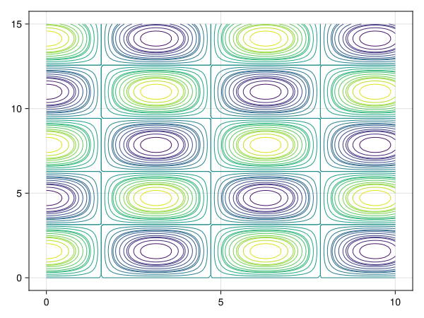 | 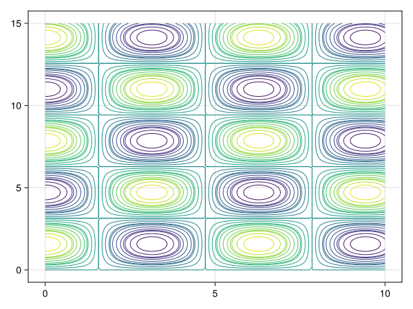 | <details><summary>✅ 7/7 checks</summary>contour plots: equal (2)<br>contour 1: points: equal (2944)<br>contour 1: line breaks: equal (46)<br>contour 1: moments Σx, Σxx: max rel \|Δ\| = 8.10e-16 over 5 values (tol 1.00e-6)<br>contour 2: points: equal (10313)<br>contour 2: line breaks: equal (187)<br>contour 2: moments Σx, Σxx: max rel \|Δ\| = 7.73e-16 over 5 values (tol 1.00e-6)</details><br><sub>pixels: mean \|ΔRGB\| 0.4/255, 0.0% of pixels > 64/255</sub> |
| **cartan-plot-contour3d** ([original](https://cartan.crucialflow.com/dev/plot))<br>contour3d of the cone ±√(x²+y²)<br><sub>`contour3d!(-xyz, linewidth=2, color=:blue2); contour3d!(+xyz, linewidth=2, color=:red2)` (`plot.md:104-118`)</sub> | 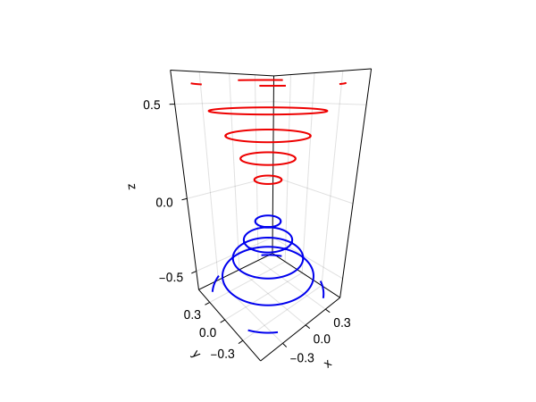 | 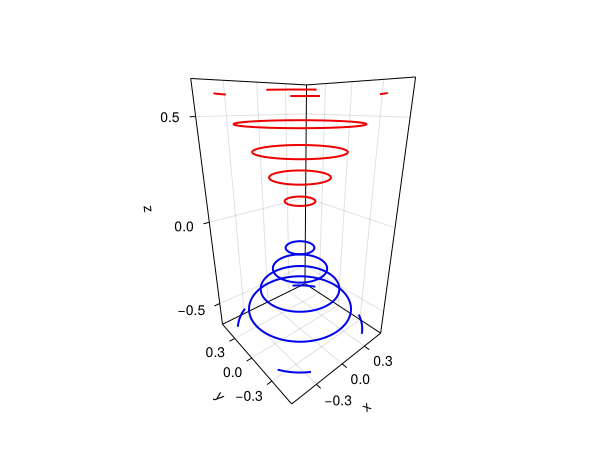 | <details><summary>✅ 7/7 checks</summary>contour plots: equal (2)<br>contour 1: points: equal (1108)<br>contour 1: line breaks: equal (8)<br>contour 1: moments Σx, Σxx: max rel \|Δ\| = 3.55e-15 over 9 values (tol 1.00e-6)<br>contour 2: points: equal (1108)<br>contour 2: line breaks: equal (8)<br>contour 2: moments Σx, Σxx: max rel \|Δ\| = 3.55e-15 over 9 values (tol 1.00e-6)</details><br><sub>pixels: mean \|ΔRGB\| 0.1/255, 0.0% of pixels > 64/255</sub> |
| **cartan-plot-contour3d-levels** ([original](https://cartan.crucialflow.com/dev/plot))<br>contour3d of the cone with explicit levels<br><sub>`contour3d!(-xyz, levels=-(.025:0.05:.475), …); contour3d!(+xyz, levels=.025:0.05:.475, …)` (`plot.md:119-125`)</sub> | 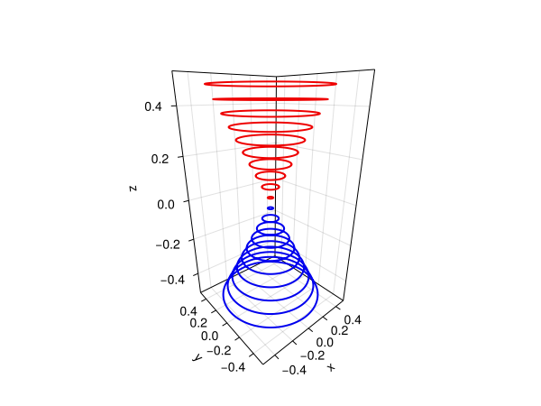 |  | <details><summary>✅ 7/7 checks</summary>contour plots: equal (2)<br>contour 1: points: equal (1980)<br>contour 1: line breaks: equal (10)<br>contour 1: moments Σx, Σxx: max rel \|Δ\| = 0 over 9 values (tol 1.00e-6)<br>contour 2: points: equal (1980)<br>contour 2: line breaks: equal (10)<br>contour 2: moments Σx, Σxx: max rel \|Δ\| = 0 over 9 values (tol 1.00e-6)</details><br><sub>pixels: mean \|ΔRGB\| 0.2/255, 0.0% of pixels > 64/255</sub> |
| **cartan-plot-heatmap-centers** ([original](https://cartan.crucialflow.com/dev/plot))<br>heatmap over irregular cell centres, centres marked<br><sub>`xy = ProductSpace([1,2,4,7,11],[6,7,9,12,16]); heatmap!(TensorField(xy,reshape(1:25, 5, 5))); scatter!(TensorField(xy,collect(xy)), color=:white, strokecolor=:black, strokewidth=1)` (`plot.md:176-188`)</sub> | 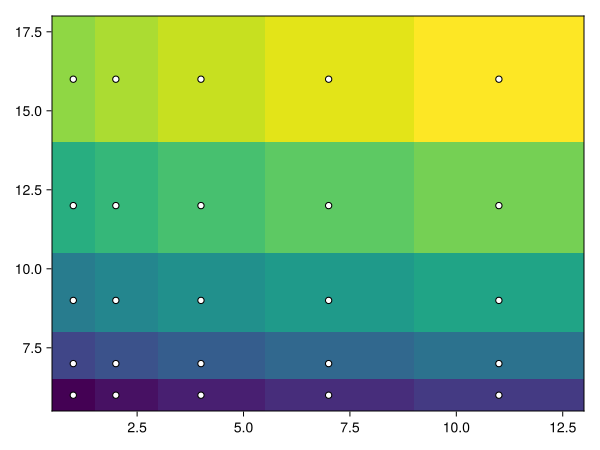 |  | <details><summary>✅ 12/12 checks</summary>x edges: max rel \|Δ\| = 0 over 6 values (tol 1.00e-12)<br>y edges: max rel \|Δ\| = 0 over 6 values (tol 1.00e-12)<br>values: count: equal (25)<br>values (every 1th): max rel \|Δ\| = 0 over 25 values (tol 1.00e-9)<br>values: sum over all: \|Δ\| / Σ\|·\| = 0 (tol 1.00e-9)<br>centres: points: equal (25)<br>centres x1: count: equal (25)<br>centres x1 (every 1th): max rel \|Δ\| = 0 over 25 values (tol 1.00e-9)<br>centres x1: sum over all: \|Δ\| / Σ\|·\| = 0 (tol 1.00e-9)<br>centres x2: count: equal (25)<br>centres x2 (every 1th): max rel \|Δ\| = 0 over 25 values (tol 1.00e-9)<br>centres x2: sum over all: \|Δ\| / Σ\|·\| = 0 (tol 1.00e-9)</details><br><sub>pixels: mean \|ΔRGB\| 0.4/255, 0.0% of pixels > 64/255</sub> |
| **cartan-plot-heatmap-colorbar** ([original](https://cartan.crucialflow.com/dev/plot))<br>heatmap of sin(x·y) with a colorbar<br><sub>`xyz = TensorField(OpenParameter(xs,ys),zs); fig, ax, hm = heatmap(xyz); Colorbar(fig[:, end+1], hm)` (`plot.md:190-201`)</sub> | 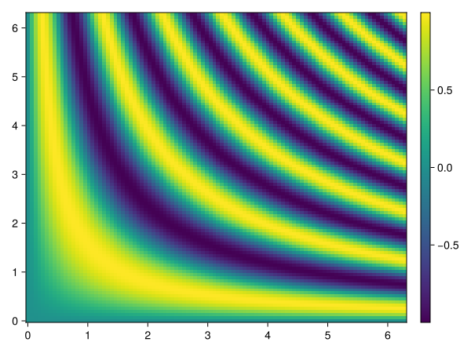 |  | <details><summary>✅ 9/9 checks</summary>x edges: count: equal (101)<br>x edges (every 1th): max rel \|Δ\| = 0 over 101 values (tol 1.00e-12)<br>x edges: sum over all: \|Δ\| / Σ\|·\| = 0 (tol 1.00e-12)<br>y edges: count: equal (101)<br>y edges (every 1th): max rel \|Δ\| = 0 over 101 values (tol 1.00e-12)<br>y edges: sum over all: \|Δ\| / Σ\|·\| = 0 (tol 1.00e-12)<br>values (binary32): count: equal (10000)<br>values (binary32) (every 7th): max rel \|Δ\| = 2.98e-8 over 1429 values (tol 1.00e-7)<br>values (binary32): sum over all: \|Δ\| / Σ\|·\| = 3.47e-10 (tol 1.00e-7)</details><br><sub>pixels: mean \|ΔRGB\| 0.3/255, 0.0% of pixels > 64/255</sub> |
| **cartan-plot-linesegments** ([original](https://cartan.crucialflow.com/dev/plot))<br>linesegments of sin, shifted: speed colours, then an explicit colour range<br><sub>`ys = sin(TensorField(1:0.2:10)); linesegments!(ys); linesegments!(ys - 1, linewidth = 5); linesegments!(ys - 2, linewidth = 5, color = LinRange(1, 5, length(xs)))` (`plot.md:224-236`)</sub> | 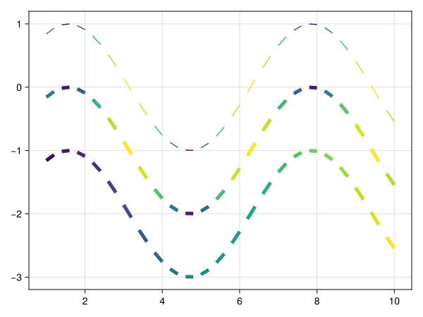 | 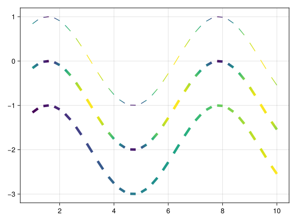 | <details><summary>✅ 30/30 checks</summary>plot 1: points: equal (46)<br>plot 1 x1: count: equal (46)<br>plot 1 x1 (every 1th): max rel \|Δ\| = 0 over 46 values (tol 1.00e-9)<br>plot 1 x1: sum over all: \|Δ\| / Σ\|·\| = 0 (tol 1.00e-9)<br>plot 1 x2: count: equal (46)<br>plot 1 x2 (every 1th): max rel \|Δ\| = 0 over 46 values (tol 1.00e-9)<br>plot 1 x2: sum over all: \|Δ\| / Σ\|·\| = 0 (tol 1.00e-9)<br>plot 1 colours (binary32): count: equal (46)<br>plot 1 colours (binary32) (every 1th): max rel \|Δ\| = 2.82e-8 over 46 values (tol 1.00e-7)<br>plot 1 colours (binary32): sum over all: \|Δ\| / Σ\|·\| = 6.36e-10 (tol 1.00e-7)<br>plot 2: points: equal (46)<br>plot 2 x1: count: equal (46)<br>plot 2 x1 (every 1th): max rel \|Δ\| = 0 over 46 values (tol 1.00e-9)<br>plot 2 x1: sum over all: \|Δ\| / Σ\|·\| = 0 (tol 1.00e-9)<br>plot 2 x2: count: equal (46)<br>plot 2 x2 (every 1th): max rel \|Δ\| = 0 over 46 values (tol 1.00e-9)<br>plot 2 x2: sum over all: \|Δ\| / Σ\|·\| = 0 (tol 1.00e-9)<br>plot 2 colours (binary32): count: equal (46)<br>plot 2 colours (binary32) (every 1th): max rel \|Δ\| = 2.82e-8 over 46 values (tol 1.00e-7)<br>plot 2 colours (binary32): sum over all: \|Δ\| / Σ\|·\| = 6.36e-10 (tol 1.00e-7)<br>plot 3: points: equal (46)<br>plot 3 x1: count: equal (46)<br>plot 3 x1 (every 1th): max rel \|Δ\| = 0 over 46 values (tol 1.00e-9)<br>plot 3 x1: sum over all: \|Δ\| / Σ\|·\| = 0 (tol 1.00e-9)<br>plot 3 x2: count: equal (46)<br>plot 3 x2 (every 1th): max rel \|Δ\| = 0 over 46 values (tol 1.00e-9)<br>plot 3 x2: sum over all: \|Δ\| / Σ\|·\| = 0 (tol 1.00e-9)<br>plot 3 colours (binary32): count: equal (46)<br>plot 3 colours (binary32) (every 1th): max rel \|Δ\| = 4.75e-8 over 46 values (tol 1.00e-7)<br>plot 3 colours (binary32): sum over all: \|Δ\| / Σ\|·\| = 1.04e-8 (tol 1.00e-7)</details><br><sub>pixels: mean \|ΔRGB\| 0.2/255, 0.0% of pixels > 64/255</sub> |
| **cartan-plot-mesh-polar3d** ([original](https://cartan.crucialflow.com/dev/plot))<br>mesh of a polar surface coloured by its height<br><sub>`xyz = TensorField(ProductSpace(rs,thetas),Chain.(xs,ys,zs)); mesh(xyz,TensorField(xyz,zs))` (`plot.md:242-252`)</sub> | 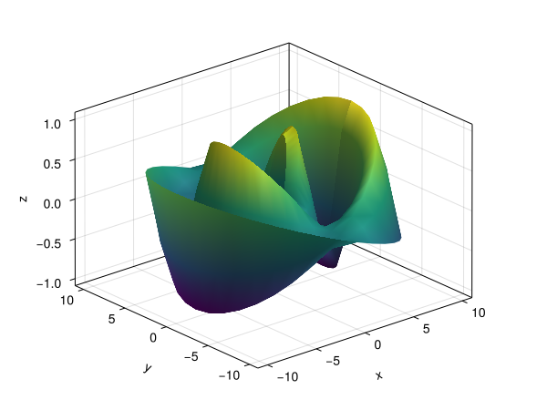 | 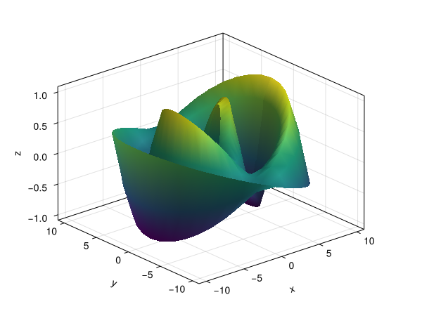 | <details><summary>✅ 14/14 checks</summary>vertices: points: equal (370)<br>vertices x1: count: equal (370)<br>vertices x1 (every 1th): max rel \|Δ\| = 0 over 370 values (tol 1.00e-9)<br>vertices x1: sum over all: \|Δ\| / Σ\|·\| = 0 (tol 1.00e-9)<br>vertices x2: count: equal (370)<br>vertices x2 (every 1th): max rel \|Δ\| = 0 over 370 values (tol 1.00e-9)<br>vertices x2: sum over all: \|Δ\| / Σ\|·\| = 0 (tol 1.00e-9)<br>vertices x3: count: equal (370)<br>vertices x3 (every 1th): max rel \|Δ\| = 0 over 370 values (tol 1.00e-9)<br>vertices x3: sum over all: \|Δ\| / Σ\|·\| = 0 (tol 1.00e-9)<br>colour values (binary32): count: equal (370)<br>colour values (binary32) (every 1th): max rel \|Δ\| = 2.80e-8 over 370 values (tol 1.00e-7)<br>colour values (binary32): sum over all: \|Δ\| / Σ\|·\| = 5.28e-10 (tol 1.00e-7)<br>triangles: equal (648)</details><br><sub>pixels: mean \|ΔRGB\| 0.6/255, 0.2% of pixels > 64/255</sub> |
| **cartan-plot-mesh-polar2d** ([original](https://cartan.crucialflow.com/dev/plot))<br>the same mesh with 2-D positions<br><sub>`xy = TensorField(ProductSpace(rs,thetas),Chain.(xs,ys)); mesh(xy,TensorField(xy,zs))` (`plot.md:253-256`)</sub> | 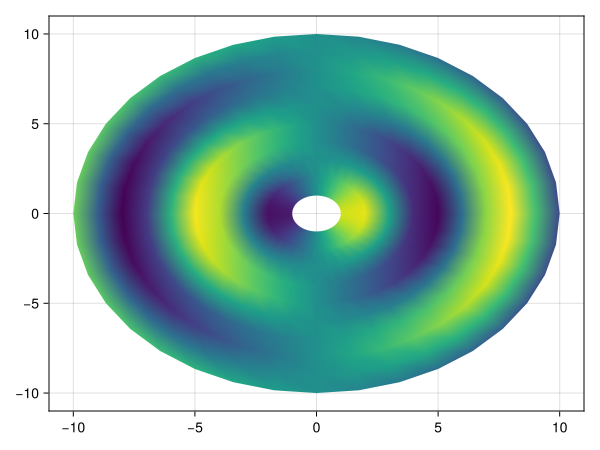 | 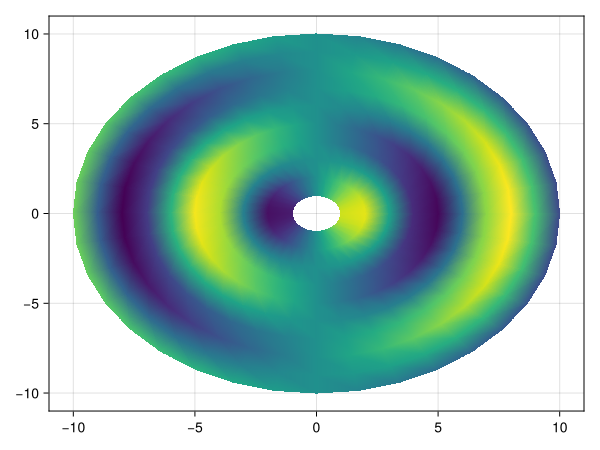 | <details><summary>✅ 11/11 checks</summary>vertices: points: equal (370)<br>vertices x1: count: equal (370)<br>vertices x1 (every 1th): max rel \|Δ\| = 0 over 370 values (tol 1.00e-9)<br>vertices x1: sum over all: \|Δ\| / Σ\|·\| = 0 (tol 1.00e-9)<br>vertices x2: count: equal (370)<br>vertices x2 (every 1th): max rel \|Δ\| = 0 over 370 values (tol 1.00e-9)<br>vertices x2: sum over all: \|Δ\| / Σ\|·\| = 0 (tol 1.00e-9)<br>colour values (binary32): count: equal (370)<br>colour values (binary32) (every 1th): max rel \|Δ\| = 2.80e-8 over 370 values (tol 1.00e-7)<br>colour values (binary32): sum over all: \|Δ\| / Σ\|·\| = 5.28e-10 (tol 1.00e-7)<br>triangles: equal (648)</details><br><sub>pixels: mean \|ΔRGB\| 0.9/255, 0.4% of pixels > 64/255</sub> |
| **cartan-plot-scatter** ([original](https://cartan.crucialflow.com/dev/plot))<br>scatter of a real function<br><sub>`xs = range(0, 10, length = 30); xy = TensorField(xs, 0.5 .* sin.(xs)); scatter(xy)` (`plot.md:266-272`)</sub> | 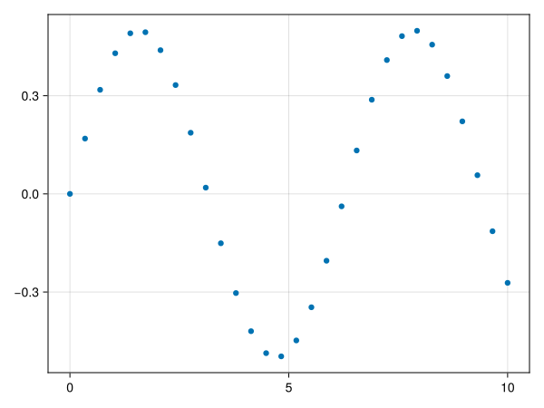 | 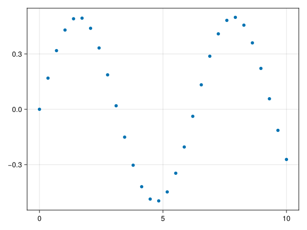 | <details><summary>✅ 7/7 checks</summary>points: points: equal (30)<br>points x1: count: equal (30)<br>points x1 (every 1th): max rel \|Δ\| = 0 over 30 values (tol 1.00e-9)<br>points x1: sum over all: \|Δ\| / Σ\|·\| = 0 (tol 1.00e-9)<br>points x2: count: equal (30)<br>points x2 (every 1th): max rel \|Δ\| = 0 over 30 values (tol 1.00e-9)<br>points x2: sum over all: \|Δ\| / Σ\|·\| = 0 (tol 1.00e-9)</details><br><sub>pixels: mean \|ΔRGB\| 0.1/255, 0.0% of pixels > 64/255</sub> |
| **cartan-plot-scatter-colored** ([original](https://cartan.crucialflow.com/dev/plot))<br>scatter of a plane curve with colours and marker sizes<br><sub>`pts = TensorField(xs,Chain.(xs, ys)); scatter(pts, color = 1:30, markersize = range(5, 30, length = 30), colormap = :thermal)` (`plot.md:273-280`)</sub> | 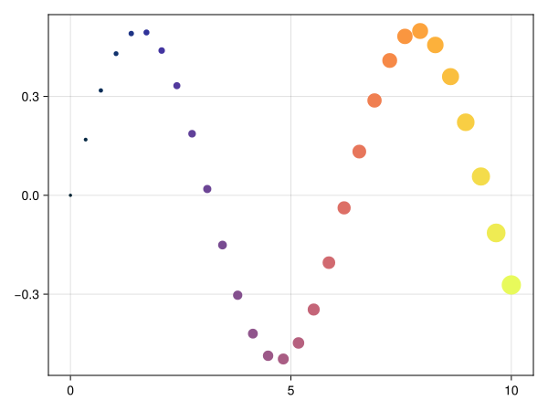 |  | <details><summary>✅ 13/13 checks</summary>points: points: equal (30)<br>points x1: count: equal (30)<br>points x1 (every 1th): max rel \|Δ\| = 0 over 30 values (tol 1.00e-9)<br>points x1: sum over all: \|Δ\| / Σ\|·\| = 0 (tol 1.00e-9)<br>points x2: count: equal (30)<br>points x2 (every 1th): max rel \|Δ\| = 0 over 30 values (tol 1.00e-9)<br>points x2: sum over all: \|Δ\| / Σ\|·\| = 0 (tol 1.00e-9)<br>colour values: count: equal (30)<br>colour values (every 1th): max rel \|Δ\| = 0 over 30 values (tol 1.00e-9)<br>colour values: sum over all: \|Δ\| / Σ\|·\| = 0 (tol 1.00e-9)<br>marker sizes (binary32): count: equal (30)<br>marker sizes (binary32) (every 1th): max rel \|Δ\| = 4.46e-8 over 30 values (tol 1.00e-7)<br>marker sizes (binary32): sum over all: \|Δ\| / Σ\|·\| = 0 (tol 1.00e-7)</details><br><sub>pixels: mean \|ΔRGB\| 0.1/255, 0.0% of pixels > 64/255</sub> |
| **cartan-plot-streamplot-point2** ([original](https://cartan.crucialflow.com/dev/plot))<br>streamplot of the plain function (y, 4x)<br><sub>`v(x::Point2{T}) where T = Point2f(x[2], 4*x[1]); streamplot(v, -2..2, -2..2)` (`plot.md:290-293`)</sub> | 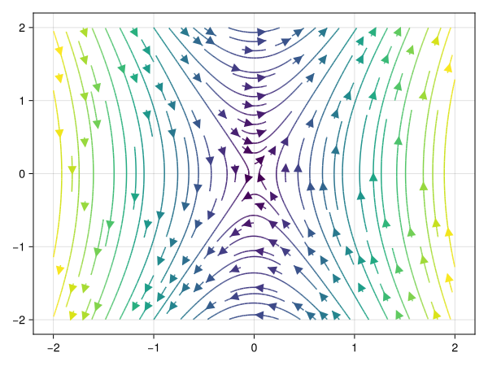 | 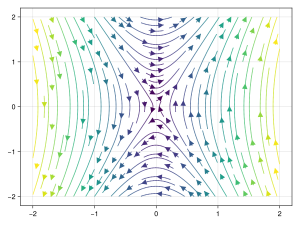 | <details><summary>✅ 6/6 checks</summary>arrows: equal (152)<br>line points: equal (11983)<br>NaN separators: equal (304)<br>all line points (Float32 hash): bit-identical (0xf36f23a436cabe16)<br>arrow positions: max \|Δ\| = 0<br>arrow directions: max \|Δ\| = 0</details><br><sub>pixels: mean \|ΔRGB\| 0.6/255, 0.0% of pixels > 64/255</sub> |
| **cartan-plot-streamplot-fhn** ([original](https://cartan.crucialflow.com/dev/plot))<br>FitzHugh-Nagumo vector field, magma colours<br><sub>`xy = OpenParameter(-1.5:0.1:1.5,-1.5:0.1:1.5); streamplot(fun.(xy), colormap = :magma)` (`plot.md:294-310`)</sub> |  | 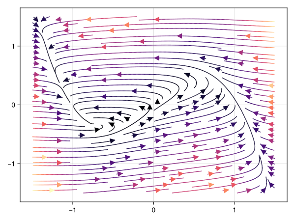 | <details><summary>✅ 6/6 checks</summary>arrows: equal (149)<br>line points: equal (9282)<br>NaN separators: equal (298)<br>all line points (Float32 hash): bit-identical (0xa9cdab001777cd96)<br>arrow positions: max \|Δ\| = 0<br>arrow directions: max \|Δ\| = 0</details><br><sub>pixels: mean \|ΔRGB\| 0.4/255, 0.0% of pixels > 64/255</sub> |
| **cartan-plot-streamplot-colorfunction** ([original](https://cartan.crucialflow.com/dev/plot))<br>FitzHugh-Nagumo streamlines coloured by RGBAf(u, v, 0, 1)<br><sub>`streamplot(fun.(xy), color=(p)-> RGBAf(p..., 0.0, 1))` (`plot.md:311-313`)</sub> | 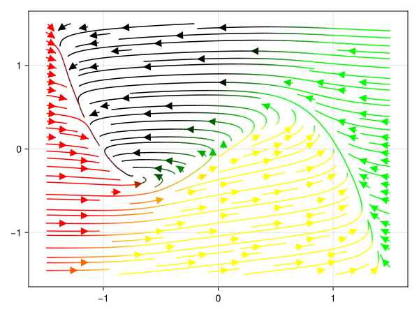 | 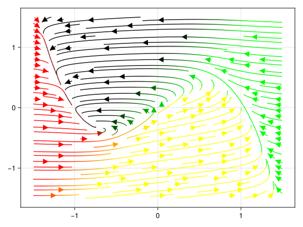 | <details><summary>✅ 12/12 checks</summary>arrows: equal (149)<br>line points: equal (9282)<br>NaN separators: equal (298)<br>all line points (Float32 hash): bit-identical (0xa9cdab001777cd96)<br>arrow positions: max \|Δ\| = 0<br>arrow directions: max \|Δ\| = 0<br>red channel (u): count: equal (9282)<br>red channel (u) (every 4th): max rel \|Δ\| = 0 over 2321 values (tol 1.00e-6)<br>red channel (u): sum over all: \|Δ\| / Σ\|·\| = 0 (tol 1.00e-6)<br>green channel (v): count: equal (9282)<br>green channel (v) (every 4th): max rel \|Δ\| = 0 over 2321 values (tol 1.00e-6)<br>green channel (v): sum over all: \|Δ\| / Σ\|·\| = 0 (tol 1.00e-6)</details><br><sub>pixels: mean \|ΔRGB\| 0.8/255, 0.0% of pixels > 64/255</sub> |
| **cartan-plot-surface** ([original](https://cartan.crucialflow.com/dev/plot))<br>surface of cos(x)·sin(y)<br><sub>`xyz = TensorField(OpenParameter(xs,ys),zs); surface(xyz, axis=(type=Axis3,))` (`plot.md:319-327`)</sub> | 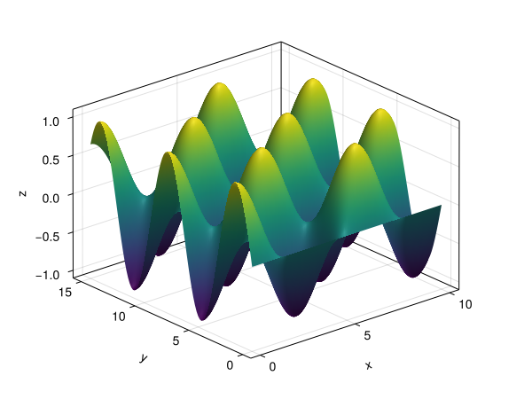 |  | <details><summary>✅ 12/12 checks</summary>x: count: equal (100)<br>x (every 1th): max rel \|Δ\| = 0 over 100 values (tol 1.00e-9)<br>x: sum over all: \|Δ\| / Σ\|·\| = 0 (tol 1.00e-9)<br>y: count: equal (100)<br>y (every 1th): max rel \|Δ\| = 0 over 100 values (tol 1.00e-9)<br>y: sum over all: \|Δ\| / Σ\|·\| = 0 (tol 1.00e-9)<br>z (binary32): count: equal (10000)<br>z (binary32) (every 7th): max rel \|Δ\| = 2.98e-8 over 1429 values (tol 1.00e-7)<br>z (binary32): sum over all: \|Δ\| / Σ\|·\| = 3.39e-10 (tol 1.00e-7)<br>colour values: count: equal (10000)<br>colour values (every 7th): max rel \|Δ\| = 0 over 1429 values (tol 1.00e-6)<br>colour values: sum over all: \|Δ\| / Σ\|·\| = 0 (tol 1.00e-6)</details><br><sub>pixels: mean \|ΔRGB\| 0.9/255, 0.5% of pixels > 64/255</sub> |
| **cartan-plot-wireframe-sinc** ([original](https://cartan.crucialflow.com/dev/plot))<br>wireframe of the graph of sinc(r/π)<br><sub>`xyz = TensorField(ProductSpace(x,y),z); wireframe(graph(xyz), axis=(type=Axis3,), color=:black)` (`plot.md:409-415`)</sub> | 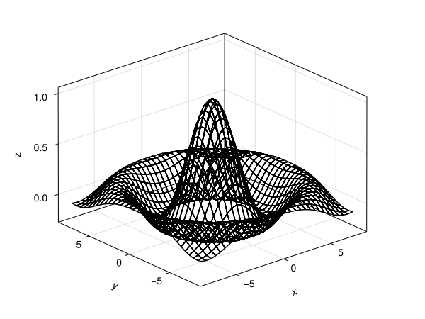 | 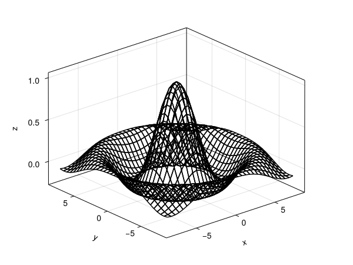 | <details><summary>✅ 10/10 checks</summary>segment points: equal (8192)<br>x1: count: equal (8192)<br>x1 (every 16th): max rel \|Δ\| = 0 over 512 values (tol 1.00e-9)<br>x1: sum over all: \|Δ\| / Σ\|·\| = 0 (tol 1.00e-9)<br>x2: count: equal (8192)<br>x2 (every 16th): max rel \|Δ\| = 0 over 512 values (tol 1.00e-9)<br>x2: sum over all: \|Δ\| / Σ\|·\| = 0 (tol 1.00e-9)<br>x3: count: equal (8192)<br>x3 (every 16th): max rel \|Δ\| = 0 over 512 values (tol 1.00e-9)<br>x3: sum over all: \|Δ\| / Σ\|·\| = 0 (tol 1.00e-9)</details><br><sub>pixels: mean \|ΔRGB\| 1.3/255, 0.1% of pixels > 64/255</sub> |
| **cartan-plot-voxels-chunk3** ([original](https://cartan.crucialflow.com/dev/plot))<br>voxels of a 3×3×3 chunk with gaps<br><sub>`chunk = TensorField(OpenParameter(3,3,3),reshape(collect(1:27), 3, 3, 3)); voxels(chunk, gap = 0.33)` (`plot.md:389-393`)</sub> | 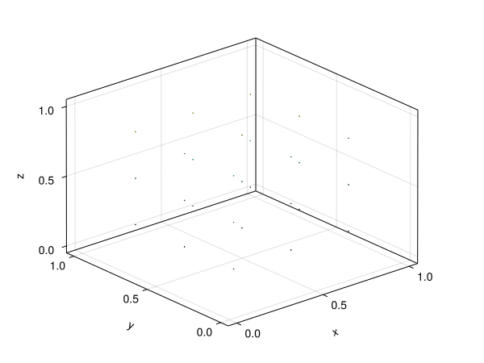 | 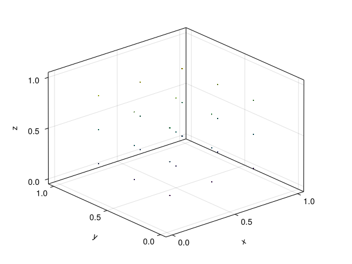 | <details><summary>✅ 3/3 checks</summary>values: count: equal (27)<br>values (every 1th): max rel \|Δ\| = 0 over 27 values (tol 1.00e-9)<br>values: sum over all: \|Δ\| / Σ\|·\| = 0 (tol 1.00e-9)</details><br><sub>pixels: mean \|ΔRGB\| 0.2/255, 0.0% of pixels > 64/255</sub> |
| **cartan-plot-voxels-chunk8** ([original](https://cartan.crucialflow.com/dev/plot))<br>voxels of an 8³ chunk: log colour scale, clip colours<br><sub>`voxels(chunk, colorrange = (65, 448), colorscale = log10, lowclip = :red, highclip = :orange, colormap = [:blue, :green])` (`plot.md:394-403`)</sub> | 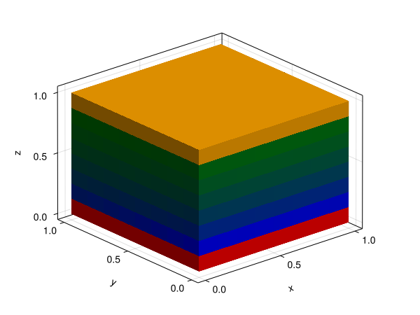 |  | <details><summary>✅ 3/3 checks</summary>values: count: equal (512)<br>values (every 1th): max rel \|Δ\| = 0 over 512 values (tol 1.00e-9)<br>values: sum over all: \|Δ\| / Σ\|·\| = 0 (tol 1.00e-9)</details><br><sub>pixels: mean \|ΔRGB\| 0.7/255, 0.5% of pixels > 64/255</sub> |
| **cartan-scaledarrows-grid** ([original](https://cartan.crucialflow.com/dev/plot))<br>scaledarrows of a vector field resampled to 10×10<br><sub>`xy = TensorField(OpenParameter(xs,ys),Chain.(us,vs)); scaledarrows(xy, gridsize = (10,10))` (`MakieExt.jl:371-379`, the field of `plot.md:15-28`)</sub> | 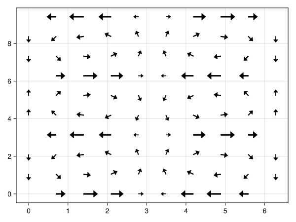 | 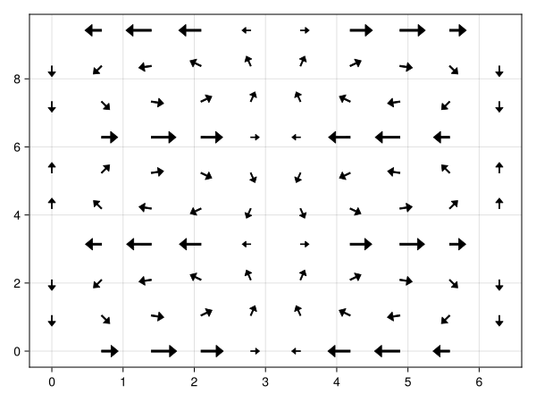 | <details><summary>✅ 15/15 checks</summary>lengthscale: Lean 0.365411, Julia 0.365411 (rel \|Δ\| = 0)<br>origins: points: equal (100)<br>origins x1: count: equal (100)<br>origins x1 (every 1th): max rel \|Δ\| = 0 over 100 values (tol 1.00e-9)<br>origins x1: sum over all: \|Δ\| / Σ\|·\| = 0 (tol 1.00e-9)<br>origins x2: count: equal (100)<br>origins x2 (every 1th): max rel \|Δ\| = 0 over 100 values (tol 1.00e-9)<br>origins x2: sum over all: \|Δ\| / Σ\|·\| = 0 (tol 1.00e-9)<br>directions: points: equal (100)<br>directions x1: count: equal (100)<br>directions x1 (every 1th): max rel \|Δ\| = 0 over 100 values (tol 1.00e-9)<br>directions x1: sum over all: \|Δ\| / Σ\|·\| = 0 (tol 1.00e-9)<br>directions x2: count: equal (100)<br>directions x2 (every 1th): max rel \|Δ\| = 0 over 100 values (tol 1.00e-9)<br>directions x2: sum over all: \|Δ\| / Σ\|·\| = 0 (tol 1.00e-9)</details><br><sub>pixels: mean \|ΔRGB\| 0.2/255, 0.0% of pixels > 64/255</sub> |
| **cartan-scaledarrows-helix** ([original](https://cartan.crucialflow.com/dev/plot))<br>a helix coloured by speed with its unit tangents, scaled by the sample spacing<br><sub>`t = TensorField(0:0.1:4pi); M = Chain.(cos(t), sin(t), t/4); lines(M); scaledarrows!(M, T)` (`MakieExt.jl:371-379`)</sub><br><sub>The arrows are 3-D meshes a few pixels long; CairoMakie strokes the edges of every mesh triangle, so tiny arrows look bolder in the Julia render. Geometry and length scale agree exactly.</sub> | 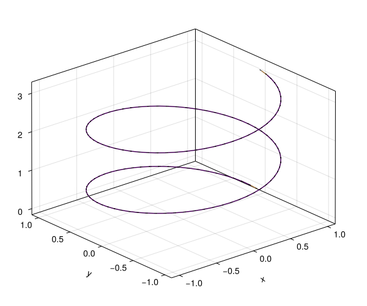 | 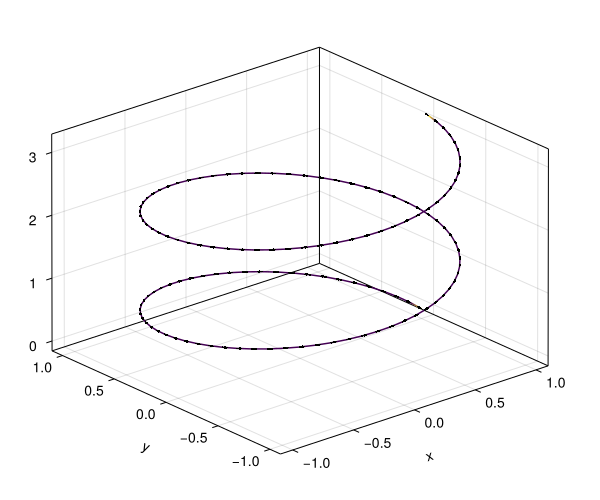 | <details><summary>✅ 22/22 checks</summary>lengthscale: Lean 0.034346, Julia 0.034346 (rel \|Δ\| = 0)<br>lengthscale: Lean 0.103037, Julia 0.103037 (rel \|Δ\| = 0)<br>origins: points: equal (126)<br>origins x1: count: equal (126)<br>origins x1 (every 1th): max rel \|Δ\| = 0 over 126 values (tol 1.00e-9)<br>origins x1: sum over all: \|Δ\| / Σ\|·\| = 0 (tol 1.00e-9)<br>origins x2: count: equal (126)<br>origins x2 (every 1th): max rel \|Δ\| = 0 over 126 values (tol 1.00e-9)<br>origins x2: sum over all: \|Δ\| / Σ\|·\| = 0 (tol 1.00e-9)<br>origins x3: count: equal (126)<br>origins x3 (every 1th): max rel \|Δ\| = 0 over 126 values (tol 1.00e-9)<br>origins x3: sum over all: \|Δ\| / Σ\|·\| = 0 (tol 1.00e-9)<br>directions: points: equal (126)<br>directions x1: count: equal (126)<br>directions x1 (every 1th): max rel \|Δ\| = 0 over 126 values (tol 1.00e-9)<br>directions x1: sum over all: \|Δ\| / Σ\|·\| = 0 (tol 1.00e-9)<br>directions x2: count: equal (126)<br>directions x2 (every 1th): max rel \|Δ\| = 0 over 126 values (tol 1.00e-9)<br>directions x2: sum over all: \|Δ\| / Σ\|·\| = 0 (tol 1.00e-9)<br>directions x3: count: equal (126)<br>directions x3 (every 1th): max rel \|Δ\| = 0 over 126 values (tol 1.00e-9)<br>directions x3: sum over all: \|Δ\| / Σ\|·\| = 0 (tol 1.00e-9)</details><br><sub>pixels: mean \|ΔRGB\| 1.5/255, 0.8% of pixels > 64/255</sub> |
| **cartan-arrowsbundle-helix** ([original](https://cartan.crucialflow.com/dev/plot))<br>arrowsbundle: the helix points with the arrows of ±T<br><sub>`t = TensorField(0:0.2:4pi); M = Chain.(cos(t), sin(t), t/4); arrowsbundle!(M, T)` (`MakieExt.jl:290-299`)</sub><br><sub>As in `cartan-scaledarrows-helix`, CairoMakie's stroked triangle edges make the tiny 3-D arrows look bolder than LeanPlot's, so they hide the points in the Julia render.</sub> | 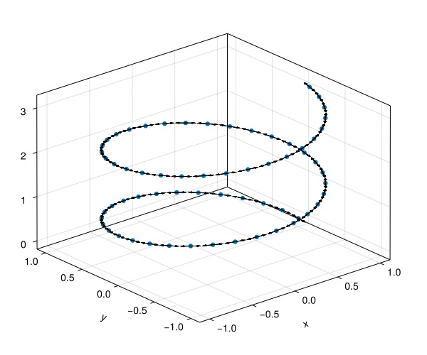 | 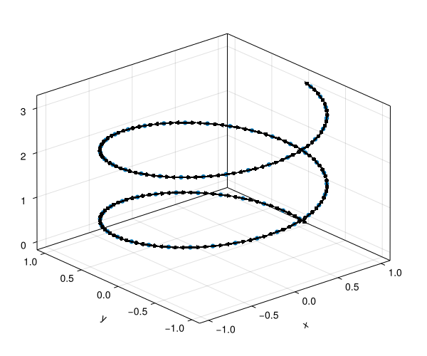 | <details><summary>✅ 33/33 checks</summary>arrow plots: equal (2)<br>lengthscale: Lean 0.102916, Julia 0.102916 (rel \|Δ\| = 0)<br>lengthscale: Lean 0.102916, Julia 0.102916 (rel \|Δ\| = 0)<br>points: points: equal (63)<br>points x1: count: equal (63)<br>points x1 (every 1th): max rel \|Δ\| = 0 over 63 values (tol 1.00e-9)<br>points x1: sum over all: \|Δ\| / Σ\|·\| = 0 (tol 1.00e-9)<br>points x2: count: equal (63)<br>points x2 (every 1th): max rel \|Δ\| = 0 over 63 values (tol 1.00e-9)<br>points x2: sum over all: \|Δ\| / Σ\|·\| = 0 (tol 1.00e-9)<br>points x3: count: equal (63)<br>points x3 (every 1th): max rel \|Δ\| = 0 over 63 values (tol 1.00e-9)<br>points x3: sum over all: \|Δ\| / Σ\|·\| = 0 (tol 1.00e-9)<br>directions of +T: points: equal (63)<br>directions of +T x1: count: equal (63)<br>directions of +T x1 (every 1th): max rel \|Δ\| = 0 over 63 values (tol 1.00e-9)<br>directions of +T x1: sum over all: \|Δ\| / Σ\|·\| = 0 (tol 1.00e-9)<br>directions of +T x2: count: equal (63)<br>directions of +T x2 (every 1th): max rel \|Δ\| = 0 over 63 values (tol 1.00e-9)<br>directions of +T x2: sum over all: \|Δ\| / Σ\|·\| = 0 (tol 1.00e-9)<br>directions of +T x3: count: equal (63)<br>directions of +T x3 (every 1th): max rel \|Δ\| = 0 over 63 values (tol 1.00e-9)<br>directions of +T x3: sum over all: \|Δ\| / Σ\|·\| = 0 (tol 1.00e-9)<br>directions of -T: points: equal (63)<br>directions of -T x1: count: equal (63)<br>directions of -T x1 (every 1th): max rel \|Δ\| = 0 over 63 values (tol 1.00e-9)<br>directions of -T x1: sum over all: \|Δ\| / Σ\|·\| = 0 (tol 1.00e-9)<br>directions of -T x2: count: equal (63)<br>directions of -T x2 (every 1th): max rel \|Δ\| = 0 over 63 values (tol 1.00e-9)<br>directions of -T x2: sum over all: \|Δ\| / Σ\|·\| = 0 (tol 1.00e-9)<br>directions of -T x3: count: equal (63)<br>directions of -T x3 (every 1th): max rel \|Δ\| = 0 over 63 values (tol 1.00e-9)<br>directions of -T x3: sum over all: \|Δ\| / Σ\|·\| = 0 (tol 1.00e-9)</details><br><sub>pixels: mean \|ΔRGB\| 3.9/255, 1.8% of pixels > 64/255</sub> |
| **cartan-scaledarrows-frame** ([original](https://cartan.crucialflow.com/dev/plot))<br>scaledarrows of a two-column tangent frame on z = xy/4<br><sub>`S = (x -> Chain(x[1], x[2], x[1]*x[2]/4)).(p); F = TensorField(base(p), TensorOperator.(Chain.(c1, c2))); scaledarrows!(S, F)` (`MakieExt.jl:380-384`)</sub> | 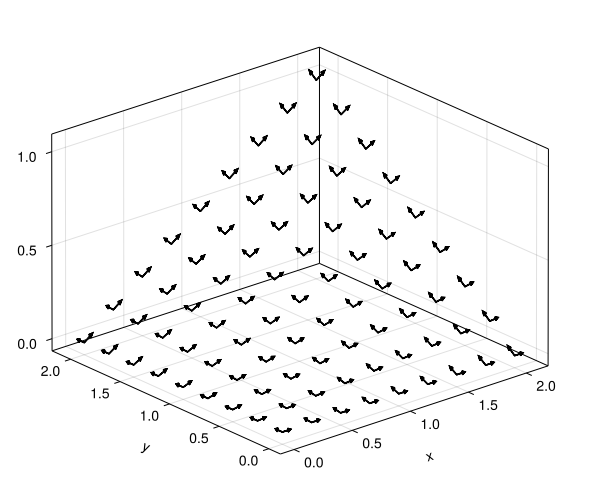 | 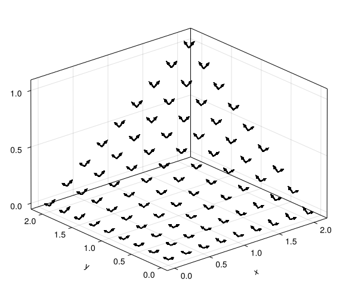 | <details><summary>✅ 33/33 checks</summary>arrow plots: equal (2)<br>lengthscale: Lean 0.083333, Julia 0.083333 (rel \|Δ\| = 0)<br>lengthscale: Lean 0.083333, Julia 0.083333 (rel \|Δ\| = 0)<br>origins: points: equal (81)<br>origins x1: count: equal (81)<br>origins x1 (every 1th): max rel \|Δ\| = 0 over 81 values (tol 1.00e-9)<br>origins x1: sum over all: \|Δ\| / Σ\|·\| = 0 (tol 1.00e-9)<br>origins x2: count: equal (81)<br>origins x2 (every 1th): max rel \|Δ\| = 0 over 81 values (tol 1.00e-9)<br>origins x2: sum over all: \|Δ\| / Σ\|·\| = 0 (tol 1.00e-9)<br>origins x3: count: equal (81)<br>origins x3 (every 1th): max rel \|Δ\| = 0 over 81 values (tol 1.00e-9)<br>origins x3: sum over all: \|Δ\| / Σ\|·\| = 0 (tol 1.00e-9)<br>column 1: points: equal (81)<br>column 1 x1: count: equal (81)<br>column 1 x1 (every 1th): max rel \|Δ\| = 0 over 81 values (tol 1.00e-9)<br>column 1 x1: sum over all: \|Δ\| / Σ\|·\| = 0 (tol 1.00e-9)<br>column 1 x2: count: equal (81)<br>column 1 x2 (every 1th): max rel \|Δ\| = 0 over 81 values (tol 1.00e-9)<br>column 1 x2: sum over all: \|Δ\| / Σ\|·\| = 0 (tol 1.00e-9)<br>column 1 x3: count: equal (81)<br>column 1 x3 (every 1th): max rel \|Δ\| = 0 over 81 values (tol 1.00e-9)<br>column 1 x3: sum over all: \|Δ\| / Σ\|·\| = 0 (tol 1.00e-9)<br>column 2: points: equal (81)<br>column 2 x1: count: equal (81)<br>column 2 x1 (every 1th): max rel \|Δ\| = 0 over 81 values (tol 1.00e-9)<br>column 2 x1: sum over all: \|Δ\| / Σ\|·\| = 0 (tol 1.00e-9)<br>column 2 x2: count: equal (81)<br>column 2 x2 (every 1th): max rel \|Δ\| = 0 over 81 values (tol 1.00e-9)<br>column 2 x2: sum over all: \|Δ\| / Σ\|·\| = 0 (tol 1.00e-9)<br>column 2 x3: count: equal (81)<br>column 2 x3 (every 1th): max rel \|Δ\| = 0 over 81 values (tol 1.00e-9)<br>column 2 x3: sum over all: \|Δ\| / Σ\|·\| = 0 (tol 1.00e-9)</details><br><sub>pixels: mean \|ΔRGB\| 6.5/255, 2.6% of pixels > 64/255</sub> |
| **cartan-simplex-mesh** ([original](https://cartan.crucialflow.com/dev/plot))<br>a simplex mesh coloured by nodal values, with its edges, vertices and vertex ids<br><sub>`pt, pe = initmeshdata(P, E, T, Val(2)); mesh(TensorField(pt, x²-y²)); wireframe!(pt); scatter!(pt); text!(pt)` (`MakieExt.jl:608-619, 799-874`)</sub> | 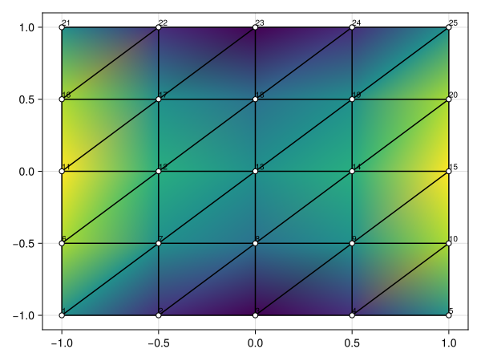 | 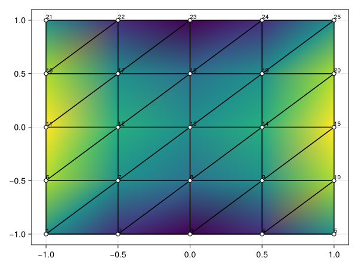 | <details><summary>✅ 26/26 checks</summary>vertices: points: equal (25)<br>vertices x1: count: equal (25)<br>vertices x1 (every 1th): max rel \|Δ\| = 0 over 25 values (tol 1.00e-9)<br>vertices x1: sum over all: \|Δ\| / Σ\|·\| = 0 (tol 1.00e-9)<br>vertices x2: count: equal (25)<br>vertices x2 (every 1th): max rel \|Δ\| = 0 over 25 values (tol 1.00e-9)<br>vertices x2: sum over all: \|Δ\| / Σ\|·\| = 0 (tol 1.00e-9)<br>triangles: equal (32)<br>colour values (binary32): count: equal (25)<br>colour values (binary32) (every 1th): max rel \|Δ\| = 0 over 25 values (tol 1.00e-7)<br>colour values (binary32): sum over all: \|Δ\| / Σ\|·\| = 0 (tol 1.00e-7)<br>wireframe: points: equal (112)<br>wireframe x1: count: equal (112)<br>wireframe x1 (every 1th): max rel \|Δ\| = 0 over 112 values (tol 1.00e-9)<br>wireframe x1: sum over all: \|Δ\| / Σ\|·\| = 0 (tol 1.00e-9)<br>wireframe x2: count: equal (112)<br>wireframe x2 (every 1th): max rel \|Δ\| = 0 over 112 values (tol 1.00e-9)<br>wireframe x2: sum over all: \|Δ\| / Σ\|·\| = 0 (tol 1.00e-9)<br>vertices (scatter): points: equal (25)<br>vertices (scatter) x1: count: equal (25)<br>vertices (scatter) x1 (every 1th): max rel \|Δ\| = 0 over 25 values (tol 1.00e-9)<br>vertices (scatter) x1: sum over all: \|Δ\| / Σ\|·\| = 0 (tol 1.00e-9)<br>vertices (scatter) x2: count: equal (25)<br>vertices (scatter) x2 (every 1th): max rel \|Δ\| = 0 over 25 values (tol 1.00e-9)<br>vertices (scatter) x2: sum over all: \|Δ\| / Σ\|·\| = 0 (tol 1.00e-9)<br>vertex labels: equal ([1, 2, 3, 4, 5, 6, 7, 8, 9, 10, 11, 12, 13, 14, 15, 16, 17, 18, 19, 20, 21, 22, 23, 24, 25])</details><br><sub>pixels: mean \|ΔRGB\| 0.6/255, 0.0% of pixels > 64/255</sub> |
| **cartan-raster** ([original](https://cartan.crucialflow.com/dev/plot))<br>raster: the incidence counts of the five lines of a pentagram<br><sub>`A(k) = Chain(1.0, 2.5cos(2π*k/5+π/2), 2.5sin(2π*k/5+π/2)); raster([A(k) ∧ A(k+2) for k in 0:4])` (`ext/ColorTypesExt.jl:18-35`)</sub> | 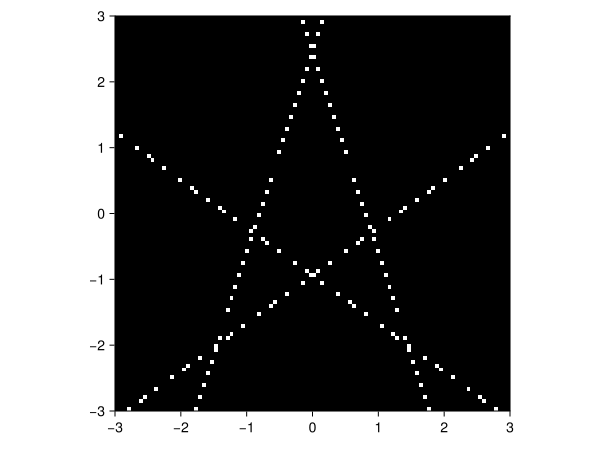 | 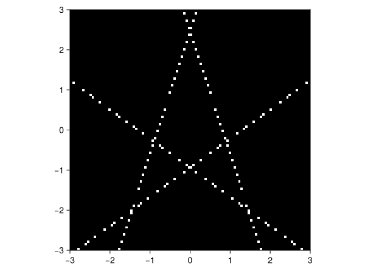 | <details><summary>✅ 3/3 checks</summary>pixels: equal (10000)<br>incidence counts (every pixel): max rel \|Δ\| = 0 over 10000 values (tol 0)<br>Σ counts: equal (134.000000)</details><br><sub>pixels: mean \|ΔRGB\| 0.1/255, 0.0% of pixels > 64/255</sub> |
| **cartan-linegraph-polar** ([original](https://cartan.crucialflow.com/dev/plot))<br>linegraph of the polar surface: every grid line coloured by its speed<br><sub>`fig = Figure(); Axis3(fig[1,1]); linegraph!(xyz)` (`MakieExt.jl:627-660`, the surface of `plot.md:242-252`)</sub> | 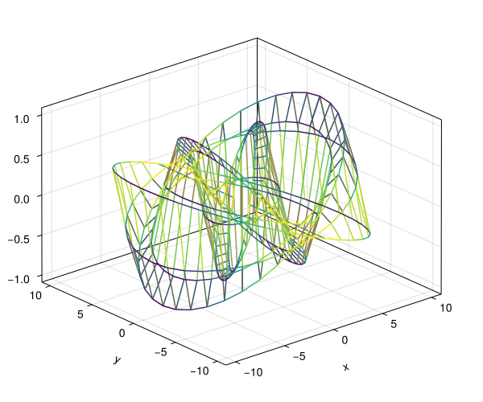 | 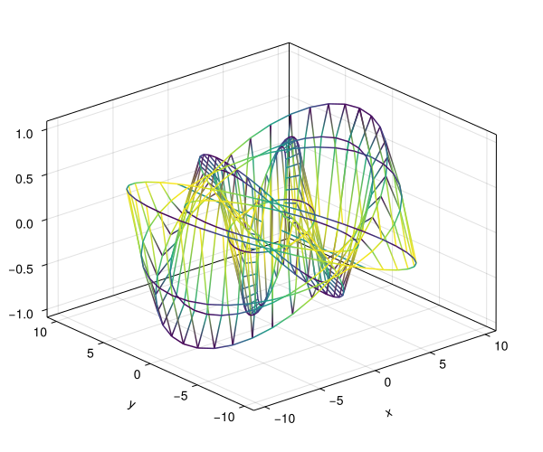 | <details><summary>✅ 15/15 checks</summary>lines: equal (47)<br>points per line: equal ([10, 10, 10, 10, 10, 10, 10, 10, 10, 10, 10, 10, 10, 10, 10, 10, 10, 10, 10, 10, 10, 10, 10, 10, 10, 10, 10, 10, 10, 10, 10, 10, 10, 10, 10, 10, 10, 37, 37, 37, 37, 37, 37, 37, 37, 37, 37])<br>speed colours (binary32): count: equal (740)<br>speed colours (binary32) (every 13th): max rel \|Δ\| = 5.56e-8 over 57 values (tol 1.00e-6)<br>speed colours (binary32): sum over all: \|Δ\| / Σ\|·\| = 3.35e-10 (tol 1.00e-6)<br>points: points: equal (740)<br>points x1: count: equal (740)<br>points x1 (every 13th): max rel \|Δ\| = 0 over 57 values (tol 1.00e-7)<br>points x1: sum over all: \|Δ\| / Σ\|·\| = 0 (tol 1.00e-7)<br>points x2: count: equal (740)<br>points x2 (every 13th): max rel \|Δ\| = 0 over 57 values (tol 1.00e-7)<br>points x2: sum over all: \|Δ\| / Σ\|·\| = 0 (tol 1.00e-7)<br>points x3: count: equal (740)<br>points x3 (every 13th): max rel \|Δ\| = 0 over 57 values (tol 1.00e-7)<br>points x3: sum over all: \|Δ\| / Σ\|·\| = 0 (tol 1.00e-7)</details><br><sub>pixels: mean \|ΔRGB\| 1.4/255, 0.5% of pixels > 64/255</sub> |
| **cartan-linegraph-polar-gridsize** ([original](https://cartan.crucialflow.com/dev/plot))<br>linegraph with gridsize = (5, 7): interpolated leaves<br><sub>`linegraph!(xyz, gridsize = (5, 7))` (`MakieExt.jl:631-638`, `Cartan.jl:737-803`)</sub> | 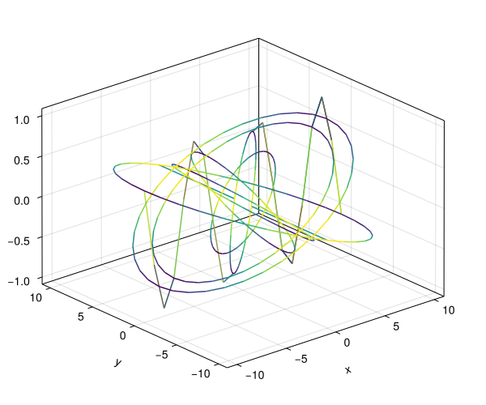 | 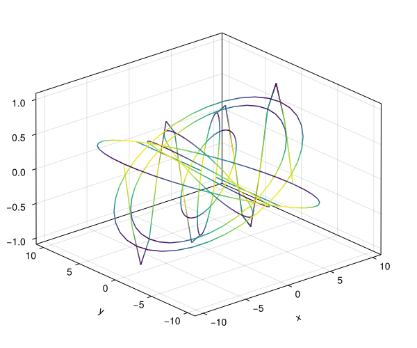 | <details><summary>✅ 15/15 checks</summary>lines: equal (12)<br>points per line: equal ([10, 10, 10, 10, 10, 37, 37, 37, 37, 37, 37, 37])<br>speed colours (binary32): count: equal (309)<br>speed colours (binary32) (every 7th): max rel \|Δ\| = 4.62e-8 over 45 values (tol 1.00e-6)<br>speed colours (binary32): sum over all: \|Δ\| / Σ\|·\| = 4.32e-10 (tol 1.00e-6)<br>points: points: equal (309)<br>points x1: count: equal (309)<br>points x1 (every 7th): max rel \|Δ\| = 0 over 45 values (tol 1.00e-7)<br>points x1: sum over all: \|Δ\| / Σ\|·\| = 0 (tol 1.00e-7)<br>points x2: count: equal (309)<br>points x2 (every 7th): max rel \|Δ\| = 0 over 45 values (tol 1.00e-7)<br>points x2: sum over all: \|Δ\| / Σ\|·\| = 0 (tol 1.00e-7)<br>points x3: count: equal (309)<br>points x3 (every 7th): max rel \|Δ\| = 0 over 45 values (tol 1.00e-7)<br>points x3: sum over all: \|Δ\| / Σ\|·\| = 0 (tol 1.00e-7)</details><br><sub>pixels: mean \|ΔRGB\| 0.4/255, 0.1% of pixels > 64/255</sub> |

## Pending

From the ranked inventory in `docs/port-notes/plot-inventory.md` §6-§7.

| id | figure | waits for |
|---|---|---|
| C1 | plane curve with unit frames, arclength/speed/curvature (Cartan `fiber.md:442-451`) | Cartan differential geometry (`unitframe`, `arclength`, `curvature`); the `scaledarrows` recipe itself is `cartan-scaledarrows-*` |
| C2 | plane curves from curvature, `planecurve` (`fiber.md:452-457`) | Cartan differential geometry (`planecurve`, cumulative integrals) |
| C3 | Lorenz vector-field 3D streamplot (`fiber.md:460-468`) | a 401³ grid field (64 M points, 1.5 GB in Julia); GrassmannPlot's grid streamplot is ready |
| C4 / A1 | Lorenz, Rössler, dynamo attractors (`fiber.md:470-474`, Adapode `examples/chaos.jl`) | Adapode (`odesolve`, RK4/ABM4 on Chains) |
| C8 | Lie bracket streamplots on the torus (`fiber.md:552-563`) | Cartan differential geometry (`gradient`, `Lie`) |
| C10 | link curves and linkmap meshes (`fiber.md:649-656`) | Cartan differential geometry (`linkmap`, `linknumber`) |
| C11 / C12 | torus and wiggle coloured by curvature (`fiber.md:669-695`) | Cartan differential geometry (shape operator, `meancurvature`, `gaussintrinsic`) |
| C13 / C14 / C15 | torus, Klein-bottle and half-plane geodesics (`fiber.md:709-763`) | Cartan + Adapode (`geodesic`, `geosolve`) |
| C17 (sphere) | tangent-space streamplot of a gradient on the sphere (`fiber.md:778-797`) | Cartan differential geometry (`gradient`); the torus half is `cartan-torus-tangent-stream` |
| C18 | da Rios vortex filament (`fiber.md:800-811`) | Adapode (`odesolve` on curve fields; upstream bug P9) |
| C19 | Bishop frame (`fiber.md:813-820`) | Cartan differential geometry (`bishopunitframe`) |
| C20 / A11 | disk eigenmodes (`fiber.md:823-834`) | Adapode (FEM assembly, generalized eigensolver; MATLAB mesh upstream) |
| C21 / A12 | heat flow around a NACA airfoil (`fiber.md:874-895`) | Adapode + FlowGeometry + a 2D mesher |
| C22 / A13 | Poisson on a sphere-in-cube tetrahedral mesh (`fiber.md:898-910`) | Adapode + TetGen-like mesher |
| C23 | Stokes theorem on a paraboloid (`fiber.md:932-962`) | Cartan differential geometry (`graph`, `unitnormal`, `curl`) |
| M-contour_himmelblau, M-heatmap_logscale | labelled isolines with a `ReversibleScale`; an `asinh` axis scale (`plot.md:66-76, 202-214`) | LeanPlot contour labels and custom scales |
| M-contour_curvilinear, M-contourf | curvilinear mesh + contour; contourf over a TensorField (`plot.md:77-98, 159-170`) | broken upstream (`Mesh(::GridBundle{PointMatrix})`, `FieldError`): no Julia render |
| M-volume*, M-contour_volume*, M-voxels_cube_with_holes | volume renderings and 3D contours of volumes (`plot.md:127-153, 350-388`) | a LeanPlot `volume` mark (blank in CairoMakie anyway); a 100³ voxel chunk |
| A2–A9 | leapfrog, wave, heat and rest-wave PDE surfaces and isosurfaces (Adapode `README.md:151-231`) | Adapode (spectral solvers, FFT) |
| A10 | L2 projector (Adapode `README.md:235-240`) | Adapode (1D FEM) |
| W1–W4 | NACA airfoils, double arc, wing surface, Rakich C-mesh (FlowGeometry) | FlowGeometry port |
| D1 | Tamari associahedron coloured by grove sums (Dendriform README) | external gist, not in the repositories |
| G10 | `vandermonde` terminal plot (`ext/UnicodePlotsExt.jl`) | UnicodePlots-style terminal backend (API only, no documented call) |

## Reproducible now, not yet in the gallery

* The rest of the Fatou wiki gallery (`docs/port-notes/fatou.md` §6.4: about 40 Newton, Julia-set and orbit images; four are above) and the 176² default-keyword sets: the Fatou port computes them (`Tests/Fatou/Catalog.lean`); maps with `exp`/`log`/complex powers need REDUCE's Newton forms written out.
* `planes`, `spaces`, `planesbundle`, `spacesbundle` of frames are in `GrassmannPlot.Arrows`, but Cartan 0.4.16's `planes`/`scaledplanes` return `nothing` after drawing every parallelogram in a figure of its own, and `planesbundle` reads an undefined `M` (B4), so there is no Julia render to compare with.

Videos (21 YouTube talks) and LaTeX formula images (Fatou basins, Dendriform) are out of scope (`plot-inventory.md` §1).
