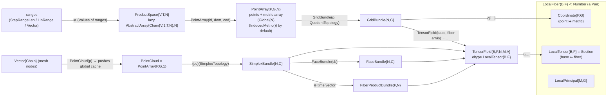

# Cartan.jl core: Lean 4 porting spec

**Scope:** `Cartan.jl/src/Cartan.jl`, `src/topology.jl`, `src/quotient.jl`, `src/fiber.jl`, `README.md`, `docs/src/index.md`, `docs/src/fiber.md`. The topology types that Cartan re-exports from **MeshTopology.jl** (`ImmersedTopology`, `ProductTopology`, `SimplexTopology`, `DiscontinuousTopology`, `QuotientTopology` and friends) are specified here only as far as Cartan core depends on them. Citations are to `MeshTopology.jl/src/*.jl`.

**Out of scope (other specs):** `grid.jl` (interpolation, finite differences, integrals), `element.jl` (FEM), `diffgeo.jl` (curves, surfaces, connections), `spectral.jl`, and `ext/` (Makie, UnicodePlots and mesh importers).

**Source pins**
- Cartan.jl master `02a105dcc6556b7a832cbbbd4e018a5d0399a88c` (2026-09-23), `Project.toml` version 0.4.16. This is byte-identical to the registered 0.4.16 at `~/.julia/packages/Cartan/1ucPA/src`, checked with `diff -rq`.
- MeshTopology.jl v0.1.0 (registered source identical to the clone).
- Grassmann v0.8.46.
- Julia 1.13.0.
- Oracle environment: `--project=/private/tmp/claude-502/-Users-alokbeniwal-Grassmann/c6cc2308-bfca-4b9a-ad33-d89b110132a8/scratchpad/juliaenv`.

**Oracle artifacts produced with this spec**
- Script: `/private/tmp/claude-502/-Users-alokbeniwal-Grassmann/c6cc2308-bfca-4b9a-ad33-d89b110132a8/scratchpad/notes/oracle/cartan_core_oracle.jl`
- Goldens (about 580 KB of JSON): `/private/tmp/claude-502/-Users-alokbeniwal-Grassmann/c6cc2308-bfca-4b9a-ad33-d89b110132a8/scratchpad/notes/oracle/goldens/`
  - `crossrange.json`
  - `quotient_neighbors.json`
  - `parameters.json`
  - `productspace.json`
  - `field_ops.json`
  - `simplex.json`
  - `display.json`
  - `e2e.json`

Notation: `file:line` refers to `Cartan.jl/src/` unless it is prefixed with `MT/` (`MeshTopology.jl/src/`), `GR/` (`Grassmann.jl/src/`) or `AT/` (`AbstractTensors.jl/src/`). Julia indexing is **1-based and column-major** everywhere.

---

## 0. TL;DR for the implementer

1. **A `TensorField` is a pair.** It holds a *base* `FrameBundle` (the discretized manifold) and a *fiber* array of the same shape. The array element type `F` can be anything: a real, a complex, a `Chain`, a `Multivector`, an operator, or even another `TensorField`. The element type of the field *as an array* is `LocalTensor{B,F}` (a `base ↦ fiber` pair). All field arithmetic is a pointwise lift of the fiber arithmetic, and the base is carried along unchanged.
2. **Bases come in two families.**
   - A **GridBundle** holds a `PointArray` (points, usually a lazy `ProductSpace` of ranges, plus a metric array that is usually `Global{N}(InducedMetric())`) together with a `QuotientTopology` (boundary identifications for torus, sphere, Möbius and so on).
   - A **SimplexBundle** or **FaceBundle** holds a `PointCloud` together with a `SimplexTopology` (a list of simplices, `Values{N,Int}`).
3. **The metric is threaded as an explicit extra argument** into every metric-sensitive fiber operation (`*`, `/`, `^`, `exp`, `abs`, `⋆` and the rest). `InducedMetric` means "use the algebra's own metric". The Lean port should make "induced" a *type-level* choice that has zero storage and specializes away.
4. **Topology boundary identification is a small integer table per face.** The table has five parts:
   - `p` gives the partner face;
   - `q` gives the transversal index remap;
   - `r` maps each face to its slot in `p` and `q`;
   - `s` gives the sizes;
   - `c` flags collapsed faces (poles).

   Neighbor lookup is branchy integer arithmetic (`MT/quotient.jl:316-561`), and the grid finite-difference code depends on it.
5. **Several documented paths are broken in the current Julia source.** Most important: after the MeshTopology split, `TorusParameter(60,60)` and every other multi-dimensional `XParameter` throws a `MethodError`. The oracle uses a one-line shim (§8.6). The Lean port should implement the *intended*, pre-split semantics.
6. **Dependent types pay off, at zero cost, in four places:**
   - the grid dimension `N` (1 to 5);
   - the simplex arity;
   - the Chain grade and algebra (from the Grassmann port);
   - "fiber length = base size" invariants, and base-equality of binary field operations (index the field type by the base *value*).

   Everything else (sizes, topology tables, metric values) is runtime data.

---

## 1. Purpose and scope

The README (lines 18-44) describes Cartan as a "unified numerical framework for comprehensive differential geometric algebra" for solving PDEs on manifolds with non-trivial topology. It uses Grassmann.jl algebra for the fibers.

The core covered here provides:

- **Discretized base manifolds:**
  - `ProductSpace` (lazy Cartesian products of ranges);
  - `PointArray` and `PointCloud` (points plus a per-point metric);
  - the `FrameBundle` subtypes: `GridBundle`, `SimplexBundle`, `FaceBundle`, `MultilinearBundle`, `VolumeBundle`, `FiberProductBundle` and `HomotopyBundle`.
- **Topologies** (`ImmersedTopology` family, from MeshTopology):
  - `ProductTopology`;
  - `QuotientTopology` and its named instances: Open, Mirror, Clamped, Torus, Cylinder, Möbius, Wing, Klein, Cone, Tube, Ball/Polar, Sphere, Geographic and Hopf;
  - `SimplexTopology` and `DiscontinuousTopology`.
- **Local fibers:** `LocalFiber` (abstract), `Coordinate` (point plus metric), `LocalTensor` (alias `Section`, operator `↦`) and `LocalPrincipal`.
- **`TensorField`**, the global section, with about 30 type aliases (`ScalarField`, `VectorField`, `PlaneCurve` and so on) and a complete lifted algebra: arithmetic, Grassmann products, elementary functions, conversions, splitting and broadcasting.
- **`XParameter` constructors** such as `TorusParameter(n,m)`. Each builds the identity field on a parameter domain with the matching quotient topology. This is how the docs construct every surface example.
- **Slicing and leaf utilities:** `leaf`, `Variation`, `alteration`, `modification`, `boundarycomponents`, `extract`, `orbit`, `resample` and `TimeParameter`.

Docs positioning (`docs/src/fiber.md:221-355`): `FiberBundle{E,N} <: AbstractArray{E,N}`. The definitions of fiber bundle and manifold are the standard textbook ones (fiber.md:296-312). `TensorField` with `fibertype <: TensorGraded{V,g}` is "a grade g differential form" (README:95).

---

## 2. Public API inventory

### 2.1 Export status of every exported name in scope

Legend:
- **D** = defined in scope files;
- **R** = re-export of a MeshTopology or Grassmann symbol that Cartan extends;
- **E** = defined in an out-of-scope Cartan file (listed for completeness);
- **U** = exported but *undefined* (a Julia bug; do not port).

| Export line | Names | Status |
|---|---|---|
| Cartan.jl:41 | `Values` (R, StaticVectors via Grassmann), `Derivation` (R), `differential`, `codifferential`, `boundary` (R, with doc overrides at Cartan.jl:882-904), `derivative` (R AbstractAnalysis, extended in grid.jl) | R/E |
| Cartan.jl:42 | `initmesh` (E element.jl:63), `pdegrad` (**U**: exported but defined nowhere), `det` (D Cartan.jl:449 for fields), `graphbundle` (D Cartan.jl:606), `divergence` (E diffgeo.jl:54), `grad`, `nabla` (R Grassmann; `grad = gradient` at GR/composite.jl:972) | D/E/U |
| Cartan.jl:43 | `Limit`, `orbit`, `orbithold`, `orbiterror`, `supnorm`, `extract`, `assign!` (R AbstractAnalysis, extended at Cartan.jl:250-256, 513-557) | R/D |
| Cartan.jl:60 | `ElementMap`, `SimplexMap`, `FaceMap` (D aliases), `Components` (D Cartan.jl:608) | D |
| Cartan.jl:61-67 | `IntervalMap`, `RectangleMap`, `HyperrectangleMap`, `PlaneCurve`, `SpaceCurve`, `TensorField`, `ScalarField`, `VectorField`, `BivectorField`, `TrivectorField`, `SurfaceGrid`, `VolumeGrid`, `ScalarGrid`, `Variation`, `RealFunction`, `ComplexMap`, `SpinorField`, `CliffordField`, `ScalarMap`, `GradedField`, `QuaternionField`, `PhasorField`, `DiagonalField`, `EndomorphismField`, `OutermorphismField`, `ParametricMap`, `AbstractCurve` | D |
| Cartan.jl:63,66 | `ElementFunction`, `GlobalFrame` (definitions commented out at Cartan.jl:122, 135) | **U** |
| Cartan.jl:68 | `metrictensorfield`, `metricextensorfield` (D 210-213), `polarize`, `complexify`, `vectorize` (R Grassmann, lifted at 401-406), `findroot` (D 584-585) | D/R |
| Cartan.jl:69 | `leaf` (E grid.jl:148-259), `alteration`, `variation`, `modification` and their `!` forms (D 663-858) | D/E |
| Cartan.jl:70 | `graylines`, `graylines!` (D as empty generic functions, 911-913, implemented in the Makie ext), `isextrinsic` (D 196-198) | D |
| Cartan.jl:598, 609, 860 | `besseljzero`, `boundarycomponents`, `tensorfield` | D |
| Cartan.jl:914-920 | `linegraph`, `tangentbundle`, `normalbundle`, `planesbundle`, `arrowsbundle`, `spacesbundle`, `scaledbundle`, `scaledfield`, `scaledarrows`, `scaledplanes`, `scaledspaces`, `planes`, `spaces`, and each `!` variant | D as empty generic functions (plot ext) |
| topology.jl:17-18 | `ProductSpace`, `RealRegion`, `NumberLine`, `Rectangle`, `Hyperrectangle`, `⧺`, `⊕`, `resample` (R MT, extended), `affinemanifold`, `isfull` (R MT) | D/R |
| topology.jl:189 | `CrossRange` | R MT |
| topology.jl:193-195 | `ImmersedTopology`, `ProductTopology`, `SimplexTopology`, `QuotientTopology`, `OpenTopology`, `CompactTopology`, `topology`, `immersion`, `vertices`, `iscover` | R MT |
| topology.jl:193 | `SimplexManifold` | **U** (exported by MT, never defined) |
| topology.jl:206 | `DiscontinuousTopology`, `discontinuous`, `disconnect`, `continuous` | R MT (extended for bundles, fiber.jl:612-624, 718-730) |
| topology.jl:214-216 | `LagrangeTopology`, `LagrangeTriangles`, `LagrangeTetrahedra`, `cornertopology`, `totalcornernodes`, `totaledgesnodes`, `totalcenternodes`, `cornernodes`, `edgesnodes`, `centernodes` | R MT (lagrange.jl, out of scope) |
| topology.jl:231, 337, 380, 432 | `Global`, `Coordinate`, `point`, `Positions`, `Interval`, `RealSpace`, `ComplexSpace`, `Section`, `LocalTensor` | D |
| fiber.jl:15-19 | `FiberProduct`, `FiberProductBundle`, `HomotopyBundle`, `GlobalFiber`, `LocalFiber`, `localfiber`, `globalfiber`, `base`, `fiber`, `domain`, `codomain`, `↦`, `→`, `←`, `↤`, `basetype`, `fibertype`, `graph`, `fullcoordinates`, `fullpoints`, `fullmetricextensor`, `isinduced`, `pointtype`, `metrictype`, `coordinates`, `coordinatetype` | D |
| fiber.jl:36-38 | `sdims`, `subimmersion`, `fullimmersion`, `fulltopology`, `topology`, `subtopology`, `totalelements`, `elements`, `subelements`, `totalnodes`, `nodes`, `vertices`, `verticesinv`, `isopen`, `iscompact`, `isfull`, `iscover`, `istotal`, `immersiontype`, `refnodes`, `isdisconnected`, `isdiscontinuous` | D (forwarders `f(m::FiberBundle) = f(immersion(m))`) |
| fiber.jl:177, 387-388, 502, 535, 746, 858 | `PointArray`, `PointVector`, `PointMatrix`, `PointCloud`, `Coordinates`, `FiberBundle`, `FrameBundle`, `GridBundle`, `SimplexBundle`, `FaceBundle`, `ElementBundle`, `IntervalRange`, `AlignedRegion`, `AlignedSpace`, `Grid`, `DiscontinuousBundle`, `MultilinearBundle`, `VolumeBundle`, `TimeParameter` | D |
| quotient.jl:65 | `OpenParameter`, `CylinderParameter`, `MobiusParameter`, `WingParameter`, `MirrorParameter`, `ClampedParameter`, `TorusParameter`, `HopfParameter`, `KleinParameter`, `ConeParameter`, `TubeParameter`, `BallParameter`, `SphereParameter`, `GeographicParameter` | D |
| quotient.jl:115 | `PolarTopology` (= `BallTopology`, MT), `PolarParameter` (= `BallParameter`), `RevolvedTopology` (= `TubeTopology`), `RevolvedParameter` (= `TubeParameter`) | D/R |
| quotient.jl:124, 128 | `MultilinearTopology`, `linearelement`, `linearelements`, `elementfun`, `elementfuns`, `BilinearTopology`, `elementsplit`, `elementquad`, `elementtri` | R MT (grid.jl of MT) |

Note: the named `XTopology` constructors (`TorusTopology` and the rest) are *imported* into Cartan (quotient.jl:62) but **not exported** by Cartan. Only `OpenTopology` and `CompactTopology` are exported.

`names(Cartan)` has 564 entries. The oracle's `isdefined` check finds exactly **12 exported-but-undefined names**:
- in scope: `ElementFunction`, `GlobalFrame`, `SimplexManifold`, `pdegrad`;
- in other files' scope (listed so those specs know): `detsimplex`, `edgelengths`, `gausseintrinsicnorm_slow`, `gradientCR`, `seriestransform`, `tangent_fast`, `trilength`, `trinormals`.

The Lean port should not reproduce them.

### 2.2 Types

| Type | Parameters (compile time) | Fields (runtime) | Supertype | Location |
|---|---|---|---|---|
| `FiberBundle{T,N}` | `T` = eltype, `N` = ndims | abstract | `AbstractArray{T,N}` | fiber.jl:28 |
| `GlobalFiber` | alias of `FiberBundle` | – | – | fiber.jl:34 |
| `Coordinates{P,G,N}` | alias `FiberBundle{Coordinate{P,G},N}` | – | – | fiber.jl:65 |
| `PointArray{P,G,N,PA,GA}` | `P` point type, `G` metric type, `N`, `PA<:AbstractArray{P,N}`, `GA<:AbstractArray{G,N}` | `id::Int`, `dom::PA` (points), `cod::GA` (metric) | `FiberBundle{Coordinate{P,G},N}` | fiber.jl:195-200 |
| `PointVector{P,G,PA,GA}`, `PointMatrix`, `PointCloud` | aliases with `N=1`, `N=2`; `PointCloud = PointVector` | – | – | fiber.jl:216-218 |
| `FiberProduct{P,N,PA,FA}` | `P` point type of the product, `N` = ndims of `PA` | `p::PA`, `f::FA` | `FiberBundle{Coordinate{P,InducedMetric},N}` | fiber.jl:357-361 |
| `FrameBundle{C,N}` | `C` = coordinate type | abstract | `FiberBundle{C,N}` | fiber.jl:405 |
| `GridBundle{N,C,PA,TA}` | `N`, `C<:Coordinate`, `PA<:FiberBundle{C,N}`, `TA<:ImmersedTopology` | `p::PA` (coordinates), `t::TA` (immersion) | `FrameBundle{C,N}` | fiber.jl:446-450 |
| `IntervalRange{P<:Real,G,PA<:AbstractRange,GA}` | `GridBundle{1,Coordinate{P,G},<:PointVector{P,G,PA,GA}}` | – | – | fiber.jl:452 |
| `AlignedRegion{N,P<:Chain,G<:InducedMetric,PA<:RealRegion{V,<:Real,N,<:AbstractRange},GA<:Global}` | `GridBundle{N,Coordinate{P,G},PointArray{P,G,N,PA,GA}}` | – | – | fiber.jl:453 |
| `AlignedSpace{…}` | same as `AlignedRegion` but `GA` is unconstrained | – | – | fiber.jl:454 |
| `Grid` | alias of `GridBundle` | – | – | fiber.jl:503 |
| `ElementBundle{N,C,PA<:FiberBundle{C,1},TA}` | `N` = simplex manifold dimension (`mdims(P)-1`) | abstract | `FrameBundle{C,1}` | fiber.jl:532 |
| `DiscontinuousBundle{N,C,PA,TA<:DiscontinuousTopology}` | alias of `ElementBundle` | – | – | fiber.jl:534 |
| `SimplexBundle{N,C,PA,TA}` | `N = mdims(pointtype(p)) - 1` is computed in the inner constructor | `p::PA`, `t::TA` | `ElementBundle` | fiber.jl:572-576 |
| `FaceBundle{N,C,PA,TA}` | same as `SimplexBundle` | `p::PA`, `t::TA` | `ElementBundle` | fiber.jl:686-690 |
| `MultilinearBundle{N,C,PA<:FiberBundle{C,N},TA<:MultilinearTopology}` | – | `p`, `t` | `FrameBundle{C,1}` | fiber.jl:748-751 |
| `VolumeBundle{…}` | same as `MultilinearBundle` | `p`, `t` | `FrameBundle{C,1}` | fiber.jl:773-776 |
| `FiberProductBundle{P,N,SA,PA}` | `P` point type, `N = M+N'` (ndims of `s` plus ndims of `g`) | `s::SA` (usually a `SimplexBundle`), `g::PA` (a `ProductSpace`) | `FrameBundle{Coordinate{P,InducedMetric},N}` | fiber.jl:819-823 |
| `HomotopyBundle{P,N,PA,FA,TA}` | – | `p::FiberProduct{P,N,PA,FA}`, `t::TA` | `FrameBundle{Coordinate{P,InducedMetric},N}` | fiber.jl:874-878 |
| `TensorField{B,F,N,M,A}` | `B` = base eltype (a `Coordinate`), `F` = fiber eltype, `N`, `M<:FiberBundle{B,N}`, `A<:AbstractArray{F,N}` | `dom::M`, `cod::A` | `FiberBundle{LocalTensor{B,F},N}` | Cartan.jl:100-106 |
| `PrincipalFiber{M,G,N,XM,XG}` | `XM<:TensorField{X,M,N}`, `XG<:TensorField{X,G,N}` | `dom::XM`, `cod::XG` | `FiberBundle{LocalPrincipal{M,G},N}` | Cartan.jl:185-188 |
| `ProductSpace{V,T,N,M,S}` | `V` = Submanifold (normalized by `DirectSum.submanifold(V)`), `T` = scalar, `N` = `mdims(V)`, `M` = number of ranges (equals `N` in practice), `S` = range type | `v::Values{M,S}` | `AbstractArray{Chain{V,1,T,N},N}` | topology.jl:46-50 |
| `RealRegion{V,T<:Real,N,S<:AbstractVector{T}}` | `ProductSpace{V,T,N,N,S}` | – | – | topology.jl:52 |
| `NumberLine{V,T,S}`, `Rectangle{V,T,S}`, `Hyperrectangle{V,T,S}` | `RealRegion` with `N = 1, 2, 3` | – | – | topology.jl:53-55 |
| `Global{N,T}` | `N`, `T` | `v::T` | `AbstractArray{T,N}` (**no `size` method**, see §8.6) | topology.jl:246-251 |
| `LocalFiber{B,F}` | – | abstract (concrete subtypes store `v::Pair{B,F}`) | `Number` | topology.jl:292 |
| `Coordinate{P,G}` | `P` point, `G` metric | `v::Pair{P,G}` | `LocalFiber{P,G}` | topology.jl:351-355 |
| `LocalPrincipal{M,G}` | – | `v::Pair{M,G}` | `LocalFiber{M,G}` | topology.jl:404-408 |
| `LocalTensor{B,F}` (= `Section`) | – | `v::Pair{B,F}` | `LocalFiber{B,F}` | topology.jl:424-430, 433 |
| `Positions{P<:Chain,G}` | `AbstractVector{<:Coordinate{P,G}}` | – | – | topology.jl:381 |
| `Interval{P<:AbstractReal,G}` | `AbstractVector{<:Coordinate{P,G}}` | – | – | topology.jl:382 |
| `RealSpace{N,P<:Chain{V,1,<:Real},G}` | `AbstractArray{<:Coordinate{P,G},N}` | – | – | topology.jl:385 |
| `ComplexSpace{N,P<:Chain{V,1,<:Complex},G}` | same, with complex scalars | – | – | topology.jl:386 |
| `Components{T<:TensorField}` | `AbstractVector{T}` | – | – | Cartan.jl:608 |

`AbstractReal = Union{Real, Single{V,G,B,<:Real}, Chain{V,G,<:Real,1}}` and `AbstractComplex{T}` (GR/multivectors.jl:979-980) are Grassmann aliases. A **one-component Chain counts as real**.

**MeshTopology types** that Cartan depends on:

| Type | Definition |
|---|---|
| `ImmersedTopology{N,M}` | `AbstractArray{Values{N,Int},M}` (MT/MeshTopology.jl:76); `immersion` is an alias of this constant (MT:83) |
| `ProductTopology{N,S<:AbstractVector{Int}}` | field `v::Values{N,S}` (MT:129-132) |
| `CrossRange <: AbstractVector{Int}` | fields `n`, `m` (MT:49-53) |
| `SimplexTopology{N,P,F,T}` | fields `id`, `t`, `i`, `p::RefValue{Int}`, `f`, `I`, `v`; `T = (istotal, isfull)` is a **type parameter tuple of Bools** (MT:235-249) |
| `DiscontinuousTopology{N,P,T<:SimplexTopology{N}}` | fields `id`, `t`, `i`, `I` (MT:483-488) |
| `QuotientTopology{N,L,M,O,LA<:ImmersedTopology{L,L}}` | fields `p::Values{O,Int}`, `q::Values{O,LA}`, `r::Values{M,Int}`, `s::Values{N,Int}`, `c::Values{M,Int}`; `L = N-1`, `M = 2N`, `O` = number of identified faces (MT/quotient.jl:27-36) |
| `OpenTopology{N,L,M,LA}` | `QuotientTopology` with `O = 0` |
| `CompactTopology{N,L,M,LA}` | `QuotientTopology` with `O = M` (MT/quotient.jl:45-46) |

### 2.3 TensorField type aliases (Cartan.jl:118-148)

All of these are `TensorField{B,F,N,P,A}` with constraints:

| Alias | N | Fiber `F` constraint | Base `P` constraint |
|---|---|---|---|
| `ScalarMap{B,F<:AbstractReal,P<:SimplexBundle,A}` | 1 | AbstractReal | SimplexBundle |
| `ElementMap` | 1 | – | `ElementBundle` |
| `SimplexMap` | 1 | – | `SimplexBundle` |
| `FaceMap` | 1 | – | `FaceBundle` |
| `IntervalMap` | 1 | – | `Interval` (1-D, AbstractReal points) |
| `RectangleMap` | 2 | – | `RealSpace{2}` |
| `HyperrectangleMap` | 3 | – | `RealSpace{3}` |
| `ParametricMap{B,F,N,P<:RealSpace,A}` | N | – | `RealSpace` |
| `Variation{B,F<:TensorField,N,P,A}` | N | a TensorField (field of fields) | – |
| `RealFunction` | 1 | AbstractReal | Interval |
| `PlaneCurve` | 1 | `Chain{V,G,Q,2}` | Interval |
| `SpaceCurve` | 1 | `Chain{V,G,Q,3}` | Interval |
| `AbstractCurve` | 1 | `Chain` | Interval |
| `SurfaceGrid` | 2 | AbstractReal | `RealSpace{2}` |
| `VolumeGrid` | 3 | AbstractReal | `RealSpace{3}` |
| `ScalarGrid{B,F,N,P<:RealSpace{N},A}` | N | AbstractReal | `RealSpace{N}` |
| `DiagonalField` | N | `DiagonalOperator` | – |
| `EndomorphismField` | N | `Endomorphism` (`TensorOperator{V,V,T}`) | – |
| `OutermorphismField` | N | `Outermorphism` | – |
| `CliffordField` | N | `Multivector` | – |
| `QuaternionField` | N | `Quaternion` (= `Spinor{V,T,4}`) | – |
| `ComplexMap` | N | `AbstractComplex` | – |
| `PhasorField` | N | `Phasor` | – |
| `SpinorField` | N | `AbstractSpinor` | – |
| `GradedField{G,B,F<:Chain{V,G},N,P,A}` | N | `Chain` of grade G | – |
| `ScalarField` | N | AbstractReal | – |
| `VectorField = GradedField{1}` | | | |
| `BivectorField = GradedField{2}` | | | |
| `TrivectorField = GradedField{3}` | | | |

Oracle check (probe p8): `TensorField(0:1.0:2)` isa `IntervalMap` and `RealFunction`. `Chain.(t,t)` isa `PlaneCurve` and `AbstractCurve`. A scalar field on a 2-D grid isa `ScalarField`, `RectangleMap`, `SurfaceGrid` and `ParametricMap`. The README table at README:166-193 prints these aliases; its `PlaneCurve` row there is wrong, and the code wins.

### 2.4 TensorField constructors (the dispatch table)

Julia picks the most specific method. The resolution order a Lean port must reproduce, where `dom` is the first argument and `cod` the second:

| # | Signature | Result | Location |
|---|---|---|---|
| C1 | `TensorField(dom::M<:FiberBundle{B,N}, cod::A<:AbstractArray{F,N})` | inner constructor: stores as is. **No size check.** | Cartan.jl:103-105 |
| C2 | `TensorField(dom::AbstractArray{P,N}, cod::AbstractArray, met::AbstractArray=Global{N}(InducedMetric()))` | `TensorField(GridBundle(PointArray(0,dom,met)), cod)`, with the default OpenTopology | Cartan.jl:109-111 |
| C3 | `TensorField(dom::PointArray, cod::AbstractArray)` | `TensorField(GridBundle(dom), cod)` | :112 |
| C4 | `TensorField(dom, cod::AbstractArray, met::FiberBundle)` | `TensorField(dom, cod, fiber(met))` | :113 |
| C5 | `TensorField(dom::FrameBundle, cod::FrameBundle)` | `TensorField(dom, points(cod))` (identity field when `cod === dom`) | :114 |
| C6 | `TensorField(a::TensorField, b::TensorField)` | `TensorField(fiber(a), fiber(b))`, i.e. **a new grid whose points are a's values** (reparametrization, graph-like) | :115 |
| C7 | `TensorField(dom::FrameBundle{B,N}, fun::BitArray{N})` | `TensorField(dom, Float64.(fun))` (Bool arrays become 0.0/1.0) | :150 |
| C8 | `TensorField(dom, fun::TensorField)` and `TensorField(dom::FrameBundle, fun::TensorField)` | `TensorField(dom, fiber(fun))` | :151-152 |
| C9 | `TensorField(dom::TensorField, fun::AbstractArray/Function/Number)` | recurses with `base(dom)` | :153-155 |
| C10 | `TensorField(dom::AbstractArray, fun::Function)` | `TensorField(dom, fun.(dom))`. `fun` sees the **raw elements of dom**: Floats for a range, `Chain`s for a ProductSpace. | :156 |
| C11 | `TensorField(dom::FrameBundle, fun::Function)` | `fun.(dom)`. Broadcasting over a FrameBundle gives `fun` **`Coordinate`s**. The result is a TensorField over `dom` (see §4.2). `fun` must use `x[i]` or `point(x)`, because `2*Coordinate` scales the *metric* and fails. | :157 |
| C12 | `TensorField(dom::AbstractArray, fun::Number)` | constant field `fill(fun, size(dom)...)` | :158 |
| C13 | `TensorField(dom::AbstractArray)` | `TensorField(dom, dom)`: the **identity field**. For a range or ProductSpace, C2 then makes the fiber the range itself (lazy). For a FrameBundle, C5 makes the fiber `points(dom)`. | :159 |
| C14 | `TensorField(f::Function, r::AbstractVector{<:Real}=-2π:0.0001:2π)` | `TensorField(r, vector.(f.(r)))`. Default length 125664 (verified). | :160 |
| C15 | `TensorField(dom::PrincipalFiber, fun::TensorField)` | `TensorField(dom, fiber(fun))` | :199 |
| C16 | `TensorField(t::Chain{V,G})` where each component is a TensorField | pointwise `Chain{V,G}` assembly via `valmat` | :340 |

Operator aliases:
- `→ = TensorField` (Cartan.jl:209), so `dom → cod` builds a field.
- `←(F,B) = B → F` (:208).
- `↦ = LocalTensor`, `domain = base`, `codomain = fiber` (topology.jl:434).
- `↤(F,B) = B ↦ F` (topology.jl:435).

ASCII aliases: none are defined, so the port must provide names.

| Unicode | Julia input | Suggested Lean ASCII name |
|---|---|---|
| `→` | `\to` | `TensorField.mk'` / `field` |
| `↦` | `\mapsto` | `LocalTensor.mk`, notation `b ↦ f` |
| `⊕` | `\oplus` | `oplus`; Julia also accepts `cross(a,b)` / `×` for ProductSpace, PointArray and GridBundle (topology.jl:105-106, fiber.jl:278-279, 466-467) |
| `⧺` | `\doubleplus` | `concat` |

### 2.5 Accessors

Generic definitions:

| Function | Definition | Location |
|---|---|---|
| `base(t::FiberBundle)` | `t.dom` | fiber.jl:79 |
| `fiber(t::FiberBundle)` | `t.cod` | fiber.jl:86 |
| `base(t::Array)` | `ProductSpace(Values(axes(t)))` (index grid) | :87 |
| `fiber(t::Array)` | `t` | :88 |
| `base(s::LocalFiber)` | `s.v.first` | topology.jl:299 |
| `fiber(s::LocalFiber)` | `s.v.second` | :300 |
| `fiber(s)` | `s` | :296 |
| `base(s::Real)` | `s` | :310 |
| `basepoint(s::LocalFiber)` | `point(base(s))` | :301 |
| `globalfiber(x)` | `fiber(x)` for a FiberBundle, else `x` | fiber.jl:32-33 |
| `localfiber(x)` | `fiber(x)` for a LocalTensor, else `x` | topology.jl:437-438 |
| `point(c)` | `c`; `point(c::Coordinate) = base(c)`; `point(c::LocalFiber) = point(base(c))` | :357-359 |
| `metricextensor(c)` | `InducedMetric()`; for a Coordinate `fiber(c)` | :360-361 |
| `metrictensor(c)` | `InducedMetric()`; for a Coordinate `TensorOperator(fiber(c)[1])` (grade-1 block) | :362-363 |

Type-level accessors, grouped by argument:

- **`LocalFiber{B,F}`:**
  - `basetype` gives `B` (topology.jl:302, 306);
  - `fibertype` gives `F` (:304, 308);
  - `pointtype` gives `basetype(B)` (:303, 307);
  - `metrictype` gives `fibertype(B)` (:305, 309).
- **Arbitrary values:** `fibertype(s) = typeof(s)` and `fibertype(::Type{T}) = T` (:297-298).
- **`Array{T}`:** `basetype` and `fibertype` both give `T` (fiber.jl:95, 102).
- **Coordinate:** `pointtype`, `metrictype` (topology.jl:364-367).
- **FiberBundle:**
  - `pointtype(m) = basetype(coordinatetype(m))` (fiber.jl:109-110);
  - `metrictype(m) = fibertype(coordinatetype(m))` (:117-118);
  - for `Coordinates`, `coordinatetype(m) = eltype(m)` (:125-126).
- **Coordinates:**
  - `coordinates(m::Coordinates) = m` (:128);
  - `const coordinates = Coordinates` (:72): calling `coordinates` on an unrecognized value invokes the *type alias as a constructor*;
  - `fullcoordinates(m::Coordinates) = m` (:135).
- **FiberBundle "full" accessors:**
  - `fullpoints(m) = base(fullcoordinates(m))` (:142);
  - `fullmetricextensor(m) = fiber(fullcoordinates(m))` (:149);
  - `fullmetrictensor(m) = submetric(fullmetricextensor(m))` (:150);
  - `metrictensor(m) = submetric(metricextensor(m))` (:151).
- **`submetric`:**
  - on a `Global`: identity;
  - on an array: elementwise;
  - on a `DiagonalOperator`: `DiagonalOperator(x[1])`;
  - on an `Outermorphism`: `TensorOperator(x[1])` (:152-155).
- **`isinduced`:**
  - on a FiberBundle: `isinduced(fullcoordinates(m))` (:162);
  - on a `DenseArray`: false;
  - on a `Global`: false;
  - on `Global{N,<:InducedMetric}`: true (:163-165);
  - on a PointArray: `isinduced(metricextensor)` (:243).
- **Arrays of Chains:**
  - `fullpoints` and `points` of `AbstractArray{<:Chain{V,1}}` return the array itself;
  - `metricextensor` returns `Global{N}(InducedMetric())` (:167-169).
- **Algebra facts of a FiberBundle:** `Manifold(m)`, `rank(m)` and `mdims(m)` are all taken from `pointtype(m)` (:171-173).
- **Topology forwarders:** `sdims`, `subimmersion`, … (22 functions) are defined as `f(m::FiberBundle) = f(immersion(m))` (fiber.jl:36-39); also `sdims(::Type{<:FiberBundle})` (:40).

Size and resizing on FiberBundles:
- `size(m) = size(base(m))` (:47);
- `resize!(m,i)` resizes base and fiber (:48);
- `resize_lastdim!` likewise (:49).

Per concrete type:

| Type | `base` | `fiber` | `coordinates` | `points` | `metricextensor` | `immersion` | `size` |
|---|---|---|---|---|---|---|---|
| PointArray | `dom` | `cod` | itself | `base(m)` (:240) | `fiber(m)` (:242) | – | `size(points)` (:283) |
| FrameBundle (generic) | `points(m)` (:407) | `metricextensor(m)` (:408) | – | – | `metricextensor(coordinates(m))` (:409) | – | `size(points(m))` (:417) |
| GridBundle | `points(coordinates)` | metric | `m.p` (:473) | `base(coordinates(m))` (:476) | `fiber(coordinates(m))` (:477) | `m.t` (:474) | generic |
| SimplexBundle | via FrameBundle | via FrameBundle | conditional (:587-593) | conditional (:594-600) | conditional (:601-607) | `m.t` (:538) | `size(vertices(m))` (:610) |
| FaceBundle | – | – | `PointCloud(0, points, metric)` (:700) | element centroids (:702-708) | centroid metric or full (:709-715) | `m.t` | `size(immersion(m))` (:733) |
| MultilinearBundle | – | – | PointCloud (:757) | `fullpoints[verticesinv(m)]` (:760) | (:761) | `m.t` | `size(verticesinv(m))` (:763) |
| VolumeBundle | – | – | PointCloud (:784) | quad and triangle centroids (:787-791) | (:792-800) | `m.t` | `(prod(size(QuotientTopology(t)).-1),)` (:802) |
| FiberProductBundle | – | – | – | – | `Global{mdims(P)}(InducedMetric())` (:841) | – | `(length(s), size(g)...)` (:840) |
| HomotopyBundle | – | – | `m.p` (:882) | – | – | (MT forwarder) | `size(FiberProduct(m))` (:885) |
| TensorField | `dom` | `cod`; for SequenceArray, `cod.v` (Cartan.jl:535) | forwarded to base (Cartan.jl:201-206; this covers `points`, `metricextensor`, `coordinates`, `immersion`, `vertices`, `fullcoordinates`, `metricextensorfield`, `metrictensorfield`) | forwarded | forwarded | forwarded | generic |

TensorField type-level accessors:
- `basetype(::TensorField{B}) = B`, where `B` is the **Coordinate type, not the point type**. The probe shows `Coordinate{Float64, InducedMetric}`.
- `coordinatetype(t) = basetype(t)` (Cartan.jl:161-164).
- `fibertype` gives `F` (:165-166).
- `eltype` gives `LocalTensor{B,F}` (:226).

`isbundle(::FrameBundle) = true`, otherwise false (fiber.jl:419-420). `grade` and `antigrade` of a FrameBundle come from `pointtype` (:421-422).

`isfiber(::LocalFiber) = true`, otherwise false (topology.jl:293-294). `isfiberbundle(::FiberBundle) = true`, otherwise false (fiber.jl:29-30).

`isextrinsic`: for a TensorField it is `isextrinsic(base)`; for a FrameBundle false; for a PrincipalFiber true (Cartan.jl:196-198).

### 2.6 Indexing and slicing

TensorField:

| Operation | Behavior | Location |
|---|---|---|
| `t[i::Int...]` | `LocalTensor(base(t)[i...], fiber(t)[i...])` | Cartan.jl:227 |
| `t[i::Union{Int,Colon}...]` (at least one Colon) | `TensorField(base(t)(i...), fiber(t)[i...])`. Slicing calls the **base as a function**, which slices points *and* topology. For a 1-D field with a plain range base, `g[:]` throws (a StepRangeLen is not callable). | :228 |
| `view(t, i...)` | same as slicing, with a `view` fiber | :229 |
| `setindex!(t, s::F, i...)` | writes the fiber element | :231 |
| `setindex!(t, s::TensorField, :, …, i)` | writes a whole last-axis slice | :232-235 |
| `setindex!(t, s::LocalTensor, i...)` | writes `fiber(s)` only and **ignores base(s)** | :236-248 |
| `t[vector of Ints]` (e.g. `g[2:3]`) | Julia's generic AbstractArray path: a plain `Vector{LocalTensor}`, not a TensorField | verified |
| `extract(x::TensorField{B,F,N}, i)` for N = 2..5 | `LocalTensor(points(x).v[end][i], view(x, :, …, :, i))`: the last-axis coordinate paired with the slice | :253-256 |
| `(t::TensorField{…,SimplexBundle})(i::ImmersedTopology)` | `TensorField(coordinates(t)(i), fiber(t)[vertices(i)])` (restrict to a sub-mesh) | :311 |
| `(t::TensorField{…,GridBundle})(i::ImmersedTopology)` | `TensorField(base(t)(i), fiber(t))` (re-topologize) | :312 |
| `XTopology(t::TensorField{…,GridBundle})` for X in {Open, Mirror, Clamped, Torus, Cylinder, Wing, Mobius, Klein, Cone, Tube, Ball, Sphere, Geographic, Hopf} | `TensorField(XTopology(base(t)), fiber(t))`; `XTopology(m::GridBundle) = m(XTopology(size(m)))`; `XTopology(p::PointArray) = TensorField(GridBundle(p, XTopology(size(p))))`; `XParameter(p::PointArray) = XTopology(p)` | :313-322 |

The call syntax `(t::TensorField)(x)` for interpolation lives in grid.jl and element.jl and is out of scope. Verified examples: `sin(TensorField(0:0.5:3))(1.25) == 0.9194829857059754`, and `t(0.75) == 0.75` for the identity field.

ProductSpace (topology.jl):
- `size` is `(size(v[1])..., …, size(v[N])...)` (:76). The number of axes is `mdims(V)`.
- `m[i1,…,iN] = Chain{V,1,T}(Values{N,T}(v[1][i1], …, v[N][iN]))` (:77). 1-D case: `Chain{V,1,T}(Values((v[1][i],)))` (:78).
- `IndexStyle` is `IndexCartesian`. A linear index maps to Cartesian indices in column-major order (axis 1 fastest) (:79-94).
- `eltype = Chain{V,1,T,N}` (:80).
- Iteration uses linear order (:67-68).
- Call syntax `m(args::Union{Int,Colon}...)` slices (topology.jl:125-129, 169-181):
  - One Colon at position a: returns the **range** `m.v[a]` itself, not a 1-D ProductSpace.
  - At least two Colons: returns `ProductSpace(m.v[perm])`, where `perm` lists the Colon positions. **`V` is re-derived** as `affmanifold(k)`.
- `remove(t::ProductSpace{V,T,2}, Val(1)) = t.v[2]` and `Val(2)` gives `t.v[1]`. In general, `ProductSpace(t.v[all but J])` (:120-122).
- `split(t) = t.v` (:62).
- `widths(t) = widths.(t.v)`, where `widths(r) = r[end]-r[1]` (:117-118).
- `isrange(m::ProductSpace)` is the product (logical AND) over axes of `isrange` (:74). `isrange(::AbstractRange) = true`, otherwise false (:72-73).
- `resample(m::ProductSpace, i::NTuple = size(m)) = ProductSpace(resample.(split(m), i))` (:185). Range resampling from MT/MeshTopology.jl:36-46 always yields a **LinRange** from `m[1]` to `m[end]` with the new length, except for a StepRangeLen input (see §4.4).
- `resize_lastdim!(m::ProductSpace, i)` resizes the last range in place (:70). This only works for a mutable vector.

### 2.7 Operators on fields (lifted algebra), exhaustive

Notation used below:
- `TF` means a TensorField, `LT` a LocalTensor, `N#` a Number.
- `g` means `refmetric(base(a))`. `refmetric(x) = ref(metricextensor(x))`. `ref(::InducedMetric) = Ref(x)`, `ref(::Global) = Ref(x.v)`, and `ref(x) = x` otherwise (topology.jl:273-276). A `Global` metric is therefore broadcast as a scalar, while a per-point array is zipped elementwise.
- Every `TF⊙TF` below is `TensorField(base(a), op.(fiber(a), fiber(b), …))`. The result **takes the base of `a`**.

**Group A, base-checked binary** (Cartan.jl:346-354). Operators: `+`, `-`, `&`, `∧` (Grassmann.∧), `∨` (Grassmann.∨), `min`, `max`, `div`, `rem`, `mod`, `mod1`, `ldexp`.
- `TF op TF`: runs `checkdomain(a,b)` first. That compares `base(a) ≠ base(b)` with structural `==` over **all elements**, and throws `"GlobalFiber base not equal"` on a mismatch (Cartan.jl:494). If the Coordinate types differ, Julia's `==` throws a promotion error first (probe: "promotion of types Coordinate{Float64, InducedMetric} and Coordinate{Int64, InducedMetric} failed…").
- `TF op N#` and `N# op TF`: pointwise with `Ref(b)`.

**Group B, metric binary without a base check** (Cartan.jl:387-394). Each pair maps an operator to its metric function:

| Operator | Metric function |
|---|---|
| `*` | `wedgedot_metric` |
| `wedgedot` | `wedgedot_metric` |
| `veedot` | `veedot_metric` |
| `⋅` | `contraction_metric` |
| `contraction` | `contraction_metric` |
| `>` | `contraction_metric` |
| `⊘` | `⊘` |
| `>>>` | `>>>` |
| `/` | `/` |
| `\` | `\` |
| `^` | `^` |

The forms are:
- `TF{R} op TF{R}` (both bases must have the same Coordinate type `R`, but **no value check**): `Grassmann.mop.(fa, fb, g)`.
- `N# op TF`: `Grassmann.op.(a, fb)`.
- `TF op N#`: `Grassmann.op.(fa, b)`, and `^` also receives `g`.

These definitions are **later in the file** and more generic than several specific ones, so the Julia dispatch table is as follows:
1. Real/Complex-specific `*` and `/` at :363-372 use plain `.*` and `./`. They are more specific when either operand's fiber is Real or Complex.
2. `TF^n::Int` at :345 becomes `.^(fiber, n, g)`.
3. `TF^b::Real` at :386 becomes `Grassmann.:^.(fiber, b, g)`.
4. `<` at :383: `TF{R} < TF{R}` becomes `contraction_metric.(fb, fa, g)`, **argument order swapped**. `N# < TF` gives `contraction.(fb, a)`; `TF < N#` gives `contraction.(b, fa)`.
5. FiberBundle `<<`, `>>` and `<` at :357-359: `a << b = contraction(b, ~a)`, `a >> b = contraction(~a, b)`, `a < b = contraction(b, a)`. `contraction(TF,TF)` then routes to the Group B `contraction_metric`.
6. `a × b` at :373 is `⋆.(fa .∧ fb, g)` (Hodge dual of the wedge product). Probe: `(x,y,1)×(1,-y,x)` at x=0.5, y=0.25 gives `-0.5v₁ - 1.0v₂ + 1.0v₃`.
7. `/(a::TF, b::TensorAlgebra)` at :443 is `./(fa, b, g)`.

**Important semantic**: `<` and `>` are **Grassmann contractions, not orderings**. `LocalTensor(1.0,2.0) < LocalTensor(1.0,3.0)` returns `1.0 ↦ 6.0` (verified). `isless` is undefined on LocalTensor.

**Group C, unary without a metric** (Cartan.jl:395-397 on Base, 401-403 on Grassmann). Each is `TensorField(base, f.(fiber))`.
- Base functions: `-`, `!`, `~`, `real`, `imag`, `conj`, `deg2rad`, `transpose`, `iszero`, `isone`, `isnan`, `isinf`, `isfinite`, `floor`, `ceil`, `round`.
- Grassmann functions: `reverse`, `clifford`, `even`, `odd`, `scalar`, `vector`, `bivector`, `trivector`, `pseudoscalar`, `value`, `complementleft`, `realvalue`, `imagvalue`, `outermorphism`, `Outermorphism`, `DiagonalOperator`, `TensorOperator`, `eigen`, `eigvecs`, `eigvals`, `eigvalsreal`, `eigvalscomplex`, `eigvecsreal`, `eigvecscomplex`, `eigpolys`, `pfaffian`, `∧` (unary), `↑`, `↓`, `vectorize`, `discriminant`, `discriminantreal`, `discriminantcomplex`, `vandermonde`, `vandermondereal`, `vandermondecomplex`, `adjugate`, `cofactor`.

Note: the Bool-valued functions (`iszero` and the other `is*` predicates) produce a `BitArray`, and C7 converts that to a `Float64` 0.0/1.0 field. The probe shows `fiber(iszero(s))[1,1] == 1.0`.

**Group D, unary with a metric** (Cartan.jl:398-400 on Base, 404-406 on Grassmann). Each is `TensorField(base, f.(fiber, ref(metricextensor(t))))`.
- Base functions: `exp`, `exp2`, `exp10`, `log2`, `log10`, `sinh`, `cosh`, `abs`, `sqrt`, `cbrt`, `cos`, `sin`, `tan`, `cot`, `sec`, `csc`, `asec`, `acsc`, `sech`, `csch`, `acsch`, `asech`, `tanh`, `coth`, `asinh`, `acosh`, `atanh`, `acoth`, `asin`, `acos`, `atan`, `acot`, `sinc`, `cosc`, `cis`, `abs2`, `inv`.
- Grassmann functions: `⋆`, `angle`, `radius`, `complementlefthodge`, `pseudoabs`, `pseudoabs2`, `pseudoexp`, `pseudolog`, `pseudoinv`, `pseudosqrt`, `pseudocbrt`, `pseudocos`, `pseudosin`, `pseudotan`, `pseudocosh`, `pseudosinh`, `pseudotanh`, `metric`, `unit`, `complexify`, `polarize`, `amplitude`, `phase`.
- `log(t)` uses `log_metric.(fiber, g)` (:442).
- For Real and Complex arguments, `f(x, g) = f(x)` (AT/AbstractTensors.jl:394-401).
- `angle(::Complex, ::InducedMetric)` has no method, so `angle(complexField)` **throws** (probe). Port it as plain `angle`.

**Group E, specific overrides:**
- `sign(a) = sign.(fiber(Real(a)))` (:360).
- `inv` on Real or Complex fibers is plain (:361-362).
- Plain elementwise `*` whenever either side's fiber is Real or Complex (:363-370).
- `/` with a Real or Complex divisor field (:371-372).
- `compound(t, i::Val|Int)`, `eigen`, `eigvals`, `eigvecs(t, i)`, `eigpolys(t, G::Val)` (:374-382).
- `tr`, `det`, `norm` pointwise (:448-450).
- `absvalue(t) = value.(abs.(fiber))` (:447).
- `Grassmann.signbit(::TF) = false` (:444).
- `diff(t) = TensorField(diff(base(t)), diff(fiber(t)))` (:446). This is **broken for GridBundle bases** (see §8.6).

**Group F, conversions and application:**
- `(V::Submanifold)(t)` gives `V.(fiber)` (:451).
- `(T<:Real)(t)`, `Complex(t)` and `Complex{T}(t)` convert the fiber scalar type (:452-454).
- `Grassmann.Phasor(s)` and `Couple(s)` are **applied to the whole fiber array, not broadcast**, and throw (bug) (:455-456).
- `(m::TensorNested)(t)` gives `m.(fiber)` (:355).
- `(m::TF{B,<:TensorNested})(t::TF) = m⋅t` (:356).
- A Phasor `z` applied to a field or LocalTensor is `z.(fiber)`, with an optional angle argument θ (:587-596).
- `Chain(t::TF{B,<:Union{Real,Complex}}) = Chain{Submanifold(ndims(t)),0}(t)`: a Chain whose single coefficient is a TensorField (:341).
- `Chain(t::TF{B,<:Chain{V,G}})` gives a `Chain{V,G}` of component scalar fields `getindex.(fiber(t), j)` for `j = 1:binomial(mdims V, G)` (:342-344).
- `TensorField(t::Chain{V,G})` is the inverse: pointwise `Chain{V,G}.(valmat(fiber.(value(t))))` (:340). `valmat` zips N arrays into one array of `Values{N}` (:331-335, dims 1..5).
- `split(t::TF{B,<:Chain{V,G,T,k}})` for k = 1..5 gives a tuple of k scalar fields `getindex.(t, j)` (:458-472).
- `fromany(t::Chain{V,G,Any}) = Chain{V,G}(value(t)...)` narrows an Any-typed Chain (:337-338).

**Group G, reductions:**
- `sum(t) = sum(fiber)` and `prod(t) = prod(fiber)` return plain values (:407-409).
- `cumsum(t)` and `cumprod(t)` return fields (:410-412).
- `supnorm(x) = maximum(norm, fiber)` and `infnorm(x) = minimum(norm, fiber)` (:513-514).
- `maximum(η) = η[argmax(fiber(η))]` and `minimum(η) = η[argmin(fiber(η))]` return a **LocalTensor at the arg-extremum** (element.jl:119-124, out of scope but used by `findroot`).
- `findroot(t) = minimum(norm(t))` and `findroot(t, x) = minimum(norm(t - x))` (:584-585). For example, `findroot(TensorField(0:0.5:3) - 2.2) == 2.0 ↦ 0.2000…018`.

**Group H, mixing with LocalTensor and matrices:**
- `TF ± LT` gives `LocalTensor(base(t), m ± fiber(t))`: the result is a LocalTensor whose **fiber is a field** (:414-417).
- `AbstractMatrix * LT`, `\`, and `LT * M` act on the fiber (:419-423).
- `M * RealFunction` and `M \ RealFunction` give `reshape(M*fiber(t), size(t))` (:427, 431).
- `RealFunction * M` gives `vec(transpose(fiber(vec(t)))*M)` (:435, 439).

**LocalTensor and Coordinate operators** (topology.jl:440-517; the loop at :466-514 defines each operator for both `type ∈ (Coordinate, LocalTensor)`):
- `(m::TensorNested)(x::LT) = LT(base, m(fiber))` (:440).
- `<<`, `>>`, `<` as for FiberBundle (:441-443). `sign(s)` uses `sign(Real(fiber))` (:444).
- `inv`, and `/` by a Real or Complex LT, on the fiber (:445-448).
- `a × b` for LocalTensors: `TensorField(base(a), ⋆(fa∧fb, metricextensor(a)))` (:449). This is a **bug**: it calls `TensorField(::Float64, ::Chain)`, which throws `MethodError` (probe p14). The intended result is `LocalTensor(base(a), ⋆(fa∧fb, g))`.
- `compound`, `eigen*` (:450-458). `<` gives `>(b,a)` (:459-461). `log` uses `log_metric` (:462).
- Base functions with a metric (list as in Group D, plus `inv`): `f(fiber, metricextensor(s))` (:463-465).
- The Grassmann constructors `Single`, `Couple`, `PseudoCouple`, `Chain`, `Spinor`, `AntiSpinor`, `Multivector`, `DiagonalOperator`, `TensorOperator`, `Outermorphism` as `T(s)` give `type(base, T(fiber))` (:467-469).
- Unary functions as in Group C (the Base list is the same; the Grassmann list adds `involute`, `curl`, `∂`, `d`) (:470-475). Metric unary functions as in Group D (:476-478).
- Binary Group A operators: `type{R} op type{R}` gives `type(base(a), op(fa,fb))` with **no base check**; with a Number, the Number is applied to the fiber (:479-486).
- Binary Group B operators, the same list without `\`, with `metricextensor(a)` (:487-494).
- `type(b, f::Function) = type(b, f(b))` (:496). For example, `LocalTensor(2.0, x->x^2) == 2.0 ↦ 4.0`.
- `contraction`, `norm`, `det`, `tr`, `^n::Int`, `V(s)`, and Real/Complex conversions (:497-507).
- `Phasor`, `Couple` (:506-507). `(X::GradedVector)(s)` (:508).
- `(T<:Chain)(s::type...)` gives `type(base(s[1]), Chain(Values(fiber.(s)...)))` (:509). From Julia 1.9 it also accepts mixed Real, Complex and TensorAlgebra arguments (:511-513). This is how `Chain.(t1, t2)` builds a vector field from two scalar fields.

**Critical subtlety**: for a **Coordinate**, "fiber" means the **metric**. So `2*Coordinate(p)` tries `2*InducedMetric()` and throws. Arithmetic on Coordinates is arithmetic on metrics. User functions applied to FrameBundle elements must use `x[i]` (`getindex(s::Coordinate, i...) = s.v.first[i...]`, topology.jl:369-370) or `point(x)`.

**LocalTensor indexing:**
- `s[]` gives the base (topology.jl:312).
- `s[i...]` gives `fiber[i...]` (:313-314).

So inside `f.(tf)` a user function sees `x[1]` as **fiber component 1**. For an identity field the fiber equals the point, which is why `spher.(SphereParameter(60,60))` works.

### 2.8 Topology and parameter constructors in Cartan

`XParameter` constructors (quotient.jl:19-59). All ranges are `LinRange` (see §4.4 for the element formula). Axes are listed in order.

| Parameter | 1-D | 2-D | 3-D | 4-D / 5-D |
|---|---|---|---|---|
| Open | `OpenTopology(PointArray(0,LinRange(0,1,n1)))` | `[0,1]²` | `[0,1]³` | `[0,1]^k` |
| Cylinder | – | `[-π,π]×[-1,1]` | – | – |
| Mobius | – | `[-π,π]×[-1,1]` | – | – |
| Wing | – | `[0,1]×[-1,1]` (calls `WingParameter(ProductSpace)`) | – | – |
| Mirror | `[0,2π]` | `[0,2π]×[0,1]` | `[0,2π]×[0,1]²` | `[0,2π]×[0,1]^{k-1}` |
| Clamped | `[0,2π]` | `[0,2π]²` | `[0,2π]³` | `[0,2π]^k` |
| Torus | `[0,2π]` | `[0,2π]²` | `[0,2π]³` | `[0,2π]^k` |
| Hopf | – | `LinRange(0,2π,n[2])⊕LinRange(0,4π,n[3])` (**indexes n[3] on a 2-vector, which is a BoundsError bug**) | `[7π/16/n1, 7π/16]×[0,2π]×[0,4π]` | – |
| Klein | – | `[0,2π]²` | – | – |
| Cone | – | `[0,1]×[0,2π]` | – | – |
| Tube | – | `[-1,1]×[-π,π]` | `[0,1]×[-1,1]×[-π,π]` | – |
| Ball | `BallTopology(PointArray(0,LinRange(-1,1,n1)))` | `[0,1]×[-π,π]` | `[0,1]×[-π/2,π/2]×[-π,π]` | `[0,1]×[-π/2,π/2]^{k-2}×[-π,π]` |
| Sphere | `[-π,π]` | `[-π/2,π/2]×[-π,π]` | `[-π/2,π/2]²×[-π,π]` | `[-π/2,π/2]^{k-1}×[-π,π]` |
| Geographic | – | `[-π,π]×[-π/2,π/2]` | – | – |

Argument forms (quotient.jl:61-110):
- `XParameter(p::ProductSpace) = XParameter(PointArray(p))`.
- `XParameter(p::Values{N,<:AbstractVector})`, `XParameter(p::AbstractVector...)` and `XParameter(n::NTuple)` normalize their arguments.
- `XParameter(n::Int...) = XParameter(Values(n...))` is defined for Hopf, Open, Mirror, Clamped, Torus, Tube, Ball and Sphere.

Defaults:

| Call | Result |
|---|---|
| `HopfParameter()` | `(7,60,61)` |
| `OpenParameter()`, `MirrorParameter()`, `ClampedParameter()`, `TorusParameter()` | `(61,61)` |
| `CylinderParameter(n=61, m=20)`, `WingParameter(61,20)`, `MobiusParameter(61,20)`, `KleinParameter(61,61)` | positional defaults as shown |
| `ConeParameter(n=31, m=2n+1)` | – |
| `GeographicParameter(n=61, m=n÷2)` | – |
| `TubeParameter()` | `TubeParameter(20,61)` |
| `BallParameter()` | **`TubeParameter(20,61)`** (quotient.jl:108) |
| `SphereParameter()` | **`TubeParameter(31,61)`** (quotient.jl:110) |

The last two are suspicious: the Ball and Sphere zero-argument defaults return Tube parameters.

Oracle checks: `size(GeographicParameter()) == (61,30)`, `size(HopfParameter()) == (7,60,61)`, `size(ConeParameter()) == (31,63)`, and `HopfParameter()` point `[1,1,1] = 0.19635v₂+0v₃+0v₄`.

Aliases: `PolarParameter = BallParameter` and `RevolvedParameter = TubeParameter` (quotient.jl:113-114).

`OpenParameter(n::ProductTopology) = OpenParameter(n.v)` (:19). It takes the `Values` of *ranges*, which only type-checks when the ranges are Ints, so this form is effectively unused.

**Semantic chain** (intended, pre-split). For example, `TorusParameter(4,5)` calls:
1. `TorusParameter(Values(4,5))`
2. `TorusTopology(LinRange(0,2π,4)⊕LinRange(0,2π,5))`, whose argument is a ProductSpace
3. [missing in current Julia] `TorusTopology(PointArray(ps))`
4. `TensorField(GridBundle(pa, TorusTopology(size(pa))))`
5. `TensorField(dom, dom)`, which by C5 becomes `TensorField(dom, points(dom))`

The result is the **identity field** on the parameter grid with the torus quotient. `fiber === points`, and it is lazy.

### 2.9 Remaining public functions in scope

| Function | Semantics | Location |
|---|---|---|
| `affinemanifold(N) = Submanifold(N+2)(2:N+1...)` (alias `affmanifold`) | the default `V` of a ProductSpace: basis vectors 2..N+1 of an (N+2)-dimensional algebra. Displays as `⟨_11_⟩` for N=2, and points print as `x v₂ + y v₃` | topology.jl:24-25 |
| `affinepoint(p::Chain{V,1,T})` | `Chain{V(1:mdims(V)+1)}(1, p...)` (homogeneous lift, generated) | :26-28 |
| `varmanifold(N) = Submanifold(N+1)(1:N...)` | shows as `⟨111_⟩` for N=3 | fiber.jl:825 |
| `⊕(a::AbstractVector{<:Real}...)` | `RealRegion(Values(a))` with `V = affmanifold(N)` | topology.jl:101 |
| `⊕(PS, vec)`, `⊕(vec, PS)`, `⊕(PS, PS)` | concatenate the ranges (:102-104); `cross` = `⊕` (:105-106) | |
| `⊕(a::PointArray, b)` variants | `PointArray(points(a)⊕…)`: **drops the metric** | fiber.jl:275-279 |
| `⊕(a::GridBundle, b::GridBundle)` | `GridBundle(coords(a)⊕coords(b), immersion(a)×immersion(b))` (topology product, §4.5.6); with a vector: `immersion(a)×length(b)` | fiber.jl:463-467 |
| `cross_sphere(a::GridBundle, b)`, `cross_sector` | build compact sphere and sector topologies from products | fiber.jl:468-469 |
| `⊕(a::SimplexBundle, b::AbstractVector{<:Real})` | `FiberProductBundle{Chain{Submanifold(N),1,promote,N}}(a, ProductSpace{W(N)}(Values((b,))))` with `N = mdims(V)+1` | fiber.jl:827-834 |
| `(::Colon)(min::Chain{V,1,T}, step, max)` | `ProductSpace{V,T}(Colon().(values…))`, so `Chain(0,0):Chain(.5,1):Chain(1,2)` works | topology.jl:65 |
| `⧺(a::Real...)`, `⧺(a::Complex...)` | `Chain(a...)` (generated) | topology.jl:113-114 |
| `⧺(a::Chain{A,G}, b::Chain{B,G})` | `Chain{A∪B,G}(vcat(a.v, b.v))`. **Binary, left-associative** in infix form; the 3-argument call `⧺(1.0,2.0,3.0)` is a separate method. `Chain(1.0,2.0) ⧺ Chain(3.0) = 1.0v₁ + 2.0v₂ + 3.0v₃` | :115 |
| `resample(t::TensorField, i::NTuple = size(t))` | returns `t` if the size is unchanged and the points are ranges; else `rg = resample(base(t), i)` and `TensorField(rg, t.(points(rg)))` (interpolation). 1-D is **ambiguous in Julia** (§8.6) | Cartan.jl:220-224 |
| `resample(m::GridBundle, i)` | `rp = resample(points, i)`, `rq = resample(immersion, i)`. `pid` is 0 if `bundle(coords)` is 0, otherwise it increments the global `point_id`. Returns `GridBundle(PointArray(pid, rp[, m.(rp)]), rq)`, where the non-induced metric is interpolated | fiber.jl:480-488 |
| `resize(t::TensorField) = TensorField(resize(base(t)), fiber(t))` | re-fits the topology to the grown last axis | Cartan.jl:217 |
| `resize(m::GridBundle) = GridBundle(coords, resize(immersion, size(coords)[end]))` | – | fiber.jl:491 |
| `isrange(t::TensorField) = isrange(points(t))` | – | Cartan.jl:219 |
| `metricextensorfield(t::GridBundle)`, `metrictensorfield` | `TensorField(GridBundle(PointArray(0, points(t)), immersion(t)), metricextensor(t))` (field of metrics). A SimplexBundle version exists too | Cartan.jl:210-213 |
| `Grassmann.grade(::GradedField{G}) = G`, `antigrade` | – | :214-215 |
| `spacing(x::AbstractVector)` | `sum(norm.(diff(fiber(x))))/(length(x)-1)` | :324 |
| `spacing(x::AbstractArray{T,N})` | `minimum over axes i of mean(norm.(diff(fiber(x), dims=i)))` (:326-329). For example, `spacing(t)=0.5`. The docstring claims it gives the grid spacing, but it actually measures differences of the *fiber values*, which coincide with the grid spacing only for identity fields | :325 |
| `interval_scale(t)` | `points(t)[end]-points(t)[1]`; for a ProductSpace, `Chain{V}(widths)` | :474-479 |
| `splitline(x)` | recursive split of a curve at a large second-derivative spike (see §4.15) | :481-492 |
| `checkdomain(a,b)` | – | :494 |
| `graphbundle(t::SimplexMap)` | `TensorField(SimplexBundle(PointCloud(0, fiber(graph.(t))), isdiscontinuous(t) ? disconnect(immersion(t)) : immersion(t)), fiber(t))`. Lifts the mesh into one dimension higher using the values | :606 |
| `graph(s::LocalFiber{…})` | Chain of the base coordinates followed by the fiber value(s), with a default `V` (topology.jl:372-378). `graph(t::FiberBundle) = graph.(t)` (fiber.jl:45). The result is a field over the same base with Chain fibers `⟨111⟩`, e.g. `graph(s)[2,3] = 1.0v₂+1.0v₃ ↦ 1.0v₁+1.0v₂+2.0v₃` | |
| `unitdomain(t) = base(t)*inv(base(t)[end])`, `arcdomain(t)` | broken for Int bases, and generally dubious (multiplies Coordinates) | fiber.jl:43-44 |
| `disconnect(t::FaceMap)`, `discontinuous(t::FaceMap)`, `discontinuous(t::SimplexMap)` | re-base the field on a discontinuous or disconnected topology. For a SimplexMap, `view(fiber, vertices(m))` duplicates vertex values per element | Cartan.jl:601-605 |
| `SimplexTopology(t::EndomorphismField)`, `SimplexBundle(M, t::EndomorphismField)`, `SimplexBundle(t::EndomorphismField)` (plus resampled variants) | build a triangle per point from the frame columns, for plotting frames (§4.15) | :496-511 |
| `boundarycomponents(f, n=1)` | the 2N boundary leaves at depth n (§4.13) | :610-661 |
| `Variation`, `variation`, `alteration`, `modification` | field-of-leaves constructors, plus animation drivers | :663-858 |
| `tensorfield(t, V=Manifold(t), W=V)` | `p -> V(vector(↓(↑((V∪Manifold(t))(fiber(p))) ⊘ t)))`. Turns a Grassmann versor `t` into a vector-field function: lift the point, sandwich it, drop it. `tensorfield(t, ϕ::AbstractVector)` is a piecewise-affine mesh interpolant (:862-875) | :861 |
| `besseljzero(n, m, x=(m+n/2-1/4)π) = x - (4n²-1)/(8x)` | McMahon first term; `besseljzero(0,1) = 2.4092461378896433` | :599 |
| `unorientedplane(p,v1,v2)`, `orientedplane` | 2×2 field over `base(OpenParameter(2,2))` with corners `p .+ [-v1-v2 v1+v2; v1-v2 v2-v1]` or `p .+ [0 v1+v2; v1 v2]` | :906-909 |
| `point2chain(x) = Chain(x[1],x[2])`, `point3chain` | – | :922-923 |
| `polytransform(x)` | `vec(x)` | :925 |
| `argarrows`, `streamargs`, `gridargs` | keyword-argument helpers for plotting. `gridargs` handles `gridsize` (resample) and `arcgridsize` (arcresample). `streamargs` defaults `gridsize=(11,11,11)` for 3-D and `(32,32[,1])` otherwise | :926-982 |
| `TimeParameter(m, time)` | `TensorField(m⊕time, [time[l] for j∈1:length(m), l∈1:length(time)])`. Variants with `fixed` (a sub-vertex list, or a predicate through `findall(fixed, m)`) | fiber.jl:859-865 |
| `findall(f, pt::SimplexBundle)` | `vt[findall(f, fullpoints[vt])]` with `vt = vertices(pt)` | fiber.jl:660-663 |
| `(m::SimplexBundle)(fixed::AbstractVector{Int})` | `fullcoordinates(m)(subtopology(immersion(m), fixed))` | :665-667 |
| `affinehull(m::ElementBundle[, i])` | the per-element point `Values`, through the full or disconnected topology | fiber.jl:540-553 |

### 2.10 Macros and module-global state

| Name | Semantics | Location |
|---|---|---|
| `@elastic T(itr)` and `elastic(T, itr)` | copy `itr` into an `ElasticArray{T}` (for appendable last-axis storage) | Cartan.jl:45-54 |
| `@findobject name type` | defines `name(bc)` that walks a `Broadcasted` tree and returns the first argument of type `type`. Instances: `find_tf` (TensorField, Cartan.jl:285), `find_pf` (PrincipalFiber, :309), `find_pa` (PointArray, fiber.jl:346), `find_gf` (FrameBundle, :528) | fiber.jl:333-344 |
| `point_id` | global Int counter used by `resample` | fiber.jl:179 |
| `point_cache`, `point_metric_cache` | global vectors of point arrays and metric arrays. `PointCloud(p,g)` **pushes** and returns id = `length(cache)`. `PointCloud(m::Int)` reloads by id. `clearpointcache!` and `deletepointcloud!` overwrite entries with dummies | fiber.jl:253-273 |
| `top_id` (MT) | global Int counter incremented by `SimplexTopology(t::Vector,…)` and `DiscontinuousTopology` | MT:212, 256, 491 |

---

## 3. Data representations

### 3.1 Layering (wiring diagram)



### 3.2 What is a type parameter and what is runtime data (Julia)

| Object | Compile-time parameters in Julia | Runtime data |
|---|---|---|
| `ProductSpace` | `V` (Submanifold bit set and dimension), `T`, `N`, `M`, range type `S` | the `M` ranges |
| `Global{N,T}` | `N`, `T` | the single value `v` |
| `PointArray` | `P`, `G`, `N`, `PA`, `GA` | `id`, points array, metric array |
| `GridBundle` | `N`, `C`, `PA`, `TA`. The **topology kind** is in `TA` (e.g. `CompactTopology{2,1,4,ProductTopology{1,OneTo}}`): `O`, the number of identified faces, is a type parameter, so `isopen` and `iscompact` are compile-time | the PointArray; `p`, `q`, `r`, `s`, `c` tables |
| `SimplexTopology` | `N` (vertices per simplex), `P`/`F` (`OneTo` vs `Vector`, i.e. "identity vertex list" vs explicit), `T = (istotal, isfull)` | `id`, elements, vertices, `RefValue` node count, subelements, fullvertices, verticesinv |
| `SimplexBundle` | `N = mdims(P) - 1` (manifold dimension), `C`, `PA`, `TA` | points, topology |
| `TensorField` | `B`, `F`, `N`, `M` (base type), `A` (fiber array type: `Vector`, `Matrix`, a lazy `ProductSpace`, a `StepRangeLen`, a `SubArray`, a `SequenceArray`, …) | base value, fiber array |
| `Coordinate`, `LocalTensor` | `B`/`P`, `F`/`G` | a Pair |

Invariants that the Julia code **does not check** but that everything assumes:
1. `size(fiber(t)) == size(base(t))` for TensorField (the inner constructor does not check it).
2. For a PointArray, `size(dom) == size(cod)`, unless `cod` is a `Global`, which has no size.
3. For a GridBundle, `size(t) == size(p)`. The default topology is `OpenTopology(size(p))`.
4. For a SimplexBundle, every vertex index in the topology is ≤ `length(fullpoints)`. `vertices(t) ⊆ 1:totalnodes`.
5. Simplex points are **homogeneous**: `Chain{varmanifold(n)}(1.0, x, y, …)`, with first coordinate 1. The manifold dimension is `N = mdims(pointtype) - 1` (fiber.jl:575, 689). For example, triangles in the plane use 3-component points `⟨111_⟩` and `SimplexBundle{2,…}`.

### 3.3 Index and ordering conventions (critical for goldens)

- **Arrays are 1-based and column-major.** Linear index `k ↔ (i1,…,iN)` with `k-1 = Σ (i_a - 1) Π_{b<a} n_b`. Iteration over a ProductSpace, TensorField or topology is in this order. The probe `collect(Iterators.take(ProductSpace(0:1.0:3, 0:0.5:1), 3))` gives `[0,0], [1,0], [2,0]`.
- **The last axis is the "time" or slowest axis.** `extract(x, i)` slices the last axis, and `resize_lastdim!` appends along it. With column-major storage, appending a last-axis slab is a contiguous append.
- **The ProductSpace default basis is the affine manifold.** An N-axis ProductSpace built with `⊕` or `ProductSpace(ranges...)` has `V = affinemanifold(N) = Submanifold(N+2)(2,…,N+1)`. Point `[i,j]` prints as `x v₂ + y v₃` (verified: `p[2,3] = 0.5v₂ + 2.0v₃`). A user-specified `ProductSpace{V}(…)` uses `V`, for example `ProductSpace{Submanifold(2)}` prints `v₁, v₂`. User fiber Chains built with plain `Chain(a,b)` use `V = Submanifold(k)` (`⟨11⟩` → `v₁,v₂`). So the base and fiber algebras usually **differ**, and that shows in display.
- **1-D bases come in two representations.**
  - `TensorField(0:0.5:2)` (a range) has Float64 points and `P = Float64`, and prints as `0.5 ↦ 0.5`.
  - `TensorField(ProductSpace(0:0.5:2))` has `Chain{⟨_1_⟩,1,Float64,1}` points and prints as `0.5v₂ ↦ …`.
  - The 1-D `XParameter`s use `PointArray(0, LinRange(...))`, which gives Float points.
- **QuotientTopology faces** are numbered `2a-1` (lower face of axis a, index 1 side) and `2a` (upper face, index n_a side), for a = 1..N. `r[f]` is the slot in `p`/`q` for face f, with 0 meaning no identification. `p[slot]` is the **partner face** number, whose axis is `_to_axis(p) = ceil(p/2)` (`(iseven(f) ? f : f+1)÷2`, MT/quotient.jl:187). `q[slot]` is an `(N-1)`-D `ProductTopology` that remaps the transversal indices. Its axes are the remaining axes in increasing order, each with a 1-D map:
  - `OneTo(n)`, the identity;
  - `n:-1:1`, a flip;
  - `1:1:n`, the identity written as a StepRange;
  - `CrossRange(n)`, the antipodal half-turn.

  `c[f] = 1` marks a **collapsed** face: all nodes on it are one point (a pole or apex). It is used only by `elementfuns` and `vertices` (MT/grid.jl:99-145).
- **SimplexTopology elements** are `Values{N,Int}` vertex lists in the order given by the mesh; no sorting is applied. `vertices(e)` lists distinct vertices in **first-appearance order** and returns `OneTo(n)` when `max == count` (MT/element.jl:34-47). `verticesinv(n, ind)` is a length-n array with `out[ind[k]] = k` and zeros elsewhere (MT:447-451). Verified: `tt[[2]]` on elements `[[1,2,3],[2,4,3]]` gives vertices `[2,4,3]` and verticesinv `[0,1,3,2]`.
- **DiscontinuousTopology numbering**: element e has local nodes `N(e-1)+1 … N(e-1)+N` (MT:561). `vertices` (`i`) interleave the original vertex ids: `I[j:N:end] = column j` (MT:496-504). Verified: for `[[1,2,3],[2,4,3]]`, `vertices == [1,2,3,2,4,3]` and the elements are `[1,2,3],[4,5,6]`.
- **Values** (from StaticVectors) are fixed-length tuples. Printing them gives `[1, 2]`.

### 3.4 Metric storage

- `InducedMetric` is an **empty struct** (GR/forms.jl:1692). "Induced" means the metric comes from the algebra `V` of the fiber elements. `isinduced(::InducedMetric) = true` (GR/forms.jl:1699).
- `Global{N,T}(v)` is an N-D array-like where every index returns `v`, with no size (topology.jl:246-270). `setindex!` on `Global{N,InducedMetric}` is a no-op that returns the value (:256). `resize!` is a no-op (:257). `vec(Global{1}) = itself`, and otherwise `Global{1}(v)` (:260-261). **Bug:** `eltype(Global{N,T})` returns `N`, because the `where T` binds the first parameter (:258). The probe shows `eltype(Global{2,Float64}) == 2`.
- Per-point metrics are ordinary arrays of `G`, where `G` is typically an `Outermorphism`, a `DiagonalOperator`, a `TensorOperator` or a scalar. `PointArray(0, pts, met)` with `met = [2.0,3.0,4.0]` makes `pa[2] = 1.0 ↦ 3.0`. A field over it has `tfm[2] = 1.0 ↦ 3.0 ↦ 1.0` (probe).
- `metrictensor(c::Coordinate) = TensorOperator(fiber(c)[1])`, the grade-1 block of the metric extensor (topology.jl:363). `submetric` does the same over arrays (fiber.jl:152-155).

---

## 4. Algorithms

### 4.1 Construction resolution (pseudocode)

```
TensorField(dom, cod):
  if dom is TensorField and cod is TensorField:      dom' = GridBundle(PointArray(0, fiber(dom))) ; return TF(dom', fiber(cod))   # C6
  if cod is TensorField:                             cod = fiber(cod)                                                      # C8
  if dom is TensorField:                             dom = base(dom)                                                       # C9
  if cod is Function:
       if dom is FrameBundle: return broadcast_over_frame(cod, dom)       # C11: cod(Coordinate) per point
       else:                  cod = map(cod, dom)                         # C10: cod(raw element)
  if cod is Number:                                  cod = fill(cod, size(dom))                                             # C12
  if dom is FrameBundle and cod is FrameBundle:      cod = points(cod)                                                      # C5
  if dom is FrameBundle and cod is BitArray:         cod = Float64.(cod)                                                     # C7
  if dom is PointArray:                              dom = GridBundle(dom, OpenTopology(size(dom)))                          # C3
  if dom is plain AbstractArray (range / ProductSpace / Array of points):
                                                     dom = GridBundle(PointArray(0, dom, Global{N}(Induced)), OpenTopology(size(dom)))   # C2
  return raw TF(dom, cod)                                                                                                   # C1
TensorField(dom) = TensorField(dom, dom)    # identity field                                                                # C13
```

### 4.2 Broadcasting semantics

Two distinct paths exist, and they are **not** equivalent.

1. **Dot syntax** `f.(t1, t2, x)`, where at least one argument is a TensorField:
   - The broadcast style is `ArrayStyle{TensorField{…}}` (Cartan.jl:261).
   - Iteration is **over LocalTensor elements**: `f` receives `LocalTensor(Coordinate, fiber)`.
   - The output is allocated by `similar` (Cartan.jl:263-268) as `TensorField(base(find_tf(bc)), Array{fibertype(ElType),N})`, where `find_tf` returns the **first TensorField argument**.
   - Each result element is stored with `setindex!`. If `f` returns a LocalTensor, only its fiber is stored and its base is **discarded** (Cartan.jl:244-248). If `f` returns a plain value (Chain, Float, …), it is stored directly (:231).
   - `fibertype(LocalTensor{B,F}) = F` and `fibertype(T) = T` otherwise, so both cases type-check.
   - A TensorField whose fiber is an `AbstractRange` (the identity field on a range) is first `collect`ed (Cartan.jl:259).
   - No base-equality check is made between multiple TensorField arguments.
2. **Explicit** `broadcast(f, t::TensorField) = TensorField(base(t), f.(fiber(t)))` (Cartan.jl:167). Here `f` receives the **raw fiber values**, not LocalTensors.
3. **Dot over a FrameBundle** (`f.(gridbundle)`), for example through C11:
   - Elements are `Coordinate`s.
   - If the result eltype is a `Coordinate`, the output is a new GridBundle or SimplexBundle of points and metrics (fiber.jl:517-521, 654-658).
   - Otherwise it is `TensorField(bundle, Array{ElType})` (Cartan.jl:269-283).
   - Verified: `(x->x[1]^2).(base(tf))` is a TensorField.
4. **Dot over a PointArray**:
   - A `Coordinate` result gives a new PointArray (fiber.jl:322-326).
   - Otherwise the result is `PointArray(similar(Array{ElType}), metricextensor(t))`, i.e. the values become new *points* (fiber.jl:327-331).
   - Explicit `broadcast(f, t::PointArray)` maps both points and metrics (fiber.jl:284-285).
5. `broadcast(f, t::GridBundle) = GridBundle(f.(coordinates(t)))` (fiber.jl:493).

Lean design consequence: provide explicit combinators rather than one overloaded `map`:
- `mapFiber : (F → F') → Field b F → Field b F'` (path 2)
- `mapLocal : (LocalTensor B F → F') → Field b F → Field b F'` (path 1)
- `zipLocal`
- `tabulate : (Coordinate P G → F) → (b : Frame) → Field b F` (path 3)

### 4.3 Arithmetic lifting

The full table is in §2.7. The general rule is

```
lift2(op, a::Field, b::Field) = Field(base(a), [op(fa[k], fb[k], g_k?) for k in eachindex])
   with g_k = metric at k if per-point, else the global metric (InducedMetric → algebra metric)
```

Base checks:
- The Group A operators (`+`, `-`, `&`, `∧`, `∨`, `min`, `max`, `div`, `rem`, `mod`, `mod1`, `ldexp`) check `base(a) == base(b)`. The check is structural: elementwise over Coordinates, plus a topology comparison, which is the `==` of AbstractArrays (elementwise `Values`).
- No other binary operator checks. The Lean port should enforce base equality **statically** (§8.2).

Oracle numbers:
- `TensorField(0:0.5:2)` with `t+t` gives fiber `0.0:1.0:4.0`. The range stays **lazy**, because Julia range arithmetic keeps ranges.
- `t-1` gives `[-1,-.5,0,.5,1]`.
- `t/(t+1)` gives `[0, 1/3, .5, .6, 2/3]`.
- `t^0.5` gives `[0, .7071067811865476, 1, 1.2247448713915892, 1.4142135623730951]`.
- `sqrt(t)[4] = 1.224744871391589`. This differs in the last ulp from `t^0.5` (pow vs sqrt), so the port must not substitute one for the other.

### 4.4 ProductSpace and ranges

Element formulas. These matter for bit-exact goldens.

- **`LinRange(a,b,n)`**: `x_i = (1-t)*a + t*b` with `t = (i-1)/(n-1)` (Julia `Base.lerpi`, range.jl:981-985). For example, `LinRange(0,2π,5) = [0.0, 1.5707963267948966, 3.141592653589793, 4.71238898038469, 6.283185307179586]`.
- **`a:s:b` for Float64** builds a `StepRangeLen{Float64,TwicePrecision,TwicePrecision}`. Julia's `floatrange` rationalizes `a`, `s` and `b` (`Base.rat`), so `(0:0.1:1)[4] == 0.3` exactly, whereas naive `0 + 3*0.1 = 0.30000000000000004`. The port **must replicate Julia's TwicePrecision range algorithm** (`Base.floatrange`, `Base.steprangelen_hp`, `unsafe_getindex` with `TwicePrecision` ref and step), or else store points explicitly and compare with 1 ulp of tolerance. Recommendation: port the algorithm. It is about 150 LOC, and every grid golden depends on it.
- **Integer ranges** (`UnitRange`, `StepRange`) are exact.
- `resample(r, n)` (MT/MeshTopology.jl:36-46):

  | Input | Result |
  |---|---|
  | `OneTo(k)` | `LinRange(1, k, n)` |
  | `UnitRange` / `StepRange` | `LinRange(start, stop, n)` |
  | `LinRange` | `LinRange(start, stop, n)` |
  | `StepRangeLen` | `range_start_step_length(r[1], step*(len-1)/(n-1), n)`, which stays a TwicePrecision StepRangeLen (verified: `resample(0:0.5:2, 9) = [0, .25, …, 2]`) |
  | any other `AbstractVector` | `LinRange(m[1], m[end], n)` |
  | `resample(r)` with no length | `r` |

Slicing and `remove`: see §2.6. The generated `colon_permutation(args...)` gives the positions of the Colons (topology.jl:169-173). With one colon the result is the raw range, **with `@inbounds` only when that colon is at position 1**. That is a Julia quirk with no semantic effect.

Display: see §5.

### 4.5 QuotientTopology (MeshTopology, required by grids)

#### 4.5.1 Named topology tables

Source: MT/quotient.jl:47-85. `PT(…)` = `ProductTopology`, `CR(n)` = `CrossRange(n)`, `rev(n)` = `n:-1:1`. `s = n` always. `c = 0` unless noted.

| Topology (N) | p | q (per slot) | r | c | line |
|---|---|---|---|---|---|
| Open(N) | () | () | 0^{2N} | 0 | 50 |
| Mirror(1) | (1) | (0-D) | (1,0) | | 54 |
| Clamped(1) | (1,2) | (0-D,0-D) | (1,2) | | 59 |
| Torus(1) = Sphere(1) | (2,1) | (0-D,0-D) | (1,2) | | 64, 80 |
| Ball(1) | = Open(1) | | | | 75 |
| Cylinder(2) | (2,1) | PT(n2), PT(n2) | (1,2,0,0) | | 51 |
| Mobius(2) | (2,1) | PT(rev n2) ×2 | (1,2,0,0) | | 52 |
| Wing(2) | (1,2) | PT(rev n2) ×2 | (1,2,0,0) | | 53 |
| Mirror(2) | (1) | PT(n2) | (1,0,0,0) | | 55 |
| Clamped(2) | (1,2,3,4) | PT(n2),PT(n2),PT(n1),PT(n1) | (1,2,3,4) | | 60 |
| Torus(2) | (2,1,4,3) | as Clamped | (1,2,3,4) | | 65 |
| Hopf(2) | (2,1,4,3) | PT(CR n2) ×2, PT(n1) ×2 | (1,2,3,4) | | 69 |
| Klein(2) | (2,1,4,3) | PT(rev n2) ×2, PT(1:1:n1) ×2 | (1,2,3,4) | | 71 |
| Cone(2) | (1,4,3) | PT(CR n2), PT(n1), PT(n1) | (1,0,2,3) | | 72 |
| Tube(2) | (4,3) | PT(n1), PT(n1) | (0,0,1,2) | | 73 |
| Ball(2) = Polar | (1,2,4,3) | PT(CR n2), PT(n2), PT(n1), PT(n1) | (1,2,3,4) | (1,0,0,0) | 76 |
| Sphere(2) | (1,2,4,3) | PT(CR n2) ×2, PT(n1) ×2 | (1,2,3,4) | (1,1,0,0) | 81 |
| Geographic(2) | (2,1,3,4) | PT(n2) ×2, PT(CR n1) ×2 | (1,2,3,4) | | 85 |
| Mirror(3..5) | (1) | PT(n2,…,nN) | (1,0,…,0) | | 56-58 |
| Clamped(3..5) | (1..2N) | face 2a-1, 2a: PT(all n except n_a) | (1..2N) | | 61-63 |
| Torus(3..5) | (2,1,4,3,…,2N,2N-1) | as Clamped | (1..2N) | | 66-68 |
| Hopf(3) | (2,1,4,3,6,5) | PT(1:n2, CR n3) ×2, PT(1:n1, CR n3) ×2, PT(n1,n2) ×2 | (1..6) | | 70 |
| Tube(3) | (1,2,6,5) | PT(1:n2, CR n3), PT(n2,n3), PT(n1,n2), PT(n1,n2) | (1,2,0,0,3,4) | (1,0,1,1,0,0) | 74 |
| Ball(3) | (1,2,3,4,6,5) | PT(1:n2,CR n3), PT(n2,n3), PT(1:n1,CR n3) ×2, PT(n1,n2) ×2 | (1..6) | (1,0,1,1,0,0) | 77 |
| Ball(4) | (1..6,8,7) | CR on the last axis for faces 1,3,4,5,6 | (1..8) | (1,0,…,0) | 78 |
| Ball(5) | (1..8,10,9) | … | … | (1,0,…) | 79, **typo `PRoductTopology`: throws** |
| Sphere(3) | (1,2,3,4,6,5) | PT(1:n2,CR n3) ×2, PT(1:n1,CR n3) ×2, PT(n1,n2) ×2 | (1..6) | 0 | 82 |
| Sphere(4), Sphere(5) | (1..2N-2, 2N, 2N-1) | CR on the last axis except for the last-axis faces | (1..2N) | 0 | 83-84 |

`PolarTopology = BallTopology` and `RevolvedTopology = TubeTopology` (MT/quotient.jl:179-180).

Topology-level defaults (MT/quotient.jl:140-177):

| Call | Size |
|---|---|
| `HopfTopology()` | (7,60,61) |
| `Open`, `Mirror`, `Clamped`, `Torus` with no arguments | (61,61) |
| `Cylinder`, `Wing`, `Mobius` | (61,20) |
| `Klein` | (61,61) |
| `Cone(n=31, m=2n+1)` | – |
| `Geographic(n=61, m=n÷2)` | – |
| `TubeTopology()` | (20,61) |
| `BallTopology()` | **`TubeTopology(20,61)`** |
| `SphereTopology()` | **`TubeTopology(31,61)`** |

#### 4.5.2 CrossRange (MT/MeshTopology.jl:49-63)

```
m = (isodd(n) ? n+1 : n)/2 - 1
CrossRange(n)[i] = i ≤ m ? i+m : i-m          (length n)
```

Values:
- n=5: `[3,4,1,2,3]`
- n=6: `[3,4,1,2,3,4]`
- n=7: `[4,5,6,1,2,3,4]`

For odd `n`, the periodic grid has `n-1` distinct nodes (node n ≡ node 1), and CrossRange is the half-turn `i ↦ i + (n-1)/2 (mod n-1)`. It is the antipodal map used for poles.

#### 4.5.3 Neighbor lookup `m[Val(K), i1,…,iN]` (MT/quotient.jl:400-561)

This is the heart of the grid stencils. `K = 0` is the "array view" (plain `m[i...]`). `K = k` is used when stepping along axis k.

```
bounds(i, n, K, a) = (K == 0 || K == a) ? (1 < i < n) : (0 < i ≤ n)      # quotient.jl:418
in[a] = bounds(idx[a], s[a], K, a)
# identification only applies when exactly ONE axis is out of its bound (explicit if-chains; corners return idx)
if exists a: !in[a] and all b≠a: in[b]:
    f = idx[a] < 2 ? 2a-1 : 2a                 # face
    slot = r[f]; if slot == 0: return idx      # open face: raw (possibly out-of-range) index returned
    pr = p[slot]; a2 = ceil(pr/2)              # partner face and its axis
    i = idx[a]
    if f is lower (i < 2):
        new = isodd(pr) ? |i-1| + 1            # reflect about 1   (partner is a lower face)
                        : s[a2] - |i-1|        # wrap to top       (partner is an upper face)
    else (i ≥ s[a]):
        new = iseven(pr) ? s[a2] + s[a] - i    # reflect about n
                         : i + 1 - s[a]        # wrap to bottom
    trans = q[slot][ idx without axis a ... ]  # Values{N-1}
    return insert(trans, position a2, new)     # getlocate(a2, new, trans...)  quotient.jl:316-321
return idx
```

- 1-D topologies use the same formulas with `locate_fast` (quotient.jl:323-336, 403-416).
- `N > 5` returns `idx` unchanged (:401).
- **Bug:** for N=5, the upper face of axis 5 uses `n4` in place of `n5` (quotient.jl:557).

Oracle excerpt, Torus(4,5) (goldens `quotient_neighbors.json`):

| Lookup | Result |
|---|---|
| `[Val(1),0,2]` | `[3,2]` |
| `[Val(1),1,2]` | `[4,2]` |
| `[Val(1),4,2]` | `[1,2]` |
| `[Val(1),5,2]` | `[2,2]` |
| `[Val(1),2,0]` | `[2,4]` |
| `[Val(1),2,1]` | `[2,1]` |
| `[Val(2),2,1]` | `[2,5]` |
| `[Val(0),0,0]` | `[0,0]` (corner: no identification) |

Mobius(4,5):
- `[Val(1),0,2] = [3,4]` (transversal flip `j → n2-j+1`).
- `[Val(2),5,2] = [2,4]`.

Sphere(4,5):
- `[Val(1),0,2] = [2,4]` (reflect about the pole, with the CrossRange antipode).
- `[Val(1),5,2] = [3,4]`.

The array view `collect(immersion(TorusParameter(4,5)))` (probe p5):

```
 [1, 1]  [4, 2]  [4, 3]  [4, 4]  [1, 5]
 [2, 5]  [2, 2]  [2, 3]  [2, 4]  [2, 1]
 [3, 5]  [3, 2]  [3, 3]  [3, 4]  [3, 1]
 [4, 1]  [1, 2]  [1, 3]  [1, 4]  [4, 5]
```

GridBundle point lookup with an offset (fiber.jl:507-513):
- `g[j, Val(K), i...]` returns `points(g)[immersion(g)[Val(K), i with i[K] += j]...]`.
- For `OpenTopology`, `getpoint` indexes the points directly without identification.
- Out-of-range indices then throw a BoundsError. The probe `base(tf)[-1,Val(1),1,2]` on an OpenTopology gives `BoundsError … at index [0]`. Callers (the grid.jl stencils) must stay in range on open faces.

#### 4.5.4 Slicing a quotient topology: `m(i…, :, j…)` → `subtopology` (MT/quotient.jl:579-752)

With one Colon at axis A, `R = (2A-1, 2A)` and `vals = (i…, j…)`:

```
findface(ri) = (ri == 0 || p[ri] ∉ R || q[ri][vals...] ≠ vals) ? 0 : (p[ri] ≠ R[1] ? 2 : 1)
p1, p2 = findface(r[R[1]]), findface(r[R[2]]);  n = s[A]
p1 == 0 && p2 == 0 → OpenTopology(n)
p1 == 0 && p2 ≠ 0  → QuotientTopology(p=(2,), q=(∅,), r=(0,1), s=(n,), c=c[R])
p1 ≠ 0 && p2 == 0  → MirrorTopology(n)             # hard-coded; c reset to 0
else               → QuotientTopology(p=(p1,p2), q=(∅,∅), r=(1,2), s=(n,), c=c[R])
```

In words: a slice keeps an identification only if the face pairs the slice's axis with itself **and** the transversal remap fixes the slice's fixed coordinates.

Verified examples:

| Slice | Result |
|---|---|
| Mobius(5,7) `(:,4)`, the centerline, which is fixed by the flip | closed, `p=[2,1]` |
| Mobius(5,7) `(:,1)` | open |
| Sphere(5,7) `(:,j)` | open (CrossRange never fixes j) |
| Sphere(5,7) `(i,:)` | torus-like (`p=[2,1]`) |
| Ball(5,7) `(:,j)` | `p=[2], r=[0,1], c=[1,0]` |

- Two or more Colons use the same idea. Faces are matched with `exclude(q, Val(position of the other kept axis))`, the new `q` is the 1-D axis map of the other kept axis, the new `r` is a running count, and `c = c[R]` (quotient.jl:621-698).
- An all-Colon call returns `m` (:582-586).
- An `OpenTopology` returns `OpenTopology(kept sizes)` (:579-581).
- `subtopology(m, Val(N))` extracts an axis while ignoring transversals (:587-602).

GridBundle slicing composes point slicing with topology slicing (fiber.jl:496, 499). TensorField slicing adds the fiber slice (Cartan.jl:228).

#### 4.5.5 resize and resample (MT/quotient.jl:363-393; ProductTopology MT:147-159)

- `resize(q1, n)` on 1-D ProductTopology maps:

  | Map | Result |
  |---|---|
  | `OneTo` | `OneTo(n)` |
  | `StepRange` starting at 1 | `1:1:n` |
  | any other `StepRange` | `n:-1:1` |
  | `CrossRange` | `CrossRange(n)` |

  N-D ProductTopology resizes only the last axis. `resample` resizes all axes.
- `resize(m::OpenTopology, i)` sets `s[N] = i`.
- `resize(m::QuotientTopology{N,L,M,O}, i)` resizes each `q[j]` whose `r[j]` is not one of the last-axis faces, then sets `s[N] = i`. Note that it compares `r[j]` (a slot) against `r[2N-1]`, `r[2N]`. For CompactTopology, all `q` except the last two are resized.
- `resample(open)` replaces `s` only.
- `resample(compact)`: `q[j]` is resampled with the sizes of the transversal axes of face j. The transversal axes of axis a are all axes except a, which is `reverse(combo(N,N-1))[a]` in the code.
- The general-`O` `resample` indexes `perms[t[(j+1)÷2]]` with `t = invert_q(r)`. **This is wrong for Cone** (face 3 gets axis-1 transversal sizes). The intent is `perms[_to_axis(t[j])]`.
- **In current Julia, every non-open `resample` throws `UndefVarError: Grassmann not defined in MeshTopology`**, because `Grassmann.combo` is referenced but not imported after the split (probe p14). So `resample` of any Torus, Sphere or other compact field is broken in Julia. The port should implement the intent.

#### 4.5.6 Products (MT/quotient.jl:195-314)

- `Open × Open` gives `OpenTopology(s_a…, s_b…)`.
- `Q × n::Int` appends an open axis. The new `q = q .× OneTo(n)` **keeps the original maps**, `r` gets `(0,0)` appended, and `s` gets `n` appended. `n × Q` prepends symmetrically.
- `Q{a} × Q{b}`:
  - `p = (p_a…, p_b .+ 2a…)`;
  - `q` is **rebuilt as identity `ProductTopology(sizes of transversal axes)`** for every identified face, so any flip or CrossRange is lost;
  - `r = (r_a…, (r_b ≠ 0 ? r_b + length(p_a) : 0)…)`;
  - `s` is concatenated;
  - `c` is reset to 0.

  Implemented for (a,b) ∈ {(1,1),(1,2),(2,1),(1,3),(3,1),(1,4),(4,1),(2,2),(2,3),(3,2)}.
- `cross_sphere(Q1, Q1)` gives `p=(1,2,p_b+2…)`, `q=(PT(CR N), PT(CR N), identity for b's faces)`, `c=(1,1,0,0)`.
- `cross_sector(Q1, Qk)` for k=1..4 gives `p=(1,2,…)`, `q=(PT(OneTo…, CR last), PT(all), …)`, `c=(1,0,…)` (quotient.jl:285-314).
- Probe results:
  - Mobius(4,5) × 3: `p=[2,1]`, `r=[1,2,0,0,0,0]`, `s=[4,5,3]`, and q keeps the flip.
  - Torus1 × Torus1: `p=[2,1,4,3]`, `r=[1,2,3,4]`.
  - `cross_sphere(Torus1(4), Torus1(5))`: `p=[1,2,4,3]`, `c=[1,1,0,0]`.

#### 4.5.7 Node identification (MT/grid.jl:92-309)

Used by `vertices(::QuotientTopology)`, `MultilinearTopology` and VolumeBundle:

```
elementfun(l, m, idx) = min(getlinear(l, m, Val(0), idx), l[idx])
```

Here `getlinear` is the linear index of the identified node, where **lower faces only identify when the partner p is odd**. A corner (both axes out of bounds, `Val(0)`) takes the min over the two single-axis identifications. `elementfuns(m)` computes this for every index, then applies collapsed-face overrides:

```
c[1]: out[1,…] .= 1
c[2]: out[end,…] .= out[end,1,…]
c[3]: out[:,1,…] .= 1
c[4]: out[:,end,…] .= out[1,end,…]
…
```

`vertices(elm)` renumbers the unique representatives to `1..#unique`. Probe: Torus(3,4) `elementfuns = [1 4 7 1; 2 5 8 2; 1 4 7 1]` and `vertices = [1 3 5 1; 2 4 6 2; 1 3 5 1]`. Sphere(3,5) `elementfuns = [1 1 1 1 1; 2 5 8 11 2; 3 3 3 3 3]`.

### 4.6 SimplexTopology and DiscontinuousTopology (MT/MeshTopology.jl:210-625)

Constructors:
- `SimplexTopology(id, t::Vector{Values{N,Int}}, i=vertices(t), p=maximum(i))`: `istotal = length(i) == p`, `isfull = true`, `f = OneTo(length(t))`, `I = i`, and `v = verticesinv(p, i, istotal && isfull)`. For a cover, `v = i` itself (MT:243-257).
- `SimplexTopology(t)` without an id takes `id = (top_id += 1)`, which is **global mutable state**.

| Accessor | Definition |
|---|---|
| `bundle` | `id` |
| `fulltopology` | `t` |
| `topology` | `isfull ? t : view(t, f)` |
| `totalelements` | `length(t)` |
| `elements` | `length(f)` |
| `subelements` | `f` |
| `totalnodes` | `p[]` |
| `nodes` | `length(i)` |
| `fullvertices` | `I` |
| `vertices` | `i` |
| `verticesinv` | `v` |
| `size` | `size(f)` |
| `m[k]` | `t[getfacet(m,k)]` |
| `getimage(m,k)` | `iscover ? k : i[k]`; `k` when `i` is a `OneTo` |
| `getfacet(m,k)` | `isfull ? k : f[k]` |
| `istotal`, `isfull` | the two halves of the type tuple |
| `iscover` | `isfull && istotal` |

Operations:
- **`m[ks::Vector]`** (MT:401-405) selects elements. The result has vertices `vertices(view(t, f[ks]))` in first-appearance order, keeps `id`, `t` and the node Ref, and takes `fullvertices = vertices(m)`.
- **`m(vs::Vector)` = `subtopology`** (MT:407-415) keeps the elements of `m` whose vertices all lie in `vs`, and takes `vertices = vs`.
- **`subimmersion(m)`** (MT:432-442) re-indexes the vertices to `1..nodes` using `verticesinv`, giving a cover with `id = 0`.
- **`fullimmersion(m)`** (MT:396-399) returns the full element list.
- **`refine(m)`** (MT:453-466) converts `OneTo` fields to explicit vectors so they can be mutated.
- **`DiscontinuousTopology(m)`** (MT:490-517): every element gets its own N local nodes, and `i`/`I` interleave the original vertex ids.
  - `disconnect(m)` gives `i = OneTo(totalnodes)`, where `totalnodes = N*totalelements` and `isdisconnected = true`.
  - `continuous(d) = d.t`.
  - `discontinuous(s) = DiscontinuousTopology(0, s)`.
- **Display summary:** `"$(length)×$(N)$(iscover ? '⊆' : '⊂')$(totalnodes) "` followed by the type (MT:704-714). For example, `2×3⊆4 SimplexTopology{3, …}` and `1×3⊂4 …`.

### 4.7 PointArray and PointCloud (fiber.jl:195-331)

Construction:
- `PointArray(id, p, g)` is the raw constructor.
- `PointArray(id, dom) = PointArray(id, dom, Global{N}(InducedMetric()))`.
- `PointArray(dom)` uses `id = 0`, except for vectors: **`PointArray(dom::AbstractVector) = PointCloud(dom)`, which registers the vector in the global cache** (:223). So a 1-D PointArray built from a vector gets a nonzero id.
- `PointArray(id, p::ProductSpace{…,1}, g) = PointArray(id, p.v[1], g)` unwraps a 1-D ProductSpace to its range (:220).
- `PointCloud(p::AbstractVector, g::AbstractVector)` pushes `p` and `g` into the caches and returns id = the new length (:257-261). `PointCloud(dom)` does the same with a Global Induced metric.

Indexing:
- `pa[i...] = Coordinate(points[i...], metric[i...])` (:300-302).
- Slicing (`pa[i::Union{Int,Colon}...]` and `pa(i...)`) keeps the metric Global when it is induced. For call syntax with a non-induced metric it throws `"missing functionality"` (:290-311).
- `setindex!` accepts a point, a metric or a Coordinate. With a Coordinate, the metric is written only when it is not induced (:312-318).
- `pc[t::ImmersedTopology] = points(pc)[t]`, which gives a vector of `Values` of points per element (:288). `getindex(m::AbstractVector, i::ImmersedTopology) = getindex.(Ref(m), i)` (:633).
- `totalnodes = nodes = length` (:232-233).
- `remove(a::PointArray{P,<:InducedMetric}, j)` (:280-281).

### 4.8 GridBundle (fiber.jl:446-528)

- `GridBundle(p::AbstractArray, i::ImmersedTopology)` gives `GridBundle(PointArray(0, p), i)`. `GridBundle(p::AbstractArray, g=Global Induced)` uses the default OpenTopology (:456-457).
- `GridBundle(dom::GridBundle, fun)` gives `GridBundle(coordinates(dom), fun)`, which **replaces the topology** with `fun` (:458-461).
- `m(i::ImmersedTopology) = GridBundle(coordinates(m), i)` re-topologizes (:495).
- `m(i::Union{Int,Colon}...)` slices points and topology (:496).
- `m[i::Int...]` returns a Coordinate (:498). `m[i with Colon...]` returns a sliced GridBundle (:499).
- `resample` and `resize` are in §2.9.
- `GridBundle{1}(m::SimplexBundle)` is `GridBundle(getindex.(fullpoints(m), 2))`, i.e. the second coordinate, which is x after the homogeneous 1 (:584).
- `GridBundle(f::FiberProductBundle{P,2})` returns `OpenTopology(getindex.(points(f.s),2) ⊕ points(f.g))`, which through the TopologyFromPointArray path is actually a **TensorField**, not a GridBundle. This is quirky, and it is broken until the §8.6 shim is applied.

### 4.9 SimplexBundle and FaceBundle (fiber.jl:532-742)

Let `COVERISH = isdiscontinuous(m) ? isdisconnected(m) : iscover(m)`.

| Accessor | Rule |
|---|---|
| `coordinates(m)` | `COVERISH ? fullcoordinates(m) : PointCloud(0, points(m), metricextensor(m))` |
| `points(m)` | `COVERISH ? fullpoints : view(fullpoints, vertices(m))` |
| `metricextensor(m)` | `(isdisconnected ∥ iscover ∥ isinduced) ? fullmetric : view(fullmetric, vertices(m))` |
| `m[i::Int]` | `Coordinate(fullpoints[getimage(t,i)], fullmetric[getimage(t,i)])` |
| `m[i::Chain{V,1}]` | `Chain{Manifold(V),1}(points(m)[value(i)])` |
| `m[i::Values]` | `fullpoints[i]` |
| `m[t::ImmersedTopology]` | `fullpoints[t]` |
| `m[t::SimplexBundle]` | `fullpoints[topology(t)]` |
| `m(t::ImmersedTopology)` | `SimplexBundle(fullcoordinates, t)` |

- `refine`, `continuous`, `discontinuous` and `disconnect` rebuild the bundle with the transformed topology (:611-624).
- For FaceBundle:
  - `points = isdisconnected ? fullpoints : means(SimplexTopology(t), fullpoints)`, the per-element centroids `mean.(p[e])` (GR/composite.jl:962-970);
  - `m[i] = Coordinate(mean(fullpoints[ind]), isinduced ? fullmetric[i] : mean(fullmetric[ind]))`.

  Probe: the unit square split into `[[1,2,3],[2,4,3]]` gives FaceBundle points `(1, 1/3, 1/3)` and `(1, 2/3, 2/3)`.

### 4.10 MultilinearBundle and VolumeBundle (fiber.jl:748-810)

These wrap a grid PointArray with a `MultilinearTopology`, which is `BilinearTopology(quotient)` in 2-D (MT/grid.jl:204-222: quads plus detected degenerate triangles).

| Bundle | points | size |
|---|---|---|
| MultilinearBundle | `fullpoints[verticesinv]` (unique nodes) | – |
| VolumeBundle | `vcat(mean.(p[quads]), mean.(p[tris]))[last.(elementsplit)]` (cell centroids) | `prod(size .- 1)` |

`VolumeBundle[i]` (BilinearTopology only) takes `s = elementsplit[i]`, where `first(s) ≠ 3` means a quad and otherwise a triangle.

### 4.11 FiberProduct, FiberProductBundle, HomotopyBundle and TimeParameter

- `FiberProduct{P}(p, f)`: `m[i, j...] = Coordinate(p[i, j...] ⧺ f[j...], InducedMetric())` and `size = (size(p)..., size(f)...)` (fiber.jl:373-378). **`fiber(m::FiberProduct)` is misspelled `Gloabl`** (:363) and throws.
- `FiberProductBundle{P}(s, g)`:
  - `m[i, j...] = Coordinate(points(s)[i] ⧺ g[j...], Induced)` (:847);
  - `size = (length(s), size(g)...)`;
  - `m(:, i) = m.s` (:844).

  Probe: `sb ⊕ (0:0.5:1)` on a 3-node triangle mesh has size `(3,3)` and `[2,3] = 1.0v₁+1.0v₂+0.0v₃+1.0v₄`. This is the homogeneous point with the time appended, `P = Chain{⟨1111⟩,1,Float64,4}`.
- `TimeParameter(sb, 0:0.5:1)` has a fiber whose rows are `[0.0 0.5 1.0]`.
- HomotopyBundle `m[i, j...]` uses `getimage(m, i)` into `pointspace`, then `⧺ fiberspace[j...]` (:896-899). `broadcast(f, t)` maps its coordinates (:887).

### 4.12 Parameter constructors

The full table is in §2.8, and the oracle point grids are in `parameters.json`. Each one gives the identity field `TensorField(GridBundle(PointArray(0, ps), XTopology(size)), ps)`. Lean: `def torusParameter (n : Vector Nat k) : Field (grid (torus n) (productSpace …)) (Chain …)`.

### 4.13 Leaves, variations and boundary components

`leaf` is defined in grid.jl:148-259 (out of scope) and is used here. Semantics verified with `a = (x->x[1]+10x[2]).(TensorField(ProductSpace(0:1.0:3, 0:0.5:1)))`:

- `leaf(m::RectangleMap, i::Int, j=2) = isone(j) ? m[i,:] : m[:,i]`. So `leaf(a, 2) = a[:,2]` gives fiber `[5,6,7,8]` over points `0:1:3`, and `leaf(a, 2, 1) = a[2,:]` gives `[1,6,11]`.
- `leaf(m, t::AbstractFloat, j)` interpolates linearly between neighboring leaves (grid.jl:149-157).
- The 3-D, 4-D and 5-D versions use the last axis by default.
- `Variation(cod) = TensorField(points(cod).v[end], leaf.(Ref(cod), 1:length))` is a field over the **last axis** whose fibers are the 1-D leaves: a field of fields (Cartan.jl:663-666). For a `FiberProductBundle` base it uses `base(cod).g.v[1]` (:667-670). `variation = Variation` (:671).
- `alteration(cod)` does the same over the **first** axis with `leaf(cod, i, 1)`. `modification(cod)` uses the **second** axis (:673-681).
- `Variation(dom, cod::TensorField) = TensorField(dom, cod.(dom))` evaluates `cod` at `dom`'s points. `alteration(dom, cod)` and `modification(dom, cod)` are the same (:663, 673, 678).
- The animation forms `variation(v, t, fun, fun!, [n], Val(clear))` etc. (:683-858) loop over leaves, `display(fun(leaf))`, `sleep(t)`, and optionally `empty!(ax)`. **They are plotting side effects, so skip or redesign them** (§8.5).
- `boundarycomponents(f, n=1)` (:610-653):
  - N=1: `FixedVector{2}([f[n], f[end-n+1]])`, two LocalTensors.
  - N ≥ 2: `[leaf(f, n, 1), leaf(f, siz[1]-n+1, 1), leaf(f, n, 2), leaf(f, siz[2]-n+1, 2), …]`, i.e. `2N` leaves in the order (axis 1 low, axis 1 high, axis 2 low, …).
  - Probe on `a`: `[[0,5,10], [3,8,13], [0,1,2,3], [10,11,12,13]]`.
  - **Bug:** N ≥ 5 declares `FixedVector{8}` with 10 entries (:651).
  - Vector forms: `boundarycomponents(f, ns::Vector)` concatenates across depths, and `(f, ns, ms)` recurses. `(f, :)` uses depths `1:minimum(size)÷2` (:654-661).
- `extract(x, i)` is in §2.6.

### 4.14 orbit, Limit and residuals (AbstractAnalysis integration; Cartan.jl:516-582)

```
orbit(f, x::TensorField, n::AbstractVector{<:AbstractFloat}):
   xs = ElasticArray{F, N+1}(undef, size(x)..., length(n))
   xs[..., 1] = fiber(x); xi = x
   for i in 2:length(n): xi = f(xi); xs[..., i] = fiber(localfiber(xi))
   return TensorField(base(x) ⊕ n, SequenceArray(xs, (u,k) -> f(extract(u,k-1))))
```

This iterates a field map and stacks the results along a new last axis. The `SequenceArray` stores a counter function so that it can extend lazily.

- `collect(x::Limit{<:TensorField}, n)` does the same using `AbstractAnalysis.counter(x)` (:527-533).
- `resize!` and `resize_lastdim!` on a SequenceArray-backed field extend the last axis and compute the new slices with the counter (:536-557).
- `extend(r, i)` extends a range by steps to length `i`, and extends the last axis of ProductSpace, PointArray or GridBundle (:559-562). Probe: `extend(0:0.5:1, 5) = 0.0:0.5:2.0`.
- `residuals(x, d=distance)` gives the distances between consecutive last-axis slices. It returns a field over `1:n-1` (SequenceArray-aware). **Bug in `_residuals`:** it writes `out[i]` for `i ∈ 2:n` into a length `n-1` vector, so the last write is out of bounds (:569-579).

### 4.15 Miscellaneous algorithms

- **splitline(x)** (:481-492). With `d = centraldiffpoints(x)`, `ddx = gradient(gradient(x, d), d)` and `af = |ddx|`, let `m = findmax(af)`. If `m.val / (mean(af) - m.val/length(x)) > 10`, split at `m.idx` into `[splitline(x[1:m]), splitline(x[m:end])]`, sharing the split point; otherwise return `x`. (It depends on grid.jl's `gradient` and `centraldiffpoints`.)
- **SimplexBundle from an EndomorphismField** (:496-511). For `n = length(t)`, the topology is `[Values(i, i+n, i+2n) for i in 1:n]`. The points are `_aff.(vcat((fiber(M) .+ columns(fiber(value(t))))...))`, where `_aff(x::Chain{V,1,T,2}) = Chain{varmanifold(3)}(1, x1, x2)` and the 3-D version is analogous. This draws one triangle per point, spanning the tips of the frame's column vectors. (Plotting utility.)
- **tensorfield(t, ϕ)** (:862-875) is a piecewise-affine interpolant on a mesh. For point `p`, form `P = Chain{V,1}(1, p...)`. Loop over the elements `ti`: if `P ∈ Pi` (the simplex contains the point, a Grassmann predicate), return `(Pi \ P) ⋅ Chain(ϕ[ti])` (barycentric weights dotted with the vertex values); otherwise return `z` (zero).
- **graph and graphbundle:** see §2.9.
- **planes:** see §2.9.

---

## 5. Display and printing

All display comes from Julia's AbstractArray printing plus these `show` methods:

1. **LocalFiber** (topology.jl:316-333). If `fibertype(s) <: InducedMetric`, only `show(base(s))` is printed; this is how a Coordinate with an induced metric prints as just the point. Otherwise, with the pair `p = s.v`:
   - If `isdelimited(io, p)` (i.e. the Pair is **not** tightly typed: element types abstract), print `show_pairtyped`, i.e. `show(typeof(s))` followed by the tuple `(base, fiber)`.
   - Otherwise print `show(base)`, then `" ↦ "` (or `"↦"` when `io[:compact]`), then `show(fiber)`. Each component is wrapped in `( … )` only if it is itself a (tight) `Pair`.
   - Verified strings:

     | Expression | Printed |
     |---|---|
     | `LocalTensor(1.0,2.0)` | `1.0 ↦ 2.0` |
     | compact `LocalTensor(Coordinate(Chain(1.0,2.0)), Chain(3.0,4.0))` | `1.0v₁+2.0v₂↦3.0v₁+4.0v₂` |
     | the same, non-compact | `1.0v₁ + 2.0v₂ ↦ 3.0v₁ + 4.0v₂` |
     | `Coordinate(Chain(1.0,2.0))` | `1.0v₁ + 2.0v₂` |
     | `Coordinate(1.0, 3.0)` | `1.0 ↦ 3.0` |
     | `LocalTensor(Coordinate(1.0,3.0), 1.0)` | `1.0 ↦ 3.0 ↦ 1.0` |
     | `LocalTensor(1=>2, 3)` | `(1 => 2) ↦ 3` |
2. **Global:** `Global{N}(v)`, for example `Global{2}(InducedMetric())`. The 2-argument and 3-argument forms are the same (topology.jl:269-270).
3. **RealRegion with ranges** (topology.jl:63): `(Chain(firsts)):(Chain(steps)):(Chain(lasts))`. It uses the **default-V Chain**, so basis names are `v₁…v_N` regardless of `V`.
   - `ProductSpace(0:0.5:1, 0:1.0:2)` prints `(0.0v₁ + 0.0v₂):(0.5v₁ + 1.0v₂):(1.0v₁ + 2.0v₂)`.
   - 1-D prints `(0.0v₁):(0.5v₁):(2.0v₁)`.
   - It reads the `:step` field, so it **throws for `LinRange` and `UnitRange`** (FieldError). In 3-arg `text/plain` display, Julia instead shows the matrix of points, e.g. `3×3 ProductSpace{⟨_11_⟩, Float64, 2, 2, StepRangeLen{…}}:` followed by rows like ` 0.0v₂+0.0v₃  0.0v₂+1.0v₃  0.0v₂+2.0v₃`.
4. **ProductTopology with ranges** (MT:139): `Values(firsts):Values(lasts)`, for example `[1, 1]:[2, 3]`.
5. **Simplex, Discontinuous and Lagrange topology summaries** (MT:704-714): `2×3⊆4 SimplexTopology{3, Base.OneTo{Int64}, Base.OneTo{Int64}, (true, true)}:` followed by rows ` [1, 2, 3]`.
6. **QuotientTopology** uses the generic array display of the identified `Values`, e.g. `4×5 CompactTopology{2, 1, 4, ProductTopology{1, Base.OneTo{Int64}}}:` and then the grid in §4.5.3.
7. **TensorField and bundles** use generic AbstractArray display.
   - 3-arg: `5-element TensorField{…full type…}:` followed by one element per line, ` 0.0 ↦ 0.0`. Julia aligns number-like elements on a separator, so leading spaces vary.
   - 2-arg: `LocalTensor{Coordinate{Float64, InducedMetric}, Float64}[0.0 ↦ 0.0, 0.5 ↦ 0.5, …]`.
   - Matrices use compact element printing: `0.5v₂+1.0v₃↦0.5v₂+1.0v₃`.
   - Chain coefficient formatting (e.g. `0.333333`, 6 significant digits, even in 2-arg show of a lone Chain) is **Grassmann's** display (see the Grassmann spec).
8. **Lean recommendation.** Implement `Repr`/`ToString` for LocalTensor and Coordinate exactly per rule 1, and ProductSpace per rule 3 (without the throw: fall back to `first:step:last` computed for LinRange). Also provide a simplified header `"{shape} TensorField{…}"`, and do not attempt to match Julia's alignment padding. The goldens in `display.json` cover element strings, not headers.

---

## 6. Examples with expected outputs (golden candidates)

**Warning: the docs are stale.** Several numbers in `docs/src/fiber.md` no longer match the current code; the "oracle (current)" columns below are authoritative.

### 6.1 Verbatim doc examples in or near scope

Measure of the unit line, disk and ball (fiber.md:565-590). `integrate` is in grid.jl.

```julia
linspace = ProductSpace(-2:0.03:2) # using Grassmann, Cartan
diameter = TensorField(linspace, x->abs(x)<1) # radius = 1
(integrate(diameter),2.0) # grid doesn't exactly align on 1.0
```

| Expression | docs | oracle (current) |
|---|---|---|
| `integrate(diameter)` | `1.98v_1` | `1.98` (a plain Float, not a Chain) |
| `integrate(disk)`, square `-2:0.003:2` squared | `3.141414000000001v_{12}` | `3.1414139999999997` |
| `integrate(ball)`, cube `-2:0.07:2` cubed | `4.180680595387064v_{123}` | `4.191460000000001` (**differs**) |

Note: `x->abs(x)<1` produces a BitVector. Through C2 (a ProductSpace domain) it becomes a GridBundle, and then C7 converts the Bools to `Float64`. The probe confirms `typeof(fiber(diameter)) == Vector{Float64}`.

Circle and sphere (fiber.md:602-623, 634-640):

```julia
t = TensorField(0:0.001:2pi)
circ = Chain.(cos(t),sin(t))
spher(x) = Chain(cos(x[2])*sin(x[1]), sin(x[2])*sin(x[1]), cos(x[1]))
sph = spher.(SphereParameter(60,60))
[surfacearea(circ), 2pi]; [surfacearea(sph), 4pi]
(sectorintegrate(circ),sectorintegrate(sph))
```

| Expression | docs | oracle (current, with the §8.6 shim) |
|---|---|---|
| `surfacearea(circ)` | `6.283000000652752` | `6.283000000652752` ✓ |
| `surfacearea(sph)` | `12.533742943601457` | `12.538186337430929` (**differs**) |
| `sectorintegrate(circ)` | `3.1415v_{12}` | `3.1415v₁₂` (coefficient `3.1414999999998967`) ✓ |
| `sectorintegrate(sph)` | `4.17791v_{123}` | `6.30575e-17v₁₂₃` (**differs**: SphereParameter's latitude range `[-π/2,π/2]` makes `spher` double-cover a hemisphere) |
| `totalarclength(circ)` | – | `6.282999738208336` |

Plane curve (fiber.md:442-451):

```julia
t = TensorField(0:0.01:4*pi); lin = Chain.(cos(t)*t,sin(t)*11+t)
```

The oracle gives `lin[100] = 0.99 ↦ 0.543203v₁ + 10.1863v₂` and `fiber(arclength(lin))[end] = 113.54675623570897`.

Stokes line integral (fiber.md:956-966): `integrate(F.(f.(t)) ⋅ tangent(f.(t)))` gives `56.547v` (docs: `56.547`; 18π = 56.548667764616276).

Other doc examples:
- Bracket (fiber.md:552-563): `f1.(TorusParameter(100,100))` etc. These are good smoke tests for `XParameter`, broadcasting and gradient.
- Torus and wiggle (fiber.md:669-695): `torus.(TorusParameter(60,60))` builds a 60×60 SpaceCurve-valued surface.

### 6.2 Core goldens verified in the oracle (`display.json`, `field_ops.json`, probes p1-p14)

```text
TensorField(0:0.5:2)[2]                          → "0.5 ↦ 0.5"
fiber(TensorField(0:0.5:2) + TensorField(0:0.5:2)) → 0.0:1.0:4.0   (lazy range preserved)
fiber(sin(TensorField(0:0.5:2)))                 → [0.0, 0.479425538604203, 0.8414709848078965, 0.9974949866040544, 0.9092974268256817]
fiber(TensorField(0:0.5:2, x->x^2))              → [0.0, 0.25, 1.0, 2.25, 4.0]
v = Chain.(t, t*t); v[3]                         → "1.0 ↦ 1.0v₁ + 1.0v₂"
fiber(norm(v))                                   → [0.0, 0.5590169943749475, 1.4142135623730951, 2.704163456597992, 4.47213595499958]
ProductSpace(0:0.5:1, 0:1:2)[2,3]                → "0.5v₂ + 2.0v₃";  p[4] → "0.0v₂ + 1.0v₃"  (column-major linear index)
TensorField(ProductSpace(0:0.5:1,0:1.0:2))[2,3]  → "0.5v₂ + 2.0v₃ ↦ 0.5v₂ + 2.0v₃"
immersion(TensorField(0:0.5:2))                  → Values{1,Int}[[1],[2],[3],[4],[5]]  (OpenTopology{1,0,2,Array{Values{0,Int},0}})
collect(CrossRange(6)) → [3,4,1,2,3,4]; collect(CrossRange(7)) → [4,5,6,1,2,3,4]
Torus1(5)[-1:7]  → [3],[4],[5],[2],[3],[4],[1],[2],[3]
Mirror1(5)[-1:7] → [3],[2],[1],[2],[3],[4],[5],[6],[7]
Clamped1(5)[-1:7]→ [3],[2],[1],[2],[3],[4],[5],[4],[3]
Open1(5)[-1:7]   → [-1],[0],[1],…,[7]
findroot(TensorField(0:0.5:3)-1)                 → "1.0 ↦ 0.0"
besseljzero(0,1)                                 → 2.4092461378896433
leaf(a,2) (a[i,j]=x_i+10y_j on (0:1:3)×(0:.5:1)) → [5.0, 6.0, 7.0, 8.0]
boundarycomponents(a) fibers                     → [[0,5,10],[3,8,13],[0,1,2,3],[10,11,12,13]]
FaceBundle centroids of [[1,2,3],[2,4,3]] on unit square → 1.0v₁+0.333333v₂+0.333333v₃, 1.0v₁+0.666667v₂+0.666667v₃
(x,y,1) × (1,-y,x) at (0.5,0.25)                  → -0.5v₁ - 1.0v₂ + 1.0v₃;  ⋅ → 1.5v;  ∧ → 1.0v₁₂ + 1.0v₁₃ - 0.5v₂₃
LocalTensor(1.0,2.0) < LocalTensor(1.0,3.0)       → "1.0 ↦ 6.0"   (contraction, not comparison)
```

---

## 7. Dependencies on other chakravala packages

| Package | Symbols used by the core files |
|---|---|
| **Grassmann.jl** (with its DirectSum, Leibniz and AbstractTensors re-exports) | Types: `Chain`, `Values` (StaticVectors), `Variables`, `FixedVector`, `Submanifold`, `Manifold`, `TensorAlgebra`, `TensorGraded`, `TensorNested`, `TensorOperator`, `Endomorphism`, `Outermorphism`, `DiagonalOperator`, `Multivector`, `Spinor`, `AntiSpinor`, `AbstractSpinor`, `Quaternion`, `Couple`, `PseudoCouple`, `Phasor`, `Single`, `GradedVector`, `Scalar`, `Bivector`, `Trivector`, `InducedMetric`, `AbstractReal`, `AbstractComplex`, `Derivation`. Functions: `value`, `valuetype`, `vector`, `list`, `mdims`, `grade`, `antigrade`, `volume`, `compound`, `points`, `metrictensor`, `metricextensor`, `tangent`, `istangent`, `radius`, `realvalue`, `imagvalue`, `complexify`, `polarize`, `vectorize`, `gradient`, `⊕`, `contraction`, `contraction_metric`, `wedgedot_metric`, `veedot_metric`, `log_metric`, `wedgedot`, `veedot`, `⋅`, `∧`, `∨`, `⋆`, `⊘`, `>>>`, `~` (reverse), `↑`, `↓`, `eigen`, `eigvals`, `eigvecs`, `eigpolys`, the pseudo-functions, `unit`, `metric`, `amplitude`, `phase`, `complementleft`, `complementlefthodge`, `clifford`, `even`, `odd`, `scalar`, `bivector`, `trivector`, `pseudoscalar`, `involute`, `curl`, `∂`, `d`, `boundary`, `differential`, `codifferential`, `mean`, `means` (GR/composite.jl:962-970), `columns`, `column`, `affineframe`, `DirectSum.submanifold`, `combo` (MT resample), `pfaffian`, `discriminant*`, `vandermonde*`, `adjugate`, `cofactor`, `outermorphism` |
| **AbstractTensors.jl** | Scalar metric fallbacks `f(x::Real, g) = f(x)` (AT/AbstractTensors.jl:386-401); `wedgedot_metric(::Real, …)` (:352-365) |
| **MeshTopology.jl** | Everything in §4.5-4.6: `ImmersedTopology`, `ProductTopology`, `SimplexTopology`, `DiscontinuousTopology`, `QuotientTopology`, `OpenTopology`, `CompactTopology`, the named `XTopology` constructors, `CrossRange`, `crossrange`, `resample`, `resize`, `exclude`, `elements`, `subelements`, `topology`, `fulltopology`, `totalelements`, `totalnodes!`, `totalnodes`, `nodes`, `fullvertices`, `vertices`, `verticesinv`, `getimage`, `getfacet`, `istotal`, `isfull`, `iscover`, `untotal`, `fullimmersion_vertices`, `subtopology`, `getelement`, `subimmersion`, `_axes`, `refval`, `refnodes`, `RefInt`, `bundle`, `refine`, `discontinuousvertices`, `isdiscontinuous`, `isdisconnected`, `continuous`, `discontinuous`, `disconnect`, `invert_q`, `isopen`, `iscompact`, `_to_axis`, `zerotuple`, `zeroprodtop`, `bounds`, `cross_sphere`, `cross_sector`, `getlocate`, `locate_fast`, `locate`, `location`, `findface`, `MultilinearTopology`, `linearelement(s)`, `elementfun(s)`, `mycollect`, `mycollect2`, `getlinear`, `BilinearTopology`, `elementsplit`, `elementquad`, `elementtri`, `detect_tri`, `to_verticesinv`, `duplicates`, `duplicatemap`, `uniquemap`, and the Lagrange family (topology.jl:197-227, quotient.jl:17, 62, 112-131) |
| **AbstractAnalysis.jl** | `orbit`, `orbithold`, `orbiterror`, `Limit`, `derivative`, `supnorm`, `infnorm`, `maxabs`, `minabs`, `residual`, `residuals`, `lipschitz`, `CountableVector`, `CountableArray`, `SequenceArray`, `FixedCycle`, `extract`, `assign!`, `counter`, `distance` (Cartan.jl:36-39, 250) |
| External, non-chakravala | `ElasticArrays` (`ElasticArray`, `resize_lastdim!`), `SparseArrays`, `LinearAlgebra`, `AbstractFFTs` (spectral.jl), `Requires` (for old Julia), and ~18 weak deps for plotting and meshing |

---

## 8. Lean 4 porting notes

### 8.1 Type-level indices versus runtime values

| Julia item | Lean choice | Why |
|---|---|---|
| Grid dimension `N` (1..5) | **type index `N : Nat`** on `ProductSpace N`, `QuotientTopology N`, `GridBundle N`, and field shape | zero cost; enables `Vector Nat N` indices, `Fin N` axes, and per-N specialized lookup |
| Face count `M = 2N`, `L = N-1` | **computed** (`2*N`, `N-1`), not separate parameters | derivable |
| Number of identified faces `O` | runtime (`isopen := all faces none`, `iscompact := all faces some`) | Julia used it for dispatch only; one branch per call is negligible |
| Simplex arity (`SimplexTopology{N}`) | **type index** `N` in `Vector Nat N` elements | fixed per mesh; enables unrolled loops over vertices |
| `istotal`, `isfull` (type tuple) | runtime `Bool`s, plus an `IdxSet` sum type (`range n` or `arr`) | cheap branches; avoids a type explosion |
| Metric kind `G` (Induced vs stored) | **type parameter `G`** with `Induced` a zero-field structure; `MetricField G n` is `global g` or `pointwise arr (h : size = n)` | "induced" must cost nothing (Julia's `Global{N,InducedMetric}` plus `Ref` broadcast) |
| Algebra `V` and grade `G` of fiber Chains | **type indices from the Grassmann port** | as in Grassmann |
| Point type `P` (Float for 1-D ranges vs `Chain (affine N) 1` for ProductSpace) | type parameter; keep both | the display and `IntervalMap` semantics differ |
| Fiber element type `F` | type parameter with a `Storable F` class | flat unboxed storage |
| Base value of a field | **value index**: `TensorField (m : M) F`, with `m` a parameter, not a field | static base equality for binary operations removes `checkdomain` (an O(n) Julia check) at **zero** runtime cost. Provide `AnyField F := Σ m, TensorField m F` for dynamic code. When two bases are propositionally but not definitionally equal, use `TensorField.cast (h : m = m')`, which is free at runtime. |
| Sizes, ranges, topology tables, point and metric arrays | runtime | data |
| `id` (bundle cache ids) | runtime `Nat`, default 0, **no global counter** | purity |

### 8.2 Proposed core Lean types (sketch, Lean v4.35)

```lean
namespace Cartan

structure Induced where deriving Repr, BEq, DecidableEq, Inhabited   -- InducedMetric

inductive MetricField (G : Type) (n : Nat) where
  | global (g : G)
  | pointwise (a : Array G) (h : a.size = n)

/-- Julia-compatible lazy 1-D axis (see §4.4). -/
inductive Axis where
  | stepLen (ref step : TwicePrecision) (len offset : Nat)  -- StepRangeLen{Float64,TwicePrecision}
  | lin (start stop : Float) (len : Nat)                     -- LinRange: (1-t)a + t b
  | int (start step : Int) (len : Nat)                       -- UnitRange / StepRange{Int}
  | explicit (xs : FloatArray)

structure ProductSpace (N : Nat) where
  axes : Vector Axis N          -- V = affine N (Grassmann-level type), elements Chain (affine N) 1

structure Coordinate (P G : Type) where
  point : P
  metric : G

structure LocalTensor (B F : Type) where
  base : B
  fiber : F
notation:25 b " ↦ " f => LocalTensor.mk b f

inductive AxisMap where | id (n : Nat) | rev (n : Nat) | cross (n : Nat)   -- OneTo, n:-1:1, CrossRange

structure FaceIdent (N : Nat) where
  partner : Fin (2*N)               -- 0-based face index; axis = partner / 2, upper = partner % 2 = 1
  trans : Vector AxisMap (N - 1)    -- transversal remap (the q ProductTopology)

structure QuotientTopology (N : Nat) where
  size : Vector Nat N
  ident : Vector (Option (FaceIdent N)) (2*N)   -- face-indexed; slots (p, r) are recovered in face order
  collapsed : Vector Bool (2*N)                  -- c

class Storable (F : Type) where           -- flat unboxed storage for fibers
  width : Nat
  read  : FloatArray → Nat → F
  write : FloatArray → Nat → F → FloatArray

structure TensorField {M : Type} [Frame M] (m : M) (F : Type) where
  data : FiberStore F (Frame.card m)       -- dense flat array, or `.points` (lazy identity field)
```

`Frame` is a typeclass with instances for `GridBundle N P G`, `SimplexBundle`, `FaceBundle`, `FiberProductBundle`, … It provides `card`, `shape`, `Point`, `Metric`, `coordinate : Fin card → Coordinate Point Metric`, `points`, `immersion`, and slicing. Keep `GridBundle` N-indexed:

```lean
structure GridBundle (N : Nat) (P G : Type) where
  pts : PointArray N P G   -- points (usually .productSpace) + MetricField
  top : QuotientTopology N
```

Invariant: `pts.size = top.size`. This can be carried as a proof field, or enforced by smart constructors.

### 8.3 Performance: how Julia gets its speed, and the Lean plan

Julia's sources of speed:
1. Fully concrete parametric types monomorphize every broadcast kernel.
2. `Chain` is an isbits `NTuple`, so arrays of Chains are contiguous and unboxed.
3. `@generated` functions unroll N-dimensional indexing (`ProductSpace` and `ProductTopology` getindex, `colon_permutation` slicing, `resample`, `exclude`).
4. `Global{N,InducedMetric}` plus `Ref` broadcasting means **no per-point metric storage or traffic**.
5. `ProductSpace` is **lazy**: points are computed from ranges, so no point arrays are stored.
6. The identity field keeps the range as its fiber, and range arithmetic keeps ranges.
7. `@pure` constant folding of type computations.
8. Threads in grid.jl kernels (out of scope).

Lean plan:
- **Flat unboxed fiber storage.** `Array (Chain …)` would box every element. Use `FloatArray` with stride `Storable.width F` (for example `choose n g` for `Chain V g`), in array-of-structures order (point-major). This matches Julia's memory layout and is ready for LeanPlot and FFI. Complex scalars use width 2. Non-storable fibers, such as `TensorField` in `Variation`, fall back to `Array F`.
- **Specialize the kernels.** Mark the lift combinators (`mapFiber`, `zipFiber`, `mapLocal`) `@[specialize]` and `@[inline]`, and write loops as `for i in [0:n]` over `FloatArray` with `uset` on uniquely owned arrays (in place, no copies). Keep all metric-aware Grassmann operations `@[inline]` with an `Induced` fast-path instance, so the metric argument folds away.
- **Lazy points.** `ProductSpace.get` computes `Vector Float N` from the axes; do not materialize. Provide `ProductSpace.toFlat` only for plotting.
- **Quotient lookups in stencils.** Keep the exact branchy `lookup` (§4.5.3) for fidelity. Also precompute, per GridBundle, a **ghost table** per face for offsets `1..w` (w = stencil half-width, usually 1-2). Each entry maps `(face, transversal linear index, depth)` to a linear index. Derivative kernels then do O(1) array reads. Julia recomputes the branches every time.
- **Unrolled N ≤ 5 kernels.** Pattern-match `N` (`match N with | 1 | 2 | 3 | 4 | 5`) or use a small `macro_rules` to generate per-N versions of indexing and lookup. `Vector` indexing with `Fin` avoids bounds checks.
- **Parallelism.** Use chunked `Task.spawn` over the fiber range for large fields (≥ 2^16 points), later.

### 8.4 Tricky semantics checklist (all verified in the oracle unless noted)

1. `<`, `>`, `<<`, `>>`, `>>>` on fields and LocalTensors are **Grassmann contractions and sandwiches**, not comparisons. `isless` is undefined.
2. Binary field operations take `base(a)`. Only Group A checks equality (structurally). The Lean port does this statically (§8.1).
3. For a **Coordinate**, "fiber" means the metric. Arithmetic on Coordinates acts on metrics, and `2*Coordinate(p)` throws. Functions applied pointwise over a FrameBundle receive Coordinates and must use `x[i]` or `point(x)`.
4. On a LocalTensor, `x[i]` is the fiber component and `x[]` is the base. On a Coordinate, `x[i]` is the point component.
5. `setindex!` with a LocalTensor ignores the base. Broadcast results never change the base.
6. Dot broadcasting passes LocalTensors, while `broadcast(f, t)` passes raw fibers (§4.2).
7. Any operation that produces a `BitArray` over a FrameBundle (`iszero`, `isnan`, a comparison lambda) produces a **Float64 0/1 field** (C7). A Bool fiber can only exist with a ProductSpace or range domain via C2, and even then C7 applies after the GridBundle wrap.
8. `TensorField(a::TF, b::TF)` makes a **new grid from a's values** (C6). It does not pair two fields.
9. There are two 1-D point representations: Float (range) and `Chain{⟨_1_⟩}` (ProductSpace).
10. ProductSpace points use basis indices 2..N+1 of an (N+2)-D algebra. Fiber Chains built by users use 1..k of a k-D algebra.
11. Simplex points are homogeneous (1, x, y, …), so the manifold dimension is `mdims - 1`.
12. `t^0.5` (pow) and `sqrt(t)` differ in the last ulp. Map each Julia function to the same libm function. Julia's `sin`, `exp` and friends are Julia-native implementations, and Lean calls C libm, so expect ≤ 1-2 ulp differences (see §9 tolerances).
13. `spacing` averages ‖Δfiber‖, not grid step, unless the field is an identity field.
14. `t[vector]` returns a plain `Vector{LocalTensor}`. Slicing with Colons returns a TensorField with the sliced topology, which can change the topology kind (Möbius centerline is closed, other rows are open).
15. `minimum(t)` and `maximum(t)` return the LocalTensor at the arg-extremum. `min(LT, LT)` keeps the **first** base. `sum` and `prod` return raw values.
16. Quotient identification happens only when **exactly one** axis is out of range. Corners are returned raw.
17. Collapsed faces (`c`) affect only node identification (`elementfuns`), not neighbor lookup.
18. The `Val(K)` bound rule: the stepping axis K uses the strict interior `1 < i < n`, and the other axes use `0 < i ≤ n`.
19. `Q × Q` resets transversal maps to identity and `c` to 0. `Q × n` preserves the maps.
20. `graph(s)` builds a Chain in the default `V` of size (point dims + fiber dims), for example `⟨111⟩`.

### 8.5 Julia-specific pieces to skip or redesign

| Julia piece | Lean redesign |
|---|---|
| `Requires` and `__init__` weak-dependency extensions (Makie, UnicodePlots, Meshes, GeometryBasics, Delaunay, QHull, TetGen, Triangulate, MATLAB, FFTW, special functions) | separate Lean libraries; the plotting stubs (`linegraph`, `scaledarrows`, …, Cartan.jl:911-920) become the **LeanPlot adapter** API |
| `variation`, `alteration`, `modification` animation drivers with `display` and `sleep` (Cartan.jl:683-858) | a pure `frames : TensorField → Array Frame` plus a LeanPlot animation writer |
| Broadcast style machinery (`BroadcastStyle`, `similar`, `@findobject`) | explicit combinators (§4.2) |
| `@generated` and `@pure` | recursion on `Vector`/`Fin`, or macros generating the N=1..5 variants |
| Global mutable caches (`point_cache`, `point_metric_cache`, `point_id`, `top_id`) and the shared `RefValue{Int}` node counter | immutable data; ids passed explicitly or omitted; persistent-array sharing replaces the cache; `refine` returns new values |
| `ElasticArray` and `SequenceArray` | a FlatArray with last-axis append (column-major last axis is contiguous), plus an explicit `Orbit` record with a step function |
| Julia's array-printing alignment and `show_pairtyped` | not needed; implement §5 rule 1 (tight pairs only) and rule 3 |
| Type aliases used for dispatch (`IntervalMap`, `PlaneCurve`, …) | Lean `abbrev`s where possible, plus `class IsCurve`-style predicates when needed by the diffgeo port |
| `Base.Colon` constructor on Chains, `(::Type{T<:Chain})(LocalTensor...)` constructor overloading | named functions (`ProductSpace.ofChains`, `LocalTensor.chain`) |

### 8.6 Known bugs and broken paths in the current Julia (oracle caveats and port decisions)

| # | Where | Behavior in the oracle | Port decision |
|---|---|---|---|
| B1 | quotient.jl:61-72. The MeshTopology split (commit 07bc4ed) removed `XTopology(p::ProductSpace) = XTopology(PointArray(p))` (pre-split `git show 8f26cc0:src/quotient.jl` line 133) | `TorusParameter(4,5)` and **every ≥ 2-D XParameter** throw `MethodError: no method matching TorusTopology(::ProductSpace…)`. The docs examples fail | implement the intended chain (§2.8). The oracle uses the shim in `cartan_core_oracle.jl` lines 8-13 |
| B2 | MT/quotient.jl:381-393 references `Grassmann.combo` without importing it | `resample` of any non-open QuotientTopology throws `UndefVarError: Grassmann` | implement the intent: transversal sizes per face axis |
| B3 | MT/quotient.jl:391 | `perms[t[(j+1)÷2]]` is wrong for mixed topologies such as Cone | use `perms[_to_axis(t[j])]` |
| B4 | Cartan.jl:220 vs MT:45; fiber.jl:480 vs MT:45 | 1-D `resample(t, (n,))` is **ambiguous** (MethodError), so 1-D field resampling is broken | implement |
| B5 | Cartan.jl:446 | `diff(t)` on a GridBundle base throws `-(::InducedMetric, ::InducedMetric)` | define `diff` on points (or skip) |
| B6 | fiber.jl:43 | `unitdomain` fails for Int bases (it multiplies Coordinates) | skip, or compute on points |
| B7 | topology.jl:63 | ProductSpace `show` throws for `LinRange` and `UnitRange` (no `:step` field) | compute the step as `(last-first)/(len-1)` |
| B8 | topology.jl:258 | `eltype(Global{N,T}) == N` | `T` |
| B9 | topology.jl:246-251 | `Global` has no `size` method | give `MetricField` an explicit `n` |
| B10 | Cartan.jl:455-456 | `Phasor(field)` and `Couple(field)` apply to the whole array and throw | broadcast |
| B11 | topology.jl:449 | `LocalTensor × LocalTensor` calls `TensorField(::Float64, …)` and throws | return a LocalTensor |
| B12 | Cartan.jl:651 | `boundarycomponents` with N ≥ 5 declares `FixedVector{8}` with 10 entries | 2N entries |
| B13 | Cartan.jl:569-579 | `_residuals` writes `out[i]` for `i ∈ 2:n` into a length-(n-1) vector: out of bounds, and `out[1]` is never written | `out[i-1]` |
| B14 | fiber.jl:363 | `fiber(::FiberProduct)` uses the typo `Gloabl` | `Global` |
| B15 | MT/quotient.jl:79 | `BallTopology(Values{5})` uses the typo `PRoductTopology` | fix |
| B16 | MT/quotient.jl:557 | 5-D upper face of axis 5 uses `n4` | `n5` |
| B17 | MT/grid.jl:55 | 4-D `linearelements` uses `s[3]` for the w axis | `s[4]` |
| B18 | quotient.jl:43 | `HopfParameter(n::Values{2})` indexes `n[3]` | use `n[1]`, `n[2]` (intent: `[0,2π]×[0,4π]`) |
| B19 | quotient.jl:108, 110 | `BallParameter()` and `SphereParameter()` return **Tube** parameters | keep as documented quirks behind names, or fix; the port should mark them deprecated |
| B20 | fiber.jl:856 | `GridBundle(::FiberProductBundle{P,2})` returns an `OpenTopology(...)` call result, i.e. a TensorField (after shim) | return a GridBundle |
| B21 | CompactTopology | `iscompact(::CompactTopology)` is **ambiguous** (MethodError) | `ident.all isSome` |
| B22 | Cartan.jl:42, 63, 66; MT:67 | `ElementFunction`, `GlobalFrame`, `SimplexManifold` and `pdegrad` are exported but undefined (12 names in all, see §2.1) | drop |
| B23 | README and docs values | `integrate(ball)`, `surfacearea(sph)` and `sectorintegrate(sph)` numbers are stale (§6.1) | trust the oracle |
| B24 | Cartan.jl:228 | 1-D `g[:]` throws (range not callable) | return a copy |
| B25 | angle with a metric | `angle(::Complex, ::InducedMetric)` has no method | plain `angle` |

### 8.7 Where proofs speed up development (cheap and high value)

1. **Index algebra.** `ProductSpace` linear ↔ Cartesian (column-major) is a bijection on `Fin (∏ n)` (`omega` and `Fin` lemmas). Slicing and `remove` preserve shapes.
2. **CrossRange.** For all n, `1 ≤ CR n i ≤ n` when `1 ≤ i ≤ n`. For odd n and `1 ≤ i ≤ n-1`, `CR n i ≡ i + (n-1)/2 (mod n-1)`, the half-turn property (`omega`).
3. **Lookup safety.** For each named compact topology and each offset `|d| ≤ n_a - 2`, `lookup (Val a) (i with i_a := i_a+d)` lands in `[1,n]^N` when the other indices are in range. Prove it once from the `locate` formulas with `omega` (four cases: lower/upper face × parity of p), then instantiate per table. This justifies unchecked array access in the stencil kernels.
4. **Torus consistency.** Wrapping is compatible with the duplicated endpoint: `lookup(1) = n` and `lookup(n) = 1`, with period `n-1` (`omega`). Mirror reflection fixes the boundary node.
5. **Simplex numbering.** `verticesinv[vertices[k]] = k` and it is 0 off the vertex set. Discontinuous numbering `(e, j) ↦ N(e-1)+j` is a bijection onto `1..N·E`.
6. **Field functor laws** (`mapFiber id = id`, composition, `zipFiber` with a commutative op). Use them as `@[simp]` lemmas so field-level rewrites (e.g. `-(-t) = t` when the fiber group allows it) are proof-carrying.
7. **Sizes by construction.** `data.size = card m` in the subtype. Every combinator preserves it definitionally, so the Julia "size mismatch" class of bugs cannot occur.
8. **Decidable goldens.** Small topology tables (sizes ≤ 7) can be checked with `decide` or `native_decide` against inlined goldens, for example `#guard (torus 4 5).lookup 1 ⟨0,2⟩ = ⟨3,2⟩`.

Suggested tactics: `omega` (index arithmetic), `decide` (tables), `grind` (structure lemmas), `simp` with custom simp sets for field lifts. `bv_decide` is not needed.

### 8.8 Suggested Lean module decomposition

| Module | Contents | Approx. LOC |
|---|---|---|
| `Cartan/Range.lean` | Julia-compatible ranges: TwicePrecision `StepRangeLen` (`floatrange`, `rat`), `LinRange` (`lerpi`), Int ranges, `resample`, `extend` | 250 |
| `Cartan/Metric.lean` | `Induced`, `MetricField`, `ref` semantics, `submetric` | 90 |
| `Cartan/Local.lean` | `LocalFiber` class, `Coordinate`, `LocalTensor` (`↦`), `LocalPrincipal`, lifted ops (§2.7, topology.jl:440-517), `graph` | 350 |
| `Cartan/ProductSpace.lean` | `ProductSpace N`, `⊕`, `⧺`, get/linear index, slicing/`remove`, `resample`, `widths`, `isrange`, display | 300 |
| `Cartan/PointArray.lean` | `PointArray`, `PointCloud` (no global cache), indexing and slicing, `⊕` | 180 |
| `Cartan/Frame.lean` | `Frame` class; `GridBundle` (resample, neighbor points, slicing, re-topologize, `⊕`); `SimplexBundle`, `FaceBundle`, `ElementBundle` helpers | 450 |
| `Cartan/FiberProduct.lean` | `FiberProduct`, `FiberProductBundle`, `HomotopyBundle`, `TimeParameter`, `MultilinearBundle`, `VolumeBundle` | 250 |
| `Cartan/Field.lean` | `Storable`, `FiberStore`, `TensorField` (value-indexed), constructors C1-C16, accessors, aliases, indexing, slicing, `setindex`, `extract` | 500 |
| `Cartan/Field/Algebra.lean` | Groups A-H lifts (metric-aware), conversions, `split`, Chain ↔ field, reductions, `findroot`, `supnorm`, `infnorm` | 450 |
| `Cartan/Field/Broadcast.lean` | `mapFiber`, `mapLocal`, `zipLocal`, `tabulate`, `tensorfield` (versor → vector field) | 150 |
| `Cartan/Parameters.lean` | all `XParameter`s (§2.8), re-topologize helpers | 220 |
| `Cartan/Leaves.lean` | `leaf` (shared with the grid spec), `Variation`, `alteration`, `modification`, `boundarycomponents`, `orbit` skeleton | 250 |
| `Cartan/Show.lean` | display (§5) | 150 |
| `Cartan/Props.lean` | §8.7 theorems | 350 |
| **Subtotal, Cartan core** | | **≈ 3,950** |
| `MeshTopology/Axis.lean` | `AxisMap`, `CrossRange`, `ProductTopology` | 200 |
| `MeshTopology/Quotient.lean` | tables, lookup, subtopology, products, resize/resample, `elementfuns`/`vertices` | 750 |
| `MeshTopology/Simplex.lean` | `SimplexTopology`, `DiscontinuousTopology` | 450 |
| **Subtotal, MeshTopology subset** (if not delivered by the MeshTopology spec) | | **≈ 1,400** |

Build order:
1. Range, Metric
2. ProductSpace, Axis, Quotient
3. Local, PointArray
4. Frame
5. Field, Algebra, Broadcast
6. Parameters, Leaves, Show
7. Props (can proceed in parallel)

---

## 9. Oracle test plan

A working script exists. It writes the goldens in `notes/oracle/goldens/`:

```
julia --startup-file=no --project=<juliaenv> \
  /private/tmp/claude-502/-Users-alokbeniwal-Grassmann/c6cc2308-bfca-4b9a-ad33-d89b110132a8/scratchpad/notes/oracle/cartan_core_oracle.jl <outdir>
```

It installs the **B1 shim** before generating anything.

JSON conventions:
- Arrays are flattened **column-major** (`vec(collect(x))`) with an accompanying `size`.
- A Chain is `{"V": "⟨_11_⟩", "n": dims, "g": grade, "v": [coeffs]}`.
- Other TensorAlgebra values are `{"type", "V", "v", "str"}`.
- A Coordinate is `{"point", "metric"}`, where `"Induced"` marks the induced metric.
- A LocalTensor is `{"base", "fiber"}`.
- A complex number is `{"re", "im"}`.
- Floats are printed shortest round-trip, and `-0.0` is preserved.

| File | Content | Input distribution | Compare |
|---|---|---|---|
| `crossrange.json` | `CrossRange(n)` for n=2..13 | exhaustive small | exact |
| `quotient_neighbors.json` (82 entries) | for each named topology × N∈1..4 × sizes {(4),(5),(7)}, {(4,5),(5,7),(7,6)}, {(3,4,5),(5,5,3)}, {(3,3,4,3)}: the `p`, `r`, `c`, `q` tables, `isopen`, and the full `m[Val(K), i...]` for K=0..N over the index box `[0, n_a+1]^N` | exhaustive boxes, including ghost layers ±1 | exact integers |
| `parameters.json` | the points (column-major) of all `XParameter`s at small sizes, plus the topology fields | 20 cases | ≤ 1 ulp (LinRange formula) |
| `productspace.json` | points and linear index 5 for StepRangeLen, LinRange and negative-step ranges | 5 cases | **exact** (tests the TwicePrecision port) |
| `field_ops.json` | ~55 operations on 1-D `TensorField(0:0.25:2)` and 2-D `ProductSpace(0:.5:1.5, 0:.25:1)` fields: scalar, vector (`Chain` of 3), bivector and spinor results; slicing, `leaf`, `boundarycomponents`, `split`, `findroot`, `sum`, `prod`, `supnorm` | fixed deterministic inputs | ≤ 2 ulp for arithmetic, ≤ 4 ulp or 1e-14 relative for transcendental functions (Julia-native vs C libm) |
| `simplex.json` | a `SimplexTopology` on 5 nodes and 3 triangles: `getindex[2,3]`, `subtopology[2,3,4]`, `subimmersion`, `discontinuous`, `disconnect`; a TensorField over the SimplexBundle; FaceBundle centroids; sub-bundle points | fixed | exact indices, ≤ 1 ulp centroids |
| `display.json` | the §5 strings | fixed | exact string |
| `e2e.json` | doc end-to-end values: `integrate(diameter)`, `integrate(ball)`, `surfacearea(circ)`, `totalarclength(circ)`, `sectorintegrate(circ)` | fixed | 1e-12 relative (these depend on grid.jl) |

**Extensions to add as the port matures**, all generated by the same script pattern:
1. **Randomized topology fuzz.** For seeds 1..200, sizes `n_a ∈ 3..9` and `N ∈ 1..4`, take a random topology from the table and random indices in `[-2, n+3]`, and dump `m[Val(K), …]`. Use a deterministic LCG in the script, not `Random`, to avoid RNG drift between Julia versions.
2. **Topology slicing.** Dump `immersion(field[slice…])` p/r/s/c for every named topology and every single-colon and double-colon slice at sizes (5,7) and (3,4,5). The p13 probe pattern is ready.
3. **Products.** Dump `Q1 × Q2`, `Q × n`, `cross_sphere` and `cross_sector` tables for all pairs of 1-D and 2-D named topologies.
4. **`elementfuns` and `vertices`** for all named 2-D and 3-D topologies at small sizes. Collapsed-face behavior is included.
5. **Field arithmetic sweep.** Over a matrix of fiber kinds {Float, Complex, Chain grade 1 in 2-D and 3-D, grade 2, Multivector, Spinor} × operations (Groups A-D) × base kinds {1-D range, 2-D grid, simplex}, with values drawn from `U[-2,2]` via the LCG. Positive-only inputs go to `log`, `sqrt` and `acosh`.
6. **Per-point metric fields.** Use `PointArray(0, pts, [DiagonalOperator(...)])` to check that metric threading uses the per-point value; compare `abs(v)` against an induced metric.
7. **Resampling.** Test 2-D GridBundle resample of **open** grids only (B2 and B4 block the rest), and `TensorField` interpolation-based resample (it needs grid.jl interpolation, so this is a joint golden with the grid spec).
8. **SimplexTopology fuzz.** Use structured triangulations of k×k grids with random vertex relabelings, random element subsets for `getindex` and `subtopology`, and vertex subsets.
9. **Parameter end-to-end.** `torus.(TorusParameter(60,60))` points checksum (sum of all coefficients, and max abs), `spher.(SphereParameter(60,60))`, `klein.(KleinParameter(100,100))`. These are cheap scalar checksums of large fields.

Do **not** golden these known-broken paths:
- `diff`, `unitdomain`, 1-D `resample`, non-open `resample` (B2-B6);
- `Phasor` and `Couple` on fields (B10), `LocalTensor ×` (B11);
- `iscompact` on CompactTopology (B21), `FiberProduct` fiber (B14).

Instead, write Lean unit tests from the intended semantics in §8.6.
