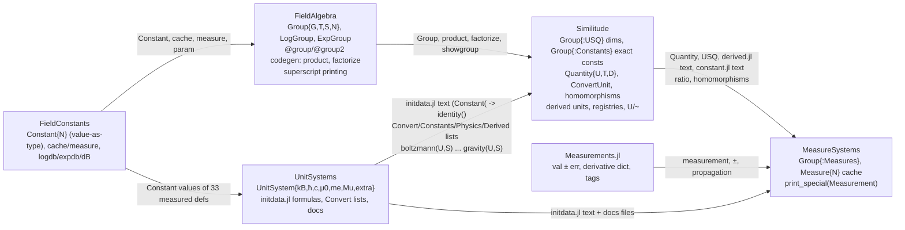

# Porting spec: FieldAlgebra.jl + Similitude.jl + MeasureSystems.jl → Lean 4

Scope: the three chakravala packages that sit *on top of* UnitSystems.jl and FieldConstants.jl and turn
plain `Float64` unit systems into (a) an exact symbolic multiplicative group of constants, (b) an
11‑dimensional dimension group (USQ) carried by a `Quantity` type, and (c) an uncertainty‑carrying
variant built on Measurements.jl.

All citations are `package/path:line` relative to `/Users/alokbeniwal/chakravala/`.
Everything marked **[oracle]** was executed against the registered packages in the Julia 1.13 env
(`scratchpad/juliaenv`) and is reproducible with the dumpers in
`scratchpad/notes/similitude_oracle/`.

---------------------------------------------------------------------------------------------------

## 0. Provenance, versions, artifacts

| package | master clone (HEAD) | registered in oracle env | delta that matters |
|---|---|---|---|
| FieldAlgebra.jl | 0.1.10, `41b5d66` (2026‑02‑04, "introduced Polynomial type") | 0.1.9 | master adds `src/polynomial.jl`; `define` accepts a single bare Symbol arg (`FieldAlgebra.jl:682-690`); default LaTeX unit glyph `\textbf{1}` (master) vs `\mathbb{1}` (registered) in `latexgroup_pre/latexgroup` (`FieldAlgebra.jl:257,260,285,293`) |
| Similitude.jl | 0.3.3, `244881d` (2025‑09‑24) | 0.3.2 | master: `normal(Unified)(d) = UnitSystem(d)` and `Unified(d) = d` (`Similitude.jl:163-164`), registered: `normal(Unified)(d) = d`; master `showgroup2` prints `D` directly, registered prints `UnitSystem(D)` for Unified (`dimension.jl:59-62`); master `latexquantity(::Quantity)` has a USQ branch (`Similitude.jl:318-322`); master adds `latexdimensions(D,::typeof(normal(Unified)))` (`Similitude.jl:356-360`); `usqlatex` wraps RK90/KJ90 in braces (`dimension.jl:157`) |
| MeasureSystems.jl | 0.2.2, `647c606` (2025‑09‑26) | 0.2.1 | only `println` messages and new (non‑included) `src/appendix.jl` |

Display outputs through `Unified` are *identical* between registered and master (verified by reading both
code paths), so registered‑env goldens are valid for the master semantics except `normal(Unified)(d)`.

Artifacts produced for the porter (all under
`/private/tmp/claude-502/-Users-alokbeniwal-Grassmann/c6cc2308-bfca-4b9a-ad33-d89b110132a8/scratchpad/notes/similitude_oracle/`):

* `dump_similitude.jl`, `dump_measuresystems.jl`, `dump_registry.jl` — oracle dumpers (run with
  `julia --startup-file=no --project=<juliaenv> <script> <outdir>`).
* `goldens/*.json` — 15 files, ~8 MB: `fieldalgebra_print`, `usq_group`, `constants_group`,
  `homomorphisms` (48 systems × 131 dims), `usq_to_constants_map`, `ratios` (13 362 conversions),
  `system_constants` (48 × 40), `derived_units`, `quotients`, `quantity_arith`, `unit_registry`,
  `measures_group`, `measurement_print`, `measure_system_constants`, `measure_ratios`.

Load times: Similitude ≈ 4 s, MeasureSystems ≈ 7 s (≈ 26 s on first precompile).

---------------------------------------------------------------------------------------------------

## 1. Purpose & scope

### 1.1 FieldAlgebra.jl — "abelian group → ring → field over a vector module"

README (`FieldAlgebra.jl/README.md:8-25`): a work‑in‑progress abelian `Group` implementation, extended to
`Ring` (sums of group elements) and `Field` (rational functions over rings). Its real consumers are
Similitude and MeasureSystems, which use only:

* `Group{G,T,S,N}` — a monomial `c · ∏ bᵢ^{vᵢ}` over a *named* basis `G` of size `N`, exponent eltype
  `T ∈ {Int, Rational{Int}, Float64}`, coefficient type `S`.
* `LogGroup{B,T}` / `ExpGroup{B,T}` — formal `log_B(g)` / `B^g`.
* the `@group`/`@group2`/`@ring` code generators (`define`, `FieldAlgebra.jl:681-745`) that, per named
  basis, emit `basistext`, `hasproduct`, the basis constants, and — when the basis has numeric values —
  a specialised `product(g)` (numeric evaluation) and `factorize(x)` (integer/τ factorisation).
* the superscript/LaTeX printing machinery (`printexpo`, `printdims`, `showgroup`, `latexpo`,
  `latexgroup`, `makeint`, `print_special`, `special_print`).

`Ring`, `Field`, `Composite`, `Polynomial` are experimental; nothing in Similitude/MeasureSystems uses
them (Ring only appears via `isring` checks in printing).

### 1.2 Similitude.jl — "Dimensions and Quantities for UnitSystems"

README `Similitude.jl/README.md:14-45`. Replaces UnitSystems' `Float64` constants by:

1. `Group{:Constants}`: a 44‑generator free abelian group of *exact* constants (33 physical measurement
   definitions + φ, γ, ℯ, τ + primes 2, 3, 5, 7, 11, 19, 43) with an optional scalar coefficient;
   evaluated to `Float64` only when displayed or mixed with floats (`dimension.jl:164-221`).
2. `Group{:USQ}`: the 11‑dimensional Unified System of Quantities dimension group with basis
   `F M L T Q Θ N J A R C` (force, mass, length, time, charge, temperature, molar amount, luminous flux,
   angle, rationalization, lorentz/"nonstandard") (`dimension.jl:144-156`).
3. `Quantity{U,T,D}`: value `v::T` (Int/Float/Rational/Group{:Constants}/…) with runtime dimension
   `d::D` (a `Group{:USQ}`) tagged with a unit system `U` at the type level (`dimension.jl:270-276`).
4. Unit systems become *group homomorphisms* `Group{:USQ} → Group{:USQ}` (each system collapses the
   dimensions it treats as dependent) (`derived.jl:27-99`, `dimension.jl:503-509`) plus a fixed linear
   isomorphism `UnitSystem(d)` from USQ exponents to exponents of the 11 fundamental constants
   (`dimension.jl:462-493`). Unit conversion factors are the exact group product
   `∏ₖ (constₖ(S)/constₖ(U))^{UnitSystem(d)ₖ}` (`Similitude.jl:70-89`).
5. `ConvertUnit{U,S,D}`: a first‑class conversion factor object (`dimension.jl:225-266`).
6. Re‑evaluates UnitSystems' `initdata.jl` (every unit system definition) inside Similitude with
   `Constant(` textually replaced by `identity(` so all constants become exact groups
   (`Similitude.jl:133-155`).
7. Defines ~200 named units (meter, foot, calorie, …) as Quantities (`derived.jl:161-420`), unit
   display names per system (`unitdim.jl`, `derived.jl:505-622`), equivalence classes `U/~`
   (`Similitude.jl:243-280`), and LaTeX table helpers (`Similitude.jl:282-362`).

### 1.3 MeasureSystems.jl — "Measurements.jl compatibility layer for UnitSystems.jl"

README `MeasureSystems.jl/README.md:14-20`. Same machinery as Similitude but the constants group is
`Group{:Measures}` whose 13 *measured* generators carry Measurements.jl uncertainties
(`MeasureSystems.jl:264-309`). Adds a `Measure{N}` singleton cache so a `Measurement` can live in a
type parameter (`MeasureSystems.jl:45-74`), measurement‑aware printing (`MeasureSystems.jl:76-189`),
and re‑evaluates UnitSystems' initdata + Similitude's `derived.jl` + UnitSystems' doc files in its own
module (`MeasureSystems.jl:395-422`).

### 1.4 Layering (wiring diagram)



---------------------------------------------------------------------------------------------------

## 2. Public API inventory

Export counts **[oracle]**: `names(FieldAlgebra)` = 19, `names(Similitude)` = 476 (mostly the
UnitSystems name lists re‑exported), `names(MeasureSystems)` = 680 (adds everything UnitSystems'
`initdata.jl`/`systems.jl` export when re‑included).

### 2.1 FieldAlgebra exports

`FieldAlgebra.jl:30-31, 655`, `ring.jl:15`, `field.jl:15`, `polynomial.jl:15`.

| name | kind | signature / semantics | file:line |
|---|---|---|---|
| `AbstractModule` | abstract type | `<: Number` root | `FieldAlgebra.jl:36` |
| `AbelianGroup` | abstract type | `<: AbstractModule` | `:38` |
| `Group{G,T,S,N}` | struct | fields `v::Values{N,T}` (exponents), `c::S` (coefficient). Inner ctors normalise (see §3.1) | `:44-59` |
| `Group{G,T}(v,c=1)`, `Group{G,T}(v::Values{N,T},c=1)`, `Group(v::Values{N,T},c=1)` (G:=N!), `Group(v,c,G)`, `Group(v,c,::Val{G})`, `Group(v::Values{N,<:Rational},c,::Val{G})` | ctors | the last one calls `promoteints` so integral rationals collapse to `Int` | `:61-70` |
| `LogGroup{B,T<:AbelianGroup}` | struct | field `v::T`; formal `log_B(v)`; `LogGroup(d)=LogGroup{ℯ}(d)` | `:476-482` |
| `ExpGroup{B,T<:AbelianGroup}` | struct | field `v::T`; formal `B^v`; `ExpGroup(d)=ExpGroup{ℯ}(d)` | `:527-532` |
| `value(g)` | fn | `g.v` for Group/LogGroup/ExpGroup/Ring/Field | `:75, 490, 537`, `ring.jl:56`, `field.jl:68` |
| `isonezero(x)` | fn | `isone(x) || iszero(x)` | `:83` |
| `islog(x)` | fn | `true` iff `LogGroup` | `:484-485` |
| `isexp` | **exported but never defined** | — | `:31` |
| `base(x)` | fn | `B` of Log/ExpGroup | `:487, 534` |
| `dimensions` | **exported but not defined in FieldAlgebra** (Similitude defines it) | — | `:31` |
| `@group G a b c …` / `@group G begin a = v … end` | macro | = `constgroup` = `define(:Constant, …)`: each basis name bound to `Constant(Group)` (FieldConstants value‑as‑type) | `:666-668, 678-679` |
| `@group2 G …` | macro | `define(:Group, …)`: basis names bound to plain `Group` values | `:669-671, 677` |
| `@constgroup` | macro | same as `@group` | `:672-674` |
| `@ring G x y z` | macro | `define(:Ring, …)`: basis names bound to 1‑term `Ring`s | `:663-665, 676` |
| `Ring{G,T,S,N,M}` | struct | `v::Values{M,Values{N,T}}` (M monomials), `c::Values{M,S}` | `ring.jl:19-34` |
| `Composite{G,F,T,S,N}` | struct | monomial over *arbitrary* factor objects `f::Values{N,F}` | `field.jl:17-21` |
| `Field{G,F,T,S,N,M}` | struct | sum of M monomials over factor list `f` | `field.jl:45-49` |
| `Polynomial{G,N,T}` | struct (master only) | dense coefficients `v::Values{N,T}` of `1, x, x², …` | `polynomial.jl:17-21` |
| `𝓍` | **exported but commented out** | — | `polynomial.jl:15, 23` |

Base methods extended (all in `FieldAlgebra.jl` unless noted):

| op | semantics | line |
|---|---|---|
| `==(a::Group,b::Group)` | `a.v == b.v && a.c == b.c` (numeric equality across eltypes) | `:78` |
| `==(g::Group,f::Float64)`, `==(f,g)` | `product(g) == f` | `:582-583` |
| `abs(g)` | same `v`, `abs(measure(c))` | `:80` |
| `signbit(g)` | `signbit(g.c)` | `:81` |
| `-(g)` | `Group(g.v,-g.c,Val(G))` | `:585` |
| `*(a,b)` same `G,N` (any `T,S`) | `Group(a.v+b.v, coefprod(coef a, coef b), Val(G))` | `:591` |
| `/(a,b)` same `G,N` | `Group(a.v-b.v, coefprod(coef a, inv(coef b)), Val(G))` | `:592` |
| `^(a::Group, b::Number/Integer/Rational)` | `Group(b*a.v, coef(a)^b, Val(G))` | `:593-595` |
| `^(::Constant{a}, b::Group)` | `Constant(a^b)` | `:596` |
| `sqrt(a::Group{G,T})` | `Group{G,T}(a.v/2, sqrt(coef))`; for `T=Int`: `Group{G,Rational{Int}}(a.v//2, …)` | `:597-598` |
| `cbrt` | analogous with `/3`, `//3` | `:599-600` |
| `inv(a)` | `Group{G,T}(-a.v, inv(coef))` | `:601` |
| `*(a::Real,b::Group{G})` | `times(factorize(a,Val(G)), b)` | `:605` |
| `*(a::Group{G},b::Real)` | `times(a, factorize(b,Val(G)))` | `:606` |
| `*(a::Constant,b::Group)` / `(a::Group,b::Constant)` | unwrap `param(a)` | `:607-608` |
| `/(a::Real,b::Group)` | `a*inv(b)` | `:609` |
| `/(a::Group{G},b::Real)` | `times(a, inv(factorize(b,Val(G))))` | `:610` |
| `/(Constant,Group)`, `/(Group,Constant)` | unwrap | `:611-612` |
| `times(a::Real,b::Group)` | `Group{G,T}(b.v, coefprod(a,coef(b)))` (same exponents, scaled coef) | `:615-616` |
| `one(g::AbelianGroup)` | `Group(zeros(Values{dimension(g),Int}),1,name(g))` | `:575` |
| `isone(x::Group)` | `iszero(norm(x.v)) && isone(x.c)` | `:576` |
| `isone(::AbelianGroup)` | `false` | `:577` |
| `zero(x::AbelianGroup)` | `log(one(x))` (a LogGroup!) | `:578` |
| `iszero(::AbelianGroup)` | `false`; `iszero(x::LogGroup) = isone(value(x))` | `:579-580` |
| `float(g::Group)` | `product(g)` | `:661` |
| `log(x)`, `log2`, `log10`, `log(b,x)` on AbelianGroup | `LogGroup{ℯ/2/10/b}(x)` | `:506-510` |
| `exp(x::LogGroup{ℯ})=value(x)`, `exp2(LogGroup{2})`, `exp10(LogGroup{10})`; `exp(LogGroup{B}) = value(x)^inv(log(B))` | inverses | `:511-514` |
| `exp2(x::LogGroup)=exp2(x)`, `exp10(x::LogGroup)=exp10(x)` | **infinite recursion** for non‑matching bases | `:515-516` |
| `^(b::Number, x::LogGroup)` | `exp(x*log(b))` | `:517` |
| `+(LogGroup{B},LogGroup{B})` | `LogGroup{B}(x.v*y.v)` | `:519` |
| `-(LogGroup{B},LogGroup{B})` | `LogGroup{B}(x.v/y.v)` | `:520` |
| `/(x::LogGroup{B}, y::Number)` | `LogGroup{B^y}(x.v)` (i.e. `log_B(v)/y = log_{B^y}(v)`) | `:521` |
| `*(x::LogGroup, y::Number)`, `*(y, x)` | `x/inv(y)` | `:522-523` |
| `exp(x::AbelianGroup)`, `exp2`, `exp10`, `^(b::Number, x::AbelianGroup)` | `ExpGroup{ℯ/2/10/b}(x)` | `:551-554` |
| `log(ExpGroup{ℯ})=value`, `log2(ExpGroup{2})`, `log10(ExpGroup{10})`, `log(b,ExpGroup{B}) = value(x)/log(B,b)` | inverses | `:555-561` |
| `^(x::ExpGroup, y::Number)` | `iszero(y) ? one(x) : x` — **wrong math** (drops y) and `one(ExpGroup)` throws (no `name`) | `:563-564` |
| `^(x::ExpGroup, y::ExpGroup)` | `ExpGroup{x}(y)` | `:565` |
| `*(ExpGroup{B},ExpGroup{B})` / `/` | `ExpGroup{B}(x.v ± y.v)` (uses group `+`!) | `:566-567` |
| `*(ExpGroup{X},ExpGroup{Y})` | `ExpGroup{X*Y}(x.v+y.v)` (mathematically wrong; faithful) | `:569` |
| `logdb(x::AbelianGroup)` | `log(exp10(0.1), x)` i.e. `LogGroup{1.2589254117941673}` | `:573` |
| `show(io, ::Group)` | `showgroup(io,x)` | `:449` |
| `show(io, ::LogGroup/ExpGroup)` | `showgroup(io,x)` (prefix via `showfun`) | `:492, 539` |

Internal but load‑bearing (import list of Similitude, `Similitude.jl:31-36`): `coef` (`:76`),
`coefprod` (`:587-590`), `name`, `valname`, `dimension` (`:72-74`), `checkint(s)`, `promoteint(s)`
(`:84-95`), `makeint` (`:100-116`), `findpower` (`:118-119`), `expos`, `chars` (`:97-98`),
`printexpo` (`:304-389`), `printdims` (`:391-412`), `printnum` (`:414-417`), `print_special`
(`:419-429`), `special_print` (`:234-243`), `showgroup_pre2/showgroup_pre/showgroup` (`:431-472`),
`latexpo/latexdims/latexgroup_pre/latexgroup/latext/showlatex` (`:121-301`), `showfun` (`:494-498,
541-544`), `product` (`:500-504, 546-549, 657` + generated), `hasproduct` (`:658-659` + generated),
`factorize` (`:660` + generated), `factorfind` (`:747`), `valueat` (`:603-604`), `times` (`:614-616`),
`basistext` (`:620` + generated), `letters` (`:33-34`), `define` (`:681-745`).

Ring API (`ring.jl`): `Ring(g::Group)` (`:40`); ctors (`:42-46`); `name/valname/dimension/value/coef/length`
(`:53-58`); `signbit=false` (`:60`); `==` (`:62`); `zero/one` (type and instance) (`:64-67`); evaluation
`(f::Ring)(v::Values{N})=sum_i prod(v.^f.v[i])` — **ignores coefficients** (`:69-70`); `inv` for 1‑term
and 0‑term (`Inf`) (`:72-73`); scalar `* / + -` via `factorize`/`times` (`:74-85`); `-f` (`:87`);
`Group+Group → Ring` (`:89-102`); `Ring1±Ring1` (`:103-116`); `add/add2` merge‑one‑term (`:120-166`);
`Ring+Ring` (`:168-203`); `Ring1*Ring1`, `Ring*Group`, `Group*Ring`, `Ring/Group`, `Ring*Ring`
(distributive, via repeated `+`) (`:205-228`); `show` (`:230-240`).

Field API (`field.jl`): `Composite` (`:17-43`), `Field` ctors incl. `Field(::Composite)`,
`Field(::Ring)` (`:51-58`); `zero/one` (`:76-82`); `inv(::Field1)` negates exponents; `inv(::Field)` and
`inv(::Ring)` wrap into a 1‑factor Field with exponent −1 (`:87-90`); scalar ops (`:91-102`); `+,-`
between Composite/Field with factor‑list merging (`pad`, `stuff`, `combine` block, `ad`, `ad2`)
(`:106-362`); Ring/Field interop (`:364-372`); `show` (`:374-384`); `Ring==Field = false` (`:386-387`).

Polynomial API (master, `polynomial.jl:17-46`): `Polynomial{G}(v)`, widening ctor
`Polynomial{G,N,T}(p::Polynomial{G,M,T})` (zero‑pad), `promote_type`, `+`/`-` with promotion,
`*` **implemented as coefficient‑wise addition (bug)**, `show` prints nonzero terms as
`Group{G,Int,T,1}(Values(i-1), p.v[i])`.

### 2.2 Similitude exports

Explicit export statements: `Similitude.jl:66-68` (every name in UnitSystems `Systems, Dimensionless,
Constants, Physics, Derived, Convert` except `length,time,angle`), `:90` (`Ratio, dimensions`),
`:161` (`Unified`), `:248` (`quotient`), `:421` (`USQ`, only under `ENV["UNITDOCS"]`),
`dimension.jl:452` (`Quantity, Quantities`), `constant.jl:42` (`factorize`), `derived.jl:15-21`
(`AbelianGroup, Dimension, 𝟙, normal, UnitSystems, Quantity, Group, LogGroup, ExpGroup, universe,
Universe, unitname, logdb, expdb, dB`, and each of `F M L T Q Θ N J A R C`), `derived.jl:101`
(`@unitdim, @unitgroup`). The `initdata.jl` re‑evaluation also exports `MetricSystem,
ConventionalSystem, RankineSystem, AstronomicalSystem, ElectricSystem, GaussSystem, EntropySystem,
SI, MKS, ME, GM, CGS, CGS2019, CGSm, CGSe, HLU, FFF, AE, EE, BG, EnglishEngineering,
BritishGravitational, AbsoluteEnglish, EnglishUS, EE2019, IAU` (`UnitSystems.jl/src/initdata.jl:45-46,
159-160`).

Similitude non‑list exports **[oracle]**: `@unitdim @unitgroup A AE AbelianGroup AbsoluteEnglish
AstronomicalSystem BG BritishGravitational C CGS CGS2019 CGSe CGSm ConventionalSystem Dimension EE
EE2019 ElectricSystem EnglishEngineering EnglishUS EntropySystem ExpGroup F GM GaussSystem Group HLU
IAU J L LogGroup M ME MKS MetricSystem N Q Quantities Quantity R RankineSystem Ratio SI Similitude T
Unified UnitSystems Universe dB dimensions expdb factorize logdb normal quotient unitname universe Θ 𝟙`.

#### 2.2.1 Types

| type | fields / params | semantics | file:line |
|---|---|---|---|
| `Group{:USQ,T,S,11}` | from FieldAlgebra | dimension; basis chars `F M L T Q Θ N J A R C` | `dimension.jl:144-156` |
| `Group{:Constants,T,S,44}` | from FieldAlgebra | exact constant; basis strings `basis` | `dimension.jl:164-221` |
| `ConvertUnit{U,S,D} <: AbstractModule` | `v::D`; `U,S` normalised unit systems | conversion factor for dimension `v` from `U` to `S` | `dimension.jl:225-228` |
| `Quantity{U,T,D} <: AbstractModule` | `v::T`, `d::D`; `U = normal(U)` | value with dimension in unit system `U` | `dimension.jl:270-276` |
| `Quantities{U,N,T,D} <: TupleVector{N,T}` | `v::Values{N,T}`, `d::D` | vector of values sharing a dimension (**largely broken**, see §8.6) | `dimension.jl:437-455` |
| `UnitSystem{kB,ħ,𝘤,μ₀,mₑ,Mᵤ,extra}` (from UnitSystems) | type params are `Quantity` objects in Similitude (so `isquantity(U)` is true) | see §3.4 | `UnitSystems.jl/src/UnitSystems.jl:145-150` |

#### 2.2.2 Constants and constructors

| name | value | file:line |
|---|---|---|
| `F M L T Q Θ N J A R C` | USQ basis elements `valueat(i,11,:USQ)`, `i=1..11` | `dimension.jl:144` (via `@group`→`group2`, `Similitude.jl:40-42`) |
| `dimensionless`, `𝟙` | `valueat(0,11,:USQ)` (all zeros, c=1) | `dimension.jl:149-154` |
| `USQ`, `usq` | `Values(F,M,L,T,Q,Θ,N,J,A,R,C)` | `dimension.jl:155-156` |
| `isq` | `Values('F','M','L','T','Q','Θ','N','J','A','R','C')`; `dims = 11` | `dimension.jl:146-147` |
| Constants basis names `kB NA 𝘩 𝘤 𝘦 Kcd ΔνCs R∞ α μₑᵤ μₚᵤ ΩΛ H0 g₀ aⱼ au ft ftUS lb T₀ atm inHg RK90 KJ90 RK KJ Rᵤ2014 Ωᵢₜ Vᵢₜ kG mP GME GMJ φ γ ℯ τ` | bound by `@group2 Constants` to `Group(valueat(i,44,:Constants))`; note the prime generators are *not* bound (their names `2,3,…` are numbers) | `dimension.jl:164-209` |
| `basis` | `Values("kB","NA","𝘩","𝘤","𝘦","Kcd","ΔνCs","R∞","α","μₑᵤ","μₚᵤ","ΩΛ","H0","g₀","aⱼ","au","ft","ftUS","lb","T₀","atm","inHg","RK90","KJ90","RK","KJ","Rᵤ2014","Ωᵢₜ","Vᵢₜ","kG","mP","GME","GMJ","φ","γ","ℯ","τ","2","3","5","7","11","19","43")`; `vals = 44` | `dimension.jl:220-221` |
| `usqlatex` | LaTeX names of the 44 generators (note index 3 is `\hbar` although generator 3 is Planck `𝘩`, **label bug**) | `dimension.jl:157` |
| `phys(j,k=vals)` | `valueat(j,k,:Constants)` (`j=0` → identity) | `dimension.jl:214-218` |
| `golden=phys(34)`, `eulergamma=phys(35)`, `tau=phys(37)`, `𝟏=phys(0)`, `two..fourtythree=phys(38..44)`, `𝟐,𝟑,𝟓,𝟕,𝟏𝟏,𝟏𝟗,𝟒𝟑` aliases | exact constants | `constant.jl:44-55` |
| `zetta,zepto,yotta,yocto` | `(𝟐*𝟓)^±21`, `(𝟐*𝟓)^±24` | `constant.jl:56` |
| `αinv = inv(α)`, `RK1990,KJ1990 = RK90,KJ90`, `RK2014,KJ2014 = RK,KJ` | aliases | `constant.jl:57-59` |
| `LD, JD` | `Constant(384399)*(𝟐*𝟓)^3`, `Constant(778479)*(𝟐*𝟓)^6` → **[oracle]** `2³3³5³⋅14237`, `2⁶3⋅5⁶⋅259493` | `Similitude.jl:128` |
| `μE☾` | `Constant(UnitSystems.μE☾)` = `FieldConstants.Constant{81.300568}` (not a group) | `Similitude.jl:129` |
| all of `initdata.jl` (`deka,hecto,kilo,…,kibi,…,fur,°R,K,HOUR,k,mₑ,μ₀,ħ,μₚₑ,μₑₚ,Rᵤ,αL,αG,Mᵤ,pc,G,DAY,nm,GM☉,th,ΛC,lc,mc,ρΛ,𝘦ₙ,ς,lcq,mcq,𝘦ᵣ,tcq,em,mi, Universe`, 48 unit systems, `unitsystem`, `constant`, `MetricSystem`, `ConventionalSystem`, `RankineSystem`, `sackurtetrode`, `derived`, `constants`) | exact groups (textual `Constant(`→`identity(`) | `Similitude.jl:150-155` over `UnitSystems.jl/src/initdata.jl:15-171` |
| `Unified` | `Quantity(UnitSystem(F*L/Θ, F*L*T/A, L/T, F*T*T*C*C/(Q*Q)/R, M, M/N, J*T/F/L, A, R, inv(C), M*L/(F*T*T), Universe, τ, 𝟐,𝟑,𝟓,𝟕,𝟏𝟏,𝟏𝟗,𝟒𝟑))` — the tautological system whose constants are their own dimensions | `Similitude.jl:157` |
| every `Convert` name except `dimensionless,length,time,angle,molarmass,luminousefficacy` | `const unit = dimensions(UnitSystems.unit(UnitSystems.Natural, Natural))` — a `Group{:USQ}` (the dimension, derived by evaluating the UnitSystems conversion formula with Similitude's Quantity‑valued `Natural`) — full table in §3.3 | `Similitude.jl:166-170` |
| `gravityforce` | `acceleration/specificforce` | `Similitude.jl:171` |
| derived units (`meter`, `foot`, …) | Quantities, see §4.9 | `derived.jl:161-420` |
| `calₜₕ,cal₄,cal₁₀,cal₂₀,calₘ,calᵢₜ` and `k`‑prefixed | `SI(UnitSystems.cal…, energy)` (plain Float values) | `derived.jl:416-420` |

#### 2.2.3 Functions

| name | signature | semantics | file:line |
|---|---|---|---|
| `Quantity{U}(v,d)`, `Quantity(U,v,d)`, `Quantity(v,d,U)`, `Quantity(d,U,v)` (deprecated) | ctors | `U` normalised | `dimension.jl:278-290` |
| `(U::UnitSystem)(v::Number, d::Constant/AbelianGroup)` | `Quantity{U}(v,d)` | the idiomatic `Metric(1,energy)` | `dimension.jl:503-504` |
| `(U::UnitSystem)(d::Group)` | the homomorphism image; default `normal(u)≠u ? normal(u)(d) : normal(Metric)(d)` (**any system without a dedicated method uses Metric's**) | `dimension.jl:507`, specialisations `derived.jl:27-99, 128-148`, `Similitude.jl:163-164, 208` |
| `(U::UnitSystem)(d::LogGroup{B}/ExpGroup{B})` | map inside | `dimension.jl:508-509` |
| `(U::UnitSystem)(::Constant{D})` | `Constant{normal(u)(D)}()` | `dimension.jl:505` |
| `(s::UnitSystem)(q::Quantity{U})`, `(q::Quantity{U})(s::UnitSystem)` | `Quantity{S}(q.v*ratio(D,U,S), D)` — conversion | `Similitude.jl:95-102` |
| `(u::UnitSystem)(c::ConvertUnit{U,S})`, `Quantity(c::ConvertUnit{U,S})` | `Quantity{u or S}(ratio(D,U,S), D)` | `dimension.jl:495-502` |
| `(D::Group{:USQ})(U,S)`, `(D::Constant)(U,S)` | `ConvertUnit{U,S}(D)` | `dimension.jl:247, 250` |
| `(D::Group{:USQ})(U)`, `(D::Constant)(U)` | `U(ratio(D,Natural,U), D)` — the *natural unit* of D expressed in U | `dimension.jl:248, 251` |
| `(D::Group{:USQ})(v::Real,U,S=Metric)` | `v/ratio(D,U,S)` (converts a number **from S to U**) | `dimension.jl:249, 252` |
| `ratio(D,U,S)` (alias `Ratio`) | `ratio_calc(UnitSystem(D), normal(U), normal(S))` | `Similitude.jl:74-75, 91` |
| `ratio_calc(D::Group,U,S)` | `∏_{k=1}^{11} constₖ(U,S)^{D.v[k]}` with `constₖ ∈ (boltzmann, planckreduced, lightspeed, permeability, electronmass, molarmass, luminousefficacy, angle, rationalization, lorentz, gravity)` and `constₖ(U,S) = unit(constₖ(S)/constₖ(U))` (UnitSystems), `unit` = identity on groups (`Similitude.jl:59-64`) | `Similitude.jl:76-89` |
| `ratio_calc(D::LogGroup{B})`, `ExpGroup{B}` | `log(B, ratio)` / `B^ratio` | `Similitude.jl:70-73` |
| `UnitSystem(d::Group{:USQ})` | linear map USQ → constant exponents (§3.5) | `dimension.jl:466-493` |
| `UnitSystem(::Constant{D})`, `UnitSystem(::LogGroup/ExpGroup)` | lifted | `dimension.jl:463-465` |
| `Quantity(u::UnitSystem)` | wraps the 11 constants of `u` as Quantities with their USQ dims and rebuilds the system (§3.4) | `Similitude.jl:104-126` |
| `normal(x::Quantity)` | `x.v` | `Similitude.jl:94` |
| `quantity(q)` | `q.v` (identity for non‑Quantity) | `dimension.jl:299-302` |
| `dimensions(q::Quantity)`, `Dimension(q)` | `q.d` (`Dimension(x)=x` otherwise) | `dimension.jl:303-305` |
| `dimensions(c::ConvertUnit)` | `c.v` | `dimension.jl:230` |
| `unitsystem(::Quantity{U})` | `dimension(U)` | `dimension.jl:306` |
| `convertdim(d::Group{:USQ},U,S)` | `Constant{Group{:USQ,T}(dimconvert.(d.v, usq, U, S))}`: zero out every exponent whose *base* dimension has unit ratio `isone(ratio(base,U,S))` | `dimension.jl:231-234` |
| `constant(x)` | `𝟏*N` for numbers, identity for Constant/AbelianGroup, `φ→φ`, `π→τ/𝟐`, `exp→ℯ`, `γ→phys(35)`, `ℯ→phys(36)`, `Float64 → factorize(N)`, `Int → factorize(N,τ,Val)` (**MethodError: 3‑arg factorize does not exist**) | `constant.jl:20-37` |
| `factorize(x, Val(:Constants))` | generated, see §4.4 | `FieldAlgebra.jl:717-734` |
| `evaldim(unit)` | `angle→A`, `length→L`, `time→T`, `molarmass→dims`, `solidangle→A²`, `loschmidt→L⁻³`, `Group→Group`, `Symbol→evaldim(eval(sym))`, `(unit,U)→normal(U)(evaldim(unit))`; `Function → evaldim(Constant(f))` (**infinite recursion** for other functions) | `derived.jl:424-437` |
| `quotient(U)`, `U/~` | equivalence classes of `Convert` dims with equal image under U (§4.8) | `Similitude.jl:246-268` |
| `printquotient(U)`, `latexquotient(U)`, `latexquantity(q)`, `latexdimensions(D,U)` | text/LaTeX tables | `Similitude.jl:270-362` |
| `naturalunits(U)` | `[x=>x(U) for x in USQ]` | `dimension.jl:159` |
| `morphism(U)` | 11×11 matrix of `param.(U.(usq))` — **broken when CONSTDIM=false** (`param(::Group)` MethodError) | `dimension.jl:160` |
| `addgroup(D,U,str)`, `addlatex(D,U,str)`, `unitdim(D,U,S,L)` | register display strings keyed by `unitname(U)` and exact image `D`; duplicate → `error("duplicate unit registered …")` | `dimension.jl:36-50, 66-80`, `unitdim.jl:15-18` |
| `@unitdim D U "S" "L"` | `unitdim(U(D), normal(U), S, L)` | `unitdim.jl:38-44` |
| `@unitdim U F M L T Q Θ N J="lm" A="rad" latex=true` | sets `dimtext(normal(U))` (11 strings, last two `""`) and optionally `dimlatex` (`\text{…}`) | `derived.jl:520-531` |
| `@unitdim U S` | copy `dimtext/dimlatex` from S | `derived.jl:599-604` |
| `@unitex U …` | set `dimlatex` explicitly | `derived.jl:561-563` |
| `@unitgroup U S` | `(u::typeof(normal(U)))(d::Group) = normal(S)(d)` | `derived.jl:108-110` |
| `dimtext(u)` default `isq`; `dimlatex(U)` default `\text{F}…\text{C}` | per‑system names | `Similitude.jl:50, 202` |
| `dimlist(U)`, `isodim`, `unitdim(U,D)`, `dimlistlatex`, `isodimlatex`, `convertext`, `unitext`, `systext`, `unitsym`, `unitdict` | doc helpers | `derived.jl:442-501` |
| `neper(U)`, `bel(U)`, `decibel(U)` | `U(𝟏, log(𝟙))`, `U(𝟏, log10(𝟙))`, `U(𝟏, dB(𝟙))` | `derived.jl:390-392` |
| `loschmidt(U,P=atmosphere(U),T=SI2019(T₀,Θ)(U))` | `U(P,pressure)/U(T,Θ)/boltzmann(U)` | `derived.jl:172` |
| `mechanicalheat(U)` | `molargas(U)*U(normal(calorie(Metric)/molargas(Metric)),Θ*N)` | `derived.jl:177` |
| `coupling, finestructure, electronunit, protonunit, protonelectron, darkenergydensity` on `Coupling`/`UnitSystem` | forwarded to UnitSystems on `universe(U)` | `derived.jl:152-155` |
| all UnitSystems `Constants`/`Physics` names | `const u = UnitSystems.u(SI)` except `permeability, gaussgravitation` — **but** these are functions in UnitSystems, so the const is `UnitSystems.u(SI)` evaluated → a Quantity in SI2019 | `derived.jl:157-159` |
| `logdb(x::Quantity{U})` | `Quantity{U}(logdb(x.v), logdb(dims))` | `Similitude.jl:57` |
| `Base.:/(U::UnitSystem, ::typeof(~))` | `quotient(U)` | `Similitude.jl:246` |
| `angle/length/time` arithmetic | every arithmetic op on these *functions* is redirected to `evaldim` (`A`,`L`,`T`) | `Similitude.jl:210-241` |

#### 2.2.4 Operators on Quantity / Group{:USQ} / Group{:Constants} / ConvertUnit

| op | semantics | file:line |
|---|---|---|
| `+(a::Group{:USQ}, b)` | if `a.v==b.v && a.c==b.c` return `a` else `error("addition of Group $a + $b is not valid")` | `dimension.jl:98-106` |
| `-(a::Group{:USQ}, b)` | `a+b` (**returns a, not zero**) | `dimension.jl:107-110` |
| `+(a::Group{:Constants},b)` | same `v`: same `c` → `𝟐*a`, else `Group(v, a.c+b.c)`; different `v` → `product(a)+product(b)` (Float) | `dimension.jl:112-120` |
| `-(a::Group{:Constants},b)` | same `v`: same `c` → `0` (Int), else `Group(v,a.c-b.c)`; else Float difference | `dimension.jl:121-129` |
| `±` with `Real`/`Constant` | Float via `product` | `dimension.jl:130-137` |
| `Group{:Constants} * Group{:USQ}` (either order) | `Group(usq.v, consts*usq.c, Val(:USQ))` — USQ group whose *coefficient* is a constants group | `dimension.jl:139-142` |
| `show(io, ::Group{:Constants})` | `showgroup(io,x,basis,'𝟏')` | `dimension.jl:211` |
| `show(io, ::ConvertUnit{U,S})` | `print(ratio(D,U,S), " [")`, `showgroup(S(d),S)`, `"]/["`, `showgroup(U(d),U)`, `"] "`, `unitname(U)`, `" -> "`, `unitname(S)` with `d = convertdim(D,U,S)` | `dimension.jl:236-243` |
| `inv(::ConvertUnit)` | references undefined `c` → **UndefVarError** | `dimension.jl:245` |
| `log/log2/log10/log(b,·)/exp/exp2/exp10/(a::Number)^` on ConvertUnit | map the dimension | `dimension.jl:255-262` |
| `ConvertUnit^Integer/Rational` | `Quantity{U,S}(…)` → **MethodError** | `dimension.jl:263-264` |
| `ConvertUnit * / ConvertUnit` (same U,S) | multiply/divide dimensions | `dimension.jl:265-266` |
| `show(io, ::Quantity{U})` | `print(io, x.v, " [")`, `showgroup(io, normal(U)(dims), U)`, `print(io, "] ", unitname(U))` | `dimension.jl:309-313` |
| `log…exp10(Quantity)` | apply to value and dimension | `dimension.jl:315-321` |
| `^(a::Number/Constant, b::Quantity)` | `Quantity{U}(a^b.v, a^dims)` | `dimension.jl:323-324` |
| `^(a::Quantity, b::Number/Integer/Rational{Int})` | `Quantity{U}(a.v^b, dims^b)` | `dimension.jl:325-327` |
| `Number ± Quantity`, `Quantity ± Number` | intended: allowed iff `U(D)==𝟙`; **all four reference undefined `D` → UndefVarError** | `dimension.jl:328-331` |
| `Real/Complex * Quantity`, `Quantity * Real/Complex` | scale value | `dimension.jl:332-335` |
| `Quantity{U} * Quantity{U}` | `Quantity{U}(a.v*b.v, da*db)` | `dimension.jl:336` |
| `Quantity{U} / Quantity{U}` | `Quantity{U}(a.v/b.v, da/db)` | `dimension.jl:338` |
| `Quantity{A} / Quantity{B}` | `ConvertUnit{A,B}((a.v/b.v)*dims(a))` — the numeric factor becomes the *coefficient of the dimension group* and is **ignored** by `show` and `Quantity(c)` (ratio only uses `UnitSystem(D)` which rebuilds with c=1) **[oracle]**: `Metric(2,L)/English(1,L)` → `ft⁻¹ = 3.280839895013123 [ft]/[m] Metric -> English` | `dimension.jl:339` |
| `Number/Quantity`, `Quantity/Number`, `/` with Constant | via `inv` | `dimension.jl:340-343` |
| `-q`, `inv`, `sqrt`, `cbrt` | on value and dims | `dimension.jl:345-348` |
| `Quantity{U} * ConvertUnit{U,U}` | identity if dims match or ConvertUnit dims 𝟙 else error | `dimension.jl:352-353` |
| `ConvertUnit{S,U} * Quantity{U}` | if `A==D && S==U` return b; if `inv(A)==D` use reversed ConvertUnit | `dimension.jl:354-361` |
| `ConvertUnit{U,S} * Quantity{U}` / `Quantity{U} * ConvertUnit{U,S}` | if dims equal → `Quantity{S}(ratio(D,U,S)*v, D)`; else error message references undefined `B` | `dimension.jl:362-369` |
| `Constant ± Quantity` | allowed iff `U(D)==𝟙` (the `-(Constant,Quantity)` branch builds `Quantity{D,U}` — **bug**) | `dimension.jl:370-385` |
| `Constant/Group * Quantity` (either order) | scale value | `dimension.jl:386-389` |
| `==(Quantity{U},Quantity{U})` | `U(da)==U(db) && a.v==b.v` (**compares images**, so `Metric(1,action)==Metric(1,angularmomentum)` is `true`) | `dimension.jl:393` |
| `==(Number,Quantity)` / reverse | first 10 exponents zero and `a == b.v*10^last(value(D))` (legacy: slot 11 `C` treated as a log10 scale) | `dimension.jl:394-401` |
| `Quantity{U} + Quantity{U}` | `Quantity{U}(a.v+b.v, A≠B ? add(A,B,U) : A)`; `add` only has `Constant` methods → **MethodError whenever A≠B** in the shipped CONSTDIM=false mode | `dimension.jl:422-425, 405-417` |
| `Quantity{U} - Quantity{U}` | analogous with `sub` | `dimension.jl:426-429, 418-421` |
| `Quantity{A} ± Quantity{B}`, `==` across systems | method ambiguity errors | — |
| `isone(::Quantity)` | `false` | `dimension.jl:433` |
| `convert(Float64/T, ::Quantity)` | value | `dimension.jl:292-294` |

Intended (CONSTDIM=true) `add` semantics, `dimension.jl:405-417`: `sumabs(D)=Σ|D.v|`; `add(D,D,U) = islog(D)
? d+d : d`; for `A≠B`: if `U(A)==U(B)` return the operand with smaller `sumabs` (ties → `b` if
`U(b)==b` else `a`); if both log → `a+b`; else `error("$(Ua) ≠ $(Ub)")`. `sub(D,D,U) = islog(D) ? 𝟙 : d`;
`sub(A,B,U)`: logs → `a-b` else `add(a,b)` (missing `U`, would MethodError).

### 2.3 MeasureSystems exports

`MeasureSystems.jl:24` (`UnitSystems, Measure, measure, cache, Constant, dimensions`),
`:230-232` (all UnitSystems lists except `length,time`), `:237` (`Similitude, 𝟙, Unified, quotient`),
`:405` (`au, day, SI, Quantity, Quantities`), plus everything re‑exported by the included UnitSystems
files (`initdata.jl`, `kinematicdocs.jl`, …, `systems.jl:22` etc.). Extra exports vs Similitude
**[oracle]**: `Measure MeasureSystems measure cache Constant` and ~200 constant aliases
(`BTUJ … 𝟕`, see §0 dump).

| name | semantics | file:line |
|---|---|---|
| `Measure{N} <: Real` | singleton; `measure(::Measure{N}) = measure_cache[N]` | `:45-47` |
| `measure_cache::Vector{Measurement{Float64}}` | global interning table | `:46` |
| `cache(M::Measurement{Float64})` | find (==) or push, return `Measure{N}()` | `:48-55` |
| `show(io, ::Measure)` | `show(io, measure(M))` | `:56` |
| `one(::Measure)=𝟏`, `zero=𝟏-𝟏` (=Int 0), `isone=false`, `iszero=false` | | `:57-60` |
| `FieldConstants.Constant(N::Measurement)` | `Constant{cache(N)}()` | `:61` |
| `inv(M)` | `cache(inv(measure(M)))` | `:62` |
| `sqrt(M)` | `cache(inv(measure(M)))` — **bug: inverse, not sqrt** | `:63` |
| `*,/` with Number | `cache(a op measure(b))` | `:65-68` |
| `+(Number,Measure)` | `cache(a+measure(b))` | `:69` |
| `+(Measure,Number)`, `+(Measure,Measurement)` | `cache(measure(a)-b)` — **bug: subtracts** | `:70, 72` |
| `+(Measurement,Measure)` | `cache(a+measure(b))` | `:71` |
| `-` with Number | correct | `:73-74` |
| `round_extra(x)` | pick the shortest string among `prevfloat(x), x, nextfloat(x)` (strictly shorter than both others) | `:76-87` |
| `showgroup(io, ::Group{:Measures}, u, c)` | like FieldAlgebra showgroup but uses `print_special` for coefficient and **always** prints `" = " * print_special(product(x))` | `:89-114` |
| `special_print(io, ::Measurement, error_digits=2)` | LaTeX concise form `v(ee) \times 10^{e}` | `:117-152` |
| `print_special(io, ::Measurement, error_digits=2)` | unicode concise form `v(ee) × 10ᵉ` | `:153-189` |
| `Quantity{U} */± Measure` | wrap result in `cache(...)` (the `+(Measure,Quantity)` uses `-`, **bug**) | `:253-260` |
| `FieldAlgebra.makeint(::Measurement) = x`, `FieldAlgebra.promoteint(::Measure) = x` | prevent collapsing | `:261-262` |
| `FieldAlgebra.latext(::Group{:Measures}) = usqlatex` | | `:263` |
| `@group2 Measures begin … end` | 44‑generator basis, 13 with `≈ measurement(...)` values (§3.6) | `:264-309` |
| `show(io, ::Group{:Measures})` | `showgroup(io,x,basis,'𝟏')` | `:310` |
| `phys(j,k=vals)` | `valueat(j,k,:Measures)` | `:311-315` |
| re‑include Similitude `constant.jl` | defines `golden…fourtythree, 𝟐…, zetta…, αinv, RK1990…` as Measures groups | `:316-317` |
| `Measure * / Group` | `times(factorize(a,Val(G)),b)` (factorize of a Measure = identity → coefficient) | `:318-321` |
| `Measure ± Group{:Measures}` | Float/Measurement via `product` | `:322-323` |
| `Group{:Measures} * / Group{:USQ}` | USQ group with Measures coefficient | `:324-327` |
| `Group{:Measures} ± anything` | always `product(a) ± product(b)` (Measurement) — no exact addition | `:328-337` |
| `Group{:Constants} * / Group{:Measures}` | result is a `:Measures` group (exponent vectors add; `/` **does not invert** the right coefficient: `coefprod(coef(a),coef(b))`) | `:338-341` |
| `Measurement */± Constant{D}` | unwrap `D` | `:346-353` |
| `LD, JD, μE☾` | `384399*(𝟐*𝟓)^3`, `778479*(𝟐*𝟓)^6`, `measurement("81.300568(3)")` | `:387-393` |
| `δμ₀` | `μ₀ - 4π*1e-7` → **[oracle]** `6.9e-16 ± 1.9e-16` | `:404` |
| Convert dims | `const unit = Similitude.unit` | `:407-412` |
| appendix.jl (not included by the module) | docs/TeX table generators: `StandardUnits`, `latexunits`, `printmarkdown`, `printtex`, `convertmarkdown`, `constantmarkdown`, `eqns` dictionary of LaTeX formulas | `appendix.jl:19-717` |

Dead code (never executes because `usingSimilitude = true` and `CONSTDIM = CONSTVAL = false`,
`MeasureSystems.jl:27-34`): `:193-229`, `:354-385`, `:397-398`, `:423-442`, `:446-466`. Do not port.

---------------------------------------------------------------------------------------------------

## 3. Data representations

### 3.1 `Group{G,T,S,N}` (FieldAlgebra.jl:44-70)

* `G` — the basis *name* (a `Symbol` like `:USQ`, `:Constants`, `:Measures`, `:xyz`) or an integer when
  constructed anonymously (`Group(v::Values{N,T},c)` sets `G=N`, `:63`). Compile time. All behaviour
  (display names, numeric values, factorisation) is dispatched on `G`.
* `N` — basis size (11 for USQ, 44 for Constants/Measures). Compile time.
* `T` — exponent eltype: `Int`, `Rational{Int}`, `Float64` (Complex allowed by printing). Compile time.
* `S` — coefficient type after normalisation: `Int`, `Float64`, `Rational{Int}`, `Complex`, another
  `Group` (e.g. Constants inside USQ), `Measure{N}`, `Constant{…}`. Compile time.
* `v::Values{N,T}` — the exponent vector, **index i ↔ i‑th basis element in declaration order**.
* `c::S` — scalar coefficient. The represented value is `c · ∏ᵢ bᵢ^{vᵢ}`.

Normalisation in the inner constructors (`:47-58`):

```
promoteint(v::Integer)   = v
promoteint(v::Group)     = iszero(prod(v.v)) && !isone(v.c) ? promoteint(v.c) : v     # :90  BUG: prod, not norm
promoteint(v::Constant)  = isone(v) ? 1 : v                                           # :93
promoteint(v)            = checkint(v) ? Int(v) : v                                   # :92
checkint(v::Integer)     = v            # (never reached for Integer; promoteint(Integer) wins)
checkint(v::Rational)    = isone(denominator(v))
checkint(v)              = isone(v) || iszero(v)    # Float: ONLY 0.0 and 1.0 become Int   # :86
promoteints(v::Values{N,<:Integer}) = v
promoteints(v)           = checkints(v) ? Int.(v) : v
checkints(v::Values{N,<:Rational}) = all denominators == 1
checkints(v::Values{N})  = all entries ∈ {0,1}      # Float exponent vectors
```

* Generic `T`: coefficient ← `promoteint(cache(c))`; exponents kept verbatim.
* `T<:Rational`: exponents ← `promoteints(v)` (→ `Int` vector iff all integral), coefficient as above.
* The `promoteint(::Group)` bug: any nested constants group with *at least one zero exponent*
  (i.e. always, N=44) and a non‑unit coefficient collapses to its coefficient.
  **[oracle]** `(13*𝟐)*F` → `F⋅13` (the `𝟐` is lost); `(𝟐*𝟑)*F` → `F⋅(2⋅3 = 6.0)`.
* Float coefficients other than 0.0/1.0 stay Float: `2.5F` → `F⋅2.5`, `F/2` → `F/2` (c = 0.5).

Invariant: none enforced on exponent eltypes mixing; `*` requires equal `G` and `N` only
(`:591-592`); `Int+Rational` → Rational → normalised back to Int when integral
(**[oracle]** `sqrt(L)*sqrt(L)` → `L :: Group{:USQ,Int64,…}`); `Float` contaminates
(`L^0.5*L^0.5 → L :: Group{…Float64…}`).

### 3.2 LogGroup / ExpGroup (FieldAlgebra.jl:476-569)

`LogGroup{B,T}`: `B` is a runtime *value* used as a type parameter (`ℯ` Irrational, `2`, `10`,
`exp10(0.1)=1.2589254117941673`, or any number, e.g. `ℯ^0.5` after `log(F)*2`). Single field `v::T`.
`ExpGroup{B,T}` same. `dimension(x) = dimension(value(x))`. Group laws: `log_B a + log_B b = log_B(ab)`,
`log_B a / y = log_{B^y} a` (`:521`). Lean: make `B` a runtime field (`base : Float` or an enum
`LogBase := e | two | ten | dB | num (x : Float)`), not a type index.

### 3.3 USQ dimensions `Group{:USQ,T,S,11}` (dimension.jl:144-156)

Index order (display chars `isq`, `dimension.jl:146`):

| i | 1 | 2 | 3 | 4 | 5 | 6 | 7 | 8 | 9 | 10 | 11 |
|---|---|---|---|---|---|---|---|---|---|---|---|
| sym | F | M | L | T | Q | Θ | N | J | A | R | C |
| meaning | force | mass | length | time | charge | temperature | molaramount | luminousflux | angle | rationalization | lorentz⁻¹ ("nonstandard") |
| constant it pairs with (`derived.jl:23-25`) | kB | ħ | 𝘤 | μ₀ | mₑ | Mᵤ | Kcd | A(ϕ) | λ | αL | g₀ |

The 11 fundamental constants' USQ dimensions (`Similitude.jl:106-116`):
`kB: FLΘ⁻¹`, `ħ: FLTA⁻¹`, `𝘤: LT⁻¹`, `μ₀: FT²Q⁻²R⁻¹C²`, `mₑ: M`, `Mᵤ: MN⁻¹`, `Kcd: F⁻¹L⁻¹TJ`,
`θ: A`, `λ: R`, `αL: C⁻¹`, `g₀: F⁻¹MLT⁻²`.

In the shipped mode (`CONSTDIM=false`, `Similitude.jl:38`) dimensions are **runtime values** stored
in `Quantity.d` (11 Ints = 88 bytes/quantity plus type). Only `U` is a type parameter.

**Canonical dimension table** of every `Convert` name (**[oracle]**, `goldens/usq_to_constants_map.json`
and `homomorphisms.json` have them too). Order = `UnitSystems.Convert` (`UnitSystems.jl:53`) which is
also the enumeration order used by `quotient`. Exponents listed `F M L T Q Θ N J A R C`:

```
dimensionless          0 0 0 0 0 0 0 0 0 0 0   𝟙
angle                  0 0 0 0 0 0 0 0 1 0 0   A
solidangle             0 0 0 0 0 0 0 0 2 0 0   A²
time                   0 0 0 1 0 0 0 0 0 0 0   T
angulartime            0 0 0 1 0 0 0 0 -1 0 0  TA⁻¹
length                 0 0 1 0 0 0 0 0 0 0 0   L
angularlength          0 0 1 0 0 0 0 0 -1 0 0  LA⁻¹
area                   0 0 2 0 0 0 0 0 0 0 0   L²
angulararea            0 0 2 0 0 0 0 0 -2 0 0  L²A⁻²
volume                 0 0 3 0 0 0 0 0 0 0 0   L³
wavenumber             0 0 -1 0 0 0 0 0 0 0 0  L⁻¹
angularwavenumber      0 0 -1 0 0 0 0 0 1 0 0  L⁻¹A
fuelefficiency         0 0 -2 0 0 0 0 0 0 0 0  L⁻²
numberdensity          0 0 -3 0 0 0 0 0 0 0 0  L⁻³
frequency              0 0 0 -1 0 0 0 0 0 0 0  T⁻¹
angularfrequency       0 0 0 -1 0 0 0 0 1 0 0  T⁻¹A
frequencydrift         0 0 0 -2 0 0 0 0 0 0 0  T⁻²
stagnance              0 0 -1 1 0 0 0 0 0 0 0  L⁻¹T
speed                  0 0 1 -1 0 0 0 0 0 0 0  LT⁻¹
acceleration           0 0 1 -2 0 0 0 0 0 0 0  LT⁻²
jerk                   0 0 1 -3 0 0 0 0 0 0 0  LT⁻³
snap                   0 0 1 -4 0 0 0 0 0 0 0  LT⁻⁴
crackle                0 0 1 -5 0 0 0 0 0 0 0  LT⁻⁵
pop                    0 0 1 -6 0 0 0 0 0 0 0  LT⁻⁶
volumeflow             0 0 3 -1 0 0 0 0 0 0 0  L³T⁻¹
etendue                0 0 2 0 0 0 0 0 2 0 0   L²A²
photonintensity        0 0 0 -1 0 0 0 0 -2 0 0 T⁻¹A⁻²
photonirradiance       0 0 -2 1 0 0 0 0 0 0 0  L⁻²T
photonradiance         0 0 -2 1 0 0 0 0 -2 0 0 L⁻²TA⁻²
inertia                1 0 -1 2 0 0 0 0 0 0 0  FL⁻¹T²
mass                   0 1 0 0 0 0 0 0 0 0 0   M
massflow               0 1 0 -1 0 0 0 0 0 0 0  MT⁻¹
lineardensity          0 1 -1 0 0 0 0 0 0 0 0  ML⁻¹
areadensity            0 1 -2 0 0 0 0 0 0 0 0  ML⁻²
density                0 1 -3 0 0 0 0 0 0 0 0  ML⁻³
specificweight         1 0 -3 0 0 0 0 0 0 0 0  FL⁻³
specificvolume         0 -1 3 0 0 0 0 0 0 0 0  M⁻¹L³
force                  1 0 0 0 0 0 0 0 0 0 0   F
specificforce          1 -1 0 0 0 0 0 0 0 0 0  FM⁻¹
gravityforce           -1 1 1 -2 0 0 0 0 0 0 0 F⁻¹MLT⁻²
pressure               1 0 -2 0 0 0 0 0 0 0 0  FL⁻²
compressibility        -1 0 2 0 0 0 0 0 0 0 0  F⁻¹L²
viscosity              1 0 -2 1 0 0 0 0 0 0 0  FL⁻²T
diffusivity            0 0 2 -1 0 0 0 0 0 0 0  L²T⁻¹
rotationalinertia      0 1 2 0 0 0 0 0 0 0 0   ML²
impulse                1 0 0 1 0 0 0 0 0 0 0   FT
momentum               0 1 1 -1 0 0 0 0 0 0 0  MLT⁻¹
angularmomentum        1 0 1 1 0 0 0 0 -1 0 0  FLTA⁻¹
yank                   0 1 1 -3 0 0 0 0 0 0 0  MLT⁻³
energy                 1 0 1 0 0 0 0 0 0 0 0   FL
specificenergy         1 -1 1 0 0 0 0 0 0 0 0  FM⁻¹L
action                 1 0 1 1 0 0 0 0 0 0 0   FLT
fluence                1 0 -1 0 0 0 0 0 0 0 0  FL⁻¹
power                  1 0 1 -1 0 0 0 0 0 0 0  FLT⁻¹
powerdensity           1 0 -2 -1 0 0 0 0 0 0 0 FL⁻²T⁻¹
irradiance             1 0 -1 -1 0 0 0 0 0 0 0 FL⁻¹T⁻¹
radiance               1 0 -1 -1 0 0 0 0 -2 0 0 FL⁻¹T⁻¹A⁻²
radiantintensity       1 0 1 -1 0 0 0 0 -2 0 0 FLT⁻¹A⁻²
spectralflux           1 0 0 -1 0 0 0 0 0 0 0  FT⁻¹
spectralexposure       1 0 -1 1 0 0 0 0 0 0 0  FL⁻¹T
soundexposure          2 0 -4 1 0 0 0 0 0 0 0  F²L⁻⁴T
impedance              1 0 -5 1 0 0 0 0 0 0 0  FL⁻⁵T
specificimpedance      1 0 -3 1 0 0 0 0 0 0 0  FL⁻³T
admittance             -1 0 5 -1 0 0 0 0 0 0 0 F⁻¹L⁵T⁻¹
compliance             0 -1 0 2 0 0 0 0 0 0 0  M⁻¹T²
inertance              0 1 -4 0 0 0 0 0 0 0 0  ML⁻⁴
charge                 0 0 0 0 1 0 0 0 0 0 0   Q
chargedensity          0 0 -3 0 1 0 0 0 0 0 0  L⁻³Q
linearchargedensity    0 0 -1 0 1 0 0 0 0 0 0  L⁻¹Q
exposure               0 -1 0 0 1 0 0 0 0 0 0  M⁻¹Q
mobility               1 0 3 -1 -1 0 0 0 0 0 0 FL³T⁻¹Q⁻¹
current                0 0 0 -1 1 0 0 0 0 0 0  T⁻¹Q
currentdensity         0 0 -2 -1 1 0 0 0 0 0 0 L⁻²T⁻¹Q
resistance             1 0 1 1 -2 0 0 0 0 0 0  FLTQ⁻²
conductance            -1 0 -1 -1 2 0 0 0 0 0 0 F⁻¹L⁻¹T⁻¹Q²
resistivity            1 0 2 1 -2 0 0 0 0 0 0  FL²TQ⁻²
conductivity           -1 0 -2 -1 2 0 0 0 0 0 0 F⁻¹L⁻²T⁻¹Q²
capacitance            -1 0 -1 0 2 0 0 0 0 0 0 F⁻¹L⁻¹Q²
inductance             1 0 1 2 -2 0 0 0 0 0 0  FLT²Q⁻²
reluctance             -1 0 -1 -2 2 0 0 0 0 1 -2 F⁻¹L⁻¹T⁻²Q²RC⁻²
permeance              1 0 1 2 -2 0 0 0 0 -1 2 FLT²Q⁻²R⁻¹C²
permittivity           -1 0 -2 0 2 0 0 0 0 1 0 F⁻¹L⁻²Q²R
permeability           1 0 0 2 -2 0 0 0 0 -1 2 FT²Q⁻²R⁻¹C²
susceptibility         0 0 0 0 0 0 0 0 0 -1 0  R⁻¹
specificsusceptibility 0 -1 3 0 0 0 0 0 -1 -1 0 M⁻¹L³A⁻¹R⁻¹
demagnetizingfactor    0 0 0 0 0 0 0 0 0 1 0   R
vectorpotential        1 0 0 1 -1 0 0 0 0 0 1  FTQ⁻¹C
electricpotential      1 0 1 0 -1 0 0 0 0 0 0  FLQ⁻¹
magneticpotential      0 0 0 -1 1 0 0 0 0 1 -1 T⁻¹QRC⁻¹
electricfield          1 0 0 0 -1 0 0 0 0 0 0  FQ⁻¹
magneticfield          0 0 -1 -1 1 0 0 0 0 1 -1 L⁻¹T⁻¹QRC⁻¹
electricflux           1 0 2 0 -1 0 0 0 0 0 0  FL²Q⁻¹
magneticflux           1 0 1 1 -1 0 0 0 0 0 1  FLTQ⁻¹C
electricdisplacement   0 0 -2 0 1 0 0 0 0 1 0  L⁻²QR
magneticfluxdensity    1 0 -1 1 -1 0 0 0 0 0 1 FL⁻¹TQ⁻¹C
electricdipolemoment   0 0 1 0 1 0 0 0 0 0 0  LQ
magneticdipolemoment   0 0 2 -1 1 0 0 0 -1 0 -1 L²T⁻¹QA⁻¹C⁻¹
electricpolarizability -1 0 1 0 2 0 0 0 0 0 0  F⁻¹LQ²
magneticpolarizability 0 0 3 0 0 0 0 0 -1 -1 0 L³A⁻¹R⁻¹
magneticmoment         1 0 2 1 -1 0 0 0 0 0 1  FL²TQ⁻¹C
specificmagnetization  -1 1 -2 -1 1 0 0 0 0 0 -1 F⁻¹ML⁻²T⁻¹QC⁻¹
polestrength           0 0 1 -1 1 0 0 0 -1 0 -1 LT⁻¹QA⁻¹C⁻¹
temperature            0 0 0 0 0 1 0 0 0 0 0   Θ
entropy                1 0 1 0 0 -1 0 0 0 0 0  FLΘ⁻¹
specificentropy        1 -1 1 0 0 -1 0 0 0 0 0 FM⁻¹LΘ⁻¹
volumeheatcapacity     1 0 -2 0 0 -1 0 0 0 0 0 FL⁻²Θ⁻¹
thermalconductivity    1 0 0 -1 0 -1 0 0 0 0 0 FT⁻¹Θ⁻¹
thermalconductance     1 0 1 -1 0 -1 0 0 0 0 0 FLT⁻¹Θ⁻¹
thermalresistivity     -1 0 0 1 0 1 0 0 0 0 0  F⁻¹TΘ
thermalresistance      -1 0 -1 1 0 1 0 0 0 0 0 F⁻¹L⁻¹TΘ
thermalexpansion       0 0 0 0 0 -1 0 0 0 0 0  Θ⁻¹
lapserate              0 0 -1 0 0 1 0 0 0 0 0  L⁻¹Θ
molarmass              0 1 0 0 0 0 -1 0 0 0 0  MN⁻¹
molality               0 -1 0 0 0 0 1 0 0 0 0  M⁻¹N
molaramount            0 0 0 0 0 0 1 0 0 0 0   N
molarity               0 0 -3 0 0 0 1 0 0 0 0  L⁻³N
molarvolume            0 0 3 0 0 0 -1 0 0 0 0  L³N⁻¹
molarentropy           1 0 1 0 0 -1 -1 0 0 0 0 FLΘ⁻¹N⁻¹
molarenergy            1 0 1 0 0 0 -1 0 0 0 0  FLN⁻¹
molarconductivity      -1 0 0 -1 2 0 -1 0 0 0 0 F⁻¹T⁻¹Q²N⁻¹
molarsusceptibility    0 0 3 0 0 0 -1 0 -1 -1 0 L³N⁻¹A⁻¹R⁻¹
catalysis              0 0 0 -1 0 0 1 0 0 0 0  T⁻¹N
specificity            0 0 3 -1 0 0 -1 0 0 0 0 L³T⁻¹N⁻¹
diffusionflux          0 0 -2 1 0 0 1 0 0 0 0  L⁻²TN
luminousflux           0 0 0 0 0 0 0 1 0 0 0   J
luminousintensity      0 0 0 0 0 0 0 1 -2 0 0  JA⁻²
luminance              0 0 -2 0 0 0 0 1 -2 0 0 L⁻²JA⁻²
illuminance            0 0 -2 0 0 0 0 1 0 0 0  L⁻²J
luminousenergy         0 0 0 1 0 0 0 1 0 0 0   TJ
luminousexposure       0 0 -2 1 0 0 0 1 0 0 0  L⁻²TJ
luminousefficacy       -1 0 -1 1 0 0 0 1 0 0 0 F⁻¹L⁻¹TJ
```

(Port as a literal data table; Julia derives it by evaluating UnitSystems formulas with dimensioned
constants, `Similitude.jl:166-170` — the port does not need that trick.)

### 3.4 `UnitSystem` inside Similitude (Similitude.jl:104-126, initdata.jl:37-43)

UnitSystems' `UnitSystem{kB,ħ,𝘤,μ₀,mₑ,Mᵤ,extra}` keeps 6 constants as type parameters and
`extra = (Kcd, θ, λ, αL, g₀, C::Coupling, τ, 𝟐, 𝟑, 𝟓, 𝟕, 𝟏𝟏, 𝟏𝟗, 𝟒𝟑)` as a tuple type parameter
(`UnitSystems.jl:145-176`). In Similitude every system is built as
`Quantity(MetricSystem(...))` etc. (initdata.jl:88-156) where
`Quantity(u::UnitSystem)` (`Similitude.jl:104-126`) replaces each of the 11 constants by
`Quantity{U}(value::Group{:Constants}, usq_dimension)` so the type parameters are *Quantity values*.
Consequences:

* `normal(U)` strips the Quantity wrappers (params become `Group{:Constants}`), used as the tag in
  `Quantity{normal(U),…}` (`dimension.jl:273`).
* `isquantity(U)` is `true` (`UnitSystems.jl:178`), so every generic UnitSystems conversion
  `x(U,S)` → `evaldim(x)(U,S)` → `ConvertUnit{U,S}(D)`, `x(U)` → `evaldim(x)(U)` → natural unit in U,
  `x(v,U,S)` → `v/ratio(D,U,S)` (`UnitSystems.jl:298-307`).
* **Quirk:** `Quantity(u)` hard‑codes `Similitude.Universe` as the coupling (`Similitude.jl:125`), so
  every MeasureSystems system also carries the *non‑uncertain* Similitude coupling;
  **[oracle]** in MeasureSystems `finestructure(Metric)` → `α = 0.0072973525692838015 ::Group{:Constants}`.
* `unitname(normal(U))` gives the system name string (`initdata.jl:169-171`, `Similitude.jl:162`);
  `IAU` prints as `IAU☉`.

Per‑system constant values (exact groups) — examples **[oracle]** (`goldens/system_constants.json`
has all 48 × 40):

```
boltzmann(Metric)      kB⋅NA⋅𝘩⋅𝘤⁻¹R∞⋅α⁻²μₑᵤ⁻¹2⁴5³ = 1.38064899952541e-23 [J⋅K⁻¹] Metric
boltzmann(SI2019)      kB = 1.380649e-23 [J⋅K⁻¹] SI2019
planckreduced(Metric)  𝘩⋅τ⁻¹ = 1.0545718176461565e-34 [J⋅s] Metric
lightspeed(Metric)     𝘤 = 2.99792458e8 [m⋅s⁻¹] Metric
vacuumpermeability(Metric) τ⋅2⁻⁶5⁻⁷ = 1.2566370614359173e-6 [H⋅m⁻¹] Metric
electronmass(Metric)   𝘩⋅𝘤⁻¹R∞⋅α⁻²2 = 9.109383701558253e-31 [kg] Metric
molarmass(Metric)      2⁻³5⁻³ = 0.001 [kg⋅mol⁻¹] Metric
luminousefficacy(Metric) Kcd = 683.01969009009 [lm⋅W⁻¹] Metric
gravity(English)       g₀⋅ft⁻¹ = 32.17404855643044 [lbf⁻¹lbm⋅ft⋅s⁻²] English
rationalization(Gauss) τ⋅2 = 12.566370614359172 [𝟙] Gauss
lorentz(Gauss)         𝘤⁻¹2⁻²5⁻² = 3.335640951981521e-11 [cm⁻¹s] Gauss
radian(MetricDegree)   τ⁻¹2³3²5 = 57.29577951308232 [deg] MetricDegree
```

### 3.5 The fundamental isomorphism `UnitSystem(d)` (dimension.jl:466-493)

Maps USQ exponent vector `d = (F,M,L,T,Q,Θ,N,J,A,R,C)` to exponents
`(kB,ħ,𝘤,μ₀,mₑ,Mᵤ,Kcd,θ,λ,αL,g₀)` so that `ratio = ∏ constₖ^{UnitSystem(d)ₖ}`:

```
kB  = -Θ
ħ   =  L + T + Q/2 - F - J
𝘤   =  3F + 2Θ + 4J - L - 2T - Q/2
μ₀  = -Q/2
mₑ  =  M + Θ + N + 2(F + J) - L - T
Mᵤ  = -N
Kcd =  J
θ   =  L + T + A + Q/2 - F - J
λ   =  R - Q/2
αL  = -(Q + C)
g₀  =  L + T - Θ - 2(F + J)
```
For `Int` exponents the `/2` uses `//2` (Rational, then `promoteints`) (`:480-493`); for other
eltypes `/2` (Float for Float, Rational for Rational). Coefficient of the result is `1`
(`Group(...,1,Val(:USQ))`) — **the input coefficient is dropped**. The doc table in
`MeasureSystems.jl/docs/src/similitude.md:661-676` is this matrix (row = constant, column = USQ dim).
The result is stored as a `Group{:USQ}` even though its slots now mean *constant* exponents, so its
default `show` uses the misleading USQ letters (**[oracle]** `UnitSystem(charge)` →
`M¹ᐟ²L⁻¹ᐟ²T⁻¹ᐟ²J¹ᐟ²A⁻¹ᐟ²R⁻¹`); only through `Unified` (dimtext `kB ħ 𝘤 μ₀ mₑ Mᵤ Kcd ϕ λ αL g₀`) is it
printed meaningfully (`charge(Unified)` → `Q [ħ¹ᐟ²𝘤⁻¹ᐟ²μ₀⁻¹ᐟ²ϕ¹ᐟ²λ⁻¹ᐟ²αL⁻¹] Unified`). In Lean give it
its own type (`ConstExp := Vector ℚ 11`).

### 3.6 Constants basis `Group{:Constants}` and `Group{:Measures}` (dimension.jl:164-221, MeasureSystems.jl:264-309)

| i | name | value in `:Constants` (FieldConstants Float) | `:Measures` value (if uncertain) | LaTeX (`usqlatex`) |
|---|---|---|---|---|
| 1 | kB | 1.380649e-23 (`UnitSystems.jl:321`) | same | `\text{k}_\text{B}` |
| 2 | NA | 6.02214076e23 | same | `\text{N}_\text{A}` |
| 3 | 𝘩 | 6.62607015e-34 | same | `\hbar` (bug) |
| 4 | 𝘤 | 299792458.0 | same | `\text{c}` |
| 5 | 𝘦 | 1.602176634e-19 | same | `\text{e}` |
| 6 | Kcd | 683*555.016/555 (`:319`) | same | `\text{K}_\text{cd}` |
| 7 | ΔνCs | 9192631770.0 | same | `\Delta\nu_\text{Cs}` |
| 8 | R∞ | 10973731.5681601 (`:320`) | `measurement("10973731.5681601(210)")` | `\text{R}_{\infty}` |
| 9 | α | inv(137.035999084) (`:322`) | `inv(measurement("137.035999084(21)"))` | `\alpha` |
| 10 | μₑᵤ | 1/1822.888486209 (`:323`) | `inv(measurement("1822.888486209(53)"))` | `\mu_\text{eu}` |
| 11 | μₚᵤ | 1.007276466621 | `measurement("1.007276466621(53)")` | `\mu_\text{pu}` |
| 12 | ΩΛ | 0.6889 (`:327`) | `measurement("0.6889(56)")` | `\Omega_{\Lambda}` |
| 13 | H0 | 67.66 | `measurement("67.66(42)")` | `\text{H}_0` |
| 14 | g₀ | 9.80665 (`:316`) | same | `\text{g}_0` |
| 15 | aⱼ | 365.25 (`:328`) | same | `\text{a}_\text{j}` |
| 16 | au | 149597870.7e3 | `measurement("149597870700(3)")` | `\text{au}` |
| 17 | ft | 0.3048 (`:317`) | same | `\text{ft}` |
| 18 | ftUS | 1200/3937 | same | `\text{ft}_\text{US}` |
| 19 | lb | 0.45359237 | same | `\text{lb}` |
| 20 | T₀ | 273.15 (`:316`) | same | `\text{T}_0` |
| 21 | atm | 101325.0 | same | `\text{atm}` |
| 22 | inHg | 1/3386.389 (`:318`) | same | `\text{in}_\text{Hg}` |
| 23 | RK90 | 25812.807 (`:324`, `RK1990`) | same | `{\text{R}_\text{K}^{90}}` |
| 24 | KJ90 | 4.835979e14 (`KJ1990`) | same | `{\text{K}_\text{J}^{90}}` |
| 25 | RK | 25812.8074555 (`:325`, `RK2014`) | `measurement("25812.8074555(59)")` | `\text{R}_\text{K}` |
| 26 | KJ | 4.835978525e14 (`KJ2014`) | `measurement("483597.8525(30)")*1e9` | `\text{K}_\text{J}` |
| 27 | Rᵤ2014 | 8.3144598 (`:324`) | `measurement("8.3144598(48)")` | `\text{R}_\text{u}` |
| 28 | Ωᵢₜ | 1.000495 (`:318`) | same | `\Omega_\text{it}` |
| 29 | Vᵢₜ | 1.00033 | same | `\text{V}_\text{it}` |
| 30 | kG | 3548.18761 (`:327`) | same | `\text{k}_\text{G}` |
| 31 | mP | 2.176434e-8 (`:319`) | `measurement("0.00000002176434(24)")` | `\text{m}_\text{P}` |
| 32 | GME | 398600441.8e6 (`:326`) | `measurement("3.986004418(8)")*1e14` | `\text{GM}_\text{E}` |
| 33 | GMJ | 1.26686534e17 | `measurement("1.26686534(9)")*1e17` | `\text{GM}_\text{J}` |
| 34 | φ | `Base.MathConstants.φ` (Irrational) | same | `\varphi` |
| 35 | γ | `Base.MathConstants.γ` (Irrational) | same | `\gamma` |
| 36 | ℯ | `Base.MathConstants.ℯ` (Irrational; `ℯ^n = exp(n)`) | same | `e` |
| 37 | τ | `2π` = 6.283185307179586 (Float, declared `τ ≡ 2π`) | same | `\tau` |
| 38–44 | 2,3,5,7,11,19,43 | integers (used as `2.0,3.0,…` Floats in `product`) | same | `2`…`43` |

`hasproduct` is `true` for these groups; display glyph for the identity is `𝟏`
(`dimension.jl:211`, `MeasureSystems.jl:310`). Basis text for `:USQ` is the `Char` vector
`'F','M',…` (all single characters → `strchar` returns Chars, `FieldAlgebra.jl:634-635`), for
`:Constants/:Measures` it is the String vector `basis`; this difference matters for separator
printing (§5.2).

### 3.7 `Quantity{U,T,D}` (dimension.jl:270-276)

* `U` — `normal(unit system)` value as a type parameter (compile time).
* `T` — value type: `Int`, `Float64`, `Rational{Int}`, `Group{:Constants}` (after any conversion),
  `Group{:USQ}` (in `Unified`), `ExpGroup`, `Measurement`/`Group{:Measures}`/`Measure{N}` in
  MeasureSystems.
* `D` — dimension type: `Group{:USQ,Int|Rational|Float64,Int,11}`, `LogGroup{B,…}`, `ExpGroup{B,…}`.
* fields `v::T`, `d::D` — **both runtime**.
* Constructor fast paths for `Int` and `Float64` are `@pure` (`:274-275`).

### 3.8 `ConvertUnit{U,S,D}` (dimension.jl:225-228)

`U,S` normalised systems (compile time), field `v::D` the dimension (runtime; may carry a coefficient
from `Quantity/Quantity`, ignored downstream).

### 3.9 Measurements (Measurements.jl, used by MeasureSystems)

`Measurement{T} <: AbstractFloat` with fields `val, err, tag::UInt64, der::Derivatives{T}`
(`~/.julia/packages/Measurements/FIcLC/src/Measurements.jl:49-54`). `der` is an immutable dictionary
`(val, err, tag) ↦ ∂self/∂(independent variable)`. Independent measurements get `tag > 0` from a
global atomic counter (`:79-91`); derived quantities `tag = 0`. `measurement(val, 0)` → no derivative
entry.

`Measure{N}` (MeasureSystems) is a pure interning trick so a Measurement can be a type parameter
(`UnitSystem{…}` params, `Group` coefficients via `cache`). Lean does not need it.

---------------------------------------------------------------------------------------------------

## 4. Algorithms

### 4.1 `define` — the group code generator (FieldAlgebra.jl:681-745)

Input: `fun ∈ {:Ring, :Group, :Constant}`, group name `G`, then either bare symbols or a `begin…end`
block of `name = value` / `name ≡ value` / `name ≈ value` / `number = number` lines.

```
args  := list of arg exprs (linefilter! removes LineNumberNodes)
vargs := symbol(arg)  -- lhs of = / ≡ / ≈ ; for "2 = 2" it's the number 2
N     := length(args)
hasval:= any arg is not a bare Symbol/Number
emit:
  basistext(::Group{G,T,S,N}) = strchar(vargs)     # Chars if all names are length-1 strings, else Strings
  hasproduct(::Group{G,T,S,N}) = hasval
  for i with checkassign(vargs[i]) (i.e. name is a Symbol, not a number, not :(Base.MathConstants.ℯ)):
      <name> = fun(valueat(i, N, G))               # Constant(...)/Group(...)/Ring(...)
  if hasval:
     vals  := rhs of each arg
     cm    := arg is a call to ≈   (measurement-valued; MeasureSystems)
     ci    := among non-≈ args, rhs is an integer Number (the primes)
     product(g) := ( ∏_{i ∈ non-int, non-≈, in index order} vals[i]^makeint(g.v[i]) )
                   * ( ( ∏_{i ∈ int} float(vals[i])^makeint(g.v[i]) ) * measure(g.c) )
                   [ * ∏_{i ∈ ≈} vals[i]^makeint(g.v[i])   only if Σ_{i∈≈}|g.v[i]| ≠ 0 ]
     factorize(x::Int, Val(G)):
         ex := zeros(#int bases)
         for each int basis p_k in index order: (x, ex[k]) = factorfind(x, p_k)
         return Group(zeros, x, Val(G)) * ∏_k valueat(i_k,N,G)^ex[k]
     factorize(x::Float64, Val(G)):
         if isinteger(x): try return factorize(Int(x), Val(G)) catch end   # InexactError for |x|≥2^63
         ex := zeros(#"divisible" bases)   # checkdiv: arg is `name ≡ value` (only τ in practice)
         for each such basis v_k: (x, ex[k]) = factorfind(x, v_k)          # Float % works
         return Group(zeros, x, Val(G)) * ∏ valueat(...)^ex[k]
factorfind(x, k, i=0) = iszero(x) ? (x, 0) : (r = x % k; iszero(r) ? factorfind(x ÷ k, k, i+1) : (x, i))
```

Evaluation‑order facts needed for bit‑exact `product` (all Float64, left folds):
`nonint = (((kB^e1 · NA^e2) · 𝘩^e3) · … · τ^e37)` (37 factors, indices 1–37);
`intp = ((((((2.0^e38 · 3.0^e39) · 5.0^e40) · 7.0^e41) · 11.0^e42) · 19.0^e43) · 43.0^e44)`;
`product = nonint · (intp · c)`. Zero exponents contribute exact `1.0`.
Powers: `Float64^Int` is Julia's compensated `pow_body` (see §8.4, `base/special/pow.jl:117-142`);
`Float64^Rational` = `x^Float64(p/q)` (`base/rational.jl:556`); `Irrational{:φ|:γ}^Int` =
`power_by_squaring` (`base/intfuncs.jl:394-446`, **throws DomainError for negative powers** —
**[oracle]** `product(inv(golden))` → `DomainError(-1, …)`); `ℯ^n = exp(n)`
(`base/mathconstants.jl:139`). `makeint` is applied to each exponent (Float exponents that are
integral become `Int`).

For `:Measures` the 13 `≈` generators are `R∞, α, μₑᵤ, μₚᵤ, ΩΛ, H0, au, RK, KJ, Rᵤ2014, mP, GME, GMJ`
(indices 8–13, 16, 25–27, 31–33); *each call* to `product` constructs fresh `measurement(...)` objects
(new tags), so two separate `product` calls are uncorrelated (**[oracle]** `R∞ - R∞` →
`0.0 ± 3.0e-5`, `R∞/R∞` → `𝟏 = 1.0` exactly because it cancels in the group).

`factorize` examples **[oracle]**: `12 → 2²3`, `-12 → 2²3⋅-1`, `13 → 13` (coef), `26 → 2⋅13`,
`0 → 𝟏/Inf = 0.0`, `1 → 𝟏`, `2π → τ`, `4π → τ⋅2` (coef 2.0 Float, since 4π/2π=2.0 stays Float),
`π → 3.141592653589793` (coef), `0.5 → 𝟏/2`, `1e30 → 1.0e30` (Int conversion fails → coef).
For `:USQ` (no values) `factorize(x,Val(:USQ)) = x` (fallback, `FieldAlgebra.jl:660`) so
`2*F` just scales the coefficient.

### 4.2 Scalar × Group

```
a::Real * b::Group{G} = times(factorize(a, Val(G)), b)
  - Constants: 12*kB → (2²3)*kB = kB⋅2²3 (exact); 2.5*𝟐 → 2⋅2.5; 0.5*𝟐 → "2/2"
  - USQ: 12*F → F⋅12 (coef)
times(a::Real, b::Group) = Group{G,T}(b.v, coefprod(a, coef(b)))
coefprod(a::Constant, b) = a*Constant(b); coefprod(a, b) = a*b
```

### 4.3 Homomorphisms `U(d)` (derived.jl:27-99; dimension.jl:503-509)

Images for `d = (F,M,L,T,Q,Θ,N,J,A,R,C)`; all return coefficient 1:

| system(s) | image `(F,M,L,T,Q,Θ,N,J,A,R,C)` | line |
|---|---|---|
| Engineering (and via `@unitgroup`: English, Survey) | `(F,M,L,T,Q,Θ,N,J,A,0,0)` | `derived.jl:27-29, 146-147` |
| Gravitational (British, IPS) | `(F+M,0,L−M,T+2M,Q,Θ,N,J,0,0,0)` | `:30-32, 145, 148` |
| Metric (**default for every system without a method**: SI2019, SI1976, CODATA, Conventional, International, InternationalMean, MTS, FPS, MPH, KKH, Nautical, Meridian, FFF, IAU☉, IAUE, IAUJ) | `(0,F+M,F+L,T−2F,Q,Θ,N,J,0,0,0)` | `:33-35`, `dimension.jl:507` |
| MetricDegree (MetricTurn, MetricSpatian, MetricGradian, MetricArcminute, MetricArcsecond) | `(0,F+M,F+L,T−2F,Q,Θ,N,J,A,0,0)` | `:36-38, 128-132` |
| Gauss (LorentzHeaviside) | `(0,F+M+Q/2,F+L+3Q/2+C,T−2F−Q−C,0,Θ,N,J,0,0,0)` | `:43-45, 53-55, 133` |
| ESU | `(0,F+M+Q/2,F+L+3Q/2,T−2F−Q,0,Θ,N,J,0,0,0)` | `:46-48, 56-58` |
| EMU | `(0,F+M+Q/2,F+L+Q/2,T−2F,0,Θ,N,J,0,0,0)` | `:49-51, 59-61` |
| Stoney | `(0,F+M+Θ+N,0,L+T−F,Q,0,0,J,0,0,0)` | `:63-65` |
| Electronic | `(0,0,0,L+T−F−J,Q,0,0,0,0,0,0)` | `:66-68` |
| QCDoriginal | `(0,M+Θ+N+2(F+J)−L−T,0,0,Q,0,0,0,0,0,0)` | `:69-71` |
| Planck (QCD) | `(0,M+Θ+N+2(F+J)−L−T,0,0,0,0,0,0,0,0,0)` | `:72-74, 137`, `Similitude.jl:208` |
| PlanckGauss (QCDGauss) | Planck + `Q` in slot 5 | `:75-77, 138` |
| Natural | all zero | `:78-80` |
| NaturalGauss | only `Q` | `:81-83` |
| Rydberg (Schrodinger) | `(0,F+M+N,F+L,T−Θ+2(J−F),Q,0,0,0,0,0,0)` | `:85-87, 136` |
| Hartree | `(0,0,L+2(T−Θ)−3F−4J,0,Q,0,0,0,0,0,0)` | `:88-90` |
| Hubble | `(0,0,0,L+T−F−J,Q,0,0,0,0,0,0)` | `:91-93` |
| Cosmological | `(0,F+M+Θ+N,0,L+T−F,Q,0,0,J,0,0,0)` | `:94-96` |
| CosmologicalQuantum | `(0,M+Θ+N+2(F+J)−L−T,0,0,Q,0,0,0,0,0,0)` | `:97-99` |
| Unified | registered: identity; master: `UnitSystem(d)` for `normal(Unified)`, identity for `Unified` | `Similitude.jl:163-164` |

Gauss/ESU/EMU use `//2` and `(3//2)*` in *both* method sets: `:43-51` are typed `Group{<:Integer}`,
which constrains the **name** parameter `G` (so they only match anonymous integer‑named groups), and
the generic `:53-61` apply to `Group{:USQ}`. Int/Rational exponents give Rational results
(normalised); **Float exponent vectors throw** (`Float64 // Int` undefined) — **[oracle]**
`Gauss(energy^0.5)` → MethodError, `Gauss(energy^(1//2))` → `M¹ᐟ²LT⁻¹`. (Contrast
`UnitSystem(d)`, whose `Group{:USQ,<:Integer}` method really does dispatch on the exponent eltype.)
All maps are linear and (checked by hand for the projections) idempotent; `LogGroup/ExpGroup` images
map the inner group (`dimension.jl:508-509`). Doc tables `similitude.md:678-975` list several of these
matrices (rows = output dim, columns = input dim).

### 4.4 Unit conversion ratio

```
ratio(D, U, S):
  e := UnitSystem(D)                      # §3.5, coefficient dropped
  r := 1
  for k in 1..11: r := r * (constₖ(S)/constₖ(U))^e[k]     # exact Group{:Constants} arithmetic
  return r                                 # left-to-right product of 11 groups (exactness makes order irrelevant)
q(S) = Quantity{S}(q.v * ratio(dims(q), U, S), dims(q))
```

`q.v * ratio` with an `Int`/`Float` value factorises the value into the group (`*(::Real,::Group)`),
so **after any conversion the value is a `Group{:Constants}`** (**[oracle]** `Metric(4,T)(English)` →
`2² = 4.0 [s] English`; `Metric(1.0,energy)(English)(Metric)` → `𝟏 = 1.0 [J] Metric`).
Examples **[oracle]**: `energy(Metric,English)` → `g₀⁻¹ft⁻¹lb⁻¹ = 0.7375621492772653 [lbf⋅ft]/[J]
Metric -> English`; `permeability(Metric,Gauss)` → `τ⁻¹2⁶5⁷ = 795774.7154594767 [gal⋅cm⁻¹]/[kg⋅m⋅s⁻²C⁻²]
Metric -> Gauss`; `energy(Metric,Planck)` → `𝘤⁻²mP⁻¹τ¹ᐟ²2¹ᐟ² = 1.8122496492542147e-9 [M]/[J] Metric -> Planck`;
`energy(1.0,Metric,English)` → `g₀⋅ft⋅lb = 1.3558179483314003` (number converted *from English to
Metric*).

### 4.5 `convertdim` (dimension.jl:231-234)

For display of a ConvertUnit only: `d'ᵢ = isone(ratio(usqᵢ, U, S)) ? 0 : dᵢ` (per base dimension).
**[oracle]** `viscosity(Metric,English)` shows `[lbf⋅ft⁻²]/[Pa]` because T's ratio is 1.

### 4.6 Addition of groups and quantities

See §2.2.4 tables. Summary for implementation:

* USQ group `+`/`-`: equal (v and c) → left operand; else error string
  `"addition of Group $a + $b is not valid"`.
* Constants group `+`: equal v & c → `𝟐*a`; equal v → coefficient sum; else Float of products.
  `-`: equal v & c → Int `0`; equal v → coefficient difference; else Float.
* Measures group `±`: always Measurement of products.
* Quantity `±` (same U): values add; dims must be *identical* (else MethodError in shipped mode).

### 4.7 `constant.jl` special values and `sackurtetrode`

`sackurtetrode(U,P=atmosphere(U),T=kelvin(U),m=dalton(U)) = normal(log((Constant(exp(5/2))*kB*sqrt(kB/g/turn/ħ²)³)*(T/P*sqrt(m*T)³)))`
(`initdata.jl:30`) produces a `LogGroup` value; `latexquantity(::LogGroup)` skips the symbolic part
(`Similitude.jl:308-314`).

### 4.8 `quotient(U)` = `U/~` (Similitude.jl:249-268)

```
C := Convert (131 names, order of §3.3)
out := [ C[i] => [C[j] for j in 1..131 if param1(U(evaldim(C[i]))) == param1(U(evaldim(C[j])))] ]
i := 1
while i ≤ length(out):
    for x in out[i].second[2:end]:
        j := first index with out[j].first == x
        if j exists and j > i: delete out[j]
    i += 1
return [evaldim(x.first, U) => x.second for x in out]
```
Equality is Group `==` (v and c). **[oracle]** Metric: `𝟙 => dimensionless, angle, solidangle,
gravityforce, susceptibility, demagnetizingfactor`, `M => inertia, mass`, `ML²T⁻¹ => angularmomentum,
action`, `Q => charge`; Gauss: `M¹ᐟ²L³ᐟ²T⁻¹ => charge, electricflux, magneticflux, polestrength`.
`printquotient` line format: `"    $(key) => "` then `"$y ($(evaldim(y)))"` joined by `", "`
(`Similitude.jl:270-280`). Full goldens: `goldens/quotients.json`.

### 4.9 Derived units (derived.jl:161-420)

Each is `System(value, dim)` possibly composed; the port must replicate the *exact group formulas*
(listed in source) and verify against `goldens/derived_units.json`. Selection **[oracle]**:

```
second        𝟏 = 1.0 [s] Metric
minute        2²3⋅5 = 60.0 [s] Metric
day           𝟏 = 1.0 [D] IAU☉          | Metric: 2⁷3³5² = 86400.0 [s] Metric
year          aⱼ = 365.25 [D] IAU☉
foot          𝟏 = 1.0 [ft] English      | Metric: ft = 0.3048 [m] Metric
mile          2⁵3⋅5⋅11 = 5280.0 [ft] English | Metric: ft⋅2⁵3⋅5⋅11 = 1609.344 [m] Metric
nauticalmile  𝟏 = 1.0 [nm] Nautical     | Metric: g₀⁻¹ᐟ²GME¹ᐟ²τ⋅2⁻⁵3⁻³5⁻² = 1854.533433896148 [m] Metric
parsec        τ⁻¹2⁷3⁴5³ = 206264.80624709636 [au] IAU☉
gallon        3⋅7⋅11 = 231.0 [in³] IPS  | Metric: ft³2⁻⁶3⁻²7⋅11 = 0.0037854117839999997 [m³] Metric
slug          𝟏 = 1.0 [slug] British    | Metric: g₀⋅ft⁻¹lb = 14.593902937206364 [kg] Metric
calorie       Ωᵢₜ⁻¹Vᵢₜ²2²3²5⋅43⁻¹ = 4.186737323211057 [J] Metric
horsepower    2⋅5²11 = 550.0 [lb⋅ft⋅s⁻¹] British
fahrenheit    459.67 [°R] English       (Float value, not a group)
siderealyear  kG⁻¹2⁷3⁴5³/1 = 365.2563427456725 [D] IAU☉   (coef < 1 prints "/1")
synodicmonth  29.487179323395576 [D] IAU☉ (Float: group difference fell back to Float)
oersted       𝟏 = 1.0 [G] EMU           | Metric: τ⁻¹2²5³ = 79.57747154594767 [m⁻¹s⁻¹C] Metric
rem           ERROR (MethodError; `rem` is Base.rem in UnitSystems)
```

### 4.10 `makeint(x::AbstractFloat)` (FieldAlgebra.jl:102-116)

```
if x == 0: return 0
ax  = |x|; rem = |x % 1|  (fmod); ne = sqrt(eps(1.0) * |x|)
if ne < 1:
   if log10(ax) - log(rem)/log(1.7) > 20: return Int(trunc(x))        # rem ≈ 0  (log(0) = -Inf ⇒ true)
   elif log10(ax) - log10(1 - rem) > 17: return Int(trunc(x)) + 1     # rem ≈ 1 (note: +1 even for negatives)
   else return x
else return x
```
**[oracle]**: `2.0→2`, `2.0000000000000004→2`, `1.9999999999999998→1.9999999999999998`,
`0.5→0.5`, `1e15→1000000000000000`, `1e16→1.0e16`, `-3.0→-3`, `123456.00000000001→123456`.
`makeint(x)` for non‑Float = identity (`:100`; `makint(x::Int)` at `:101` is a typo'd dead method).

### 4.11 `findpower(x::Int)` (FieldAlgebra.jl:118-119)

```
findpower(x::Int, i = floor(Int, log10(x))) =
    i < 0 ? 0 : (d = (x ÷ 10^i) % 10; d != 0 ? findpower(x, i-1) : i+1)
findpower(x) = 0            # non-Int
```
i.e. scanning digits from the most significant one, return `i+1` where `10^i` is the place of the
*first zero digit*; 0 if there is none. Equals the trailing‑zero count only when all zeros are
trailing (`1020 → 3`, not 1). **[oracle]** `1000→3`, `1200→2`, `7→0`, `1234000→3`. Only called on
positive integers (`log10` of ≤0 would throw).

### 4.12 Measurements error propagation (Measurements.jl `src/math.jl`)

One argument: `result(val, der, a)`: new derivative dict `tag ↦ der·a.der[tag]` for tags with σ≠0,
`σ = iszero(a.err) ? a.err : |der·a.err|` (`math.jl:41-54`). Several arguments:
`result(val, (∂G/∂a₁,…), (a₁,…))` iterates the union of independent tags (first‑seen order),
`∂G/∂x = Σᵢ der[i]·∂aᵢ/∂x`, `err = sqrt(Σ (σ_x·∂G/∂x)²)` (`math.jl:80-118`). Rules used here:
`a±b` (1,±1); `a*b` (b,a); `a/b` (1/b, −a/b²); `inv(a)` → −1/a²; `a^n` (Int) → `n·a^(n−1)`;
`a^(p/q)` → `b·a^(b−1)`; `Real*a`, `a*Real` → scale (`math.jl:155-310`). Parsing
`measurement("v(e)[eN]")`: if `v` has a decimal part and `e` does not, `err = e / 10^(#decimals of v)`;
global `eN` scales both (`parsing.jl:56-128`).

---------------------------------------------------------------------------------------------------

## 5. Display / printing (exact rules)

### 5.1 Superscripts (FieldAlgebra.jl:97-98, 304-389)

* `expos = ('⁰','¹','²','³','⁴','⁵','⁶','⁷','⁸','⁹')`.
* `chars` map (Float exponents): digits → `expos`, `'.'→'⋅'`, `'-'→'⁻'`, `'e'→'ᵉ'`, `'v'→'ᵛ'`,
  subscript digits `₀…₉` → superscripts, `'*'→'*'`, `'⋅'→'⋅'`.
* `printexpo(io, x::Integer)`: nothing if `x==1`; else `'⁻'` if `x<0`, then superscript decimal digits
  of `|x|`. (x==0 prints `⁰` but callers skip zero.)
* `printexpo(io, x::Rational)`: nothing if `x==1`; `'⁻'` if `num<0`; digits of `|num|`; if `den≠1`:
  `'ᐟ'` (U+141F) then digits of `den`.
* `printexpo(io, x::AbstractFloat)`: nothing if `x==1.0`; `'⁻'` if `x<0`; `chars` of `string(|x|)`
  (Julia shortest float string, §5.7).
* `printexpo(io, x::Complex)`: if `x≠1`: if `re≠0`: `'¹'` if `re==1` else `printexpo(re)`; then
  `'⁻'`/`'⁺'` if `im≠0`; else (`re==0`) `'⁻'` if `im<0`; then if `im≠0`: `printexpo(|im|)` and `"ⁱᵐ"`.
* `printexpo(io, d, x)` (generic, Int/Rational): if `x≠0`: `print(d)` then `printexpo(io,x)`.
* `printexpo(io, d, x::AbstractFloat)` (`:305-355`):
  ```
  if x == 0: nothing
  ix = makeint(x)
  if |x| < 1:
      mix = makeint(1/x)
      if mix is Int: printexpo(io, d, 1//mix)
      elif d ∈ (10,"10") and length(string(|x|)) > 5:
          x<0 && print('/'); print(makeint(10^|x|)); x≥0 && print('⋅')
      else: print(d); printexpo(io, x)
  elif d ∈ (10,"10"):
      mx = makeint(|x|); x<0 && print('/')
      if mx is Int: printexpo(io, d, mx)                     # mx = makeint(|x|) ≥ 0, so x=-3.0 ⇒ "/10³"
      else:
          ten = makeint(10^|x|); pow = findpower(ten)
          if pow ≠ 0: net = ten ÷ 10^pow; if net≠1: print(net); print(x<0 ? '/' : '⋅') end; print(d); printexpo(io,pow)
          elif length(string(|x|)) > 5: print(ten); x≥0 && print('⋅')
          else: printexpo(io, d, rationalize(x))            # signed x ⇒ "/10⁻⁷ᐟ²" double-negative quirk
  elif ix is Int: printexpo(io, d, ix)
  else: print(d); printexpo(io, x)
  ```
  **[oracle]** `("x",0.25)→"x¹ᐟ⁴"`, `("x",0.3)→"x⁰⋅³"`, `("10",3.5)→"10⁷ᐟ²"`, `("10",-3.5)→"/10⁻⁷ᐟ²"`,
  `(F^0.3 in Metric)→"kg⁰⋅³m⁰⋅³s⁻⁰⋅⁶"`, `2^log(F)` → `"F⁰⋅⁶⁹³¹⁴⁷¹⁸⁰⁵⁵⁹⁹⁴⁵³"`.
  Goldens: `goldens/fieldalgebra_print.json`.

### 5.2 `printdims(io, xv, name)` (FieldAlgebra.jl:391-412)

Default branch (env var `GROUPAREN` unset):
```
for i in 1..N:
    str = (isgroup(name[i]) || isring(name[i])) ? "($(name[i]))" : name[i]
    printexpo(io, str, makeint(xv[i]))                       # prints nothing for exponent 0
    if name[i] isa String && isone(xv[i]) && any(xv[i+1:N] .!= 0): print('⋅')
```
So a String‑named basis gets a `⋅` separator *only after an exponent of exactly 1* followed by more
factors (`"kB⋅NA⋅𝘩⋅𝘤⁻¹R∞⋅α⁻²2"`, `"lb⋅ft²s⁻²"`, `"M☉⋅au²D⁻²"`); Char‑named bases never get
separators (`"ML²T⁻²"`). `GROUPAREN` branch (`:393-404`) prints positive then `/` + parenthesised
negatives with `'*'` separators — optional, low priority.

### 5.3 Group display (FieldAlgebra.jl:431-472)

```
showgroup_pre2(io, xc, xv, c='𝟙'):
    iz = all(xv .== 0)
    if iz and (xc == 1 or |measure(xc)| < 1): print(c)
    if xc != 1:
        if float(|measure(xc)|) < 1 and !isgroup(xc): print('/', makeint(inv(xc)))
        else:
            if !iz: print('⋅')
            if isgroup(xc) or isring(xc): print('(', makeint(xc), ')')    # nested group uses its own show
            else: print(makeint(xc))
showgroup(io, x::Group, u=basistext(x), c='𝟙'):
    printdims(io, x.v, u); showgroup_pre2(io, coef(x), x.v, c)
    if hasproduct(x): print(" = ", product(x))                  # Julia print of Float64 (§5.7)
showgroup(io, x::LogGroup/ExpGroup, …): showfun(io,x); showgroup_pre(value(x)); print(')'); [" = ", product]
showfun: LogGroup{ℯ}→"log(", {2}→"log2(", {10}→"log10(", {exp10(0.1)}→"dB(", {B}→"log($B,"
         ExpGroup{ℯ}→"exp(", {2}→"exp2(", {10}→"exp10(", {B}→"$B^("
product(LogGroup{B}) = log(B, product(v)) (ℯ→log, 2→log2, 10→log10, dB→10log10)
product(ExpGroup{B}) = B^product(v) (ℯ→exp, 2→exp2, 10→exp10)
```
Coefficient printing uses Julia `print` of the (makeint‑ed) coefficient: `-1 → "⋅-1"`, `1//3 →
"/3//1"`, `2//3 → "/3//2"`, `-0.25 → "/-4"`, `0.3 → "/3.3333333333333335"`, `1+2im → "⋅1 + 2im"`,
`1.5e-20 → "/6.666666666666666e19"`, `0 → "/Inf"` **[oracle]**.
**Anonymous groups** (`Group(Values(...))`, `G=N`) have no `hasproduct` method → `show` throws after
printing dims.

Examples **[oracle]**: `2F→"F⋅2"`, `2.5F→"F⋅2.5"`, `F/2→"F/2"`, `-F→"F⋅-1"`, `0.5*𝟙→"𝟙/2"`,
`2*𝟙→"2"`, `F^(1//3)→"F¹ᐟ³"`, `F*M*L*T*Q*Θ*N*J*A*R*C→"FMLTQΘNJARC"`, `𝟐→"2 = 2.0"`,
`𝟏→"𝟏 = 1.0"`, `τ/𝟐→"τ⋅2⁻¹ = 3.141592653589793"`, `𝟐*F→"F⋅(2 = 2.0)"`, `log(F)→"log(F)"`,
`log(3,F)→"log(3,F)"`, `dB(F)→"dB(F)"`, `2^F→"exp2(F)"`, `log(F)*2→"log(1.6487212707001282,F)"`,
`log(𝟐)→"log(2) = 0.6931471805599453"`, `dB(kilo)→"dB(2³5³) = 30.0"`.

### 5.4 Quantity / ConvertUnit / unit names (dimension.jl:25-94, 236-243, 309-313)

```
show(Quantity{U} x):  print(x.v); print(" ["); showgroup(io, normal(U)(x.d), U); print("] ", unitname(U))
showgroup(io, D, U::UnitSystem) = showgroup2(io, D, U):
    nam = Symbol(unitname(U))
    if registry[nam] has key D (exact Group equality incl. eltype via hashing): print(registry[nam][D])
    else: showgroup(io, D, dimtext(U), '𝟙')          # no " = product" since USQ has no product
show(ConvertUnit{U,S} c):
    d = convertdim(c.v, U, S)
    print(ratio(c.v,U,S), " ["); showgroup(S(d), S); print("]/["); showgroup(U(d), U); print("] ", unitname(U), " -> ", unitname(S))
```
`x.v` is printed with Julia `print` (Int `"1"`, Float `"2.5"`, Rational `"1//3"`, Group via its show
`"2² = 4.0"`). Registry keys are `Group{:USQ,<:Real,Int,11}`; a `Float` exponent image never hits the
registry (different type → different hash) — **[oracle]** `Metric(1,energy^1.0)` →
`"1 [kg⋅m²s⁻²] Metric"` while `Metric(1,energy^(2//2))` and `Metric(1,sqrt(energy)^2)` →
`"1 [J] Metric"` (Rational exponents normalise back to Int).

`dimtext` tables (`derived.jl:533-622`, `Similitude.jl:50,158`; dump `goldens/unit_registry.json`):

| system | dimtext (F M L T Q Θ N J A R C) |
|---|---|
| default (Planck, Stoney, Electronic, Rydberg, Hubble, Cosmological, CosmologicalQuantum, Natural, Schrodinger, …) | `'F','M','L','T','Q','Θ','N','J','A','R','C'` (Chars) |
| Metric; SI2019, SI1976, CODATA, Conventional, International, InternationalMean, Engineering, Gravitational (copied) | `kgf kg m s C K mol lm rad "" ""` |
| Meridian | `kegf keg em s eC K eg-mol lm rad "" ""` |
| MetricTurn / MetricSpatian | `… lm τ` / `… lm ς` |
| MetricGradian / Degree / Arcminute / Arcsecond | `… lm gon/deg/amin/asec` |
| British | `lb slug ft s C °R slug-mol lm rad` |
| English (Survey copies) | `lbf lbm ft s C °R lb-mol lm rad` |
| IPS | `lb slinch in s C °R slinch-mol lm rad` |
| FPS | `pdl lb ft s C °R lb-mol lm rad` |
| Gauss (EMU, ESU, LorentzHeaviside copy) | `gf g cm s _ K mol lm rad` |
| IAU☉ | `M☉f M☉ au D C K mol lm rad` |
| IAUE / IAUJ | `MEf ME LD D C K mol` / `MJf MJ JD D C K mol` |
| MTS | `tf t m s C K mol` |
| KKH | `kgf kg km h C K mol` |
| MPH | `lbf lb mi h C °R lb-mol` |
| Nautical | `kegf keg nm h eC K eg-mol` |
| FFF | `firf fir fur ftn Inf °R fir-mol` |
| Hartree | `F M a₀ T 𝘦 Θ N J rad` |
| QCDoriginal / QCD / QCDGauss | `F mₚ L T 𝘦/Q/𝘦ₙ Θ N J rad` |
| PlanckGauss / NaturalGauss | `F mP L T 𝘦ₙ …` / `F M L T 𝘦ₙ …` |
| Unified | `kB ħ 𝘤 μ₀ mₑ Mᵤ Kcd ϕ λ αL g₀` (and Unified displays `UnitSystem(D)`) |

Registered unit names: 30 systems, 1177 entries (`unitdim.jl:46-365`; dumped). Examples:
Metric `frequency→Hz`, `force→N`, `energy→J`, `power→W`, `pressure→Pa`, `electricpotential→V`,
`capacitance→F`, `resistance→Ω`, `magneticflux→Wb`, `magneticfluxdensity→T`, `permeance→H`,
`entropy→"J⋅K⁻¹"`, `luminousintensity→cd` (so Metric `luminousflux` also shows `cd`, since
Metric kills `A`); Gauss `force→dyn`, `energy→erg`, `pressure→Ba`, `magneticflux→Mx`
(so `charge` shows `Mx` too), `viscosity→P`, `diffusivity→St`; EMU/Gauss `magneticfluxdensity→G`;
Meridian prefixes `e`; British `mass→slug`; IPS `mass→slinch`; Gravitational `mass→hyl`;
FPS `force→pdl`; MTS `force→sn`, `pressure→pz`; Rydberg `L→a₀`; Electronic/Stoney/Schrodinger
`Q→𝘦`, `inv(Q)→"𝘦⁼¹"` (sic, `⁼`); CosmologicalQuantum `Q→𝘦ₙ`. Note `unitdim(luminance, normal(U),
"nt", …)` registers the **raw** USQ `luminance` vector (not its image), so it only matches in systems
that keep `A` (Engineering) (`unitdim.jl:53, 138, 197, 264`).

**[oracle]** `Metric(1,energy)→"1 [J] Metric"`, `English(1,energy)→"1 [lbf⋅ft] English"`,
`English(1,magneticflux)→"1 [lbf⋅ft⋅s⋅C⁻¹] English"`, `Planck(1,energy)→"1 [M] Planck"`,
`PlanckGauss(1,energy)→"1 [mP] PlanckGauss"`, `Hartree(1,permeability)→"1 [a₀⋅𝘦⁻²] Hartree"`,
`Unified(1,energy)→"1 [𝘤²mₑ⋅g₀⁻¹] Unified"`, `force(Unified)→"F [ħ⁻¹𝘤³mₑ²ϕ⁻¹g₀⁻²] Unified"`,
`log(Metric(4,T))→"1.3862943611198906 [log(s)] Metric"`, `decibel(Metric)→"𝟏 = 1.0 [dB(𝟙)] Metric"`.

### 5.5 MeasureSystems measurement printing (MeasureSystems.jl:76-189)

```
print_special(io, M::Measurement, error_digits=2):
  if isinf(M): print("Inf"); return
  err_digits = -hidigit(M.err) + error_digits          # hidigit(x) = floor(log10|x|)+1 ; hidigit(0)=0
  digits = isfinite(M.val) ? max(-hidigit(M.val)+2, err_digits) : err_digits
  val = (M.err == 0 or !isfinite(M.err)) ? M.val : round_extra(round(M.val, digits=digits))
  err = round_extra(round(M.err, sigdigits=error_digits))
  sval = string(val)
  if 'e' in sval:
     serr = string(err); if 'e' in serr: serr = mantissa of serr (regex (\d+.\d+)[e](-?\d+), capture 1)
     (m1, m2) = regex (\d+.\d+)[e](-?\d+) on string(val)
     ms = serr without '.'
     zs = digits + 1 + hidigit(M.val) + (M.val<0) - length(m1);  z = "0"^zs
     E  = ms[1]≠'0' ? ms[1:error_digits] : ms[end-error_digits+1]≠'0' ? ms[end-error_digits+1:end]
          : join(string(ms[end]),"0")      # sic: = ms[end] only (join of a 1-char string); the
                                           # non-sci branch and special_print use ms[end]*"0"
     print(m1, z, "(", E, ") × 10"); printexpo(io, parse(Int, m2))
  else:
     mz = first match of r"0\.0*" in sval
     zs = digits + 1 + hidigit(M.val) + (M.val<0) - length(sval) + (mz ? length(mz)-1 : 0)
     if zs < 0 and sval ends with ".0": print(val, "(±"); print_special(err); print(")")
     else: z = "0"^zs; ms = string(err) without '.'; print(sval, z, "(", E(ms), ")")
special_print: identical but LaTeX: "\\infty " for Inf, "m1 z(E) \\times 10^{m2}", "(\\pm ", ")"
round_extra(x): among prevfloat(x), x, nextfloat(x) return the one with strictly shortest string
```
**Quirk:** the `r"0\.0*"` term is meant for leading zeros (`0.00120`) but also matches inside values
like `500.0`, producing an extra zero: **[oracle]** `"500(20)"→"500.00(20)"`, `"5.0(1)"→"5.00(10)"`,
`"1.0(0)"→"1.00(00)"`, `"-1.23(4)"→"-1.230(40)"`, `"12.5(3)"→"12.50(30)"`. Correct cases:
`"137.035999084(21)"`, `"0.6889(56)"`, `"1.0973731568160(21) × 10⁷"`, `"2.176434(24) × 10⁻⁸"`,
`"3.9860044180(80)"`, `"1.50(30) × 10²⁰"`. Full list `goldens/measurement_print.json`.

Float printing in MeasureSystems/FieldAlgebra `print_special(io, f::Float64)` (`FieldAlgebra.jl:419-429`):
if `'e'` in `string(f)`: `m1 * "×10" * printexpo(parse(Int,m2))` (no spaces) else `string(f)`.
**[oracle]** `1.5e-20→"1.5×10⁻²⁰"`, `15.0→"15.0"`; `special_print` → `"1.5 \times 10^{-20}"`.

`showgroup(io, ::Group{:Measures})` (`MeasureSystems.jl:89-114`): as §5.3 but coefficient via
`print_special(makeint(...))` and unconditional `" = " * print_special(product(x))`.
**[oracle]**: `R∞ → "R∞ = 1.0973731568160(21) × 10⁷"`, `kB → "kB = 1.380649×10⁻²³"`,
`mₑ → "𝘩⋅𝘤⁻¹R∞⋅α⁻²2 = 9.1093837016(28) × 10⁻³¹"`,
`boltzmann(Metric) → "kB⋅NA⋅𝘩⋅𝘤⁻¹R∞⋅α⁻²μₑᵤ⁻¹2⁴5³ = 1.38064899953(43) × 10⁻²³ [J⋅K⁻¹] Metric"`,
`measurement("1.5(1)")*boltzmann(Metric) → "kB⋅NA⋅𝘩⋅𝘤⁻¹R∞⋅α⁻²μₑᵤ⁻¹2⁴5³⋅1.50(10) = 2.07(14) × 10⁻²³ [J⋅K⁻¹] Metric"`.

### 5.6 LaTeX (FieldAlgebra.jl:121-301; Similitude.jl:282-362; dimension.jl:30-94)

`latexpo(io,x::Integer)`: if `x≠1`: `"^{x}"`; Rational `"^{num/den}"` (den omitted if 1); Float
`"^{x}"`; Complex analogous with `"im"`. `latexpo(io,d,x)` generic: if `x≠0`: `print(d); latexpo(x)`;
Float variant mirrors `printexpo(io,d,x::Float)` with `\cdot `. `latexdims` = `printdims` with
separator `"\cdot "`; `latexgroup_pre` prints `\textbf{1}` (master) / `\mathbb{1}` (registered) for
the identity, `/`+coef or `\cdot `+coef (Group coef in parens); `latexgroup` appends
`" = " * special_print(product)`. `latexquantity(q)` returns `Values(str1,str2,unitname)`.
**[oracle]** `showlatex(mₑ) = "\hbar\cdot \text{c}^{-1}\text{R}_{\infty}\cdot \alpha^{-2}2 = 9.109383701558253 \times 10^{-31}"`,
`latexquantity(Metric(1,energy)) = ["$1.0$ $\left[\text{J}\right]$", "$1$", "Metric"]`.

### 5.7 Julia number printing that the port must reproduce

* `Float64` via `print`/`string`: shortest round‑trip digits (Ryu). Plain notation iff decimal
  exponent `E` (of `d.ddd×10^E`) satisfies `-5 < E < 6`, always with at least one fractional digit
  (`"100000.0"`, `"0.0001"`, `"0.00027777777777777783"`); otherwise `"<mantissa>e<E>"` with mantissa
  containing `.` (`"1.0e6"`, `"1.234567e6"`, `"9.99e-5"`, `"1.0e15"`), no `+`, no zero padding.
  `-0.0`, `Inf`, `NaN` literal. **[oracle]** list in §0 dumps and the probe above.
* `Int` decimal; `Rational` `"p//q"`; `Complex{Int}` `"a + bim"`.

---------------------------------------------------------------------------------------------------

## 6. Examples / golden candidates (verbatim)

### 6.1 From READMEs and tests

FieldAlgebra README (`FieldAlgebra.jl/README.md:9-20`) — **[oracle] reproduced exactly**:
```
julia> @ring xyz x y z
julia> x*y^2
xy²
julia> ans/x
y²
julia> x+y^2
x + y²
```
Additional **[oracle]** ring outputs: `x+x → x⋅2`, `x+y+x → x⋅2 + y`, `(x+y)*(x-y) → x² + y²⋅-1`,
`(x+y)^2 → x² + xy⋅2 + y²`, `2+x → 2 + x`, `x/2 → x/2`, `inv(x+y) → (x + y)⁻¹` (a Field),
`(x+y)/(x+y) → 𝟙`, `(x+y)(1,2,3) → 3`, `(x*y^2)(2,3,5) → 18`, `-(x+y) → x⋅-1 + y⋅-1`,
`zero(x+y) → 𝟎`, `x - x → x/Inf` (bug), `x^(1//2)` → promotion error.

FieldAlgebra test: `@test 1+1 == 2` (`test/runtests.jl:3`, dummy).

Similitude / MeasureSystems tests (`Similitude.jl/test/runtests.jl:3-4`,
`MeasureSystems.jl/test/runtests.jl:3-4`) — **[oracle] both `true`**:
```
@test 1000normal(molarmass(Metric)) == 1normal(molarmass(Gauss))
@test 1normal(luminousefficacy(Metric)) == 1e7*normal(luminousefficacy(Gauss))
```
(`normal(q)` = `q.v`; `1000*g` factorises 1000 into `2³5³` so equality is exact group equality.)

### 6.2 From docs (`MeasureSystems.jl/docs/src/*.md`, Similitude docstrings)

`similitude.md:103-104` — matches oracle:
```
julia> Metric(1,energy)(English)
g₀⁻¹ft⁻¹lb⁻¹ = 0.7375621492772653 [lbf⋅ft] English
```
`similitude.md:609-630` — match oracle:
```
julia> Gauss(charge)        M¹ᐟ²L³ᐟ²T⁻¹
julia> Gauss(electricflux)  M¹ᐟ²L³ᐟ²T⁻¹
julia> Gauss(magneticflux)  M¹ᐟ²L³ᐟ²T⁻¹
julia> Gauss(polestrength)  M¹ᐟ²L³ᐟ²T⁻¹
julia> Metric(charge)       Q
julia> Metric(electricflux) ML³T⁻²Q⁻¹
julia> Metric(magneticflux) ML²T⁻¹Q⁻¹
julia> Metric(polestrength) LT⁻¹Q
```
`similitude.md:178-202` (MeasureSystems display) — match oracle:
```
ħ    𝘩⋅τ⁻¹ = 1.0545718176461565×10⁻³⁴
μ₀   𝘩⋅𝘤⁻¹𝘦⁻²α⋅2 = 1.25663706212(19) × 10⁻⁶
mₑ   𝘩⋅𝘤⁻¹R∞⋅α⁻²2 = 9.1093837016(28) × 10⁻³¹
Mᵤ   NA⋅𝘩⋅𝘤⁻¹R∞⋅α⁻²μₑᵤ⁻¹2 = 0.00099999999966(31)
μₚₑ  μₑᵤ⁻¹μₚᵤ = 1836.15267343(11)
ΔνCs ΔνCs = 9.19263177×10⁹
Kcd  Kcd = 683.01969009009
```
Stale in docs (do **not** use as goldens): `similitude.md:155-169` (`NA = 6.02214076 × 10²³` with
spaces; current prints `×10²³`), `similitude.md:320` (`… = 1.751810(39)×10⁻⁴⁵`; current
`1.751810(39) × 10⁻⁴⁵`), `unitsystems.md:124-125` (old Measurements format, old basis order),
`similitude.md:529` (`mechanicalheat` = `kB⋅NA⋅Ωᵢₜ⋅Vᵢₜ⁻²2⁻²3⁻²5⁻¹43 = 1.9859050081929637`; current
`mechanicalheat(Metric)` → `Ωᵢₜ⁻¹Vᵢₜ²2²3²5⋅43⁻¹ = 4.186737323211057 [J] Metric`).

Docstring interpolations (`Similitude.jl:173-200`), current values **[oracle]**:
```
energy(Metric,CGS)      2⁷5⁷ = 1.0e7 [erg]/[J] Metric -> Gauss
energy(Metric,English)  g₀⁻¹ft⁻¹lb⁻¹ = 0.7375621492772653 [lbf⋅ft]/[J] Metric -> English
Metric(1,energy)        1 [J] Metric
English(1,energy)       1 [lbf⋅ft] English
```

### 6.3 Selected oracle goldens (more in JSON)

```
Unified                   boltzmann(Unified) → FLΘ⁻¹ [kB] Unified
                          elementarycharge(Unified) → Q⋅(α¹ᐟ²τ¹ᐟ²2¹ᐟ² = 0.30282212087175264) [ħ¹ᐟ²𝘤⁻¹ᐟ²μ₀⁻¹ᐟ²ϕ¹ᐟ²λ⁻¹ᐟ²αL⁻¹] Unified
                          charge(Unified) → Q [ħ¹ᐟ²𝘤⁻¹ᐟ²μ₀⁻¹ᐟ²ϕ¹ᐟ²λ⁻¹ᐟ²αL⁻¹] Unified
dimlist(Metric)           "F=MLT⁻², M=M, L=L, T=T, Q=Q, Θ=Θ, N=N, J=J, A=𝟙, R=𝟙, C=𝟙"
dimlist(Gauss)            "F=MLT⁻², M=M, L=L, T=T, Q=M¹ᐟ²L³ᐟ²T⁻¹, Θ=Θ, N=N, J=J, A=𝟙, R=𝟙, C=LT⁻¹"
dimlist(Planck)           "F=M², M, L=M⁻¹, T=M⁻¹, Q=𝟙, Θ=M, N=M, J=M², A=𝟙, R=𝟙, C=𝟙"
naturalunits(Metric)[1]   F => 𝘩⋅𝘤⋅R∞²α⁻⁴τ⋅2² = 0.21201370668016106 [N] Metric
Metric(2,energy)*Metric(3,force)  6 [kg²m³s⁻⁴] Metric
Metric(2,energy)/Metric(4,force)  0.5 [m] Metric
sqrt(Metric(4,area))      2.0 [m] Metric
Metric(1,charge)(Gauss)   𝘤⋅2⋅5 = 2.99792458e9 [Mx] Gauss
Metric(1,charge)(EMU)     2⁻¹5⁻¹ = 0.1 [g¹ᐟ²cm¹ᐟ²] EMU
Metric(1,Θ)(English)      3²5⁻¹ = 1.8 [°R] English
Metric(1,energy)(Natural) 𝘩⁻¹𝘤⁻¹R∞⁻¹α²2⁻¹ = 1.221432857047495e13 [𝟙] Natural
Metric(1,L)(Planck)       𝘩⁻¹𝘤⋅mP⋅τ¹ᐟ²2⁻¹ᐟ² = 1.745360373766954e34 [M⁻¹] Planck
elementarycharge(Metric)  𝘩¹ᐟ²𝘤⁻¹ᐟ²α¹ᐟ²τ⁻¹ᐟ²2⁷ᐟ²5⁷ᐟ² = 1.602176634436761e-19 [C] Metric
klitzing(Metric)          𝘤⋅α⁻¹τ⋅2⁻⁷5⁻⁷ = 25812.80744523112 [Ω] Metric
stefan(Metric)            kB⁴NA⁴𝘩⋅𝘤⁻⁶R∞⁴α⁻⁸μₑᵤ⁻⁴τ⁵2¹²3⁻¹5¹¹ = 5.670374411387797e-8 [W⋅m⁻²K⁻⁴] Metric
S.Universe                UnitSystems.Coupling{𝘩²𝘤⁻²R∞²α⁻⁴mP⁻²2² = 1.7518099457505135e-45, α = 0.0072973525692838015, μₑᵤ = 0.0005485799090649074, μₚᵤ = 1.007276466621, ΩΛ = 0.6889}()
```

---------------------------------------------------------------------------------------------------

## 7. Dependencies on other chakravala packages

| from | symbols used | where |
|---|---|---|
| FieldConstants (FieldAlgebra) | `Constant`, `isconstant`, `measure`, `cache`, `param`, `logdb`, `expdb`, `dB` | `FieldAlgebra.jl:24,28`, used `:48-52, 76, 80, 93, 588-590, 607-612` |
| AbstractTensors (FieldAlgebra) | `TupleVector, Values, value, Variables, countvalues` (StaticVectors types) | `FieldAlgebra.jl:25`, `field.jl:249-254` |
| SyntaxTree (FieldAlgebra) | `linefilter!` | `FieldAlgebra.jl:623, 686` |
| UnitSystems (Similitude) | `UnitSystem, universe, Coupling, logdb, expdb, dB, cache, Systems, Dimensionless, Constants, Physics, Convert, Derived, normal, unitname, evaldim, isquantity, listext, Kinematic, Mechanical, Electromagnetic, Thermodynamic, Molar, Photometric, GaussSystem, EntropySystem, ElectricSystem, AstronomicalSystem, isconstant`, all measured constants (`kB, NA, …, GMJ, μE☾, cal…`), all conversion functions `boltzmann(U,S) … gravity(U,S)`, `tau/two/…/fourtythree(U)`, and **the source text of `initdata.jl`** and docs files | `Similitude.jl:23-26, 93, 131, 150-155, 364-372`, `dimension.jl:15, 164-209`, `derived.jl:152-159, 416-420`, `constant.jl:15` |
| FieldAlgebra (Similitude) | see §2.1 import list | `Similitude.jl:31-36` |
| FieldConstants (Similitude) | `param, Constant` | `Similitude.jl:30`, `constant.jl:17-18` |
| Similitude (MeasureSystems) | `CONSTDIM, CONSTVAL, Unified, coefprod, promoteint, USQ, quotient, dimlatex, dimtext, Group, AbelianGroup, LogGroup, ExpGroup, Quantity, Dimension, Quantities, Values, value, vals, basis, valueat, showgroup, isq, dims, 𝟙, usq, ratio, morphism, dimensions, includereplace, F..C`, and **source text of `constant.jl` and `derived.jl`** | `MeasureSystems.jl:30, 237-252, 316-317, 400, 407-414` |
| FieldAlgebra (MeasureSystems) | `coef, coefprod, factorize, showgroup, product, makeint, measure, AbstractModule, AbelianGroup, Group, LogGroup, ExpGroup, value, isonezero, islog, base, Variables, special_print, print_special, printdims, printexpo, norm, isgroup, times` | `MeasureSystems.jl:16-19, 116, 92-108, 176` |
| UnitSystems (MeasureSystems) | as Similitude + `measure, unit` and doc files `kinematicdocs.jl … systems.jl` | `MeasureSystems.jl:21-23, 395-422` |
| Measurements.jl (external) | `Measurement, measurement, ±` | `MeasureSystems.jl:44` |

Lean dependency order: `FieldConstants → FieldAlgebra → UnitSystems(core data) → Similitude →
MeasureSystems`, plus a `Measurements` module (external package, must be ported too).

---------------------------------------------------------------------------------------------------

## 8. Lean 4 porting notes

### 8.1 What Julia makes compile‑time, and what Lean should

| Julia | where | Lean recommendation |
|---|---|---|
| unit system `U` in `Quantity{U,…}` | type param | **type index** `U : UnitSys` (an `inductive` enum of 48 systems + `Unified`); erased at runtime |
| dimension `D` in `Quantity` | *runtime field* (CONSTDIM=false) | **type index** `d : Dim` (zero runtime cost; strictly better than Julia) |
| group name `G`, size `N`, exponent eltype `T` | type params | `N` → `Vector Int N`/`Fin N`; `G` → a `class GroupBasis (G)` giving names/values; `T` → runtime sum type or `Rat` |
| constants values in `UnitSystem{…}` params | type params (isbits Quantities / Groups) | plain `def` tables `UnitSys → Fin 11 → ConstGroup` (computed once; closed‑term extraction caches them) |
| `LogGroup{B}` base | type param | runtime field `base : LogBase` |
| `Measure{N}` interning | type param trick | drop; store `Measurement` directly |

### 8.2 Suggested core types

```lean
namespace Similitude

/-- USQ exponents, stored as numerators over the fixed denominator `Dim.den = 12`
    (covers ½, ⅓, ¼, ⅙). Pure `Int` fields ⇒ kernel/elaborator defeq by literal arithmetic. -/
structure Dim where
  F : Int
  M : Int
  L : Int
  T : Int
  Q : Int
  Θ : Int
  N : Int
  J : Int
  A : Int
  R : Int
  C : Int
  deriving DecidableEq, Hashable, Repr, Inhabited

-- one, mul (+), div (−), inv (neg), zpow (· * n), root k (requires AllDvd k, proof by `decide`)
-- abbrev F : Dim := ⟨12,0,…⟩, …, energy := F*L, etc. (131 named dims from §3.3 as `abbrev`s)

inductive UnitSys | Metric | SI2019 | SI1976 | CODATA | Conventional | International
  | InternationalMean | MetricTurn | MetricSpatian | MetricGradian | MetricDegree | MetricArcminute
  | MetricArcsecond | Engineering | Gravitational | MTS | EMU | ESU | Gauss | LorentzHeaviside
  | FPS | IPS | British | English | Survey | FFF | MPH | KKH | Nautical | Meridian | IAU | IAUE | IAUJ
  | Hubble | Cosmological | CosmologicalQuantum | Planck | PlanckGauss | Stoney | Hartree | Rydberg
  | Schrodinger | Electronic | Natural | NaturalGauss | QCD | QCDGauss | QCDoriginal | Unified
  deriving DecidableEq, Repr, Inhabited, Hashable

/-- Zero-overhead: one relevant field ⇒ represented exactly as `α`
    (reference-manual Manual/Language/InductiveTypes.lean:419-439 "Trivial Wrappers"). -/
structure Quantity (U : UnitSys) (d : Dim) (α : Type) where
  val : α

instance [Add α] : Add (Quantity U d α)              -- same d only ⇒ dimension errors are type errors
instance [Mul α] : HMul (Quantity U d₁ α) (Quantity U d₂ α) (Quantity U (d₁ * d₂) α)
instance [Div α] : HDiv (Quantity U d₁ α) (Quantity U d₂ α) (Quantity U (d₁ / d₂) α)
def Quantity.to (S : UnitSys) [ConvScalar α] (q : Quantity U d α) : Quantity S d α :=
  ⟨q.val * ConvScalar.ratio U S d⟩   -- closed term for literal U S d ⇒ hoisted & computed once
```

* Runtime mirror for exotic exponents (Julia allows `F^0.3`) and for display: `DynDim := Vector ℚ 11`
  (or a tagged `ExpVec := int (Vector Int n) | rat (Vector ℚ n) | float (FloatArray)` if exact
  Float‑exponent printing parity is wanted); `DynQuantity U α := {val : α, dim : DynDim}`; `Dim.toDyn`.
* Homomorphisms `UnitSys.hom : UnitSys → DynDim → DynDim` and `UnitSystem(d)` iso `usqToConst :
  DynDim → Vector ℚ 11` live at the value level (they need `Q/2`), from the tables in §3.5/§4.3.
* `ConstGroup := { e : Vector ℤ 44 or ℚ 44, coef : Coef }` with
  `inductive Coef | int (n : Int) | rat (q : ℚ) | float (x : Float) | group (g : ConstGroup) | meas (m : Measurement)`
  mirroring `promoteint` (§3.1). A sparse representation (`Array (Fin 44 × ℚ)` sorted) is ~10× smaller
  and faster since typical groups touch ≤ 8 generators; keep dense for `product` order parity or
  iterate indices 1..44 in order either way.
* `ConvScalar α` instances: `Float` (use cached `Float` ratios), `ConstGroup` (exact ratio group),
  `Measurement`.

Why `Int` twelfths rather than `ℚ` at the type level: `Rat` arithmetic normalises through `Nat.gcd`,
which is defined by well‑founded recursion and does not reduce reliably in `decide`/`rfl`/unification;
`Int` literal arithmetic reduces with GMP acceleration. Unrepresentable exponents (`F^(1//5)`)
become a type error — fall back to `DynQuantity`.

### 8.3 Proofs worth weaving in (cheap, speed up development)

* `Dim` is a commutative group: `ext <;> simp <;> omega` per law (or `CommGroup` instance if Mathlib).
* Every `UnitSys.hom` is a group homomorphism and idempotent (`hom (hom d) = hom d`, a projection):
  for rational tables, `ext; simp; ring` / `linarith`; catches transcription errors in §4.3.
* `usqToConst` is a bijection (11×11 rational matrix with determinant ≠ 0): prove via explicit inverse
  and `decide` on the matrix product = identity; then `ratio U U d = 1` and
  `ratio U S d * ratio S V d = ratio U V d` (the "similitude" law) follow symbolically.
* `hom U (energy) = hom U (force * length)`-style regression lemmas by `decide` for all 131 dims and
  48 systems (generated from `goldens/homomorphisms.json`), mirroring the Julia oracle.
* `factorize` correctness: `product (factorize n) = n` for `n ≠ 0` (on the exact integer part).
* Printing: `printExpo` injectivity is not needed; test via goldens.

### 8.4 Hot paths & how Julia gets speed

* `@pure` + singleton types: all unit systems are types, constants are type parameters, so
  `ratio(D,U,S)` constant‑folds at compile time; `Values{N}` (StaticVectors) unrolls the 11/44‑wide
  exponent adds. Lean: closed‑term extraction does the same for literal `U S d`; mark `Dim` ops
  `@[inline]`/`@[reducible]`; store per‑system Float constants in a `#[...]` literal array; use
  `@[specialize]` on `Quantity.to`.
* `define` generates *unrolled* `product`/`factorize` per basis. Lean: a small `elab`/`macro`
  `declare_group G [names] [values]` generating `basisText`, `hasProduct`, `product`, `factorize`,
  or simply data tables + generic loops (fine: 44 iterations only at display time).
* Bit‑exact `product`: replicate Julia's `pow_body(x::Float64, n::Integer)`
  (`julia/base/special/pow.jl:117-142`: `n==3 → x*x*x`; `n<0`: `rx=inv(x)`, `n==-2 → rx*rx`,
  `xnlo = -fma(x,rx,-1)*rx`; square‑and‑multiply with `two_mul` error terms; final
  `muladd(x,y,err)`), `^(x::Float64, n)` dispatcher (`pow.jl:58-74`, `n==0 → 1.0`,
  `-2^12 ≤ n ≤ 3·2^13 → pow_body`), `Float64^Float64` (`pow.jl:7-30`) for rational exponents, and
  `power_by_squaring` for Irrationals. Needs `fma` (Lean `Float` has no `fma` in core: add a 3‑line
  `@[extern "fma"]` C shim or implement `two_mul` via Dekker splitting). Without this, expect 1‑ulp
  differences that change printed digits (e.g. `αinv` prints `137.035999084` only with the
  compensated `x^-1`).
* Julia shortest float printing (§5.7) — needs a Ryu port or FFI `snprintf("%.{p}g")` loop for
  p = 1..17 choosing the first round‑tripping p, then Julia's formatting rule. Shared with every other
  chakravala port; put it in a common `JuliaShow` module.

### 8.5 Julia‑specific things to skip or redesign

* `includereplace` textual re‑evaluation of `initdata.jl` with `Constant(`→`identity(`
  (`Similitude.jl:133-155`) and MeasureSystems' re‑inclusion of Similitude/UnitSystems sources
  (`MeasureSystems.jl:316-317, 395-422`): in Lean, write the initdata formulas **once**, generic over
  a `ConstantAlgebra` class (`Float`, `ConstGroup`, `MeasGroup`), and instantiate three times.
* `Measure{N}` global cache, `FieldConstants.Constant{N}` value‑as‑type: unnecessary.
* `CONSTDIM/CONSTVAL` switches and all dead branches (§2.3).
* `ENV["GROUPAREN"]`, `ENV["UNITDOCS"]`, `UnitSystems.similitude()`: optional flags; skip or make
  `Config` fields.
* `evaldim(::Function)`, `Similitude.jl:210-241` hacks for `angle/length/time` Base‑name clashes:
  Lean namespaces avoid the clash; just provide `Dim.angle/length/time`.
* Docs/LaTeX appendix generation (`appendix.jl`, `latexquotient`, `latexquantity`,
  `markdown*`/`tex*`): port last, as pure string builders driven by the same data.
* Measurements' global tag counter: in Lean use deterministic tags (fixed tag per measured basis
  constant 1..13 + user tags) — this makes cross‑`product` correlations *correct*
  (Julia returns `R∞ - R∞ = 0 ± 3.0e-5`, Lean would give `0 ± 0`); mark those goldens as known
  divergences.

### 8.6 Tricky semantics / bugs to decide on (replicate for parity or fix + mark golden)

1. `promoteint(::Group)` uses `prod` (not `norm`) → nested constant groups with a non‑unit coefficient
   collapse to the coefficient (`FieldAlgebra.jl:90`); `(13*𝟐)*F → F⋅13`.
2. Float coefficients only normalise when 0.0/1.0 (`:86`).
3. `factorfind(0,…)=(0,0)`, `factorize(0)` prints `𝟏/Inf = 0.0` (`:747`).
4. `-(::Group{:USQ},·)` returns `a+b` i.e. `a` (`dimension.jl:107-110`); USQ `+` needs equal coef too.
5. `Group{:Constants}` `-` of equal returns Int `0`; `+` of different returns Float.
6. `Quantity ± Number` → `UndefVarError D` (`dimension.jl:328-331`); `Constant - Quantity` builds
   wrong type (`:380`); `inv(ConvertUnit)` undefined `c` (`:245`); `ConvertUnit^n` broken
   (`:263-264`); ConvertUnit×Quantity error message uses undefined `B` (`:364,368`); `Quantities`
   indexing/conversion broken (no `dimensions(::Quantities)`) (`:437-455`).
7. `Quantity{A}/Quantity{B}` drops the numeric factor in display / `Quantity(c)` (`:339, 495-498`).
8. `Quantity + Quantity` with different‑but‑equivalent dims → MethodError (`add` only for Constant).
9. `==(Quantity,Quantity)` compares images; `==(Number,Quantity)` uses legacy `10^C`.
10. `ExpGroup^y` ignores `y`; `exp2/exp10(::LogGroup)` infinite recursion; `ExpGroup{X}*ExpGroup{Y}`
    wrong base (`FieldAlgebra.jl:515-516, 563-569`).
11. `printexpo("10", negative non‑int float)` prints both `/` and `⁻` (`:314-342`).
12. MeasureSystems `Measure` `+` subtracts, `sqrt` inverts (`MeasureSystems.jl:63,70,72,258`);
    `Group{:Constants}/Group{:Measures}` does not invert the coefficient (`:340-341`).
13. MeasureSystems systems carry the non‑uncertain Similitude `Universe` (`Similitude.jl:125`).
14. MeasureSystems `print_special` zero‑padding regex quirk (§5.5).
15. `golden`/`eulergamma` negative integer powers throw in `product`.
16. `usqlatex[3] = \hbar` for Planck `𝘩`; registry typos `𝘦⁼¹`, `"slinch-slinch-mol⁻¹"`.
17. `constant(::Int)` calls non‑existent 3‑arg `factorize` (`constant.jl:35`); `morphism` broken.
18. `Ring` `-` of equal monomials mis‑parenthesised (`ring.jl:100`); `Ring` evaluation ignores
    coefficients (`ring.jl:69`); `Polynomial *` adds coefficients (`polynomial.jl:36`).
19. Default homomorphism for unlisted systems is Metric's (`dimension.jl:507`) — FPS, MTS, KKH,
    Nautical, Meridian, IAU* all use it.
20. Registry lookups are by *exact* image and eltype (Rational vs Int vs Float); unit names for
    luminance are registered on the raw vector.

Recommendation: implement a `Compat.julia` flag set, default **faithful** for display/numeric
parity on the golden corpus; fix bugs 6–8, 10, 12, 17, 18 unconditionally (they error or are
unreachable in Julia, so no golden depends on them); keep 1–5, 9, 11, 14–16, 19–20 faithful.

### 8.7 Module decomposition (rough LOC)

| module | contents | LOC |
|---|---|---|
| `JuliaShow/Float.lean` | Ryu/shortest float print + Julia plain/sci rule; `Rat`/`Int`/Complex print | 250 |
| `JuliaShow/Pow.lean` | bit‑exact `pow_body`, `Float^Int`, `Float^Float` delegation, `fma` shim | 120 |
| `FieldConstants/Basic.lean` | `logdb`, `expdb`, `dB`, measure/cache identity | 40 |
| `FieldAlgebra/Superscript.lean` | `expos`, `chars`, `printExpo` (Int/Rat/Float/Complex, based variants), `latexpo`, `makeint`, `findpower`, `printSpecial`, `specialPrint` | 300 |
| `FieldAlgebra/Group.lean` | `Coef`, normalisation (`promoteint` family), `AGroup n`, mul/div/pow/inv/sqrt/cbrt, `times`, `GroupBasis` class, `factorize`, `factorfind`, `product` | 350 |
| `FieldAlgebra/LogExp.lean` | `LogGroup`, `ExpGroup`, laws, `showfun`, `product` | 150 |
| `FieldAlgebra/Show.lean` | `printDims`, `showGroupPre2`, `showGroup`, LaTeX variants | 200 |
| `FieldAlgebra/Ring.lean` (+ `Field`, `Composite`, `Polynomial`) | sparse Laurent polynomials; low priority | 400 |
| `Similitude/Dim.lean` | static `Dim` (twelfths), named dims (131), `DynDim`, proofs of group laws | 350 |
| `Similitude/ConstGroup.lean` | 44‑basis data, `ConstGroup`, exact arithmetic incl. `+` rules, `product`, display | 300 |
| `Similitude/Hom.lean` | 48 homomorphisms, `usqToConst`, idempotence/homomorphism lemmas | 300 |
| `Similitude/Systems.lean` | exact constants per system (initdata formulas, generic over `ConstantAlgebra`) — coordinate with UnitSystems port | 400 |
| `Similitude/Quantity.lean` | `Quantity`, `DynQuantity`, `ConvertUnit`, conversions, ratio, `convertdim`, arithmetic | 400 |
| `Similitude/Registry.lean` | `dimtext`, `dimlatex`, unit‑name registries (data from `unit_registry.json`) | 500 (mostly data) |
| `Similitude/Derived.lean` | ~200 derived units | 300 |
| `Similitude/Quotient.lean`, `Similitude/Latex.lean` | `U/~`, `printquotient`, `latexquantity`, tables | 200 |
| `Measurements/Core.lean` | `Measurement`, tags, derivative map, `result`, arithmetic, `^`, `inv`, `sqrt`, `exp/log` | 350 |
| `Measurements/Parse.lean`, `Measurements/Show.lean` | parser (§4.12), `show` (`v ± e`) | 200 |
| `MeasureSystems/Group.lean`, `Print.lean` | `MeasGroup` basis with 13 measured, product, `printSpecial(Measurement)`, `roundExtra` | 300 |
| `Test/Goldens.lean` | JSON golden loaders & comparators (strings exact, floats ulp‑tolerant) | 350 |
| **total** | | **≈ 5 800** |

---------------------------------------------------------------------------------------------------

## 9. Oracle test plan

All dumpers exist (§0); regenerate with
`julia --startup-file=no --project=<juliaenv> notes/similitude_oracle/dump_*.jl notes/similitude_oracle/goldens`.
For master‑branch semantics (Unified/LaTeX deltas), run the same scripts in a separate env that
`Pkg.develop`s the three clones (do not modify `juliaenv`).

| golden file | what | inputs / distribution | Lean check |
|---|---|---|---|
| `fieldalgebra_print.json` (90) | `printexpo` Int/Rat/Float/based, `makeint`, `findpower`, `print_special`, `special_print`, `latexpo` | hand‑picked edge cases (±, 0, 1, near‑integers, `"10"` base, large/small floats) | exact string/int equality |
| `usq_group.json` (308) | USQ `*`, `/`, `^n`, `^(p/q)`, `inv`, `sqrt`, `cbrt` vectors + show strings; coefficient display | 300 random products of 1–4 basis powers in [−3,3]; rationals {½,⅓,−½,3/2,⅔}; 8 coefficients | exact vectors & strings |
| `constants_group.json` (606) | 44 basis shows/products; 400 random sparse groups (1–5 gens, exps {±1,±2,±3,±½}); `factorize` ints −30..60 + special; floats; named initdata constants; `+`/`-` rules | seeded RNG 20260924 | strings exact; `product` ≤ 1 ulp (exact once `pow_body` ported) |
| `homomorphisms.json` (6288) | every system × every Convert dim: USQ vector, image vector, image show, `U(1,d)` show | exhaustive | exact |
| `usq_to_constants_map.json` (131) | `UnitSystem(d)` vector and `Unified(1,d)` show | exhaustive | exact |
| `ratios.json` (13 362) | `ratio(d,U,S)` show & Float, ConvertUnit show | all systems → Metric, Metric → all systems, 6 extra pairs, × 131 dims | exact strings; Float ≤ 1 ulp |
| `system_constants.json` (1920) | each system × each of `Constants ∪ Physics` (40): show, value, dims | exhaustive | exact |
| `derived_units.json` (196) | each `Derived` unit: show, `(Metric)` show, Metric value | exhaustive | exact (known errors: `rem`) |
| `quotients.json` (48) | `U/~` classes | all systems | exact order & membership |
| `quantity_arith.json` (200) | random Quantity pairs in random systems: `* / inv ^2 sqrt`, conversions to Metric/English | random dims from Convert, values {1,2,3,0.5,2.5,1//3} × {1,2,4,0.25} | exact strings |
| `unit_registry.json` | registry dictionaries (text + LaTeX) and dimtext/dimlatex per system | exhaustive | data import (generate Lean tables from it) |
| `measures_group.json` (64) | Measures basis + named groups: show, val, err | exhaustive / named | strings exact; val ≤ 1 ulp; err ≤ 1e‑12 rel |
| `measurement_print.json` (24) | parse + `show`/`print_special`/`special_print` | measured constants + edge cases (0 err, ends in `.0`, large exponent, negative) | exact |
| `measure_system_constants.json` (840) | 21 systems × 40 constants with uncertainty | selection | exact strings |
| `measure_ratios.json` (1048) | 8 system pairs × 131 dims | selection | exact strings |

Additional property tests to run on the Lean side (no oracle needed): homomorphism & idempotence
laws, `usqToConst` invertibility, `ratio U S d * ratio S U d = 1` (exact group), `factorize` round
trip, `q.to S |>.to U = q` exactly for `ConstGroup` values, and `Quantity` dimension arithmetic
rejected at compile time (`#guard_msgs` on a failing `example`).

Known divergences to annotate in the Lean golden runner: Julia `Float` printing requires the Ryu
port; Measurements correlation across separate `product` calls; bugs in §8.6 items that the port fixes
(none of those currently produce goldens except `rem` → ERROR).
